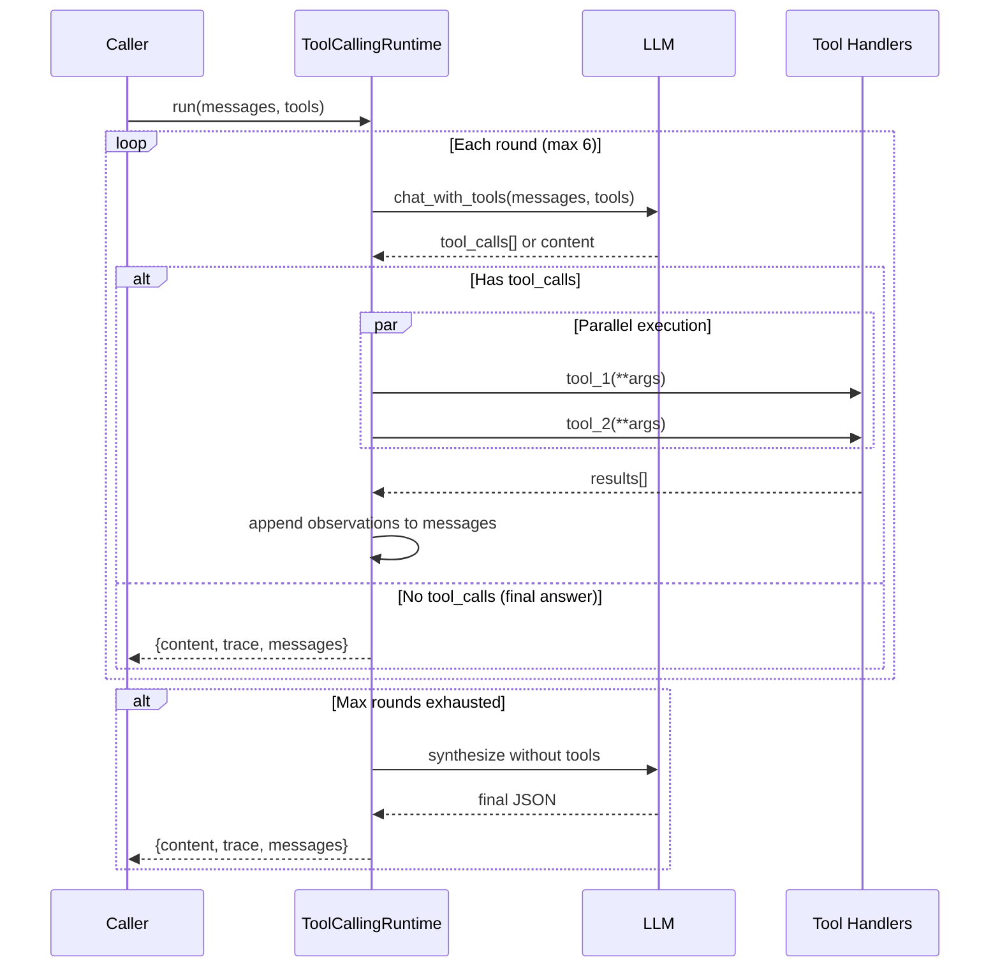
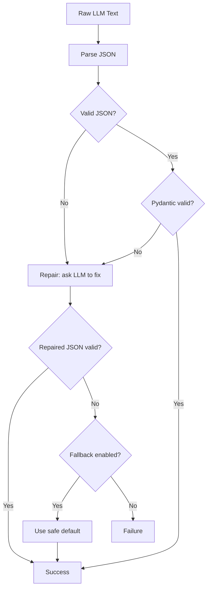
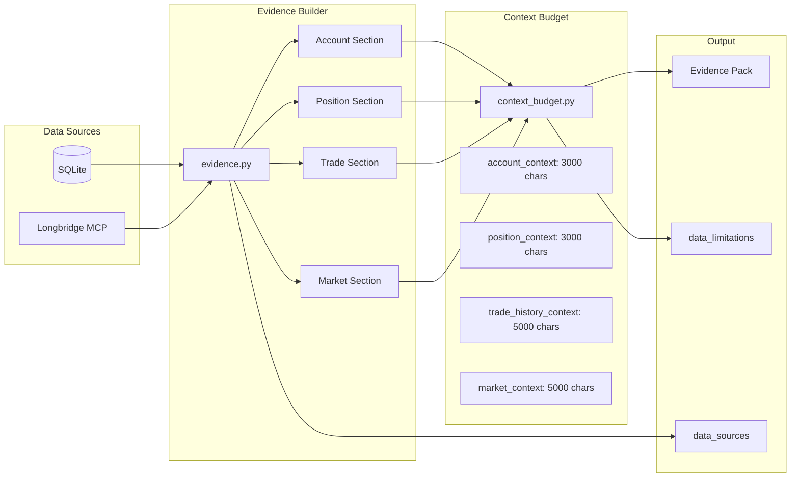
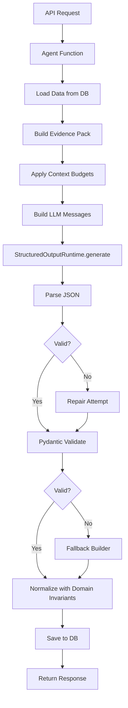

# Agent Architecture

This document explains the shared infrastructure that powers all five AI agents. Understanding these building blocks will help you read the agent source code and extend agent behavior.

## ReAct Runtime (ToolCallingRuntime)

The `ToolCallingRuntime` in `app/agents/runtime.py` implements a **ReAct loop** -- a pattern where the LLM reasons about what to do, executes tools, observes results, and repeats until it can produce a final answer.

### How It Works



### Key Configuration

| Parameter | Default | Purpose |
|---|---|---|
| `max_rounds` | 6 | Maximum ReAct loop iterations |
| `max_parallel_tools` | 6 | ThreadPoolExecutor workers for parallel tool calls |
| `max_observation_chars` | 12,000 | Truncation limit for tool output in conversation |

### Final Round Behavior

On the last round, the runtime forces `tool_choice="none"`, blocking the LLM from requesting more tools. If the LLM still tries to call tools, the runtime falls back to a plain `chat()` call. This guarantees the loop always terminates with a content response.

### Initial Tool Calls

You can pass `initial_tool_calls` to pre-execute read-only data loading before the first LLM round. The results are injected as synthetic user messages, giving the LLM immediate data without needing a round-trip.

```python
# app/agents/runtime.py
# Pre-executing data loading before the LLM sees the conversation
initial_tool_calls = [
    InitialToolCall(
        tool_name="ibkr_get_account_overview",
        arguments={},
        inject_as="user",       # Result becomes a synthetic user message
    ),
    InitialToolCall(
        tool_name="ibkr_get_current_positions",
        arguments={},
        inject_as="user",
    ),
]

result = await runtime.run(
    messages=messages,
    tools=tool_registry.get_tools(),
    initial_tool_calls=initial_tool_calls,
)
```

## Structured Output Pipeline

Every agent that produces a fixed-schema output uses the **StructuredOutputRuntime** in `app/agents/structured_output/runtime.py`. This pipeline has four stages:



### Stage 1: Parse

The JSON parser in `app/agents/structured_output/json_parser.py` handles common LLM quirks:

- **Markdown fences**: Strips ` ```json ... ``` ` wrappers
- **raw_decode fallback**: Scans for the first `{` character and parses from there
- **Empty output detection**: Raises a specific error code

```python
# app/agents/structured_output/json_parser.py
def extract_json_object(text: str) -> dict:
    """Extract a JSON object from raw LLM text."""
    # 1. Strip markdown fences
    text = _strip_markdown_fences(text)

    # 2. Try direct parse
    try:
        return json.loads(text)
    except JSONDecodeError:
        pass

    # 3. raw_decode fallback: find first '{' and parse from there
    for i, ch in enumerate(text):
        if ch == '{':
            obj, _ = json.JSONDecoder().raw_decode(text, i)
            if isinstance(obj, dict):
                return obj

    raise StructuredOutputError(ErrorCode.LLM_JSON_PARSE_FAILED)
```

### Stage 2: Validate

Parsed JSON is validated against a Pydantic model (e.g., `TradeDecisionOutput`, `TradeReviewOutput`). The `FlexibleModel` base class uses `extra="allow"` for forward compatibility -- unexpected fields are preserved rather than rejected.

### Stage 3: Repair

If validation fails, the system sends the raw output back to the LLM with the schema hint and validation error, asking it to fix only format issues. The repair prompt explicitly says: "Do not fabricate facts, numbers, news, financial data, or trading recommendations."

### Stage 4: Fallback

If repair fails, the system calls a `fallback_builder` function that returns a safe, conservative default. For example, the trade decision fallback returns `action: "watchlist"` with `confidence: "low"`.

### StructuredOutputContract

Each agent defines a `StructuredOutputContract` that configures the pipeline:

```python
# app/agents/trade_decision/contracts.py
contract = StructuredOutputContract(
    name="trade_decision",
    agent_name="trade_decision",
    node_name="compose",
    output_model=TradeDecisionOutput,      # Pydantic model
    schema_hint=TradeDecisionOutput.model_json_schema(),
    max_repair_attempts=1,
    repair_enabled=True,
    fallback_enabled=True,
    fallback_builder=lambda ctx, err, raw: _build_fallback_decision(...),
)
```

## Evidence Flow Diagram



## Evidence Builder

The evidence builder in `app/agents/evidence.py` transforms raw database data into **evidence packs** -- structured context objects that agents consume. Each agent type has its own builder function:

- `build_trade_decision_evidence_pack()` -- account, position, trade, market context
- `build_trade_review_evidence_pack()` -- trade facts, performance metrics, benchmarks
- `build_daily_position_review_evidence_pack()` -- overview, rankings, risk, focus symbols
- `build_risk_assessment_evidence_pack()` -- portfolio snapshot, concentration, themes

### Data Source Annotations

Every evidence pack records its data sources:

```python
# app/agents/evidence.py
DATA_SOURCES = {
    "account_data": "IBKR_ONLY",
    "position_data": "IBKR_ONLY",
    "trade_data": "IBKR_ONLY",
    "public_market_data": "LONGBRIDGE_PUBLIC_ONLY",
}
```

This tells the LLM (and the user) exactly where each piece of data came from.

### Evidence Summary

The `build_evidence_summary()` function creates a safe, sanitized summary for frontend display. It:

- Redacts sensitive fields (tokens, keys, passwords)
- Reports section availability status (available / partial / missing)
- Lists missing data and data limitations

## Context Budget Enforcement

The context budget system in `app/agents/context_budget.py` prevents evidence packs from exceeding LLM context limits. Each section has a character budget:

| Section | Budget (chars) |
|---|---|
| `account_context` | 3,000 |
| `position_context` | 3,000 |
| `trade_history_context` | 5,000 |
| `market_context` | 5,000 |
| `company_context` | 5,000 |
| `daily_position_context` | 12,000 |
| `data_quality` | 2,000 |

### Progressive Enforcement Strategy

When a section exceeds its budget, the system applies strategies in order:

1. **Section-specific compaction** -- Drop low-priority items (e.g., limit positions to 20, news to 5)
2. **Shrink lists** -- Halve all list lengths recursively
3. **Trim strings** -- Truncate text fields to 140 characters
4. **Degrade** -- Replace the entire section with a 1000-character preview

Every enforcement action produces a **budget report** showing what was dropped or truncated, which becomes part of the evidence pack's `data_limitations`.

## Domain Invariants

The domain invariants module in `app/agents/invariants.py` defines:

### Score Dimensions

**Trade Decision** (7 dimensions, 100 points total):
- `fundamental_quality_score` (20)
- `valuation_score` (15)
- `trend_score` (15)
- `account_fit_score` (20)
- `risk_reward_score` (15)
- `review_constraint_score` (10)
- `event_catalyst_score` (5)

**Trade Review** (8 dimensions, 100 points total):
- `return_result_score` (20)
- `relative_performance_score` (15)
- `entry_quality_score` (15)
- `exit_quality_score` (15)
- `position_sizing_score` (15)
- `holding_period_score` (5)
- `risk_control_score` (10)
- `decision_attribution_score` (5)

### Allowed Enumerations

The system enforces strict enumerations for actions, confidence levels, and ratings:

- **Actions**: `add`, `add_small`, `add_batch`, `hold`, `reduce`, `reduce_batch`, `sell`, `wait`, `avoid`, `watchlist`
- **Confidence**: `high`, `medium`, `low`
- **Decision ratings**: `strong_buy_or_hold`, `positive`, `neutral`, `negative`
- **Review ratings**: `excellent`, `good`, `average`, `poor`

### Action Aliases

The normalizer handles both English and Chinese action aliases. For example, `"逢低加仓"` maps to `add_small`, and `"清仓"` maps to `sell`. This makes the system resilient to LLM output variations.

### Safety Guards

- Forceful trade language (e.g., "必须买入", "all in") is softened to "observe pending preset conditions"
- Confidence is automatically downgraded when data limitations are material
- Ratings are capped when critical public data is missing

## Agent Execution Flow


