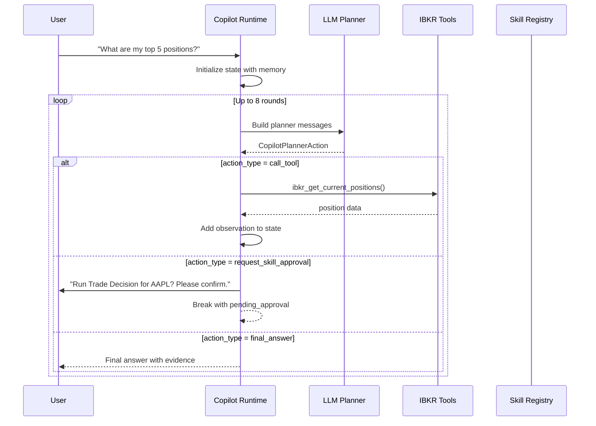
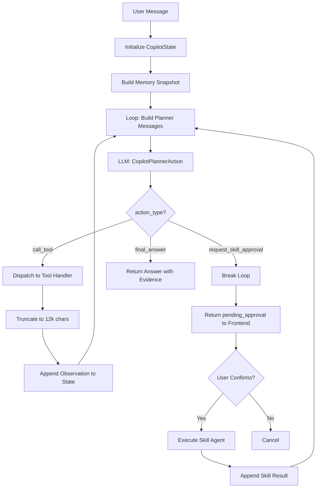
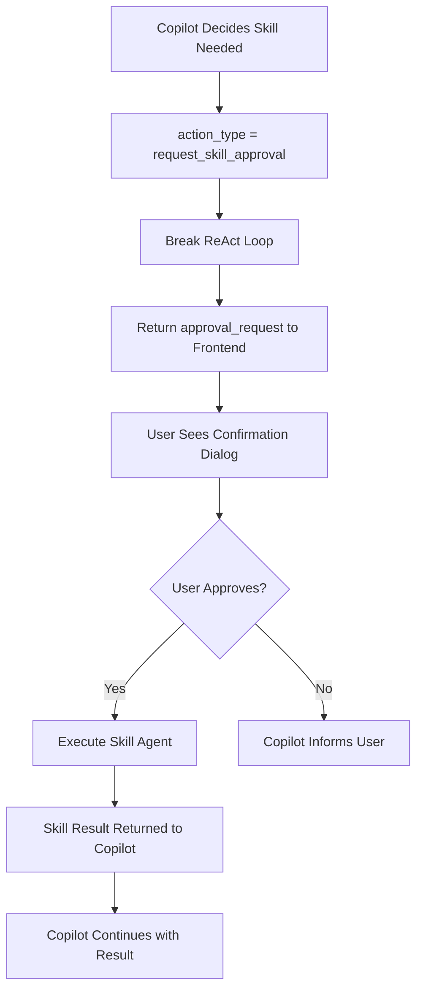
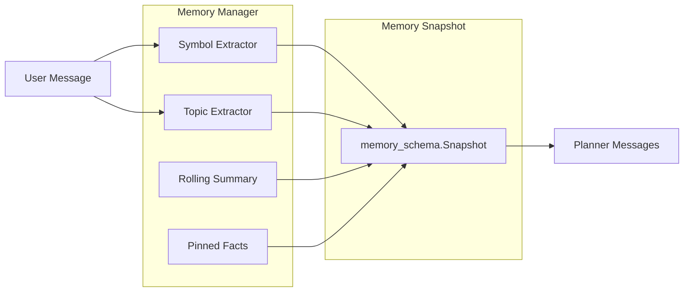

# Account Copilot

The Account Copilot is an interactive chat agent that answers questions about your portfolio. Unlike the other agents that run once and produce a report, the Copilot maintains a conversation and can call multiple tools across multiple rounds to gather evidence before answering.

## How It Works

The Copilot uses its own ReAct loop implemented in `AccountCopilotRuntime` (`app/agents/account_copilot/runtime.py`). Each round follows a **plan-then-act** pattern:

1. The LLM receives the conversation history and produces a **planner action** (structured JSON)
2. The runtime dispatches the action -- call a tool, request skill approval, or return a final answer
3. If a tool was called, the result becomes an observation added to the conversation
4. The loop repeats until the LLM produces a final answer or reaches the round limit



### Conversation Flow Detail



## Planner Schema

Each planner round produces a `CopilotPlannerAction` with these fields:

| Field | Type | Purpose |
|---|---|---|
| `action_type` | string | `call_tool`, `final_answer`, or `request_skill_approval` |
| `thought_summary` | string | LLM's reasoning for this action |
| `tool_name` | string | Name of the tool to call (when action_type is call_tool) |
| `tool_arguments` | dict | Arguments for the tool |
| `skill_name` | string | Name of the skill to request (when action_type is request_skill_approval) |
| `skill_arguments` | dict | Arguments for the skill |
| `final_answer` | string | The answer text (when action_type is final_answer) |
| `evidence_sufficiency` | object | Assessment of whether enough evidence has been gathered |

The planner uses `StructuredOutputContract` with `CopilotPlannerAction` as the Pydantic model, so every planner output is schema-validated.

```python
# app/agents/account_copilot/planner_schema.py
class CopilotPlannerAction(FlexibleModel):
    action_type: str                    # "call_tool" | "final_answer" | "request_skill_approval"
    thought_summary: str = ""           # LLM reasoning trace
    tool_name: str | None = None
    tool_arguments: dict[str, Any] = {}
    skill_name: str | None = None
    skill_arguments: dict[str, Any] = {}
    final_answer: str | None = None
    evidence_sufficiency: dict[str, Any] = {}
```

## Tool Registry

The Copilot registers IBKR data tools via `AccountCopilotToolRegistry` (`app/agents/account_copilot/tool_registry.py`). Each tool has a handler function, a JSON schema, and metadata:

```python
# app/agents/account_copilot/tool_registry.py
class AccountCopilotToolRegistry:
    """Registers all IBKR read-only data tools for the Copilot."""

    def __init__(self, db_session):
        self._tools: dict[str, ToolRegistration] = {}
        self._register_all(db_session)

    def _register_all(self, db_session):
        self.register(ToolRegistration(
            name="ibkr_get_account_overview",
            description="Account equity, cash, margin info",
            parameters_schema={},                  # No parameters needed
            handler=lambda **kw: get_account_overview(db_session),
        ))
        self.register(ToolRegistration(
            name="ibkr_get_current_positions",
            description="All current positions with weights",
            parameters_schema={},
            handler=lambda **kw: get_current_positions(db_session),
        ))
        # ... 7 more tools
```

| Tool | Description |
|---|---|
| `ibkr_get_account_overview` | Account equity, cash, margin info |
| `ibkr_get_current_positions` | All current positions with weights |
| `ibkr_get_symbol_position` | Position details for a specific symbol |
| `ibkr_get_symbol_trades` | Trade history for a specific symbol |
| `ibkr_get_position_history` | Historical position snapshots |
| `ibkr_get_equity_curve` | Equity curve data points |
| `ibkr_get_daily_attribution` | Daily PnL attribution by position |
| `ibkr_get_risk_snapshot` | Concentration and risk metrics |
| `ibkr_get_cash_flow_summary` | Deposit/withdrawal/dividend summary |

All tools are **read-only** and have a 12,000-character output budget. The runtime truncates tool output that exceeds this limit.

## Skill Registry

Skills are higher-level operations that require **user approval** before execution. They are registered via `AccountCopilotSkillRegistry` (`app/agents/account_copilot/skill_registry.py`).



| Skill | Description | Risk Level |
|---|---|---|
| `trade_decision_entry_skill` | Analyze whether to open a new position | medium |
| `trade_decision_holding_skill` | Analyze whether to add/reduce/maintain a holding | medium |
| `trade_review_symbol_skill` | Review historical trade performance | medium |
| `daily_position_review_skill` | Generate daily position review | low |
| `risk_assessment_skill` | Generate account-level risk assessment | low |

When the Copilot decides a skill would help answer the user's question, it:

1. Sets `action_type = "request_skill_approval"`
2. Includes a human-readable `approval_message`
3. The runtime breaks the loop and returns the approval request to the frontend
4. The frontend shows the user a confirmation dialog
5. On approval, the skill executes and the Copilot continues with the result

## Memory System

The Copilot maintains conversation memory across rounds via `memory_manager.py` and `memory_schema.py`:



- **Symbol extraction**: Regex-based extraction of stock symbols from user messages (e.g., "AAPL", "NVDA.US")
- **Topic extraction**: Keyword-based topic detection (risk, trade_review, valuation, etc.)
- **Rolling summary**: A compressed summary of the conversation so far
- **Pinned facts**: Key facts the user has mentioned that should persist across rounds

The memory snapshot is passed to the planner each round so it can reference previous context without re-reading the full conversation.

```python
# app/agents/account_copilot/memory_manager.py
class MemoryManager:
    def extract_symbols(self, text: str) -> list[str]:
        """Extract stock symbols from user text using regex."""
        # Matches patterns like AAPL, NVDA.US, 9988.HK
        pattern = r'\b([A-Z]{1,5}(?:\.[A-Z]{1,3})?)\b'
        return list(set(re.findall(pattern, text.upper())))

    def extract_topics(self, text: str) -> list[str]:
        """Detect conversation topics via keyword matching."""
        topic_keywords = {
            "risk": ["risk", "concentration", "exposure", "风险", "集中度"],
            "trade_review": ["review", "mistake", "performance", "回顾", "复盘"],
            "valuation": ["valuation", "PE", "overvalued", "估值"],
        }
        return [t for t, kw in topic_keywords.items()
                if any(k in text.lower() for k in kw)]
```

## Safety Features

- **Cancel checker**: The runtime checks a `cancel_checker` function each round, allowing the frontend to cancel a running analysis
- **Timeout**: Configurable `timeout_seconds` prevents runaway executions
- **Consecutive empty guard**: If 3 consecutive tool calls return no valid data, the loop breaks with a fallback message
- **Read-only enforcement**: Only read-only tools are executed; write operations are blocked at the runtime level

## Frontend Integration

The Copilot view (`AccountCopilotView.tsx`) provides:

- A chat interface with message history
- Session management (create, switch, delete sessions)
- Skill approval confirmation dialogs
- Markdown rendering for the Copilot's answers (using `react-markdown`)

The API client (`api/accountCopilot.ts`) sends messages to the backend's `/api/copilot` endpoint and handles streaming or polling for responses.

## Source Code Map

| File | Purpose |
|---|---|
| `app/agents/account_copilot/runtime.py` | Main ReAct loop runtime |
| `app/agents/account_copilot/planner_schema.py` | CopilotPlannerAction Pydantic model |
| `app/agents/account_copilot/tool_registry.py` | IBKR tool registration |
| `app/agents/account_copilot/tool_schemas.py` | Tool JSON schemas |
| `app/agents/account_copilot/skill_registry.py` | Skill registration |
| `app/agents/account_copilot/skills.py` | Skill definitions (5 skills) |
| `app/agents/account_copilot/memory_manager.py` | Symbol/topic extraction, memory compression |
| `app/agents/account_copilot/memory.py` | Memory persistence |
| `app/agents/account_copilot/memory_schema.py` | Memory data models |
| `app/agents/account_copilot/prompts.py` | System prompt and planner message builder |
| `app/agents/account_copilot/state.py` | AccountCopilotState type definition |
