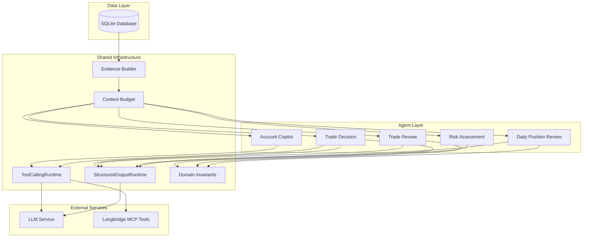

# AI Agents Overview

The IBKR Dashboard includes five specialized AI agents that analyze your portfolio data and provide actionable insights. Each agent combines **deterministic calculations** (running in Python) with **LLM-powered reasoning** (calling a large language model) to produce structured, reliable outputs.

## What Are the Agents?

Each agent follows the same core pattern:

1. **Load data** from the SQLite database (account snapshots, positions, trades)
2. **Build an evidence pack** with context budget enforcement
3. **Call the LLM** with a structured prompt and output schema
4. **Validate, repair, and normalize** the output using Pydantic models
5. **Save the result** to the database for frontend display

This approach ensures that outputs are always valid JSON, always conform to a schema, and degrade gracefully when the LLM fails.

```python
# Simplified agent lifecycle -- every agent follows this pattern
# app/agents/trade_decision/agent.py

async def analyze_trade(symbol: str, decision_type: str) -> TradeDecisionOutput:
    # Step 1: Load data
    account_data = load_account_from_db()
    position_data = load_positions_from_db(symbol)

    # Step 2: Build evidence pack with context budget
    evidence = build_trade_decision_evidence_pack(account_data, position_data)

    # Step 3: Call LLM with structured output contract
    contract = TRADE_DECISION_CONTRACT
    result = structured_output_runtime.generate(messages, contract)

    # Step 4: Normalize with domain invariants
    if result.ok:
        normalized = normalize_trade_decision_output(result.payload)

    # Step 5: Save to DB
    save_decision_to_db(normalized)
    return normalized
```

## The Five Agents

### 1. Account Copilot

An interactive chat agent that answers questions about your portfolio. It uses a **ReAct loop** (Reason + Act) to plan which tools to call, execute them, observe results, and either call more tools or produce a final answer. It can also request approval to run higher-level "skills" like trade analysis.

- **Input**: Free-form user question
- **Output**: Conversational answer grounded in IBKR data
- **Key feature**: Multi-round tool calling with memory

### 2. Trade Decision Agent

Analyzes whether to enter, hold, or exit a position. It runs **four parallel sub-analyses** (account fit, market trend, fundamental valuation, event catalyst), then synthesizes them into a final decision with scores and recommendations.

- **Input**: Symbol, decision type (entry/holding), optional question
- **Output**: Structured decision with action, confidence, score breakdown
- **Key feature**: Parallel sub-agent architecture

### 3. Trade Review Agent

Reviews historical trades to evaluate entry quality, exit quality, position sizing, and behavioral patterns. It scores across **eight dimensions** and tags common mistakes like chasing highs or panic selling.

- **Input**: Symbol or trade ID, optional date range
- **Output**: Structured review with 8-dimension scoring and mistake tags
- **Key feature**: Anti-hindsight-bias scoring

### 4. Daily Position Review Agent

Generates a daily portfolio review covering account attribution, focus symbol analysis, market context, and a tomorrow watchlist. It selects focus symbols deterministically and produces symbol evidence cards.

- **Input**: Report date (YYYY-MM-DD)
- **Output**: Full daily review with attribution, analysis, and watchlist
- **Key feature**: Deterministic focus symbol selection + LLM explanation

### 5. Risk Assessment Agent

Assesses portfolio risk across concentration, sector/theme exposure, and stress test scenarios. The heavy computations (concentration ratios, theme classification, stress test math) are **fully deterministic**; the LLM only composes the narrative report.

- **Input**: Optional user question
- **Output**: Risk report with scores, scenarios, and recommendations
- **Key feature**: Deterministic risk cards + LLM narrative

## Capability Comparison

| Feature | Copilot | Trade Decision | Trade Review | Daily Review | Risk Assessment |
|---|---|---|---|---|---|
| **Runtime type** | ReAct loop (multi-turn) | Structured output (single-shot) | Structured output (single-shot) | Structured output (single-shot) | Structured output (single-shot) |
| **LLM calls per run** | 2-8 rounds | 5 (4 sub-agents + 1 compose) | 1 | 1 + N cards | 1 |
| **Deterministic work** | Minimal | Account fit scoring | Trade fact loading | Attribution, focus selection | All risk computations |
| **Tool calling** | Yes (9 IBKR tools) | Yes (Longbridge MCP) | No | No | No |
| **Skill system** | Yes (5 skills) | No | No | No | No |
| **Parallel execution** | Tool calls in parallel | 4 sub-analyses in parallel | No | Card generation in parallel | No |
| **User approval** | Yes (for skills) | No | No | No | No |
| **Fallback strategy** | Graceful message | `watchlist` + `low` confidence | Score 50, `neutral` | Deterministic-only report | Risk cards without narrative |
| **Score dimensions** | N/A | 7 dimensions (100 pts) | 8 dimensions (100 pts) | N/A | 3 cards (65 pts) |
| **Output format** | Conversational text | JSON decision document | JSON review document | JSON review document | JSON risk report |
| **Memory/context** | Conversation memory | Evidence pack | Evidence pack | Evidence pack | Portfolio snapshot |

## Architecture Diagram



### Data Flow Summary

```mermaid
flowchart LR
    A[SQLite DB] -->|raw rows| B[Evidence Builder]
    B -->|evidence pack| C[Context Budget]
    C -->|budgeted context| D[LLM Prompt]
    D -->|raw JSON| E[Structured Output]
    E -->|validated model| F[Domain Invariants]
    F -->|normalized output| G[Save to DB]
    G -->|API response| H[Frontend]
```



## Key Design Principles

- **Deterministic first**: Computations like PnL, concentration ratios, and stress tests run in Python. The LLM interprets and narrates, not calculates.
- **Structured output always**: Every LLM call produces JSON validated against a Pydantic model. If parsing fails, the system attempts repair, then falls back to safe defaults.
- **Evidence packs**: Agents never see raw database rows. Data is packaged into evidence packs with section budgets, data source annotations, and quality metadata.
- **Graceful degradation**: If the LLM is unavailable or returns invalid output, every agent has a deterministic fallback that returns a conservative result.
- **Traceability**: Every agent run produces a trace of LLM calls, tool calls, latencies, and errors for debugging and monitoring.

## Source Code Layout

```
app/agents/
    runtime.py                    # ToolCallingRuntime (ReAct loop)
    structured_output/
        runtime.py                # StructuredOutputRuntime
        contracts.py              # StructuredOutputContract
        json_parser.py            # JSON extraction from LLM text
        errors.py                 # Error types
        registry.py               # Contract registry
    evidence.py                   # Evidence pack builders
    context_budget.py             # Context budget enforcement
    invariants.py                 # Domain invariants and normalizers
    eval_checks.py                # Generic eval checks
    eval_domain_checks.py         # Agent-specific eval checks
    account_copilot/              # Copilot agent
    trade_decision/               # Trade Decision agent
    trade_review/                 # Trade Review agent
    daily_review/                 # Daily Review agent
    risk_assessment/              # Risk Assessment agent
```

## Next Steps

- [Agent Architecture](./architecture.md) -- Deep dive into the ReAct runtime and structured output pipeline
- [Account Copilot](./copilot.md) -- How the interactive chat agent works
- [Trade Decision](./trade-decision.md) -- How trade decisions are analyzed
- [Trade Review](./trade-review.md) -- How trades are reviewed and scored
- [Daily Review](./daily-review.md) -- How daily position reviews are generated
- [Risk Assessment](./risk-assessment.md) -- How portfolio risk is assessed
