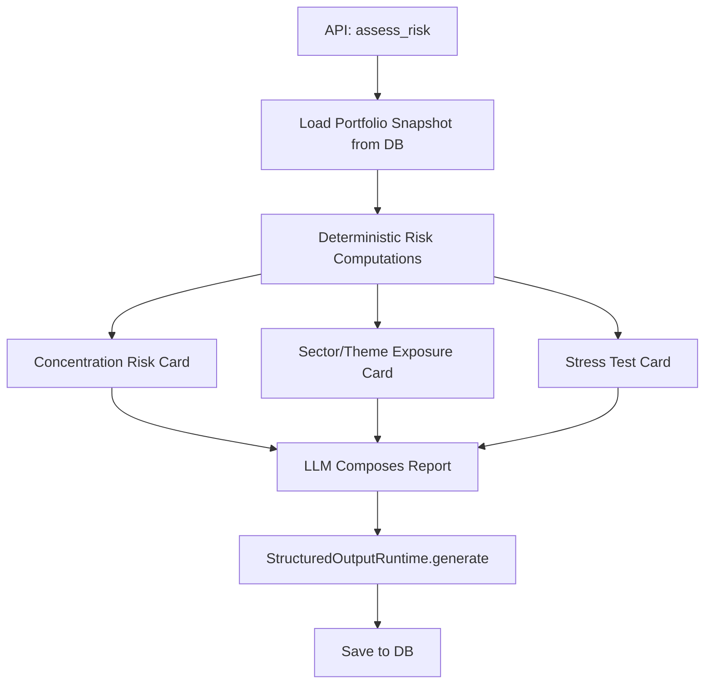
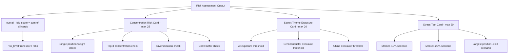
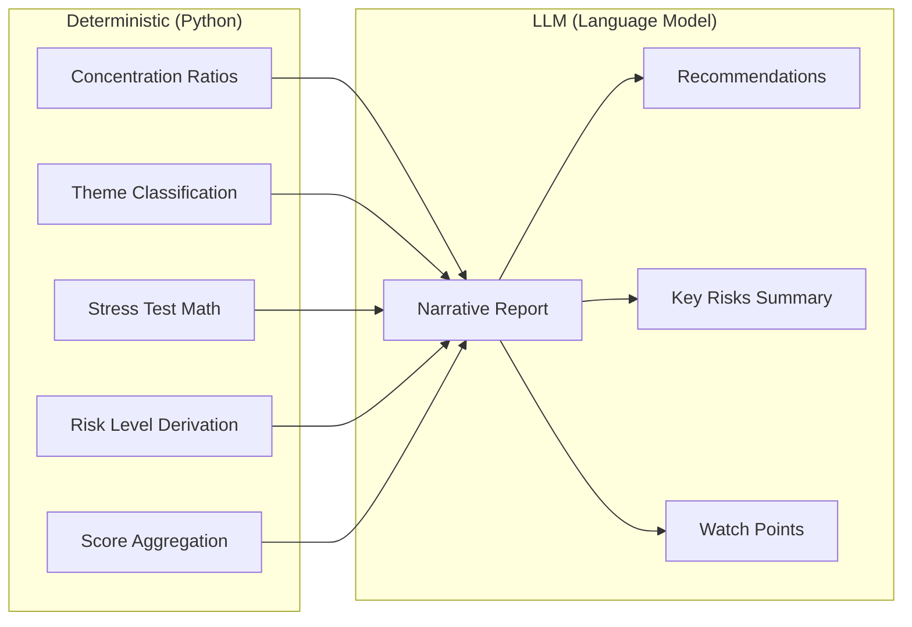

# Risk Assessment Agent

The Risk Assessment agent evaluates portfolio risk across multiple dimensions. Unlike other agents, the heavy analysis is **fully deterministic** -- the LLM only composes the narrative report from pre-computed risk cards.

## How It Works

The entry point is `assess_risk()` in `app/agents/risk_assessment/agent.py`. It follows a four-step pipeline:



## Risk Card Hierarchy



## Step 1: Portfolio Snapshot

The agent loads the latest portfolio data from the database:

- **Account snapshot**: Total equity, cash, margin info
- **Position details**: Symbol, quantity, market value, weight, unrealized PnL
- **Derived metrics**: Largest position %, top-3 concentration, top-5 concentration, cash %

## Step 2: Deterministic Risk Cards

### Concentration Risk Card (max score: 25)

Computes concentration risk using pure Python logic:

```python
# app/agents/risk_assessment/concentration.py
def compute_concentration_risk(positions: list[Position]) -> dict:
    """Deterministic concentration risk computation."""
    weights = sorted([p.weight for p in positions], reverse=True)
    largest = weights[0] if weights else 0
    top3 = sum(weights[:3])
    cash_pct = 1.0 - sum(weights)

    score = 0
    findings = []

    if largest > 0.40:
        score += 20; findings.append("Extreme single-position concentration")
    elif largest > 0.25:
        score += 14; findings.append("High single-position concentration")
    elif largest > 0.15:
        score += 7; findings.append("Moderate single-position concentration")

    if top3 > 0.70:
        score += 5; findings.append("High top-3 concentration")

    if len(positions) <= 2 and largest > 0.30:
        score += 5; findings.append("Insufficient diversification")

    if cash_pct < 0.05:
        score += 3; findings.append("Low liquidity buffer")

    return {"score": score, "max_score": 25, "findings": findings}
```

| Condition | Score | Finding |
|---|---|---|
| Largest position > 40% | +20 | Extreme concentration |
| Largest position > 25% | +14 | High concentration |
| Largest position > 15% | +7 | Moderate concentration |
| Top 3 > 70% | +5 | High top-3 concentration |
| {'<='} 2 positions and largest > 30% | +5 | Insufficient diversification |
| Cash < 5% | +3 | Low liquidity buffer |

The risk level is derived from the score ratio:

| Ratio | Risk Level |
|---|---|
| >= 75% | Extreme |
| >= 50% | High |
| >= 25% | Medium |
| < 25% | Low |

### Sector/Theme Exposure Card (max score: 20)

Classifies positions into themes using symbol-based rules:

```python
# app/agents/risk_assessment/themes.py
THEME_MAP = {
    "NVDA": ["semiconductor", "ai"],
    "AMD": ["semiconductor"],
    "MSFT": ["ai", "cloud"],
    "GOOG": ["ai", "cloud"],
    "BABA": ["china"],
    "JD": ["china"],
    "PDD": ["china"],
}

def classify_symbol_theme(symbol: str) -> list[str]:
    base = symbol.split(".")[0]
    return THEME_MAP.get(base, ["other"])
```

| Theme | Threshold | Score |
|---|---|---|
| AI exposure | > 40% | +8 |
| Semiconductor exposure | > 30% | +6 |
| China exposure | > 20% | +4 |

The `classify_symbol_theme()` function maps symbols to themes (e.g., NVDA -> semiconductor + AI, BABA -> china).

### Stress Test Card (max score: 20)

Runs three what-if scenarios:

| Scenario | Calculation |
|---|---|
| Market -10% | Total exposure * 0.10 |
| Market -20% | Total exposure * 0.20 |
| Largest position -30% | Largest position value * 0.30 |

Each scenario computes the estimated loss amount and portfolio impact percentage. The worst-case scenario drives the score:

| Worst-Case Impact | Score |
|---|---|
| > 20% | +15 |
| > 10% | +8 |

## Step 3: LLM Composition

The LLM receives all three risk cards and the portfolio snapshot, then composes a narrative report. The LLM does **not** perform any calculations -- it interprets the pre-computed numbers and adds context.

## Output Schema

```python
# app/agents/risk_assessment/output_schema.py
class RiskAssessmentOutput(FlexibleModel):
    overall_risk_score: float = 0
    risk_level: str = "medium"         # "low", "medium", "high", "extreme"
    summary: str = ""
    concentration_risk: dict[str, Any]
    sector_exposure: dict[str, Any]
    liquidity_risk: dict[str, Any]
    stress_test: dict[str, Any]
    key_risks: list[str]
    recommendations: list[str]
    watch_points: list[str]
    data_limitations: list[str]
    evidence_used: list[str]
```

### Key Sections

| Section | Description |
|---|---|
| `overall_risk_score` | Sum of all risk card scores |
| `risk_level` | Derived from the total score ratio |
| `summary` | One-line risk summary |
| `concentration_risk` | Concentration card details |
| `sector_exposure` | Sector/theme exposure details |
| `stress_test` | Stress test scenarios and results |
| `key_risks` | List of identified risks |
| `recommendations` | Actionable risk mitigation suggestions |
| `watch_points` | Things to monitor |

## Risk Score Composition

The overall risk score is the sum of all three cards:

| Card | Max Score |
|---|---|
| Concentration | 25 |
| Sector/Theme | 20 |
| Stress Test | 20 |
| **Total** | **65** |

The risk level is derived from the total score:

```python
# app/agents/risk_assessment/agent.py
def _risk_level_from_score(score, max_score):
    ratio = score / max_score
    if ratio >= 0.75: return "extreme"
    if ratio >= 0.50: return "high"
    if ratio >= 0.25: return "medium"
    return "low"
```

## Deterministic vs. LLM Split

This agent has a clear separation between deterministic and LLM work:



| Component | Type | Purpose |
|---|---|---|
| Concentration ratios | Deterministic | Exact calculations from position data |
| Theme classification | Deterministic | Symbol-to-theme mapping rules |
| Stress test math | Deterministic | What-if scenario calculations |
| Risk level derivation | Deterministic | Score-to-level mapping |
| Narrative report | LLM | Interpretation and explanation |
| Recommendations | LLM | Actionable advice based on findings |
| Key risks | LLM | Risk identification and prioritization |

:::tip
Because the core analysis is deterministic, the risk assessment always produces meaningful results even when the LLM is unavailable. The fallback simply returns the risk card data without LLM narrative.
:::

## Fallback Behavior

If the LLM fails, the fallback returns:

```json
{
  "overall_risk_score": 22,
  "risk_level": "medium",
  "summary": "Risk assessment generated with fallback. Concentration: medium, Sector: low, Stress: medium.",
  "concentration_risk": { "...concentration card data..." },
  "sector_exposure": { "...sector card data..." },
  "stress_test": { "...stress test card data..." },
  "key_risks": ["Single position concentration too high"],
  "recommendations": ["Monitor largest position weight changes"],
  "data_limitations": ["LLM output validation failed; using deterministic fallback"]
}
```

## API Usage

```
POST /api/risk-assessment
{
  "question": "What is my portfolio risk level?"
}
```

The response includes the full risk assessment with all three risk cards and the LLM narrative.
