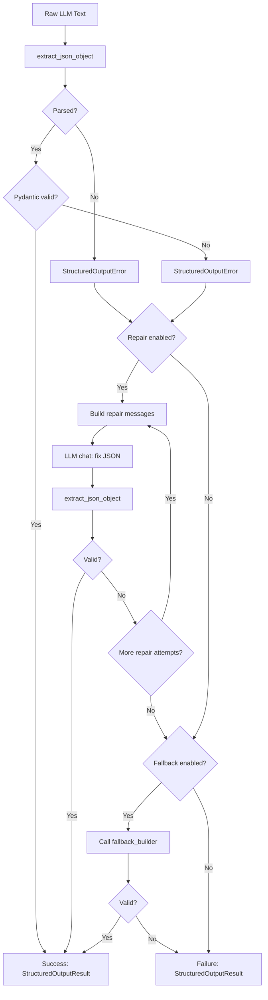
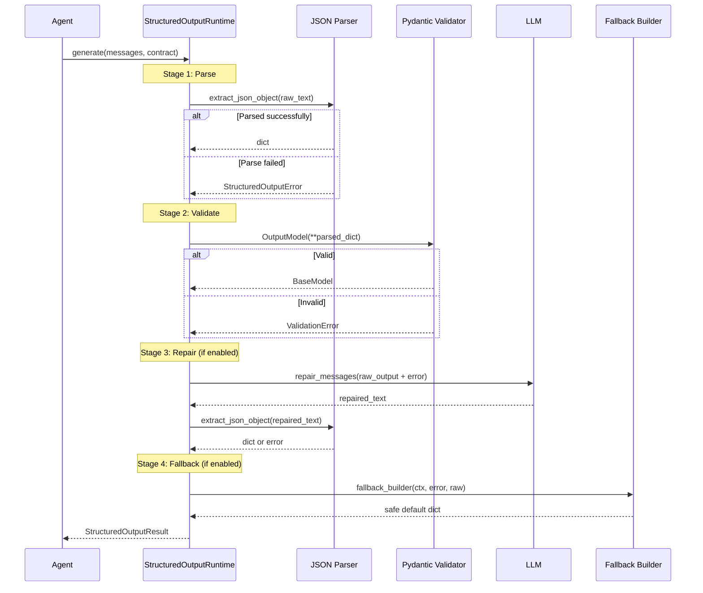

# Structured Output Pipeline

Every agent that produces a fixed-schema output uses the structured output pipeline. This system ensures that LLM output is always valid JSON, always conforms to a Pydantic model, and degrades gracefully on failure.

## Overview

The pipeline lives in `app/agents/structured_output/` and has four files:

| File | Purpose |
|---|---|
| `contracts.py` | `StructuredOutputContract` definition |
| `json_parser.py` | JSON extraction from raw LLM text |
| `runtime.py` | `StructuredOutputRuntime` -- the pipeline engine |
| `errors.py` | Error types and constants |
| `registry.py` | Contract registry for auditing |

## The Pipeline



## Parse-Validate-Repair-Fallback Flow



## StructuredOutputContract

The contract defines how to parse, validate, repair, and fallback for a specific LLM output:

```python
# app/agents/structured_output/contracts.py
@dataclass
class StructuredOutputContract:
    name: str                          # Contract identifier
    agent_name: str                    # Which agent owns this
    node_name: str                     # Which node/step in the agent
    output_model: type[BaseModel]      # Pydantic model for validation
    schema_hint: dict                  # JSON schema for the repair prompt
    examples: list[dict]               # Example outputs for the repair prompt
    max_repair_attempts: int           # How many repair rounds (default: 1)
    response_format: dict              # {"type": "json_object"}
    repair_enabled: bool               # Whether to attempt repair
    fallback_enabled: bool             # Whether to use fallback on failure
    fallback_builder: Callable         # Function to build fallback output
    repair_system_prompt: str          # System prompt for repair LLM call
    repair_user_prompt_builder: Callable  # Custom repair prompt builder
```

### Contract Examples

Each agent defines contracts for its LLM calls:

| Contract Name | Agent | Purpose |
|---|---|---|
| `account_copilot_planner` | Copilot | Planner action selection |
| `trade_decision` | Trade Decision | Final decision composition |
| `trade_review` | Trade Review | Review composition |
| `daily_position_review` | Daily Review | Review composition |
| `risk_assessment` | Risk Assessment | Report composition |
| `trade_decision_market_trend` | Trade Decision | Market trend sub-agent |
| `trade_decision_fundamental_valuation` | Trade Decision | Fundamental sub-agent |
| `trade_decision_event_catalyst` | Trade Decision | Event catalyst sub-agent |
| `daily_review_symbol_evidence_card` | Daily Review | Symbol evidence card |
| `daily_review_macro_evidence_card` | Daily Review | Macro evidence card |

## JSON Parser

The JSON parser in `json_parser.py` handles common LLM output quirks:

### Markdown Fence Handling

LLMs often wrap JSON in markdown fences:

````
```json
{"key": "value"}
```
````

The parser strips these fences using a regex pattern: `^\s*```(?:json|JSON)?\s*(.*?)\s*```\s*$`

### raw_decode Fallback

If direct parsing fails, the parser scans for the first `{` character and uses `json.JSONDecoder().raw_decode()` to extract a JSON object from anywhere in the text. This handles cases where the LLM includes explanatory text before or after the JSON.

```python
# app/agents/structured_output/json_parser.py
import json
import re

_MD_FENCE_RE = re.compile(r'^\s*```(?:json|JSON)?\s*(.*?)\s*```\s*$', re.DOTALL)

def extract_json_object(text: str) -> dict:
    """Extract a JSON object from LLM text, handling markdown fences."""
    # Step 1: Strip markdown fences
    m = _MD_FENCE_RE.match(text.strip())
    if m:
        text = m.group(1).strip()

    # Step 2: Try direct parse
    try:
        result = json.loads(text)
        if isinstance(result, dict):
            return result
        raise StructuredOutputError(ErrorCode.LLM_OUTPUT_NOT_OBJECT)
    except json.JSONDecodeError:
        pass

    # Step 3: raw_decode fallback -- find first '{'
    for i, ch in enumerate(text):
        if ch == '{':
            try:
                obj, _ = json.JSONDecoder().raw_decode(text, i)
                if isinstance(obj, dict):
                    return obj
            except json.JSONDecodeError:
                continue

    raise StructuredOutputError(ErrorCode.LLM_JSON_PARSE_FAILED)
```

### Error Codes

| Code | Meaning |
|---|---|
| `LLM_OUTPUT_EMPTY` | LLM returned empty or whitespace-only text |
| `LLM_JSON_PARSE_FAILED` | No valid JSON object could be extracted |
| `LLM_OUTPUT_NOT_OBJECT` | JSON parsed but is not an object (e.g., array, string) |

## Pydantic Validation

All output models extend `FlexibleModel` which uses `extra="allow"`:

```python
# app/agents/structured_output/contracts.py
class FlexibleModel(BaseModel):
    model_config = ConfigDict(extra="allow")
```

This means the LLM can include extra fields that aren't in the schema -- they're preserved in the output rather than causing validation errors. This provides forward compatibility as prompts evolve.

### Field Validators

Output models include custom validators for resilience:

- **List coercion**: If the LLM returns a string instead of a list, it's wrapped in a list
- **String normalization**: If the LLM returns a dict or list for a string field, it's converted
- **Enum mapping**: Chinese action names are mapped to English equivalents
- **Default values**: Missing fields get conservative defaults

## Repair

When validation fails, the system builds repair messages:

```python
# app/agents/structured_output/runtime.py
messages = contract.build_repair_messages(
    raw_response=raw_text,
    error=structured_output_error,
    context=context,
)
repaired_text = llm_service.chat(messages, temperature=0.0)
```

The repair prompt instructs the LLM to:
- Fix format and schema issues only
- Not add new facts or fabricate data
- Use only information from the original output
- Output strict JSON object only

:::warning
The repair LLM call uses `temperature=0.0` for deterministic output. This maximizes the chance of valid JSON.
:::

## Fallback

If all repair attempts fail and `fallback_enabled=True`, the system calls `fallback_builder`:

```python
# app/agents/structured_output/runtime.py
fallback_output = contract.fallback_builder(context, last_error, raw_text)
```

Each agent defines its own fallback builder that returns a conservative default. For example:

- **Trade Decision**: `action: "watchlist"`, `confidence: "low"`, `rating: "negative"`
- **Trade Review**: `overall_score: 50`, `rating: "neutral"`
- **Daily Review**: Uses deterministic data only, marks everything as "fallback"
- **Risk Assessment**: Returns risk card data without LLM narrative

## StructuredOutputResult

The pipeline returns a `StructuredOutputResult` with full traceability:

```python
# app/agents/structured_output/runtime.py
@dataclass
class StructuredOutputResult:
    ok: bool                           # Did the pipeline succeed?
    payload: dict | None               # The validated output dict
    model: BaseModel | None            # The validated Pydantic model
    raw_response: str                  # Original LLM text
    final_response: str | None         # Repaired text (if repair happened)
    repaired: bool                     # Was repair used?
    repair_attempts: int               # How many repair rounds
    fallback_used: bool                # Was fallback used?
    error_code: str | None             # Error code if failed
    error_message: str | None          # Error message if failed
    errors: list[dict]                 # All errors encountered
    trace: list[dict]                  # Full event trace
    metadata: dict                     # Summary metadata
```

## Contract Registry

The contract registry in `registry.py` provides a static listing of all contracts for auditing and monitoring:

```python
# app/agents/structured_output/registry.py
specs = get_structured_output_contract_specs()
for spec in specs:
    print(f"{spec.name}: {spec.agent_name}/{spec.node_name}")
```

This is used by the admin monitoring view to show which contracts exist, their repair/fallback settings, and their output model names.

## Using StructuredOutputRuntime

Here's how an agent uses the pipeline:

```python
# app/agents/trade_review/agent.py
from app.agents.structured_output import StructuredOutputContract, StructuredOutputRuntime

contract = StructuredOutputContract(
    name="my_agent_output",
    agent_name="my_agent",
    node_name="compose",
    output_model=MyOutputModel,
    schema_hint=MyOutputModel.model_json_schema(),
    max_repair_attempts=1,
    repair_enabled=True,
    fallback_enabled=True,
    fallback_builder=lambda ctx, err, raw: {"safe": "default"},
)

so_runtime = StructuredOutputRuntime(llm_service)
result = so_runtime.generate(messages, contract)

if result.ok:
    validated = result.payload  # Always valid JSON conforming to MyOutputModel
else:
    # All attempts failed
    logger.error(f"Structured output failed: {result.error_code}")
```
