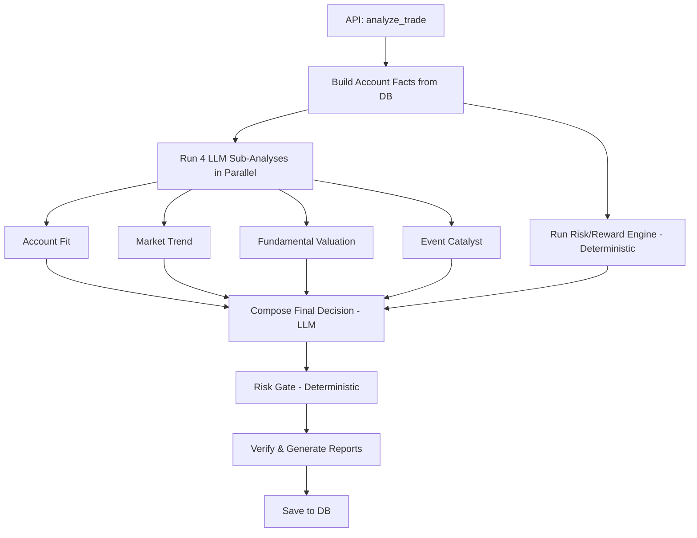
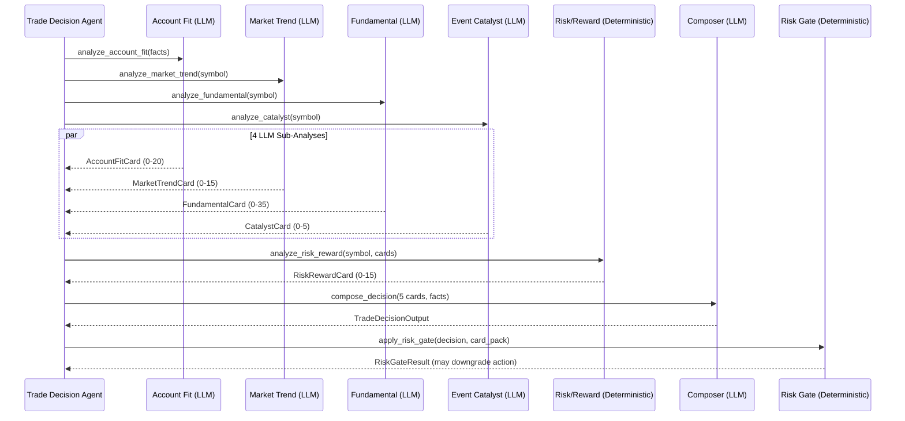

# Trade Decision Agent

The Trade Decision agent analyzes whether to **enter a new position** or **adjust an existing holding**. It runs five sub-analyses (4 LLM + 1 deterministic), synthesizes them via LLM composer, then applies a **deterministic Risk Gate** for safety.

## Architecture



The entry point is `analyze_trade()` in `app/agents/trade_decision/agent.py`. It uses `asyncio.gather` with a `ThreadPoolExecutor` for the 4 LLM sub-analyses, then runs the deterministic Risk/Reward engine and Risk Gate synchronously.

### Pipeline



## The Five Sub-Analyses

### 1. Account Fit (LLM, score 0-20)

Analyzes how well the symbol fits the current portfolio. Works purely with IBKR account data — no MCP tools.

**Output fields**: `summary`, `score`, `stance`, `account_fit_level`, `deployable_liquidity`, `current_position_pct`, `max_suggested_position_pct`, `position_size_label`, `key_points`, `risks`, `historical_mistake_flags`

### 2. Market Trend (LLM, score 0-15)

Analyzes price trends, volatility, and technical signals. Enhanced with `TechnicalSignalEngine` outputs (trend_break_level, support/resistance, relative strength).

**Output fields**: `summary`, `score`, `stance`, `price_trend`, `trend_break_level`, `relative_to_benchmark`, `recent_return_pct`, `volatility_summary`, `technical_signals`, `support_levels`, `resistance_levels`

### 3. Fundamental Valuation (LLM, score 0-35)

Analyzes company fundamentals and valuation. Enhanced with `FundamentalChangeEngine` outputs (fundamental_status, thesis_broken, change signals).

**Output fields**: `summary`, `score`, `stance`, `company_name`, `pe_ttm`, `forward_pe`, `fundamental_status`, `thesis_broken`, `revenue_growth_trend`, `margin_trend`, `cash_flow_trend`

### 4. Event Catalyst (LLM, score 0-5)

Analyzes upcoming events and news catalysts.

**Output fields**: `summary`, `score`, `stance`, `next_earnings_date`, `recent_news_count`, `key_events`, `sentiment`, `catalyst_strength`, `risk_events`

### 5. Risk/Reward (Deterministic, score 0-15)

**No LLM call.** Uses three deterministic engines:

- **TechnicalSignalEngine** → MA20/50/200, ATR14, support/resistance, trend-break level
- **RiskRewardEngine** → upside/downside estimation, R-multiple, action guidance, stop/invalidation levels
- **InvestmentThesis** → per-symbol max position, risk class, sell/no-add triggers

**Output fields**: `summary`, `score`, `stance`, `upside_potential_pct`, `downside_risk_pct`, `reward_risk_ratio`, `action_guidance`, `max_position_pct`, `stop_add_level`, `invalidation_level`, `downside_scenarios`, `upside_scenarios`

## Risk Gate

After the LLM composer produces a decision, the **Risk Gate** applies deterministic safety rules. It can downgrade or block unsafe actions.

### Gating Rules

| Rule | Trigger | Effect |
|------|---------|--------|
| **Panic detection** | User asks to dump position while fundamentals are intact | `panic_blocked` |
| **Missing position limit** | `add` without `max_position_pct` | → `hold_no_add` / `wait` |
| **Missing invalidation** | Strong `add` without `invalid_conditions` | → `add_on_pullback` |
| **Data insufficiency** | 2+ public data fallbacks | → `hold_no_add` |
| **Weak catalyst** | `add` with weak/no catalyst | → `hold_no_add` |
| **Position limit reached** | Already at/above max position | → `hold_no_add` |
| **Trend severe** | `trend_break_level = severe` | Block all `add` |
| **Trend broken** | `trend_break_level = broken` | Block all `add` |
| **Trend warning** | `trend_break_level = warning` | Block strong `add` |
| **Thesis position limit** | At thesis max position | → `hold_no_add` |
| **Extreme risk class** | `risk_class = extreme` | Block strong `add` |
| **Sell triggers hit** | Investment thesis sell rules match | → `reduce_now` / `sell_thesis_broken` |
| **Fundamental red** | `fundamental_status = red` or `thesis_broken` | → `reduce_now` / `sell_thesis_broken` |
| **Fundamental orange** | `fundamental_status = orange` | Block `add` |
| **R/R < 1.0** | `reward_risk_ratio < 1.0` | → `reduce_now` / `wait` |
| **R/R < 1.5** | `reward_risk_ratio < 1.5` | → `hold_no_add` |
| **Severe breakdown** | All signals bearish | → `reduce_now` |

### Action Vocabulary

| Action | Meaning |
|--------|---------|
| `add` / `add_small` / `add_batch` | Increase position |
| `add_on_pullback` | Increase only after price pullback |
| `add_right_side` | Increase on confirmed uptrend |
| `hold` / `hold_no_add` | Maintain current, do not increase |
| `reduce` / `reduce_now` | Decrease position |
| `sell_thesis_broken` | Exit — investment thesis invalidated |
| `wait` / `watchlist` / `avoid` | No action now |
| `panic_blocked` | User panic detected, action blocked |

### Confidence Capping

The Risk Gate caps the LLM's confidence when:

- Panic sell detected → `low`
- Fundamental red → `low`
- 3+ public data fallbacks → `low`
- Weak catalyst → `medium`
- Insufficient data → `medium`

## Score Dimensions

| Dimension | Max Score | Source |
|-----------|-----------|--------|
| `fundamental_quality_score` | 20 | Fundamental card |
| `valuation_score` | 15 | Fundamental card |
| `trend_score` | 15 | Market trend card |
| `account_fit_score` | 20 | Account fit card |
| `risk_reward_score` | 15 | Risk/reward card (deterministic) |
| `review_constraint_score` | 10 | Review history |
| `event_catalyst_score` | 5 | Event catalyst card |

## API Usage

```
POST /api/trade-decision/analyze
{
  "symbol": "AAPL.US",
  "decision_type": "entry_decision",
  "question": "Should I buy AAPL given the recent pullback?"
}
```

The response includes the full decision with evidence pack (5 cards), risk gate result, score breakdown, and execution plan.
