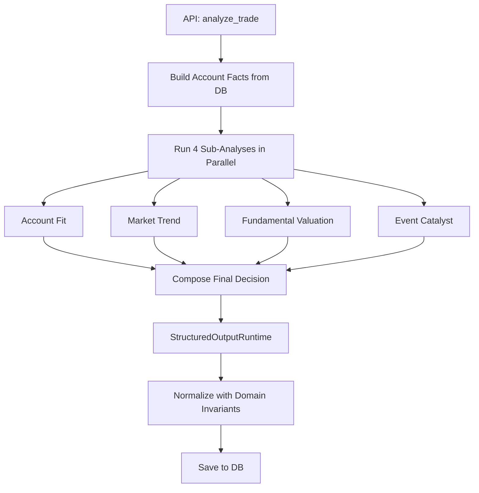
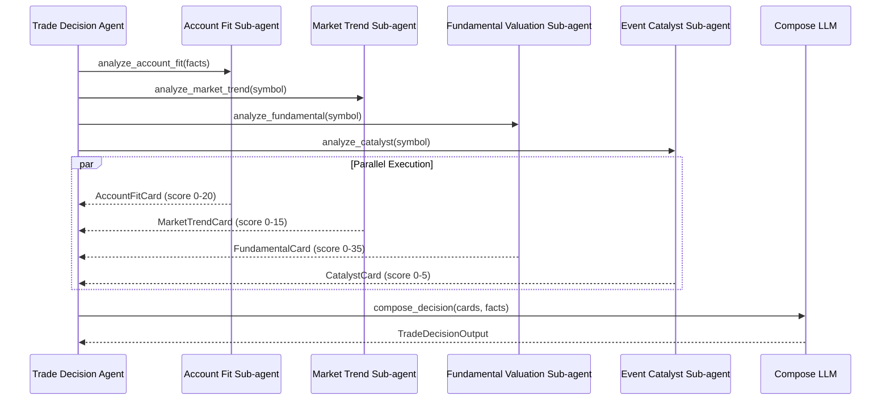

# Trade Decision Agent

The Trade Decision agent analyzes whether to **enter a new position** or **adjust an existing holding**. It runs four parallel sub-analyses, each producing a scored "card", then synthesizes them into a final decision.

## Architecture



The entry point is `analyze_trade()` in `app/agents/trade_decision/agent.py`. It is an async function that uses `asyncio.gather` with a `ThreadPoolExecutor` to run the four sub-analyses concurrently.

```python
# app/agents/trade_decision/agent.py
async def analyze_trade(symbol: str, decision_type: str) -> TradeDecisionOutput:
    # Build deterministic account facts
    account_facts = build_account_facts(symbol, decision_type)

    # Run 4 sub-analyses in parallel
    account_fit, market_trend, fundamental, catalyst = await asyncio.gather(
        run_account_fit_analysis(account_facts),
        run_market_trend_analysis(symbol),
        run_fundamental_analysis(symbol),
        run_event_catalyst_analysis(symbol),
    )

    # Compose final decision from all 4 cards
    cards = {
        "account_fit": account_fit,
        "market_trend": market_trend,
        "fundamental_valuation": fundamental,
        "event_catalyst": catalyst,
    }
    decision = await compose_final_decision(cards, account_facts)
    return normalize_trade_decision_output(decision)
```

### 4-Subagent Parallel Execution



## Decision Types

| Type | Description |
|---|---|
| `entry_decision` | Should I open a new position in this symbol? |
| `holding_decision` | Should I add to, reduce, or maintain my existing position? |

## The Four Sub-Analyses

Each sub-analysis runs as a separate `ToolCallingRuntime` instance with its own system prompt and output schema.

### 1. Account Fit (score 0-20)

Analyzes how well the symbol fits the current portfolio. This sub-analysis does **not** use MCP tools -- it works purely with IBKR account data and LLM reasoning.

**Output fields**: `summary`, `score`, `stance`, `account_fit_level`, `deployable_liquidity`, `current_position_pct`, `max_suggested_position_pct`, `suggested_cash_amount`, `position_size_label`, `key_points`, `risks`, `historical_mistake_flags`

**Key considerations**:
- Current portfolio concentration
- Available cash and liquidity
- Position sizing relative to account size
- Historical mistake patterns for this symbol

### 2. Market Trend (score 0-15)

Analyzes price trends, volatility, and technical signals. Uses MCP tools to fetch public market data from Longbridge.

**Output fields**: `summary`, `score`, `stance`, `price_trend`, `relative_to_benchmark`, `recent_return_pct`, `volatility_summary`, `volume_signal`, `support_resistance`, `sector_view`, `key_points`, `risks`

**Key considerations**:
- Price trend direction and strength
- Volume patterns
- Support/resistance levels
- Sector and benchmark comparison

### 3. Fundamental Valuation (score 0-35)

Analyzes company fundamentals and valuation metrics. Uses MCP tools for financial data.

**Output fields**: `summary`, `score`, `stance`, `company_name`, `market_cap`, `pe_ttm`, `forward_pe`, `revenue_growth_summary`, `profitability_summary`, `valuation_summary`, `peer_relative_note`, `key_points`, `risks`

**Key considerations**:
- Revenue and earnings growth
- Profit margins
- PE, PB, and other valuation ratios
- Peer comparison

### 4. Event Catalyst (score 0-5)

Analyzes upcoming events and news catalysts. Uses MCP tools for news and events data.

**Output fields**: `summary`, `score`, `stance`, `next_earnings_date`, `recent_news_count`, `key_events`, `sentiment`, `catalyst_strength`, `risk_events`, `key_points`, `risks`

**Key considerations**:
- Upcoming earnings dates
- Recent news sentiment
- Regulatory or product events
- Risk events (lawsuits, investigations)

## Score Dimensions

The final decision uses 7 score dimensions totaling 100 points:

| Dimension | Max Score | Source | What It Measures |
|---|---|---|---|
| `fundamental_quality_score` | 20 | Fundamental card | Revenue growth, profitability, business quality |
| `valuation_score` | 15 | Fundamental card | PE, PB, peer comparison, valuation attractiveness |
| `trend_score` | 15 | Market trend card | Price trend, momentum, volume signals |
| `account_fit_score` | 20 | Account fit card | Portfolio fit, position sizing, liquidity |
| `risk_reward_score` | 15 | Synthesized | Risk-reward ratio across all signals |
| `review_constraint_score` | 10 | Synthesized from review history | Penalty from historical poor trades in this symbol |
| `event_catalyst_score` | 5 | Event catalyst card | Upcoming events, news catalysts |

## Decision Output Schema

The `TradeDecisionOutput` Pydantic model defines the output structure:

```python
# app/agents/trade_decision/output_schema.py
class TradeDecisionOutput(FlexibleModel):
    symbol: str | None = None
    decision_type: str = ""          # "entry_decision" or "holding_decision"
    overall_score: float = 0         # 0-100
    rating: str | None = None        # "strong_buy_or_hold", "positive", "neutral", "negative"
    action: str = "watchlist"         # "add", "hold", "reduce", "sell", "wait", "avoid", "watchlist"
    confidence: str = "low"           # "high", "medium", "low"
    decision_summary: str = ""
    score_detail: dict[str, ScoreItem]
    position_advice: dict[str, Any]
    execution_plan: dict[str, Any]
    key_reasons: list[str]
    major_risks: list[str]
    review_warnings: list[str]
    data_limitations: list[str]
    evidence_used: list[str]
```

### Rating Derivation

The rating is derived from the overall score:

| Score Range | Rating |
|---|---|
| >= 85 | `strong_buy_or_hold` |
| >= 70 | `positive` |
| >= 50 | `neutral` |
| < 50 | `negative` |

### Position Advice

The `position_advice` field provides concrete sizing guidance:

```json
{
  "current_position_pct": 0.05,
  "suggested_target_position_pct": 0.08,
  "max_position_pct": 0.15,
  "suggested_cash_amount": 5000,
  "position_size_label": "small"
}
```

### Execution Plan

The `execution_plan` field provides step-by-step guidance:

```json
{
  "should_act_now": true,
  "plan": [
    {"step": 1, "condition": "Price pulls back to 50-day MA", "action": "add_small", "amount": 3000}
  ],
  "invalid_conditions": ["Earnings miss", "Sector downgrade"],
  "recheck_triggers": ["After next earnings report"]
}
```

## Normalization and Safety

After the LLM produces output, `normalize_trade_decision_output()` in `app/agents/invariants.py` enforces:

- **Action normalization**: Chinese aliases like "逢低加仓" map to `add_small`
- **Confidence downgrade**: If 4+ data limitations exist, confidence is capped at `medium`
- **Rating cap**: If critical Longbridge data is missing, `strong_buy_or_hold` is capped to `positive`
- **Action reconciliation**: If `should_act_now` is false or `suggested_cash_amount` is 0, buy actions are downgraded to `hold`
- **Forceful language softening**: "必须买入" becomes "observe pending preset conditions"

## Fallback Behavior

If the LLM fails or returns invalid output, the fallback returns:

```json
{
  "action": "watchlist",
  "confidence": "low",
  "rating": "negative",
  "decision_summary": "Analysis failed; recommend watching.",
  "key_reasons": ["Insufficient data for reliable analysis"],
  "major_risks": ["Data insufficiency"]
}
```

## API Usage

```
POST /api/trade-decision
{
  "symbol": "AAPL.US",
  "decision_type": "entry_decision",
  "question": "Should I buy AAPL given the recent pullback?"
}
```

The response includes the full decision document with evidence pack, score breakdown, and execution plan.
