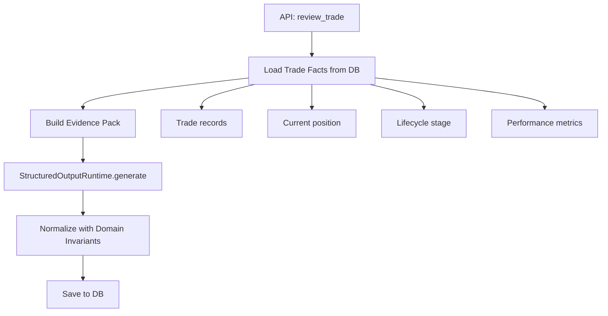
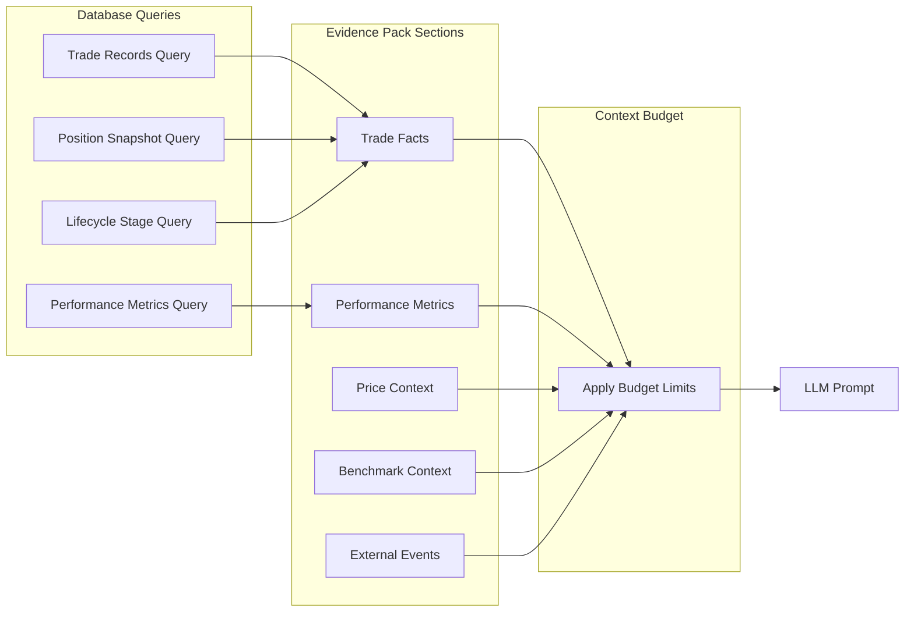
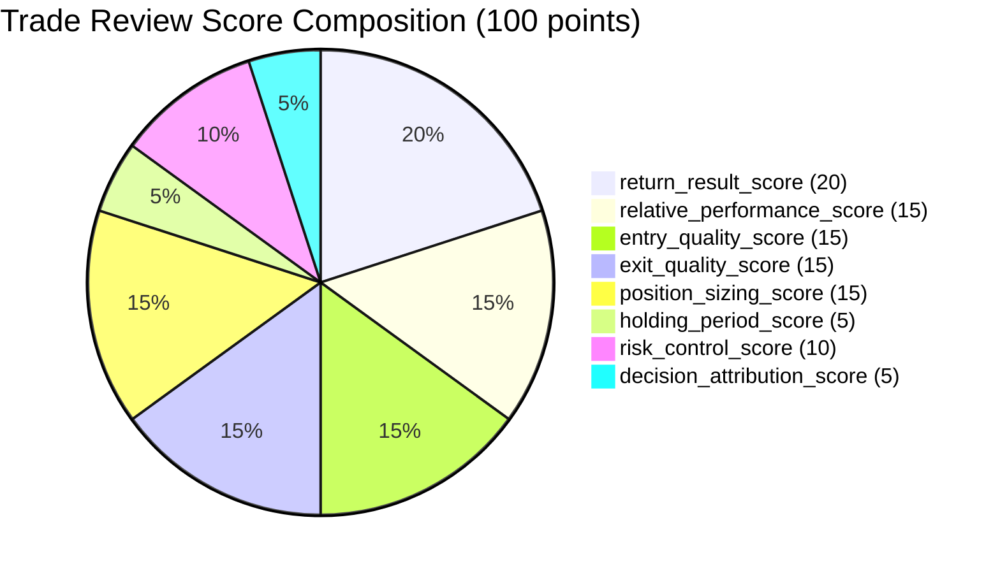
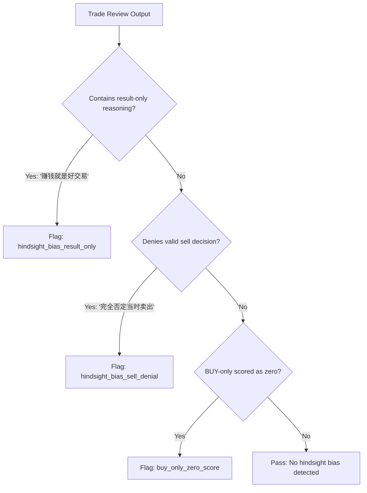

# Trade Review Agent

The Trade Review agent evaluates your historical trading performance for a specific symbol or trade. It scores across eight dimensions, identifies behavioral patterns, and tags common trading mistakes.

## How It Works

The entry point is `review_trade()` in `app/agents/trade_review/agent.py`. It follows a four-step pipeline:



### Evidence Gathering Flow



## Review Types

| Type | Description |
|---|---|
| `single_trade_review` | Review a specific trade by trade ID |
| `symbol_level_review` | Review all trades for a symbol in a date range |

## Trade Facts

The agent loads these deterministic facts from the database:

- **Trade records**: All BUY/SELL transactions for the symbol
- **Current position**: Whether the position is still open, current quantity and value
- **Lifecycle stage**: `open` (still holding) or `closed` (fully exited)
- **Performance metrics**: Total bought/sold, commission, realized PnL, trade count
- **First buy date / Last trade date**: Temporal boundaries of the trade history

## Eight Score Dimensions

The trade review scores across eight dimensions, totaling 100 points:

| Dimension | Max Score | What It Measures |
|---|---|---|
| `return_result_score` | 20 | Absolute return on the trade |
| `relative_performance_score` | 15 | Performance vs. benchmark (e.g., S&P 500) |
| `entry_quality_score` | 15 | Was the entry well-timed? Did you buy at a reasonable price? |
| `exit_quality_score` | 15 | Was the exit well-timed? Did you sell too early or too late? |
| `position_sizing_score` | 15 | Was the position size appropriate for the account? |
| `holding_period_score` | 5 | Was the holding period reasonable for the strategy? |
| `risk_control_score` | 10 | Were stop-losses or risk limits in place? |
| `decision_attribution_score` | 5 | Was the decision based on analysis or emotion? |

### Exit Quality for Open Positions

For positions that are still open (no SELL trades), `exit_quality_score` is marked as **not applicable** and excluded from the total. This prevents the LLM from penalizing a trade that hasn't been exited yet.

For BUY-only open positions, the system enforces minimum scores on `entry_quality_score` (5.0), `position_sizing_score` (3.0), `holding_period_score` (1.0), and `risk_control_score` (1.0) to avoid zero-score outputs.

### Scoring Breakdown Diagram



## Rating Derivation

The overall score is calculated as `(raw_score / applicable_max_score) * 100`, then mapped to a rating:

| Score Range | Rating |
|---|---|
| >= 85 | `excellent` |
| >= 70 | `good` |
| >= 50 | `average` |
| < 50 | `poor` |

## Mistake Tags

The agent can tag common trading mistakes from this allowed set:

### Negative Tags (Behavioral Mistakes)

| Tag | Meaning | Category |
|---|---|---|
| `CHASE_HIGH` | Bought after a significant run-up | Entry mistake |
| `SELL_TOO_EARLY` | Exited before the move played out | Exit mistake |
| `SELL_TOO_LATE` | Held too long and gave back gains | Exit mistake |
| `PANIC_SELL` | Sold during a panic/crash | Emotional mistake |
| `POSITION_TOO_SMALL` | Position was too small to matter | Sizing mistake |
| `POSITION_TOO_LARGE` | Position was too large for the account | Sizing mistake |
| `MISSED_OPPORTUNITY` | Identified the trade but didn't execute | Execution mistake |
| `NO_CLEAR_PLAN` | No defined entry/exit criteria | Planning mistake |
| `WEAK_RELATIVE_PERFORMANCE` | Underperformed the benchmark | Performance issue |

### Positive Tags (Good Practices)

| Tag | Meaning | Category |
|---|---|---|
| `GOOD_ENTRY` | Well-timed entry | Good entry |
| `GOOD_EXIT` | Well-timed exit | Good exit |
| `GOOD_POSITION_SIZING` | Appropriate position size | Good sizing |
| `GOOD_TREND_FOLLOW` | Successfully followed the trend | Good strategy |
| `GOOD_RISK_CONTROL` | Good risk management | Good risk |

Unknown tags from the LLM are filtered out and added to `data_limitations`.

## Anti-Hindsight Bias

The evaluation harness includes checks to prevent **hindsight bias** -- the tendency to judge past decisions based on outcomes that weren't known at the time:



- "赚钱就是好交易" (making money means good trade) is flagged as result-only thinking
- "完全否定当时卖出" (completely denying the sell decision) is flagged when reviewing hindsight scenarios
- BUY-only open positions are not automatically scored as zero just because there's no exit yet

## Output Schema

```python
# app/agents/trade_review/output_schema.py
class TradeReviewOutput(FlexibleModel):
    symbol: str | None = None
    review_type: str | None = None
    overall_score: float = 0
    rating: str | None = None
    score_detail: dict[str, ScoreItem]
    summary: str | None = None
    strengths: list[str]
    weaknesses: list[str]
    mistake_tags: list[str]
    improvement_suggestions: list[str]
    data_limitations: list[str]
    evidence_used: list[str]
```

## Evidence Pack

The evidence pack for trade review includes:

- **Trade facts**: The specific trades being reviewed, lifecycle stage, current position
- **Performance metrics**: Program-calculated returns, total bought/sold, commissions
- **Price context**: Price at first buy, price at last sell, period high/low
- **Benchmark context**: Public benchmark returns from Longbridge
- **External events**: News and events during the trade period

## Fallback Behavior

If the LLM fails, the fallback returns:

```json
{
  "overall_score": 50,
  "rating": "neutral",
  "summary": "Trade review failed; using conservative neutral assessment.",
  "weaknesses": ["Insufficient data for reliable review"],
  "improvement_suggestions": ["Retry review when LLM output recovers"]
}
```

## API Usage

**Symbol-level review:**
```
POST /api/trade-review
{
  "symbol": "AAPL.US",
  "start_date": "2024-01-01",
  "end_date": "2024-12-31"
}
```

**Single trade review:**
```
POST /api/trade-review
{
  "symbol": "AAPL.US",
  "trade_id": "12345"
}
```
