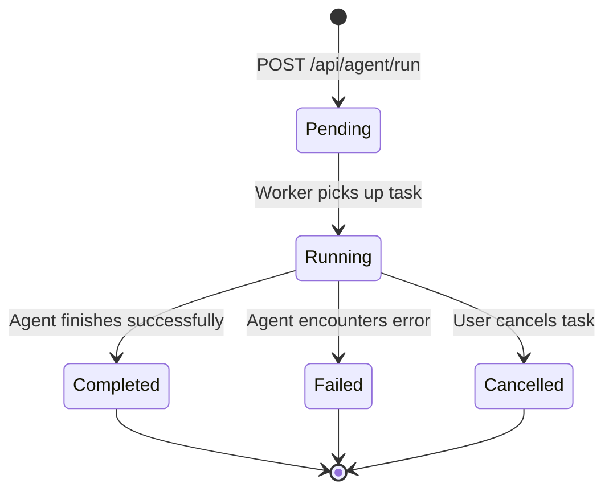
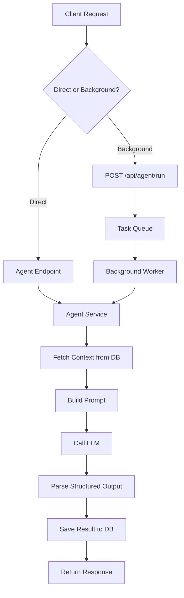

# AI Agents API

IBKR Dash includes four specialized AI agents that analyze your portfolio data using LLM-powered reasoning. Each agent focuses on a specific task: trade decisions, trade reviews, daily position reviews, and risk assessments.

You can run agents in two ways:
- **Direct endpoints** -- each agent has its own endpoint that returns results synchronously.
- **Background tasks** -- use the `/api/agent/run` endpoint to run agents in the background and poll for results.

---

## Agent Task Lifecycle



---

## Agent Architecture



---

## Agent Overview

| Agent | Prefix | Purpose |
|-------|--------|---------|
| Trade Decision | `/api/trade-decision` | Should I buy/sell/hold a specific symbol? |
| Trade Review | `/api/trade-review` | Review past trades for lessons learned |
| Daily Position Review | `/api/daily-position-review` | Daily portfolio health check |
| Risk Assessment | `/api/risk-assessment` | Portfolio-wide risk analysis |

All agent endpoints are rate-limited (20 requests per 60 seconds per IP).

---

## Trade Decision Agent

Analyze whether to enter, hold, or exit a position for a given symbol.

### Endpoints

| Method | Path | Description |
|--------|------|-------------|
| POST | `/api/trade-decision/analyze` | Run a trade decision analysis |
| GET | `/api/trade-decision/decisions` | List past decisions |
| GET | `/api/trade-decision/decisions/{decision_id}` | Get a specific decision |
| GET | `/api/trade-decision/health` | Health check |

### Run Analysis

```bash
# Entry decision
curl -X POST "http://localhost:8000/api/trade-decision/analyze" \
  -H "Content-Type: application/json" \
  -d '{"symbol": "AAPL", "decision_type": "entry_decision"}'

# Holding decision with custom question
curl -X POST "http://localhost:8000/api/trade-decision/analyze" \
  -H "Content-Type: application/json" \
  -d '{"symbol": "AAPL", "decision_type": "holding_decision", "question": "Should I add more shares?"}'
```

**Request body:**

| Field | Type | Required | Description |
|-------|------|----------|-------------|
| `symbol` | string | Yes | Ticker symbol to analyze |
| `decision_type` | string | No | `entry_decision` (default) or `holding_decision` |
| `question` | string | No | Custom question for the agent |

**Response:**

```json
{
  "id": "td-abc-123",
  "decision_type": "entry_decision",
  "symbol": "AAPL",
  "decision_output": {
    "recommendation": "BUY",
    "confidence": "high",
    "reasoning": "Strong fundamentals with...",
    "target_price": 200.00,
    "risk_factors": ["Market volatility", "Earnings upcoming"]
  },
  "metadata": {
    "model": "gpt-4o",
    "tokens_used": 2500
  },
  "evidence_summary": {
    "positions": [...],
    "recent_trades": [...]
  },
  "run_trace": [],
  "created_at": "2024-01-15T10:30:00"
}
```

### List Decisions

```bash
curl "http://localhost:8000/api/trade-decision/decisions?limit=10&symbol=AAPL"
```

| Parameter | Type | Default | Description |
|-----------|------|---------|-------------|
| `limit` | int | `20` | Max results (1-100) |
| `symbol` | string | - | Filter by symbol |
| `decision_type` | string | - | Filter by type |

### Get Specific Decision

```bash
curl "http://localhost:8000/api/trade-decision/decisions/td-abc-123"
```

### Health Check

```bash
curl "http://localhost:8000/api/trade-decision/health"
```

```json
{
  "status": "ok",
  "agent": "trade_decision"
}
```

---

## Trade Review Agent

Review past trades for a symbol to identify patterns, mistakes, and lessons.

### Endpoints

| Method | Path | Description |
|--------|------|-------------|
| POST | `/api/trade-review/review` | Trigger a trade review |
| GET | `/api/trade-review/reviews` | List past reviews |
| GET | `/api/trade-review/reviews/{review_id}` | Get a specific review |
| GET | `/api/trade-review/health` | Health check |

### Run Review

```bash
# Review all trades for a symbol
curl -X POST "http://localhost:8000/api/trade-review/review" \
  -H "Content-Type: application/json" \
  -d '{"symbol": "AAPL"}'

# Review a specific trade
curl -X POST "http://localhost:8000/api/trade-review/review" \
  -H "Content-Type: application/json" \
  -d '{"symbol": "AAPL", "trade_id": "T12345"}'

# Review trades in a date range
curl -X POST "http://localhost:8000/api/trade-review/review" \
  -H "Content-Type: application/json" \
  -d '{"symbol": "AAPL", "start_date": "2024-01-01", "end_date": "2024-01-31"}'
```

**Request body:**

| Field | Type | Required | Description |
|-------|------|----------|-------------|
| `symbol` | string | Yes | Ticker symbol to review |
| `trade_id` | string | No | Specific trade ID to review |
| `start_date` | string | No | Filter trades from this date |
| `end_date` | string | No | Filter trades up to this date |

### List Reviews

```bash
curl "http://localhost:8000/api/trade-review/reviews?limit=10&symbol=AAPL"
```

### Get Specific Review

```bash
curl "http://localhost:8000/api/trade-review/reviews/review-abc-123"
```

### Health Check

```bash
curl "http://localhost:8000/api/trade-review/health"
```

---

## Daily Position Review Agent

Generate a daily health check of your portfolio positions.

### Endpoints

| Method | Path | Description |
|--------|------|-------------|
| POST | `/api/daily-position-review/generate` | Generate a daily review |
| GET | `/api/daily-position-review/dates` | List available review dates |
| GET | `/api/daily-position-review/reviews/{date}` | Get review for a date |
| GET | `/api/daily-position-review/health` | Health check |

### Generate Review

```bash
# Generate for the latest date
curl -X POST "http://localhost:8000/api/daily-position-review/generate" \
  -H "Content-Type: application/json" \
  -d '{"report_date": ""}'

# Generate for a specific date
curl -X POST "http://localhost:8000/api/daily-position-review/generate" \
  -H "Content-Type: application/json" \
  -d '{"report_date": "2024-01-15"}'
```

### List Available Dates

```bash
curl "http://localhost:8000/api/daily-position-review/dates?limit=30"
```

Returns a list of dates that have reviews:

```json
{
  "items": ["2024-01-15", "2024-01-14", "2024-01-13"]
}
```

### Get Review by Date

```bash
curl "http://localhost:8000/api/daily-position-review/reviews/2024-01-15"
```

---

## Risk Assessment Agent

Analyze portfolio-wide risk including concentration, diversification, and exposure.

### Endpoints

| Method | Path | Description |
|--------|------|-------------|
| POST | `/api/risk-assessment/assess` | Run a risk assessment |
| GET | `/api/risk-assessment/assessments` | List past assessments |
| GET | `/api/risk-assessment/assessments/{assessment_id}` | Get a specific assessment |
| GET | `/api/risk-assessment/health` | Health check |

### Run Assessment

```bash
# Default risk assessment
curl -X POST "http://localhost:8000/api/risk-assessment/assess" \
  -H "Content-Type: application/json" \
  -d '{}'

# With a custom question
curl -X POST "http://localhost:8000/api/risk-assessment/assess" \
  -H "Content-Type: application/json" \
  -d '{"question": "What is my exposure to tech stocks?"}'
```

### List Assessments

```bash
curl "http://localhost:8000/api/risk-assessment/assessments?limit=10"
```

### Get Specific Assessment

```bash
curl "http://localhost:8000/api/risk-assessment/assessments/assess-abc-123"
```

### Health Check

```bash
curl "http://localhost:8000/api/risk-assessment/health"
```

---

## Background Task Runner

For long-running agent tasks, use the background task API. This returns a task ID immediately and you can poll for the result.

### Run a Background Task

```bash
curl -X POST "http://localhost:8000/api/agent/run" \
  -H "Content-Type: application/json" \
  -d '{"agent_name": "daily_review", "report_date": "2024-01-15"}'
```

**Request body:**

| Field | Type | Required | Description |
|-------|------|----------|-------------|
| `agent_name` | string | Yes | `daily_review`, `trade_decision`, `trade_review`, or `risk_assessment` |
| `symbol` | string | For trade agents | Ticker symbol |
| `trade_id` | string | No | Specific trade ID |
| `report_date` | string | No | Date for daily review |
| `question` | string | No | Custom question |
| `decision_type` | string | No | `entry_decision` or `holding_decision` |

**Response:**

```json
{
  "id": "task-abc-123",
  "agent_name": "daily_review",
  "status": "running",
  "progress": null,
  "result": null,
  "error": null,
  "created_at": "2024-01-15T10:30:00",
  "started_at": "2024-01-15T10:30:01",
  "finished_at": null
}
```

### Poll Task Status

```bash
curl "http://localhost:8000/api/agent/tasks/task-abc-123"
```

**Completed response:**

```json
{
  "id": "task-abc-123",
  "agent_name": "daily_review",
  "status": "completed",
  "progress": 100,
  "result": {
    "review_date": "2024-01-15",
    "summary": "Portfolio is well-diversified...",
    "cards": [...]
  },
  "error": null,
  "created_at": "2024-01-15T10:30:00",
  "started_at": "2024-01-15T10:30:01",
  "finished_at": "2024-01-15T10:30:45"
}
```

Status values: `pending`, `running`, `completed`, `failed`, `cancelled`.

### List Tasks

```bash
curl "http://localhost:8000/api/agent/tasks?agent_name=daily_review&status=completed&limit=10"
```

### Cancel a Task

```bash
curl -X POST "http://localhost:8000/api/agent/tasks/task-abc-123/cancel"
```

---

## Error Handling

| Status | Body | Cause |
|--------|------|-------|
| `400` | `{"detail":"symbol is required"}` | Missing required parameter |
| `401` | `{"detail":"Not authenticated"}` | Missing or expired session |
| `404` | `{"detail":"Task not found"}` | Task ID does not exist |
| `422` | `{"detail":"No data available..."}` | No data for the requested analysis |
| `429` | `{"detail":"Rate limit exceeded..."}` | Too many LLM requests |
| `500` | `{"detail":"Analysis failed: ..."}` | LLM or agent runtime error |
