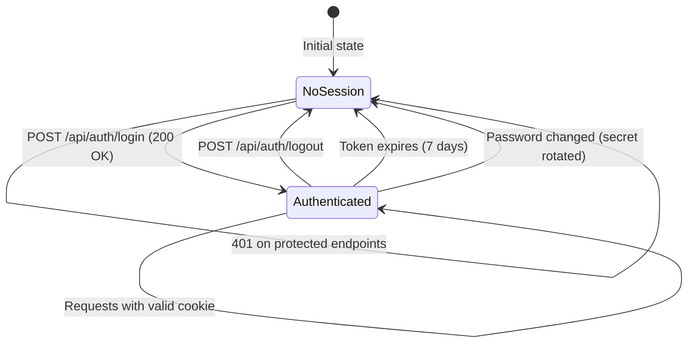
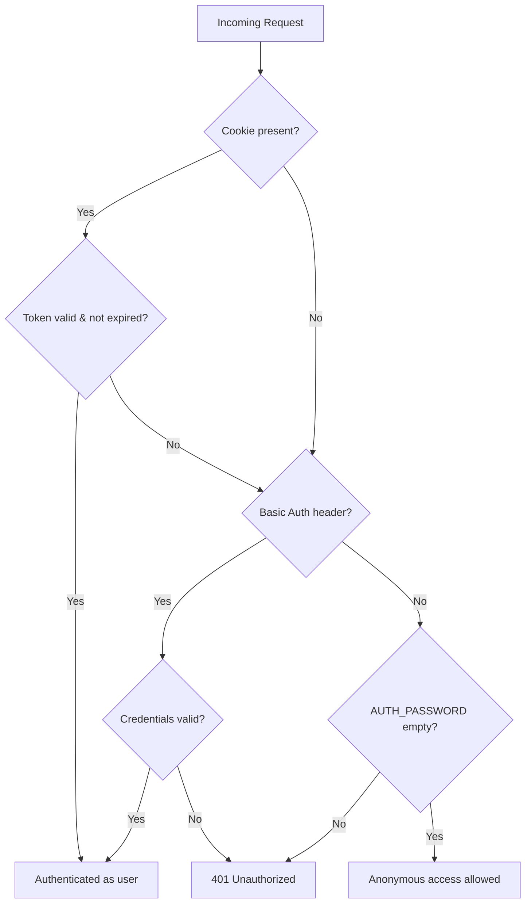

# Authentication API

IBKR Dash uses HMAC-signed session tokens stored in `httpOnly` cookies for authentication. When `auth.password` is empty in Admin Settings, all endpoints are publicly accessible without login.

---

## Endpoints

| Method | Path | Description |
|--------|------|-------------|
| `POST` | `/api/auth/login` | Log in and receive a session cookie |
| `POST` | `/api/auth/logout` | Clear the session cookie |
| `GET` | `/api/auth/session` | Check current session status |

---

## Login Sequence Diagram

```mermaid
sequenceDiagram
    participant Browser
    participant FastAPI as FastAPI Server
    participant Auth as Auth Module
    participant HMAC as HMAC-SHA256

    Browser->>FastAPI: POST /api/auth/login<br/>{username, password}

    alt AUTH_PASSWORD is empty
        FastAPI->>Auth: Skip validation
        Auth-->>FastAPI: Accept any credentials
    else AUTH_PASSWORD is set
        FastAPI->>Auth: Verify credentials
        Auth->>Auth: secrets.compare_digest(password, AUTH_PASSWORD)
        alt Invalid password
            Auth-->>FastAPI: Authentication failed
            FastAPI-->>Browser: 401 {"detail": "Invalid username or password"}
        end
    end

    FastAPI->>HMAC: Generate token
    HMAC->>HMAC: payload = base64({username, expires_at})
    HMAC->>HMAC: signature = HMAC-SHA256(payload, secret)
    HMAC-->>FastAPI: token = payload + "." + signature
    FastAPI-->>Browser: 200 OK<br/>Set-Cookie: ibkr_dash_session=token; HttpOnly; SameSite=Lax; Max-Age=604800
```

---

## POST /api/auth/login

Authenticate with username and password. On success, the server sets a session cookie.

### Request

```json
{
  "username": "admin",
  "password": "your-password"
}
```

| Field | Type | Required | Description |
|-------|------|----------|-------------|
| `username` | string | Yes | Must match `AUTH_USERNAME` setting |
| `password` | string | Yes | Must match `AUTH_PASSWORD` setting |

### Success Response (200)

```json
{
  "authenticated": true,
  "username": "admin"
}
```

The response also sets a `Set-Cookie` header:

```
Set-Cookie: ibkr_dash_session=<token>; Max-Age=604800; HttpOnly; SameSite=Lax; Path=/
```

The session cookie:

- Is `httpOnly` (not accessible from JavaScript)
- Has `SameSite=Lax` (sent with same-site navigations and top-level cross-site GET)
- Lasts **7 days** (604,800 seconds)
- Is scoped to `/` (all paths)

### Error Response (401)

```json
{
  "detail": "Invalid username or password"
}
```

### Example

```bash
curl -X POST http://localhost:8000/api/auth/login \
  -H "Content-Type: application/json" \
  -d '{"username": "admin", "password": "my-secret"}' \
  -c cookies.txt
```

### When Auth Is Disabled

If `auth.password` is empty in Admin Settings, the login endpoint accepts **any** credentials and returns a valid session. This is convenient for local development but should never be used in production.

---

## POST /api/auth/logout

Clear the session cookie. Returns the current (now unauthenticated) session status.

### Request

No request body needed. The session cookie is identified automatically.

### Response (200)

```json
{
  "authenticated": false,
  "username": null
}
```

The response clears the cookie:

```
Set-Cookie: ibkr_dash_session=; Max-Age=0; Path=/; SameSite=Lax
```

### Example

```bash
curl -X POST http://localhost:8000/api/auth/logout -b cookies.txt
```

---

## GET /api/auth/session

Check whether the current request has a valid session. This is a lightweight endpoint that does not require authentication -- it simply reports whether a valid session cookie is present.

### Request

No parameters. The session cookie is read from the request automatically.

### Response (200)

**Authenticated:**

```json
{
  "authenticated": true,
  "username": "admin"
}
```

**Not authenticated:**

```json
{
  "authenticated": false,
  "username": null
}
```

### Example

```bash
# Check if logged in
curl -b cookies.txt http://localhost:8000/api/auth/session
```

---

## Cookie Lifecycle



---

## How Sessions Work

### Token Format

The session token is a string with two parts separated by a dot:

```
<base64-payload>.<hex-signature>
```

- **Payload**: Base64-encoded JSON containing the username and expiration timestamp
- **Signature**: HMAC-SHA256 of the payload, using a secret derived from `AUTH_PASSWORD`

**Example token structure:**

```
eyJ1c2VybmFtZSI6ImFkbWluIiwiZXhwaXJlc19hdCI6MTcwNzk4NDgwMH0=.a1b2c3d4e5f6...
\________________________________________________________/   \______________/
                    base64(JSON payload)                        hex(HMAC signature)
```

### Token Verification

When a request arrives with a session cookie:

1. The server extracts the token from the `ibkr_dash_session` cookie.
2. It recomputes the HMAC signature using the configured secret.
3. It compares the signatures using constant-time comparison (to prevent timing attacks).
4. It checks that the token has not expired.
5. If all checks pass, the request is authenticated.

### Security Notes

- The signing secret is derived from `AUTH_PASSWORD` using SHA-256. If you change the password, all existing sessions are invalidated.
- Credentials are compared using `secrets.compare_digest()` to prevent timing-based attacks.
- The session cookie is `httpOnly`, so it cannot be read by JavaScript in the browser.

---

## Authentication in Other Endpoints

Most API endpoints require authentication. They use the `get_current_user` dependency, which:

1. Checks for the `ibkr_dash_session` cookie first.
2. Falls back to HTTP Basic Auth (`Authorization` header).
3. If `AUTH_PASSWORD` is empty, allows anonymous access.
4. Returns `401 Unauthorized` if auth is required but no valid credential is provided.



### HTTP Basic Auth Example

```bash
curl -u admin:your-password http://localhost:8000/api/account/overview
```

### Cookie Auth Example

```bash
# First log in
curl -X POST http://localhost:8000/api/auth/login \
  -H "Content-Type: application/json" \
  -d '{"username": "admin", "password": "my-secret"}' \
  -c cookies.txt

# Then use the cookie for subsequent requests
curl -b cookies.txt http://localhost:8000/api/account/overview
```

### Frontend Auth Hook

```typescript
// Example React hook using the session endpoint
import { useState, useEffect } from 'react';

export function useAuth() {
  const [isAuthenticated, setIsAuthenticated] = useState(false);
  const [loading, setLoading] = useState(true);

  useEffect(() => {
    fetch('/api/auth/session', { credentials: 'include' })
      .then(res => res.json())
      .then(data => {
        setIsAuthenticated(data.authenticated);
        setLoading(false);
      })
      .catch(() => setLoading(false));
  }, []);

  return { isAuthenticated, loading };
}
```

---

## Schemas

### LoginRequest

| Field | Type | Description |
|-------|------|-------------|
| `username` | string | Login username |
| `password` | string | Login password |

### LoginResponse

| Field | Type | Description |
|-------|------|-------------|
| `authenticated` | boolean | Whether login succeeded |
| `username` | string \| null | Authenticated username |

### SessionResponse

| Field | Type | Description |
|-------|------|-------------|
| `authenticated` | boolean | Whether a valid session exists |
| `username` | string \| null | Username from the session |
