# Data Flow

This document traces data as it moves through IBKR Dash -- from IBKR's servers to your screen. Every major flow is illustrated with sequence diagrams so you can understand exactly what happens at each step.

---

## Overview

There are two main data flows in IBKR Dash:

1. **Financial Data Flow** -- IBKR Flex API -> Worker -> SQLite -> Backend -> Frontend
2. **AI Agent Flow** -- User -> Frontend -> Backend -> LLM -> Response

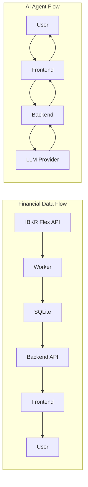

---

## Financial Data Flow

This is the core data pipeline that brings your IBKR portfolio data into the dashboard.

### Step 1: Data Extraction from IBKR

There are two ways to get data from IBKR:

#### Option A: Manual Flex CSV Export

You manually export a CSV from IBKR's web interface:

1. Log in to IBKR Account Management
2. Navigate to Reports > Flex Queries
3. Run a Flex Query (daily snapshot)
4. Download the CSV file
5. Place it in `data/flex_exports/`

#### Option B: Automatic Flex Web Service Pull

The worker automatically pulls data using IBKR's Flex Web Service API:

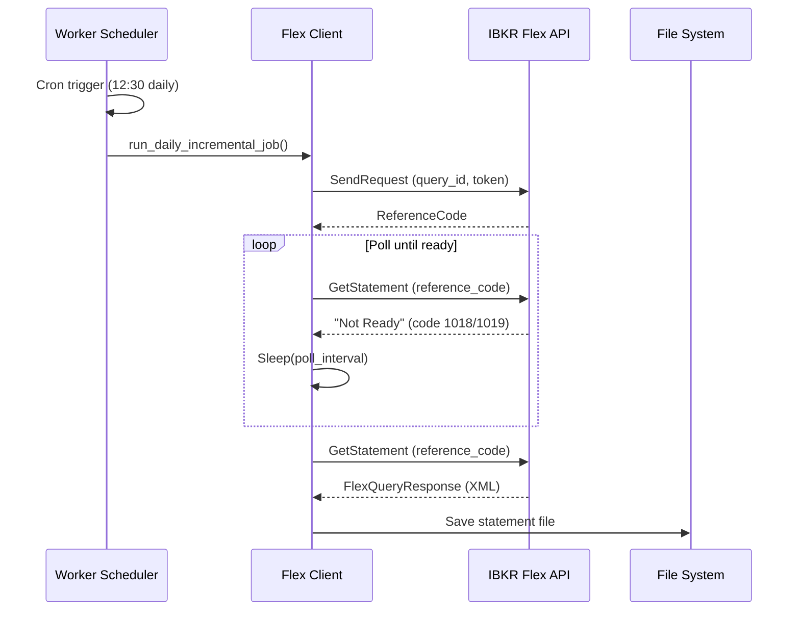

The Flex Client (`worker/clients/flex_client.py`) handles:

- **Sending** the query request with your token and query ID
- **Polling** until the statement is ready (IBKR generates reports asynchronously)
- **Downloading** the final statement (XML or CSV format)
- **Retrying** up to 60 times with 10-second intervals

:::info
IBKR Flex queries are not instant. After submitting a query, IBKR takes 10-60 seconds to generate the report. The worker polls every 10 seconds until the report is ready.
:::

---

### Step 2: CSV Parsing

The IBKR Flex CSV format is a multi-section format with record type markers. The parser (`worker/parsers/flex_csv_parser.py`) reads each row and categorizes it:

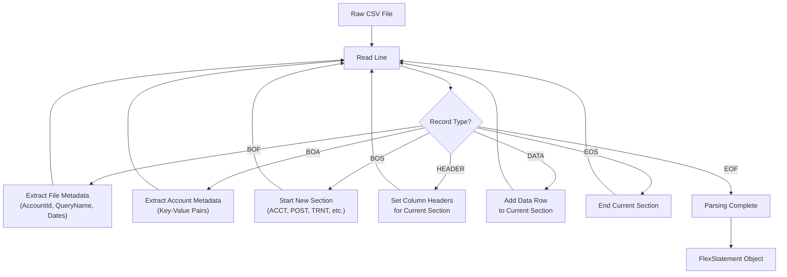

The CSV contains several sections:

| Section | Description | Maps To |
|---------|-------------|---------|
| `ACCT` | Account information | `account_snapshots` |
| `POST` | Position data | `position_snapshots` |
| `TRNT` | Trade transactions | `trade_records` |
| `CTRN` | Cash transactions | `cash_flows` |
| `FIFO` | FIFO P&L data | Merged into positions |
| `SECU` | Security details | Merged into positions |
| `PPPO` | Price data | `price_history` |

Example of the raw CSV structure:

```csv
BOF,DU123456,Daily_Snapshot,2024-01-01,2024-01-15
BOA,AccountId,DU123456,AccountType,Individual
BOS,ACCT
HEADER,AccountId,Currency,TotalEquity,Cash
DATA,DU123456,USD,150000.00,25000.00
EOS
BOS,POST
HEADER,Symbol,Quantity,MarkPrice,PositionValue
DATA,AAPL,100,185.50,18550.00
DATA,MSFT,50,375.00,18750.00
EOS
```

---

### Step 3: Data Transformation

The transformer (`worker/parsers/transformers.py`) converts parsed sections into SQLite-ready dictionaries:

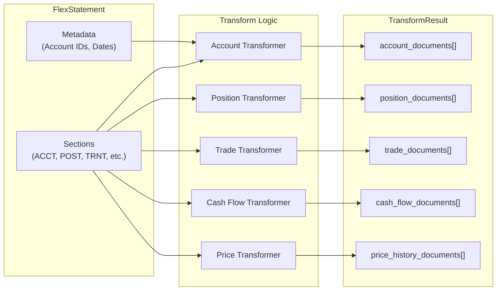

Key transformation steps:

- **Date normalization** -- Converts IBKR date formats to ISO 8601 (`YYYY-MM-DD`)
- **Number cleaning** -- Removes commas, currency symbols, and whitespace from numeric fields
- **Field mapping** -- Maps IBKR column names to database column names
- **Deduplication** -- Uses unique constraints to prevent duplicate records

---

### Step 4: Database Write

The SQLite writer (`worker/writers/sqlite_writer.py`) performs bulk upserts:

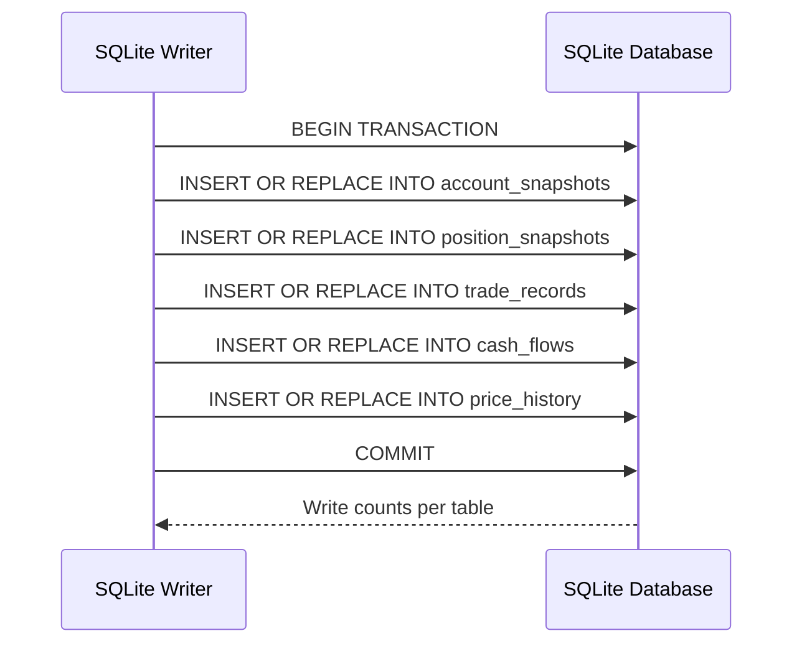

The upsert pattern (`INSERT ... ON CONFLICT DO UPDATE`) ensures that:

- Re-importing the same day's data updates existing records instead of creating duplicates
- The unique constraints (`account_id + report_date + symbol`) prevent data duplication
- Each import is idempotent (safe to run multiple times)

:::tip
The worker uses SQLite's `PRAGMA journal_mode=WAL` for concurrent access. This allows the backend to continue serving read requests while the worker is writing.
:::

---

### Step 5: API Read

When the frontend requests data, the backend reads from SQLite:

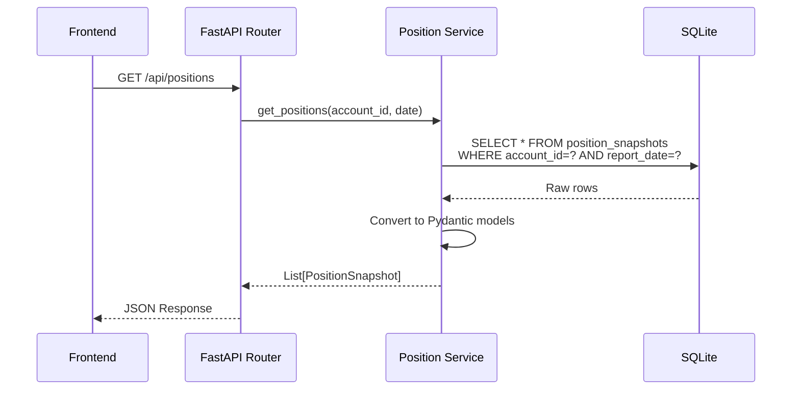

---

### Step 6: Frontend Display

The frontend renders data using React components and ECharts:

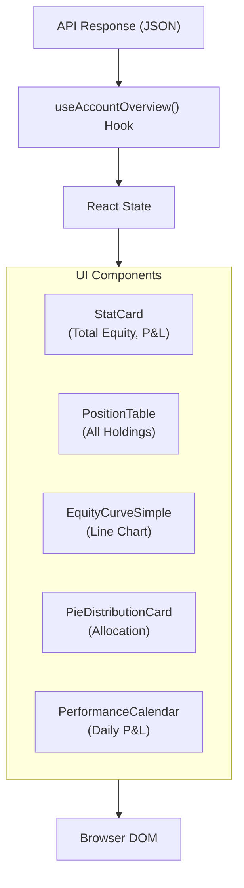

---

## AI Agent Data Flow

The AI agents are the most complex data flow in IBKR Dash. There are two distinct patterns:

### Pattern 1: Structured Output Agents

Used by: Daily Position Review, Trade Decision, Trade Review, Risk Assessment

These agents follow a fixed pipeline: gather data -> call LLM -> parse structured JSON -> store result.

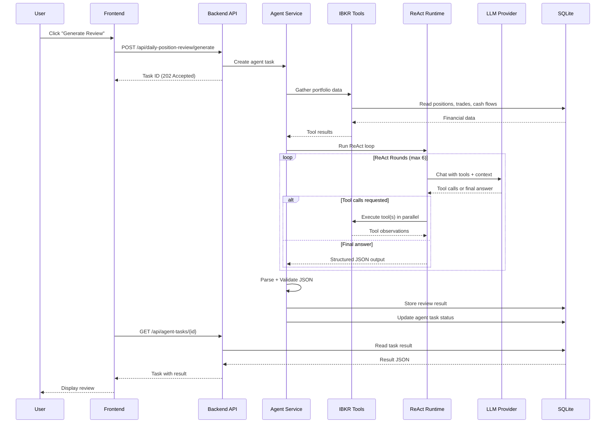

---

### Pattern 2: Copilot (Conversational Agent)

Used by: Account Copilot

The copilot is a conversational agent with memory, skills, and tool dispatch:

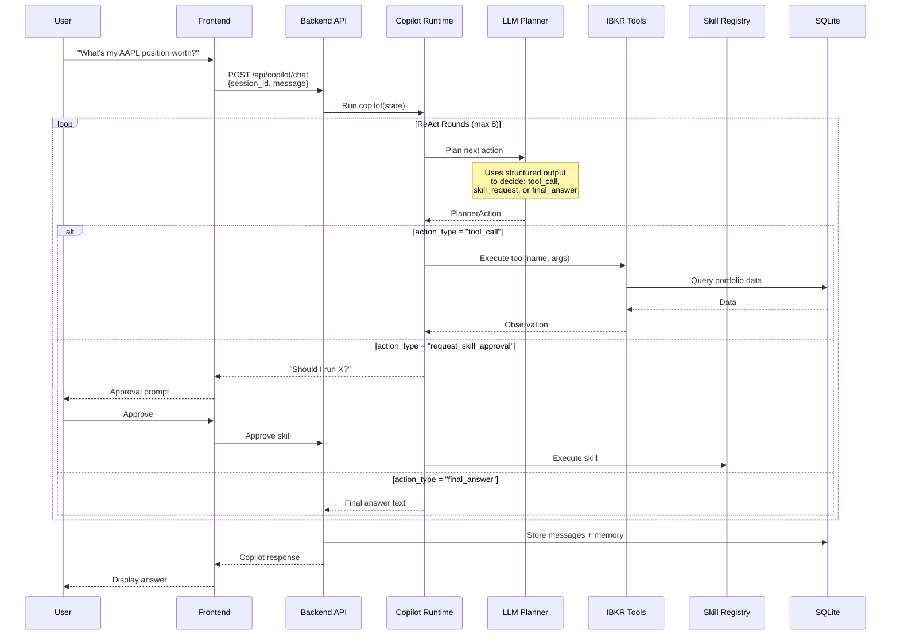

---

## Structured Output Pipeline

All AI agents use a structured output pipeline to ensure reliable JSON output from the LLM. This is critical because LLMs can produce malformed JSON.

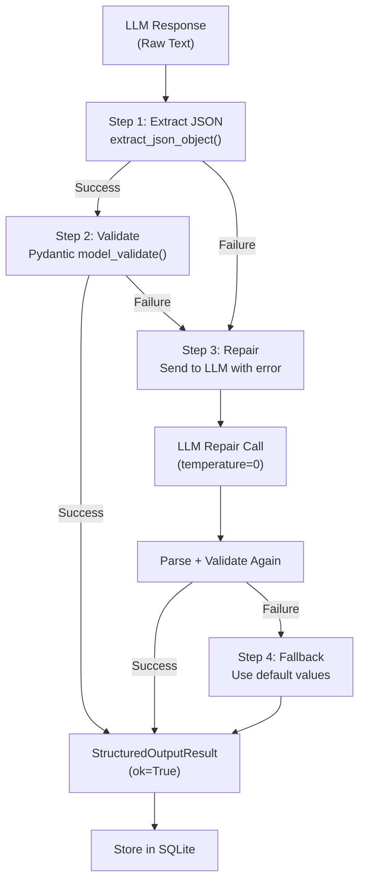

The pipeline has four stages:

1. **Parse** -- Extract a JSON object from the raw LLM text (handles markdown code blocks, extra text, etc.)
2. **Validate** -- Validate the JSON against a Pydantic model schema
3. **Repair** -- If validation fails, send the raw output back to the LLM with the error message and ask it to fix the format
4. **Fallback** -- If repair fails, use a default/fallback value

:::info
The structured output pipeline is defined in `app/agents/structured_output/`. Each agent defines a `StructuredOutputContract` that specifies the expected schema, repair behavior, and fallback logic.
:::

---

## Copilot Tool System

The Account Copilot has access to a registry of read-only tools that query the database:

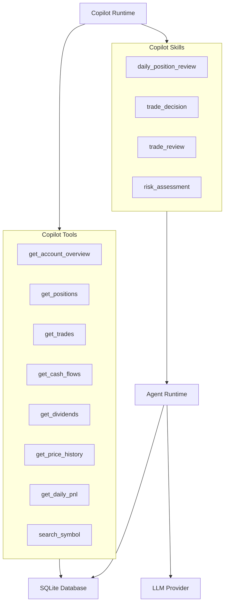

**Tools** are read-only database queries. The copilot can call them freely to gather data.

**Skills** are more complex operations that trigger full agent runs. They require user approval before execution and may call the LLM multiple times.

---

## Agent Task Lifecycle

Every agent execution creates a task record that tracks its progress:

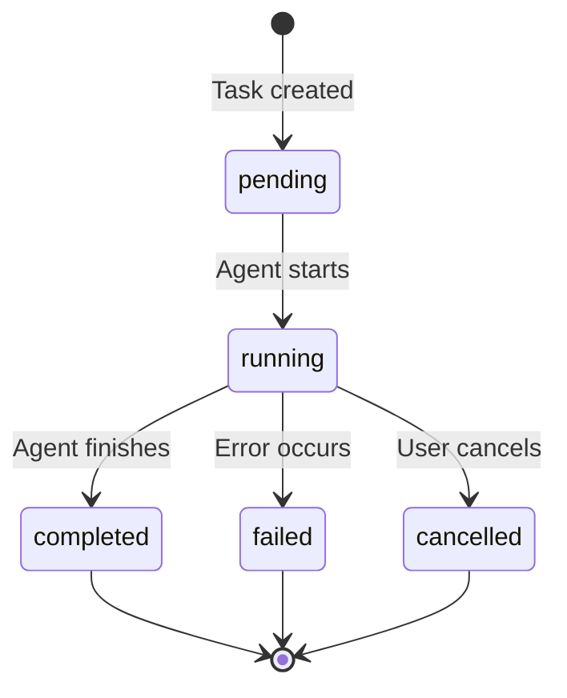

The task record stores:

- **Progress** -- JSON updates during execution
- **Result** -- The final output (review, decision, etc.)
- **Error** -- Error message if failed
- **Timing** -- Created, started, and finished timestamps
- **Run Trace** -- Full execution trace for debugging

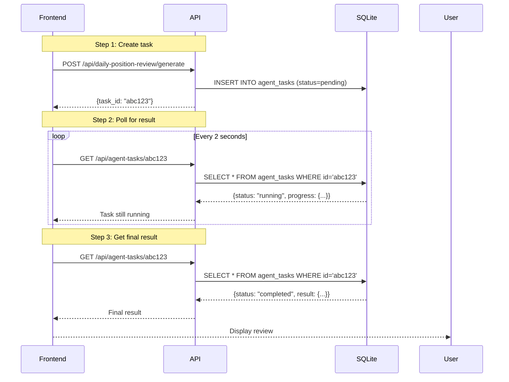

---

## Copilot Memory Flow

The copilot maintains memory across conversations:

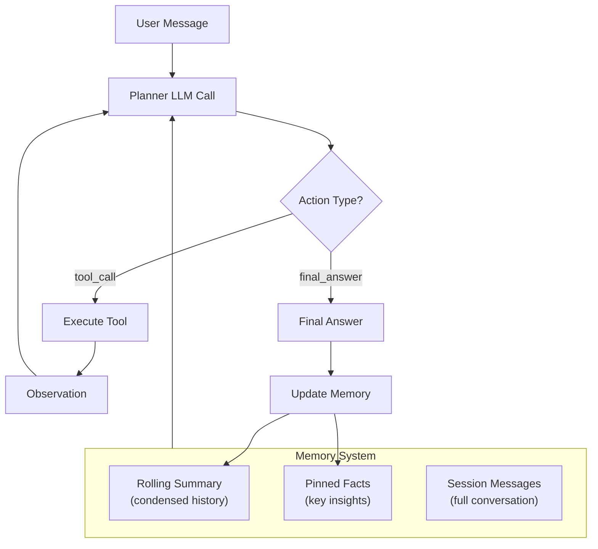

Memory types:

- **Rolling Summary** -- A condensed version of the conversation history, updated after each exchange
- **Pinned Facts** -- Key facts extracted from the conversation (e.g., "User is interested in tech stocks")
- **Session Messages** -- Full message history for the current session

---

## Data Freshness

Understanding when data is updated helps you interpret the dashboard:

```mermaid
gantt
    title Daily Data Timeline
    dateFormat HH:mm
    axisFormat %H:%M

    section Worker
    Flex Query Submission   :done, 12:30, 1m
    Poll for Statement      :done, 12:31, 5m
    Parse + Transform       :done, 12:36, 1m
    Write to SQLite         :done, 12:37, 1m

    section Backend
    Serve API Requests      :active, 00:00, 24h

    section Frontend
    Fetch on Page Load      :crit, 12:38, 1m
```

- **Financial data** is updated once per day (when the worker runs)
- **API responses** are real-time reads from SQLite (no caching by default, though `CACHE_TTL_SECONDS` can be configured)
- **AI agent outputs** are generated on-demand and stored permanently

:::warning
The dashboard shows the most recent snapshot date. If the worker has not run today, you will see yesterday's data. Check the report date in the dashboard header to confirm data freshness.
:::

---

## Error Handling

Each layer has its own error handling strategy:

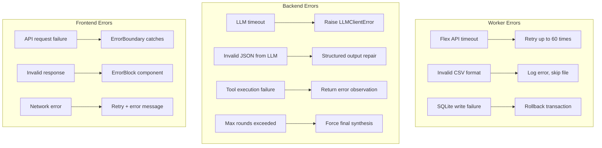

---

## Summary

| Flow | Direction | Protocol | Frequency |
|------|-----------|----------|-----------|
| IBKR -> Worker | Pull | Flex Web Service API | Daily (scheduled) |
| Worker -> SQLite | Write | Direct SQL (upsert) | On import |
| SQLite -> Backend | Read | Direct SQL query | On API request |
| Backend -> Frontend | Serve | HTTP REST (JSON) | On page load |
| Frontend -> User | Display | Browser DOM | Real-time |
| User -> Copilot | Chat | HTTP REST (JSON) | On-demand |
| Copilot -> LLM | Query | HTTP (chat/completions) | Per agent round |
| LLM -> Copilot | Response | HTTP (JSON) | Per agent round |
| Copilot -> SQLite | Store | Direct SQL | After completion |
