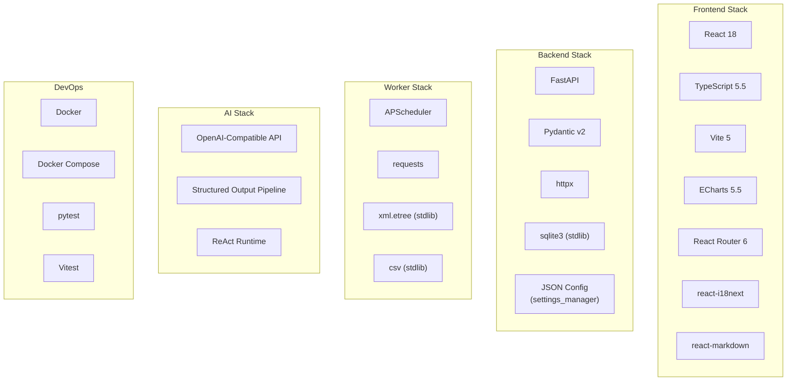
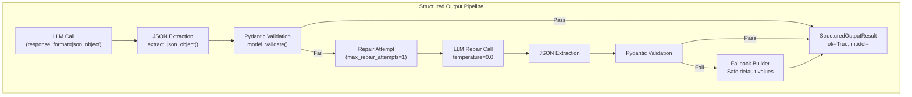
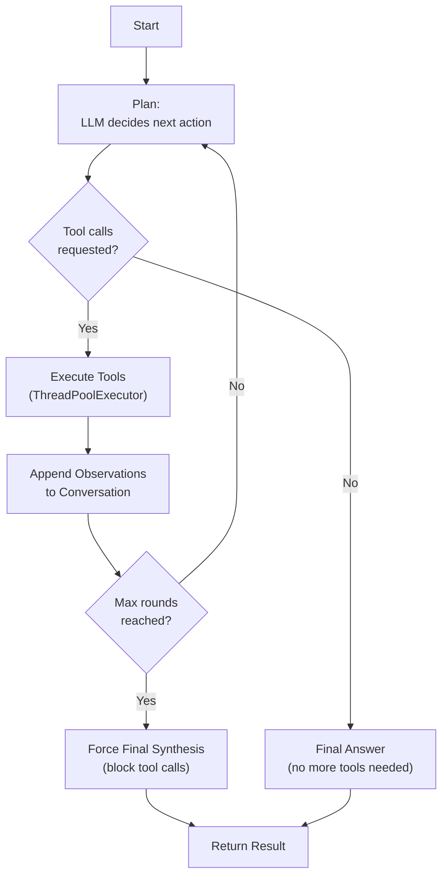
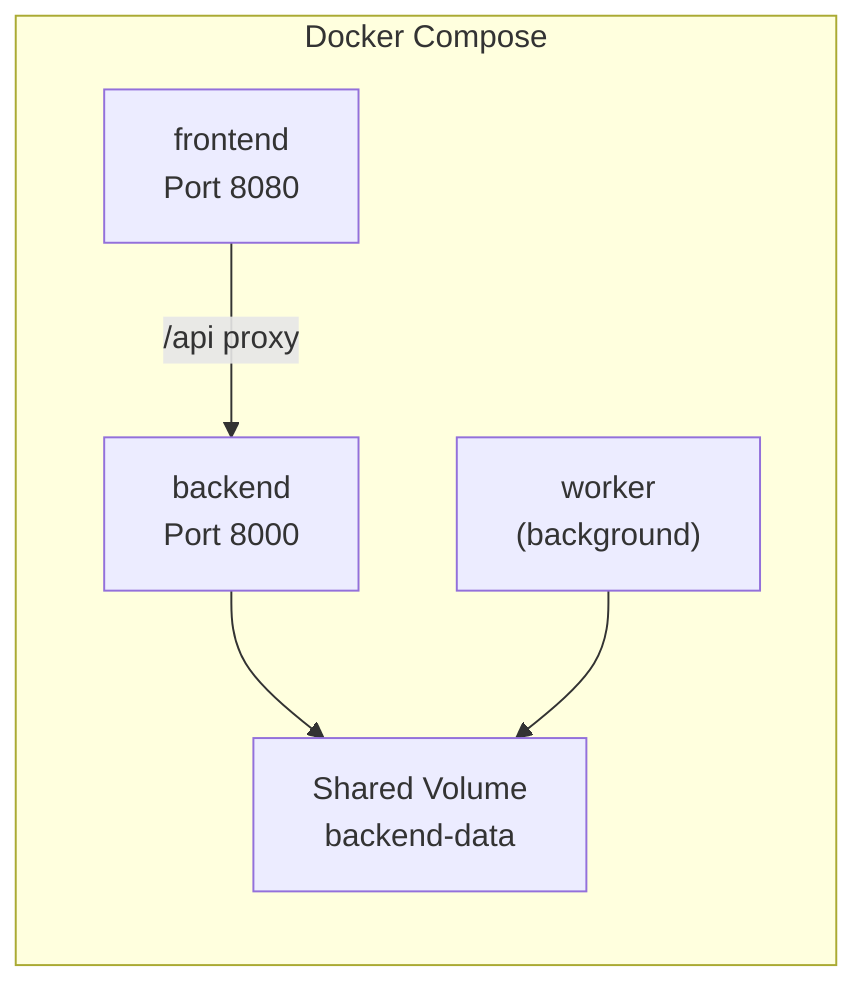
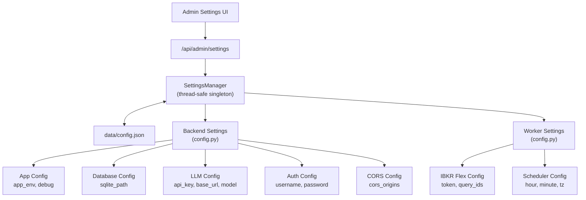

# Technology Stack

This document explains every technology used in IBKR Dash, why it was chosen, and how it is configured. If you are evaluating the project or planning to contribute, this will give you a complete picture of the technical foundation.

---

## Stack Overview



---

## Dependency Version Matrix

### Backend Dependencies

| Package | Version | Purpose |
|---------|---------|---------|
| `fastapi` | ^0.115.0 | Web framework with async support |
| `uvicorn` | ^0.34.0 | ASGI server for FastAPI |
| `pydantic` | ^2.10.0 | Data validation and JSON Schema generation |
| `httpx` | ^0.28.0 | HTTP client for LLM API calls |

### Frontend Dependencies

| Package | Version | Purpose |
|---------|---------|---------|
| `react` | ^18.3.1 | UI library |
| `react-dom` | ^18.3.1 | DOM rendering |
| `react-router-dom` | ^6.23.0 | Client-side routing |
| `typescript` | ^5.5.0 | Type-safe JavaScript |
| `vite` | ^5.4.0 | Build tool and dev server |
| `echarts` | ^5.5.0 | Charting library |
| `react-markdown` | ^10.1.0 | Markdown rendering |
| `remark-gfm` | ^4.0.1 | GitHub Flavored Markdown |
| `i18next` | ^26.3.1 | Internationalization framework |
| `react-i18next` | ^17.0.8 | React i18n bindings |
| `vitest` | ^2.1.0 | Test framework |

### Worker Dependencies

| Package | Version | Purpose |
|---------|---------|---------|
| `apscheduler` | ^3.10.0 | Cron-like job scheduling |
| `requests` | ^2.32.0 | IBKR Flex API HTTP client |

:::info
The worker has the fewest dependencies. The CSV parser uses Python's built-in `csv` module, and the XML parser uses `xml.etree.ElementTree` from the standard library. The `sqlite3` module is also part of the standard library.
:::

---

## Backend Technologies

### FastAPI

**What it is:** A modern, fast Python web framework for building APIs.

**Why it was chosen:**

- **Async support** -- FastAPI is built on ASGI and supports async request handling, which is important when making LLM API calls that can take several seconds
- **Automatic documentation** -- Generates interactive Swagger UI at `/docs` and ReDoc at `/redoc` with zero configuration
- **Pydantic integration** -- Native request/response validation using Pydantic models
- **Performance** -- One of the fastest Python web frameworks, comparable to Node.js and Go for I/O-bound workloads
- **Simplicity** -- Minimal boilerplate compared to Django or Flask with extensions

**How it is used:**

```python
# From app/main.py -- Application factory
from fastapi import FastAPI

def create_app() -> FastAPI:
    app = FastAPI(title="IBKR Dash", version="0.1.0", lifespan=lifespan)

    # CORS middleware for frontend communication
    app.add_middleware(CORSMiddleware, allow_origins=origins, ...)

    # Register 20+ route modules
    app.include_router(health_router, prefix="/api")
    app.include_router(account_router, prefix="/api")
    app.include_router(copilot_router, prefix="/api")
    # ... and more

    return app
```

**Key patterns:**

- **Dependency injection** -- `app/api/deps.py` provides shared dependencies like `get_current_user`
- **Router modules** -- Each feature has its own router file in `app/api/routes/`
- **Lifespan events** -- Database initialization happens in the `lifespan` context manager

:::tip
FastAPI's Swagger UI at `http://localhost:8000/docs` is the best way to explore all available API endpoints. You can test every endpoint directly from the browser.
:::

---

### SQLite

**What it is:** A self-contained, serverless SQL database engine.

**Why it was chosen:**

- **Zero configuration** -- No database server to install, configure, or maintain
- **Single file** -- The entire database is one file (`data/ibkr_dash.db`), easy to back up
- **Sufficient scale** -- A personal portfolio generates thousands of rows per year, well within SQLite's capabilities
- **WAL mode** -- Write-Ahead Logging allows concurrent reads during writes
- **Built-in** -- Python's `sqlite3` module is part of the standard library

**How it is used:**

```python
# From app/core/database.py -- Thread-safe wrapper
class Database:
    def __init__(self, db_path: str | Path) -> None:
        self._db_path = db_path

    def _connect(self) -> sqlite3.Connection:
        conn = sqlite3.connect(self._db_path, check_same_thread=False)
        conn.row_factory = sqlite3.Row  # Return rows as dicts
        conn.execute("PRAGMA journal_mode=WAL")    # Concurrent reads
        conn.execute("PRAGMA foreign_keys=ON")      # FK enforcement
        conn.execute("PRAGMA busy_timeout=5000")    # Wait 5s on lock
        return conn

    def upsert(self, table: str, data: dict, conflict_cols: list[str]) -> None:
        # INSERT ... ON CONFLICT DO UPDATE
        ...

    def execute(self, sql: str, params: tuple = ()) -> list[dict]:
        # Execute query, return rows as dicts
        ...
```

**Key design choices:**

- **No ORM** -- Direct SQL queries via the `Database` class. This keeps the code simple and the queries transparent
- **WAL mode** -- Enables the worker to write while the backend reads
- **Upsert pattern** -- `INSERT ... ON CONFLICT DO UPDATE` makes imports idempotent
- **Schema in code** -- The full DDL is defined as a Python string in `database.py`, applied on startup

:::info
SQLite's WAL mode is critical for IBKR Dash. Without it, the worker's write operations would block all backend read requests. With WAL mode, readers and the single writer can operate concurrently.
:::

---

### Pydantic

**What it is:** Data validation and settings management using Python type annotations.

**Why it was chosen:**

- **Type safety** -- Validates data at runtime using Python type hints
- **FastAPI integration** -- Native request/response validation
- **JSON Schema** -- Automatically generates JSON schemas for API documentation
- **Structured output** -- Used to validate LLM JSON output against expected schemas

**How it is used:**

```python
# From app/schemas/positions.py -- Request/response models
from pydantic import BaseModel

class PositionSnapshot(BaseModel):
    account_id: str
    report_date: str
    symbol: str
    quantity: float
    mark_price: float
    position_value: float
    average_cost_price: float | None = None
    fifo_pnl_unrealized: float | None = None
```

```python
# From app/core/config.py -- Settings management
from app.core.settings_manager import get_manager

class Settings:
    @property
    def llm_api_key(self) -> str:
        return str(get_manager().get("llm.api_key", ""))

    @property
    def llm_base_url(self) -> str:
        return str(get_manager().get("llm.base_url", "https://api.openai.com/v1"))
```

---

### httpx

**What it is:** A modern HTTP client library for Python.

**Why it was chosen:**

- **Provider agnostic** -- Works with any OpenAI-compatible API endpoint
- **No vendor lock-in** -- Does not depend on the OpenAI SDK
- **Connection pooling** -- Reuses connections for better performance
- **Timeout control** -- Configurable timeouts for LLM calls

**How it is used:**

```python
# From app/services/llm_service.py -- LLM client
class LLMService:
    def __init__(self, settings: Settings) -> None:
        self._client = httpx.Client(
            timeout=60.0,
            limits=httpx.Limits(max_connections=10),
        )

    def chat(self, messages: list[dict], **kwargs) -> str:
        url = f"{self.base_url}/chat/completions"
        headers = {"Authorization": f"Bearer {self.api_key}"}
        payload = {"model": self.default_model, "messages": messages, ...}
        response = self._client.post(url, headers=headers, json=payload)
        return response.json()["choices"][0]["message"]["content"]
```

The LLM service is a thin wrapper around a single HTTP POST to the `/chat/completions` endpoint. This means it works with:

- OpenAI (GPT-4o, GPT-4, etc.)
- DeepSeek (deepseek-chat, deepseek-reasoner)
- Xiaomi MiMo
- Any other OpenAI-compatible provider

---

## Frontend Technologies

### React 18

**What it is:** A JavaScript library for building user interfaces.

**Why it was chosen:**

- **Component model** -- Clean component architecture for a dashboard with many views
- **Lazy loading** -- `React.lazy()` for code-splitting 19 views
- **Ecosystem** -- Rich ecosystem of libraries (ECharts bindings, markdown rendering, i18n)
- **Testing** -- Excellent testing tools (React Testing Library, Vitest)

**How it is used:**

```tsx
// From src/router/index.tsx -- Lazy-loaded routes
const DashboardView = lazy(() => import('@/views/DashboardView'))
const PositionsView = lazy(() => import('@/views/PositionsView'))
const AccountCopilotView = lazy(() => import('@/views/AccountCopilotView'))

export const router = createBrowserRouter([
  {
    path: '/',
    element: <App />,
    children: [
      { index: true, element: lazyViewWithErrorBoundary(DashboardView) },
      { path: 'positions', element: lazyViewWithErrorBoundary(PositionsView) },
      { path: 'copilot', element: <ProtectedRoute>{lazyViewWithErrorBoundary(AccountCopilotView)}</ProtectedRoute> },
      // ... 19 routes total
    ],
  },
])
```

:::tip
Every view is lazy-loaded, meaning the JavaScript for each page is only downloaded when you navigate to it. This keeps the initial page load fast.
:::

---

### TypeScript 5.5

**What it is:** A typed superset of JavaScript that compiles to plain JavaScript.

**Why it was chosen:**

- **Type safety** -- Catches bugs at compile time instead of runtime
- **API contracts** -- TypeScript interfaces mirror the backend's Pydantic models
- **IDE support** -- Autocomplete, refactoring, and error detection in the editor
- **Maintainability** -- Easier to understand and modify code with explicit types

**How it is used:**

```typescript
// From src/types/positions.ts -- Backend response types
export interface PositionSnapshot {
  account_id: string
  report_date: string
  symbol: string
  quantity: number
  mark_price: number
  position_value: number
  average_cost_price: number | null
  fifo_pnl_unrealized: number | null
  percent_of_nav: number | null
}
```

---

### Vite 5

**What it is:** A fast build tool and development server for modern web projects.

**Why it was chosen:**

- **Fast dev server** -- Instant hot module replacement (HMR)
- **ESBuild** -- Extremely fast TypeScript/JSX compilation
- **Tree shaking** -- Removes unused code from production builds
- **Simple config** -- Minimal configuration compared to Webpack

**How it is used:**

The Vite config is minimal. The project uses path aliases (`@/` maps to `src/`) and the React plugin for JSX transformation.

```bash
# Development
npm run dev      # Starts Vite dev server on port 5173

# Production
npm run build    # TypeScript check + Vite build
npm run preview  # Preview production build locally
```

---

### ECharts 5.5

**What it is:** A powerful, interactive charting library originally from Apache.

**Why it was chosen:**

- **Rich chart types** -- Line, bar, pie, candlestick, heatmap, and more
- **Interactive** -- Built-in zoom, pan, tooltip, and data filtering
- **Performance** -- Handles thousands of data points smoothly
- **React bindings** -- Clean integration with React components

**How it is used:**

The frontend uses ECharts for:

- **Equity Curve** -- Line chart showing portfolio value over time
- **Asset Distribution** -- Pie charts for sector/allocation breakdown
- **Performance Calendar** -- Heatmap showing daily P&L
- **Symbol Analysis** -- Price charts with technical indicators

---

### React Router 6

**What it is:** Declarative routing for React applications.

**How it is used:**

```tsx
// Routes are defined in src/router/index.tsx
// Protected routes require authentication
function ProtectedRoute({ children }: { children: React.ReactNode }) {
  const { authenticated, initialized } = useAuth()
  if (!initialized) return <LoadingFallback />
  if (!authenticated) return <LoginPrompt />
  return <>{children}</>
}
```

The router defines 19 routes, split into:

- **Public routes** -- Dashboard, Positions, Trades, Cash Flows, Dividends
- **Protected routes** -- Copilot, AI agents, Admin panels (require login)

---

## Worker Technologies

### APScheduler

**What it is:** A Python library for scheduling tasks with cron-like syntax.

**Why it was chosen:**

- **Cron syntax** -- Familiar scheduling format (`hour=12, minute=30`)
- **Background execution** -- Runs jobs in a background thread
- **Timezone support** -- Uses `zoneinfo` for accurate timezone handling
- **Lightweight** -- Minimal overhead for a single scheduled job

**How it is used:**

```python
# From worker/core/scheduler.py
from apscheduler.schedulers.background import BackgroundScheduler

def create_scheduler() -> BackgroundScheduler:
    settings = get_settings()
    tz = ZoneInfo(settings.scheduler_timezone)

    scheduler = BackgroundScheduler(timezone=tz)
    scheduler.add_job(
        run_daily_incremental_job,
        trigger="cron",
        hour=settings.scheduler_hour,
        minute=settings.scheduler_minute,
        id="daily_incremental_job",
    )
    return scheduler
```

---

### requests

**What it is:** A simple, elegant HTTP library for Python.

**Why it was chosen:**

- **Simplicity** -- The most straightforward HTTP client for Python
- **Session support** -- `requests.Session()` reuses connections to IBKR
- **XML parsing** -- IBKR Flex API returns XML, which pairs well with `requests` + `xml.etree`

**How it is used:**

```python
# From worker/clients/flex_client.py
class FlexClient:
    def __init__(self, settings: Settings) -> None:
        self.session = requests.Session()
        self.session.headers.update({"User-Agent": "ibkr-dash-worker/0.1"})

    def send_request(self, query_id: str) -> str:
        response = self.session.get(
            self._build_url("SendRequest"),
            params={"t": token, "q": query_id, "v": "3"},
            timeout=30,
        )
        # Parse XML response
        root = ET.fromstring(response.text)
        return root.find(".//ReferenceCode").text
```

---

## AI Technologies

### OpenAI-Compatible API

IBKR Dash does not depend on any specific AI provider. It uses the OpenAI chat completions protocol, which is supported by many providers:

| Provider | Example Models | Base URL |
|----------|---------------|----------|
| OpenAI | gpt-4o, gpt-4, gpt-3.5-turbo | `https://api.openai.com/v1` |
| DeepSeek | deepseek-chat, deepseek-reasoner | `https://api.deepseek.com/v1` |
| Xiaomi MiMo | mimo-v2.5 | Provider-specific |
| Ollama | llama3, mistral | `http://localhost:11434/v1` |
| LiteLLM | Any model via proxy | `http://localhost:4000/v1` |

The LLM configuration is managed through the Admin Settings UI (`/admin/settings`):

| Setting | Default |
|---------|---------|
| `llm.api_key` | `""` |
| `llm.base_url` | `https://api.openai.com/v1` |
| `llm.default_model` | `gpt-4o` |
| `llm.temperature` | `0.1` |
| `llm.max_tokens` | `8192` |

:::tip
You can change the LLM provider at any time via Admin Settings. No code changes needed. The backend uses a single HTTP client that works with any OpenAI-compatible endpoint.
:::

---

### Structured Output Pipeline

The structured output pipeline (`app/agents/structured_output/`) ensures reliable JSON output from LLMs. This is a custom implementation that handles the reality that LLMs sometimes produce malformed JSON.



**Key classes:**

| Class | File | Purpose |
|-------|------|---------|
| `StructuredOutputContract` | `contracts.py` | Defines schema, repair behavior, and fallback logic |
| `StructuredOutputRuntime` | `runtime.py` | Executes the parse/validate/repair/fallback pipeline |
| `StructuredOutputResult` | `runtime.py` | Contains the result with payload, model, errors, and trace |
| `StructuredOutputError` | `errors.py` | Error type with error codes and context |

**How a contract is defined:**

```python
# From app/agents/daily_review/agent.py
contract = StructuredOutputContract(
    name="daily_position_review",
    agent_name="daily_review",
    node_name="synthesis",
    output_model=DailyReviewOutput,           # Pydantic model
    schema_hint=DailyReviewOutput.model_json_schema(),
    max_repair_attempts=1,
    repair_enabled=True,
    fallback_enabled=True,
    fallback_builder=build_fallback_review,    # Safe default
)
```

---

### ReAct Runtime

The ReAct (Reason + Act) runtime (`app/agents/runtime.py`) implements the standard agent loop:



**Key features:**

- **Parallel tool execution** -- Multiple tool calls in one round are executed concurrently via `ThreadPoolExecutor`
- **Max rounds** -- Default 6 rounds; on the final round, tool calls are blocked
- **Observation truncation** -- Large tool outputs are truncated to fit within context limits
- **Trace recording** -- Every LLM call, tool execution, and decision is recorded for debugging
- **Error recovery** -- If the LLM fails on the final round, it falls back to a no-tools synthesis

**Tool definition:**

```python
# Tools are defined as AgentTool instances
@dataclass(frozen=True)
class AgentTool:
    name: str                              # "get_positions"
    description: str                       # "Get current positions for an account"
    parameters: dict[str, Any]             # JSON Schema for parameters
    handler: Callable[..., Any]            # Python function to call

    def to_openai_tool(self) -> dict[str, Any]:
        return {
            "type": "function",
            "function": {
                "name": self.name,
                "description": self.description,
                "parameters": self.parameters,
            },
        }
```

---

### Copilot Planner

The Account Copilot uses a more sophisticated planning system than the standard ReAct runtime. Instead of relying on the LLM's native tool calling, it uses structured output to force the LLM into a specific action schema:

```python
# From app/agents/account_copilot/planner_schema.py
class CopilotPlannerAction(BaseModel):
    action_type: Literal["tool_call", "skill_request", "final_answer"]
    thought_summary: str
    tool_name: str | None = None
    tool_arguments: dict[str, Any] | None = None
    skill_name: str | None = None
    skill_arguments: dict[str, Any] | None = None
    final_answer: str | None = None
    approval_message: str | None = None
    evidence_sufficiency: EvidenceSufficiency
```

This gives the system more control over the agent's behavior:

- **Structured decisions** -- The LLM must choose from defined action types
- **Evidence tracking** -- The LLM reports whether it has enough data to answer
- **Skill approval** -- Complex operations require explicit user approval
- **Memory management** -- The planner receives a compact state representation

---

## DevOps Technologies

### Docker

IBKR Dash supports Docker deployment with three containers:



```yaml
# docker-compose.yml
services:
  backend:
    build:
      dockerfile: docker/backend.Dockerfile
    ports:
      - "8000:8000"
    volumes:
      - backend-data:/app/ibkr_dash_backend/data

  worker:
    build:
      dockerfile: docker/worker.Dockerfile
    volumes:
      - backend-data:/app/ibkr_dash_backend/data

  frontend:
    build:
      dockerfile: docker/frontend.Dockerfile
    ports:
      - "8080:80"
    depends_on:
      - backend

volumes:
  backend-data:
```

The shared volume (`backend-data`) contains the SQLite database, which both the backend and worker can access.

---

### Testing

**Backend: pytest**

```bash
cd ibkr_dash_backend
.venv/bin/python -m pytest tests/ -v
```

The backend has 43 tests covering:

- Database operations (schema creation, CRUD)
- Service layer (position queries, chart generation)
- Agent services (structured output, LLM integration)
- API endpoints (health, auth, copilot)
- Structured output pipeline (parse, validate, repair)

**Frontend: Vitest**

```bash
cd ibkr_dash_frontend
npx vitest run
```

The frontend has 74 tests covering:

- API client functions (HTTP requests, error handling)
- Utility functions (formatters, date helpers)
- Component rendering (StatCard, ErrorBlock, LoadingBlock)
- View rendering (DashboardView, PositionsView)
- Authentication hooks (useAuth)

:::info
Vitest is used instead of Jest because it is faster (native ESM support), has a smaller configuration footprint, and integrates seamlessly with Vite.
:::

---

## Configuration Architecture

All configuration is stored in a single JSON file (`data/config.json`) and managed through the Admin Settings UI. No `.env` files.



Both backend and worker read from the same `data/config.json` file via their own `Settings` classes. Changes made through the Admin Settings UI take effect immediately — no restart required.

---

## Technology Decision Matrix

| Decision | Chosen | Alternative | Reason |
|----------|--------|-------------|--------|
| Database | SQLite | PostgreSQL | Zero config, single file, sufficient for personal use |
| Backend framework | FastAPI | Django, Flask | Async support, auto docs, Pydantic integration |
| Frontend framework | React | Vue, Svelte | Ecosystem, TypeScript support, ECharts bindings |
| Build tool | Vite | Webpack | Speed, simplicity, native ESM |
| Charting | ECharts | Chart.js, D3 | Rich interactivity, React bindings, chart variety |
| HTTP client (backend) | httpx | requests, OpenAI SDK | Provider agnostic, async support |
| HTTP client (worker) | requests | httpx | Simplicity for synchronous IBKR API calls |
| Agent framework | Custom ReAct | LangGraph | Simplicity, control, fewer dependencies |
| LLM integration | OpenAI protocol | Provider-specific SDKs | Works with any provider |
| Testing (backend) | pytest | unittest | Better fixtures, parametrize, plugins |
| Testing (frontend) | Vitest | Jest | Speed, Vite integration, native ESM |
| Deployment | Docker Compose | Kubernetes | Simplicity for single-machine deployment |
| Auth | HMAC session tokens | JWT, OAuth | Simple, no external dependencies |
| i18n | react-i18next | react-intl | Lightweight, flexible, good React integration |

---

## Version Requirements

| Tool | Minimum Version | Recommended |
|------|----------------|-------------|
| Python | 3.11 | 3.12+ |
| Node.js | 18 | 20+ |
| npm | 9 | 10+ |
| Docker | 20.10 | 24+ |
| Docker Compose | 2.0 | 2.20+ |

:::warning
Python 3.11 is the minimum supported version. The codebase uses `type | None` union syntax (PEP 604) and `match` statements that require 3.10+. However, 3.11 is recommended for better error messages and performance improvements.
:::
