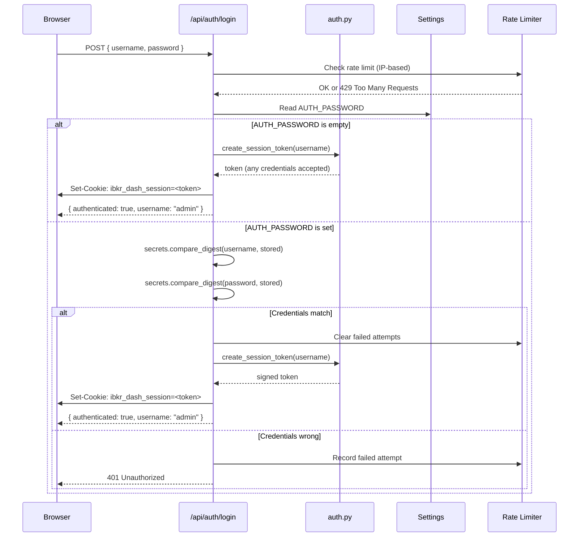
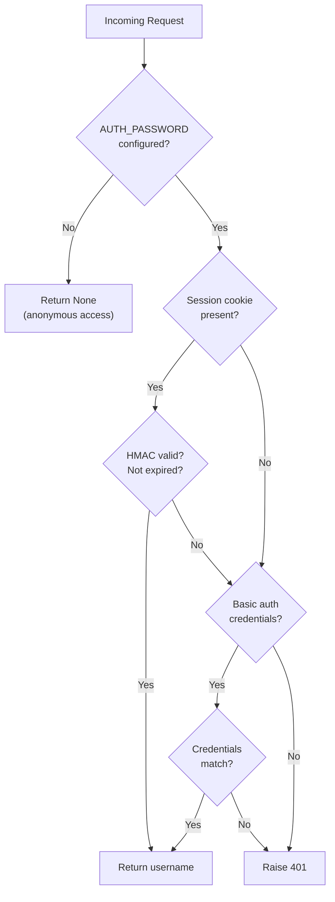

# Authentication

IBKR Dash supports two authentication methods: **cookie-based sessions** (primary) and **HTTP Basic auth** (fallback). If `AUTH_PASSWORD` is not configured, all endpoints are publicly accessible.

## Login Flow

Here is the complete authentication flow from the browser to the backend:



## Rate Limiting

Login attempts are rate-limited per IP address using a **SQLite-backed** sliding window:

| Parameter | Value | Description |
|-----------|-------|-------------|
| `MAX_ATTEMPTS` | 5 | Maximum failed attempts before blocking |
| `WINDOW_SECONDS` | 300 | Time window for counting attempts (5 minutes) |
| `BLOCK_SECONDS` | 900 | Block duration after exceeding limit (15 minutes) |

The rate limiter state is stored in the `login_attempts` SQLite table, so it **persists across server restarts**.

```python
# From app/api/routes/auth.py
def _check_rate_limit(ip: str) -> None:
    """Raise 429 if IP is rate-limited."""
    row = db.execute_one(
        "SELECT fail_count, first_fail FROM login_attempts WHERE ip = ?",
        (ip,),
    )
    if row and row["fail_count"] >= _MAX_ATTEMPTS:
        raise HTTPException(status_code=429, detail="Too many login attempts.")
```

## HMAC Session Tokens

Session tokens are signed using **HMAC-SHA256**. The signing secret is derived from the configured `AUTH_PASSWORD`:

```python
# From app/core/auth.py
secret = hashlib.sha256(settings.auth_password.encode()).hexdigest()
```

### Token Format

A token consists of two parts separated by a dot:

```
<base64-payload>.<hex-signature>
```

The payload is a JSON object encoded with URL-safe Base64:

```json
{"u": "admin", "e": 1718000000}
```

- `u` -- Username
- `e` -- Expiration timestamp (Unix epoch seconds)

The signature is computed as:

```python
hmac.new(secret.encode(), payload.encode(), hashlib.sha256).hexdigest()
```

### Token Lifetime

Default session lifetime is **7 days** (`DEFAULT_SESSION_MAX_AGE = 604800` seconds).

## Cookie-Based Sessions

The session cookie is named `ibkr_dash_session` and is set with these attributes:

| Attribute | Value | Purpose |
|-----------|-------|---------|
| `httponly` | `true` | Prevents JavaScript access (XSS protection). |
| `samesite` | `strict` | CSRF protection (blocks cross-site cookie sending). |
| `secure` | auto | `true` in production, `false` in development. |
| `path` | `/` | Cookie is sent for all paths. |
| `max_age` | `604800` | 7 days. |

:::warning
Credential comparison uses `secrets.compare_digest()` to prevent timing attacks. Never use `==` for password comparison.
:::

## HTTP Basic Auth Fallback

For programmatic access (e.g., scripts, curl), the API also accepts HTTP Basic auth credentials:

```bash
curl -u admin:password http://localhost:8000/api/account/overview
```

The `get_current_user` dependency checks Basic auth credentials only if no valid session cookie is found.

## How `get_current_user` Works

The `get_current_user` function in `app/api/deps.py` is the central authentication gate:

```python
# From app/api/deps.py
def get_current_user(
    request: Request,
    credentials: HTTPBasicCredentials | None = Depends(security),
    settings: Settings = Depends(get_app_settings),
) -> str | None:
```

**Step-by-step logic:**



1. **Check if auth is configured.** If `settings.auth_password` is empty, return `None` (anonymous access allowed).

2. **Try session cookie.** Read `ibkr_dash_session` from the request cookies. Verify the HMAC signature and check expiration. If valid, return the username.

3. **Try HTTP Basic auth.** If the request includes Basic auth credentials, compare them against `auth_username` and `auth_password` using constant-time comparison. If they match, return the username.

4. **Raise 401.** If neither method succeeds, raise `HTTPException(status_code=401)`.

```python
# Simplified flow from app/api/deps.py
if not settings.auth_password:
    return None  # anonymous access

# Try cookie
token = request.cookies.get(SESSION_COOKIE_NAME)
if token:
    session = verify_session_token(token, secret=secret)
    if session:
        return session.username

# Try Basic auth
if credentials:
    if compare_digest(credentials.username, settings.auth_username) and \
       compare_digest(credentials.password, settings.auth_password):
        return credentials.username

raise HTTPException(status_code=401)
```

## Logout

The logout endpoint simply deletes the cookie:

```python
# From app/api/routes/auth.py
@router.post("/logout")
def logout(response: Response) -> SessionResponse:
    response.delete_cookie(key=SESSION_COOKIE_NAME, path="/", samesite="strict")
    return SessionResponse(authenticated=False)
```

## Session Check

The `/api/auth/session` endpoint allows the frontend to check if the user is currently authenticated:

```python
# From app/api/routes/auth.py
@router.get("/session")
def get_session(request: Request, settings: Settings) -> SessionResponse:
    session = _get_optional_session(request, settings)
    if session is None:
        return SessionResponse(authenticated=False)
    return SessionResponse(authenticated=True, username=session.username)
```

:::info
The session check endpoint does not raise 401 -- it always returns a response indicating whether the user is authenticated. This is useful for the frontend to determine if it should show a login form.
:::

## Security Considerations

- **HMAC secret** is derived from `AUTH_PASSWORD`, not stored directly. Changing the password invalidates all existing sessions.
- **Token tampering** is detected because the HMAC signature must match.
- **Token expiration** is checked on every verification (7-day default).
- **Timing-safe comparison** prevents side-channel attacks on credentials.
- **httpOnly cookies** prevent XSS from stealing session tokens.
- **SameSite=strict** provides strong CSRF protection (blocks all cross-site cookie sending).
- **Secure flag** is automatically set to `true` in production environments.
- **Rate limiting** prevents brute-force attacks (SQLite-backed, persists across restarts).

## Token Internals

### Creation

```python
# From app/core/auth.py
def create_session_token(*, username: str, secret: str, max_age_seconds: int) -> str:
    expires_at = int(time.time()) + max_age_seconds
    payload = base64_urlsafe_encode(json.dumps({"u": username, "e": expires_at}))
    signature = hmac.new(secret.encode(), payload.encode(), hashlib.sha256).hexdigest()
    return f"{payload}.{signature}"
```

### Verification

```python
# From app/core/auth.py
def verify_session_token(token: str, *, secret: str) -> AuthSession | None:
    payload, signature = token.rsplit(".", 1)
    expected = hmac.new(secret.encode(), payload.encode(), hashlib.sha256).hexdigest()
    if not hmac.compare_digest(signature, expected):
        return None  # Tampered
    data = json.loads(base64_urlsafe_decode(payload))
    if data["e"] <= int(time.time()):
        return None  # Expired
    return AuthSession(username=data["u"], expires_at=data["e"])
```

### Why HMAC Instead of JWT?

The project uses a custom HMAC token instead of JWT for simplicity:

- **No external library** required (uses Python stdlib `hmac`, `hashlib`, `json`, `base64`).
- **Smaller token size** (no header/algorithm metadata).
- **Sufficient for this use case** (single-server, single-user dashboard).

If you need multi-user support or third-party token verification, consider switching to JWT with `python-jose`.

## Disabling Authentication

To run the dashboard without any login (e.g., for local development), leave `auth.password` empty in Admin Settings.

When auth is disabled:
- `get_current_user()` returns `None` for all requests.
- The login endpoint accepts any credentials.
- No session cookie is required.

:::warning
Never deploy to a public network with authentication disabled. Anyone with access to the URL can view your portfolio data and trigger AI agent runs (which cost LLM API credits).
:::

## Frontend Integration

The frontend should:

1. **Check session** on page load: `GET /api/auth/session`
2. **Show login form** if `authenticated: false`
3. **Submit credentials**: `POST /api/auth/login` with `{ username, password }`
4. **Include cookies**: All subsequent requests automatically include the session cookie (same origin).
5. **Handle 401**: If any API call returns 401, redirect to the login form.
6. **Logout**: `POST /api/auth/logout` clears the cookie.

```javascript
// Example frontend flow
const res = await fetch("/api/auth/session", { credentials: "include" });
const { authenticated, username } = await res.json();
if (!authenticated) {
  // Show login form
}
```
