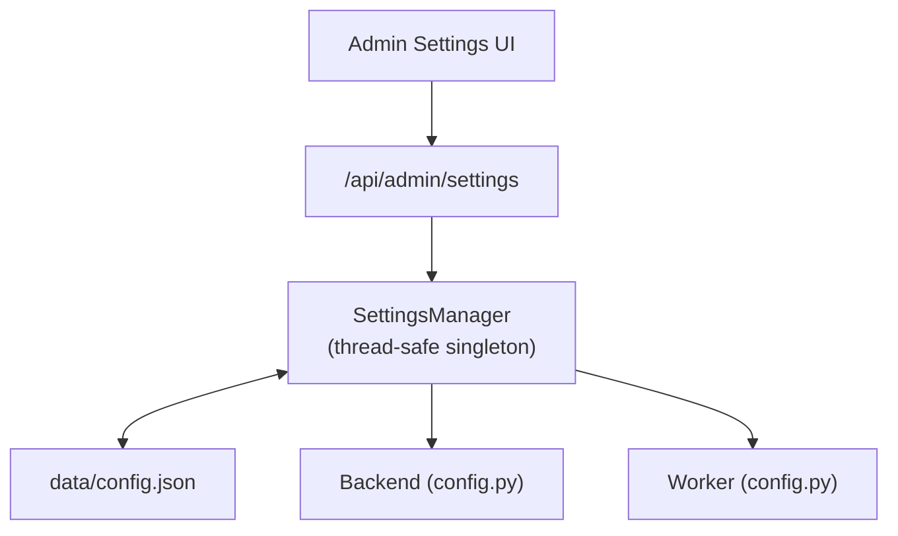

# Configuration

All configuration is stored in a single JSON file (`data/config.json`) and managed through the **Admin Settings** UI. No `.env` files, no environment variables.

## How It Works



The `SettingsManager` (in `app/core/settings_manager.py`) is a thread-safe, JSON-backed store:

1. On first access, loads `data/config.json` (auto-creates with defaults if missing).
2. All reads go through `get("section.key")` dot-path access.
3. All writes persist immediately to disk.
4. Both backend and worker read from the **same** `data/config.json`.

## Configuration Sections

### IBKR Flex

| Key | Default | Description |
|-----|---------|-------------|
| `ibkr.flex_token` | `""` | IBKR Flex Web Service token. |
| `ibkr.flex_query_ids` | `"1532356,1532359"` | Comma-separated Flex query IDs. |
| `ibkr.flex_base_url` | `https://www.interactivebrokers.com/AccountManagement/FlexWebService` | Flex API base URL. |
| `ibkr.flex_poll_interval_seconds` | `10` | Seconds between poll retries. |
| `ibkr.flex_max_poll_retries` | `60` | Maximum poll attempts. |

### LLM

| Key | Default | Description |
|-----|---------|-------------|
| `llm.api_key` | `""` | API key for the LLM provider. |
| `llm.base_url` | `https://api.openai.com/v1` | Base URL for chat completions. |
| `llm.default_model` | `gpt-4o` | Default model name. |
| `llm.temperature` | `0.1` | Sampling temperature. |
| `llm.max_tokens` | `8192` | Maximum response tokens. |
| `llm.bls_api_key` | `""` | BLS API key (for economic data). |

:::tip
Any OpenAI-compatible API works. Set `llm.base_url` and `llm.api_key` to use providers like DeepSeek, Xiaomi MiMo, or a self-hosted model.
:::

### Scheduler

| Key | Default | Description |
|-----|---------|-------------|
| `scheduler.enabled` | `true` | Enable the background scheduler. |
| `scheduler.hour` | `12` | Hour to run the daily job. |
| `scheduler.minute` | `30` | Minute to run the daily job. |
| `scheduler.timezone` | `Asia/Shanghai` | Scheduler timezone. |

### Authentication

| Key | Default | Description |
|-----|---------|-------------|
| `auth.username` | `admin` | Username for login. |
| `auth.password` | `""` | Password. **Leave empty to disable authentication.** |
| `auth.cookie_secure` | `false` | Whether session cookies require HTTPS. Auto-set to `true` when `advanced.app_env` is `production`. |

### Email

| Key | Default | Description |
|-----|---------|-------------|
| `email.smtp_host` | `""` | SMTP server host. |
| `email.smtp_port` | `587` | SMTP server port. |
| `email.smtp_username` | `""` | SMTP username. |
| `email.smtp_password` | `""` | SMTP password. |
| `email.from_address` | `""` | Sender email address. |
| `email.to_addresses` | `[]` | Recipient email addresses. |
| `email.enabled` | `false` | Enable email notifications. |

### Longbridge (Optional)

| Key | Default | Description |
|-----|---------|-------------|
| `longbridge.app_key` | `""` | Longbridge API app key. |
| `longbridge.app_secret` | `""` | Longbridge API app secret. |
| `longbridge.access_token` | `""` | Longbridge access token. |

### Advanced

| Key | Default | Description |
|-----|---------|-------------|
| `advanced.app_name` | `"IBKR Dash"` | Application display name. |
| `advanced.app_env` | `"development"` | Environment name. |
| `advanced.debug` | `false` | Enable debug mode. |
| `advanced.sqlite_path` | `"data/ibkr_dash.db"` | SQLite database path. |
| `advanced.log_level` | `"INFO"` | Logging level. |
| `advanced.cors_origins` | `"http://localhost:5173"` | Allowed CORS origins. |
| `advanced.data_dir` | `"data/flex_exports"` | Flex data export directory. |
| `advanced.cache_ttl_seconds` | `86400` | In-memory cache TTL (24h). |
| `advanced.audit_llm_calls` | `false` | Log all LLM API calls. |

### Worker

| Key | Default | Description |
|-----|---------|-------------|
| `worker.backend_base_url` | `"http://localhost:8000"` | Backend URL for worker-to-backend calls. |
| `worker.daily_review_internal_token` | `""` | Internal token for triggering daily reviews. |

## Editing Configuration

### Via Admin UI (Recommended)

Navigate to **Admin → Settings** in the web interface. Changes take effect immediately — no restart required.

### Via API

```bash
# Read all settings
curl -b cookies.txt http://localhost:8000/api/admin/settings

# Update a single value
curl -b cookies.txt -X PATCH http://localhost:8000/api/admin/settings \
  -H "Content-Type: application/json" \
  -d '{"updates": {"llm.default_model": "gpt-4o-mini"}}'

# Reset a key to default
curl -b cookies.txt -X POST http://localhost:8000/api/admin/settings/reset/llm.default_model
```

### Via File (Emergency)

Edit `data/config.json` directly, then restart the backend. The JSON structure matches the dot-path keys shown above.

## Best Practices

### Development

```json
{
  "advanced": { "app_env": "development", "debug": true },
  "auth": { "password": "" }
}
```

### Production

```json
{
  "advanced": { "app_env": "production", "debug": false, "cors_origins": "https://your-domain.com" },
  "auth": { "password": "strong-random-secret", "cookie_secure": true }
}
```

:::warning
In production, always set a strong `auth.password` and restrict `advanced.cors_origins` to your actual domain. Never leave `debug: true` in production.
:::
