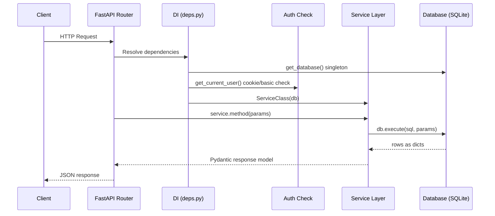
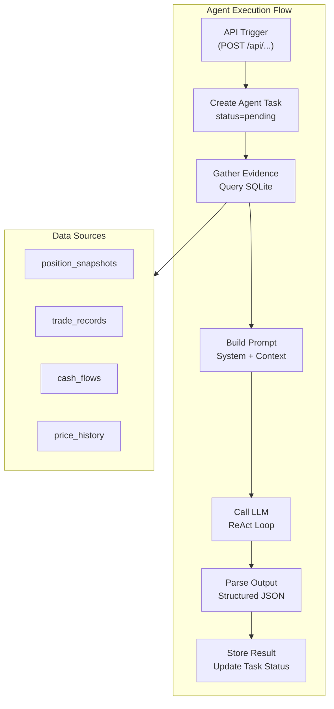

# Backend Overview

The IBKR Dash backend is a **FastAPI** application that serves the REST API for the dashboard. It reads financial data from a shared **SQLite** database (populated by the worker) and exposes it through typed, validated endpoints. It also runs AI agents for portfolio analysis using any OpenAI-compatible LLM provider.

## Directory Layout

```
ibkr_dash_backend/
  app/
    main.py                 # FastAPI app factory, middleware, router registration
    core/
      config.py             # JSON-backed settings accessor
      settings_manager.py   # Thread-safe JSON config store
      database.py           # SQLite connection, schema DDL, Database class
      auth.py               # HMAC session token helpers
      cors.py               # CORS configuration
      logger.py             # Logging setup
      rate_limit.py         # In-memory sliding-window rate limiter
    api/
      deps.py               # FastAPI dependency injection providers
      routes/
        account.py          # Account overview & snapshots
        positions.py        # Position list, summary, detail
        trades.py           # Trade list & summary
        cash_flows.py       # Cash flow list
        dividends.py        # Dividend list
        charts.py           # Equity curve & performance calendar
        copilot.py          # Account Copilot chat
        agent_tasks.py      # Background agent task management
        auth.py             # Login / logout / session check
        health.py           # Health check endpoint
        symbols.py          # Symbol autocomplete
        daily_position_review.py  # Daily position review agent
        trade_decision_agent.py   # Trade decision agent
        trade_review_agent.py     # Trade review agent
        risk_assessment_agent.py  # Risk assessment agent
        admin_system.py     # System status
        admin_prompts.py    # Prompt management
        admin_llm.py        # LLM provider management
        admin_ibkr.py       # IBKR settings
        admin_email.py      # Email settings
    services/
      account_service.py    # Account overview & snapshot queries
      position_service.py   # Position list, summary, detail
      trade_service.py      # Trade queries
      cash_flow_service.py  # Cash flow queries
      dividend_service.py   # Dividend queries
      chart_service.py      # Equity curve & performance calendar
      llm_service.py        # OpenAI-compatible HTTP client
      agent_services.py     # Background task management
      ibkr_tool_service.py  # Tool service for Copilot agent
    schemas/                # Pydantic request/response models
    agents/                 # AI agent logic (daily review, trade decision, etc.)
    utils/                  # Date helpers, pagination, JSON field parsers
  tests/                    # pytest test suite
```

## Key Design Patterns

### 1. Dependency Injection via FastAPI `Depends`

Every route handler declares its dependencies as function parameters annotated with `Depends(...)`. FastAPI resolves these automatically at request time.

```python
# From app/api/routes/positions.py
@router.get("", response_model=PositionListResponse)
def list_positions(
    report_date: str | None = Query(default=None),
    service: PositionService = Depends(get_position_service),   # injected service
    _user: str | None = Depends(get_current_user),              # auth check
) -> PositionListResponse:
    return service.list_positions(report_date=report_date, ...)
```

The dependency providers live in `app/api/deps.py`. Each provider creates a service instance and injects the shared `Database` singleton:

```python
# From app/api/deps.py
def get_position_service(db: Database = Depends(get_db)) -> PositionService:
    return PositionService(db)
```

### 2. Service Layer

All business logic sits in **service classes** (e.g., `AccountService`, `PositionService`). Routes are thin -- they validate input, call a service, and return the result. Services receive a `Database` instance through their constructor and execute SQL queries directly.

### 3. Schema Validation

All request bodies and response shapes are defined as **Pydantic models** in the `schemas/` directory. FastAPI uses these for automatic request validation and response serialization.

## Request Lifecycle

Here is how a typical API request flows through the backend, from the HTTP request arriving to the JSON response being sent:



### Middleware Stack

The request passes through three middleware layers before reaching the route handler:


1. **CORS** (`app/core/cors.py`) -- Allows the frontend dev server to call the API. Origins are configured via `CORS_ORIGINS`.
2. **GZip** -- Compresses large JSON responses (threshold: 1000 bytes).
3. **Body Size Limit** -- Rejects requests with bodies larger than 1 MB (prevents abuse).

:::tip
The CORS middleware is critical during development. Without it, the browser blocks requests from `localhost:5173` (frontend) to `localhost:8000` (backend) due to the Same-Origin Policy. The `CORS_ORIGINS` setting must include the frontend URL.
:::

## Why SQLite?

The entire system uses **SQLite** as the sole data store. There is no Redis, Elasticsearch, or external database.

- **Zero infrastructure**: No database server to install or maintain.
- **WAL mode**: Enables concurrent reads while the worker writes data.
- **Portable**: The entire database is a single `.db` file.
- **Sufficient scale**: Personal portfolio data is small enough that SQLite handles it easily.

:::tip
The backend and worker share the same SQLite file. The worker writes IBKR data; the backend reads it. WAL mode ensures they can operate concurrently without locking issues.
:::

## Application Startup

When the FastAPI app starts (via the `lifespan` context manager), it:

1. Loads settings from `data/config.json` via `SettingsManager`
2. Sets up logging
3. Initializes the SQLite database schema (creates tables and indexes if they do not exist)

```python
# From app/main.py
@asynccontextmanager
async def lifespan(app: FastAPI):
    settings = get_settings()
    setup_logging()
    init_database(settings)
    yield
```

:::info
The `init_database()` function (in `app/core/database.py`) runs the full DDL schema creation with `CREATE TABLE IF NOT EXISTS` statements. It also runs any pending migrations from the `_MIGRATIONS` list.
:::

## Tech Stack

| Component | Technology | Purpose |
|-----------|-----------|---------|
| Web framework | FastAPI | Async REST API with automatic OpenAPI docs. |
| Validation | Pydantic v2 | Request/response schema validation. |
| Configuration | SettingsManager (JSON) | Thread-safe JSON config with admin UI. |
| Database | SQLite (stdlib) | Zero-config embedded database with WAL mode. |
| HTTP client | httpx | Persistent connection pool for LLM API calls. |
| Auth | HMAC-SHA256 (stdlib) | Lightweight session tokens without external deps. |
| AI agents | OpenAI-compatible API | Portfolio analysis via any LLM provider. |

## AI Agent Architecture

The backend includes five specialized AI agents, each designed for a specific portfolio analysis task:

| Agent | Purpose | Trigger |
|-------|---------|---------|
| **Daily Review** | Summarizes portfolio performance for a given date. | `POST /api/daily-position-review/generate` |
| **Trade Decision** | Analyzes whether to enter/exit a position. | `POST /api/trade-decision/analyze` |
| **Trade Review** | Reviews past trades for lessons learned. | `POST /api/trade-review/review` |
| **Risk Assessment** | Evaluates portfolio risk and concentration. | `POST /api/risk-assessment/assess` |
| **Account Copilot** | Conversational assistant with tool use. | `POST /api/copilot/chat` |

Agents gather **evidence** from the database (positions, trades, PnL), build a **prompt** with context, call the LLM, and parse the **structured output** into a typed response. Results are persisted in dedicated database tables for later retrieval.



## Testing

Tests live in `ibkr_dash_backend/tests/` and use **pytest**. The test suite covers:

- Service layer logic (account, position, trade, cash flow, chart, LLM, agent)
- API route behavior (admin, copilot, agent tasks)
- Database operations
- Structured output parsing
- Health endpoint

Run tests with:

```bash
cd ibkr_dash_backend
pytest tests/ -v
```

:::info
Tests use an in-memory SQLite database (`:memory:`) to avoid touching production data. The `Database` class supports this mode natively.
:::
