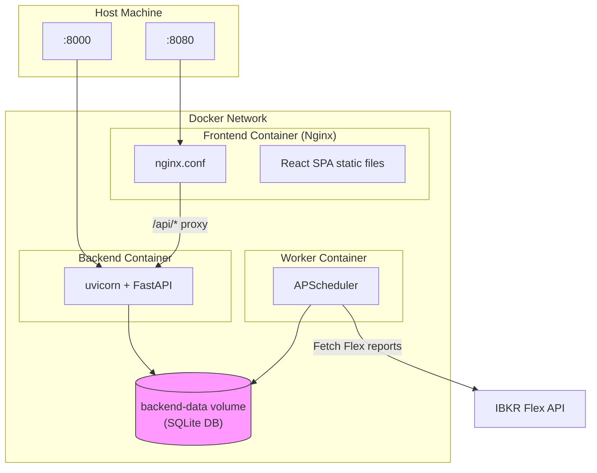

# Docker Deployment

IBKR Dash provides a Docker Compose setup for running all three services (backend, frontend, worker) in containers. This is the easiest way to run the full stack without installing Python or Node.js locally.

---

## Architecture



```
                    ┌─────────────────────────────────────┐
                    │            Docker Network            │
                    │                                      │
    :8080 ──────────┤  ┌──────────┐                        │
                    │  │ Frontend │ (Nginx)                │
                    │  │ :80      │                        │
                    │  └────┬─────┘                        │
                    │       │ /api/*                       │
                    │       ▼                              │
                    │  ┌──────────┐                        │
                    │  │ Backend  │ (uvicorn)              │
                    │  │ :8000    │                        │
                    │  └────┬─────┘                        │
                    │       │                              │
                    │       ▼                              │
                    │  ┌──────────┐  ┌──────────┐          │
                    │  │  SQLite  │  │  Worker  │          │
                    │  │  (vol)   │  │ (cron)   │          │
                    │  └──────────┘  └──────────┘          │
                    └─────────────────────────────────────┘
```

- **Frontend** -- Nginx serves the built React app and proxies `/api/*` to the backend.
- **Backend** -- FastAPI serves the REST API on port 8000.
- **Worker** -- Runs the IBKR Flex scheduler to import data daily.
- **Shared volume** -- `backend-data` holds the SQLite database, shared between backend and worker.

---

## Quick Start

### 1. Create the `.env` file

```bash
cp .env.example .env
```

Edit `.env` with your configuration. At minimum:

```env
LLM_API_KEY=your-api-key
FLEX_TOKEN=your-flex-token
AUTH_PASSWORD=your-password
```

### 2. Build and start

```bash
docker compose up --build -d
```

### 3. Initialize the database

```bash
# Run init-db inside the worker container
docker compose exec worker python -m worker.main init-db
```

### 4. Access the application

| Service | URL |
|---------|-----|
| Frontend | `http://localhost:8080` |
| Backend API | `http://localhost:8080/api/health` |
| API Docs | `http://localhost:8000/docs` (direct backend access) |

---

## Docker Compose Services

### Backend

```yaml
# docker-compose.yml (backend section)
backend:
  build:
    context: .
    dockerfile: docker/backend.Dockerfile
  ports:
    - "${BACKEND_PORT:-8000}:8000"
  volumes:
    - backend-data:/app/ibkr_dash_backend/data
  env_file: .env
  environment:
    - SQLITE_PATH=/app/ibkr_dash_backend/data/ibkr_dash.db
    - APP_ENV=${APP_ENV:-docker}
  restart: unless-stopped
```

- Runs `uvicorn app.main:app --host 0.0.0.0 --port 8000`.
- Uses Python 3.12 slim image.
- Data is persisted in the `backend-data` volume.

### Worker

```yaml
# docker-compose.yml (worker section)
worker:
  build:
    context: .
    dockerfile: docker/worker.Dockerfile
  volumes:
    - backend-data:/app/ibkr_dash_backend/data
  env_file: .env
  environment:
    - SQLITE_PATH=/app/ibkr_dash_backend/data/ibkr_dash.db
  restart: unless-stopped
```

- Runs `python -m worker.main run-scheduler`.
- Shares the same SQLite database via the `backend-data` volume.
- Imports IBKR Flex data on the configured schedule.

### Frontend

```yaml
# docker-compose.yml (frontend section)
frontend:
  build:
    context: .
    dockerfile: docker/frontend.Dockerfile
  ports:
    - "${FRONTEND_PORT:-8080}:80"
  depends_on:
    - backend
```

- Multi-stage build: Node.js compiles the React app, then Nginx serves the static files.
- Nginx proxies `/api/*` requests to the backend service.

---

## Dockerfiles

### Backend (`docker/backend.Dockerfile`)

```dockerfile
FROM python:3.12-slim
WORKDIR /app
COPY ibkr_dash_backend/requirements.txt .
RUN pip install --no-cache-dir -r requirements.txt
COPY ibkr_dash_backend/ .
CMD ["uvicorn", "app.main:app", "--host", "0.0.0.0", "--port", "8000"]
```

### Worker (`docker/worker.Dockerfile`)

```dockerfile
FROM python:3.12-slim
WORKDIR /app
COPY ibkr_dash_worker/requirements.txt .
RUN pip install --no-cache-dir -r requirements.txt
COPY ibkr_dash_worker/ .
CMD ["python", "-m", "worker.main", "run-scheduler"]
```

### Frontend (`docker/frontend.Dockerfile`)

```dockerfile
FROM node:20-alpine AS build
WORKDIR /app
COPY ibkr_dash_frontend/package*.json ./
RUN npm ci
COPY ibkr_dash_frontend/ .
RUN npm run build

FROM nginx:alpine
COPY --from=build /app/dist /usr/share/nginx/html
COPY docker/nginx.conf /etc/nginx/conf.d/default.conf
```

---

## Nginx Configuration

The frontend uses Nginx to serve the SPA and proxy API requests:

```nginx
# docker/nginx.conf
server {
    listen 80;
    server_name _;
    client_max_body_size 100m;

    root /usr/share/nginx/html;
    index index.html;

    # Proxy API requests to backend
    location /api/ {
        proxy_pass http://backend:8000/api/;
    }

    # SPA fallback -- serve index.html for all non-file routes
    location / {
        try_files $uri $uri/ /index.html;
    }
}
```

Key points:
- `/api/*` requests are forwarded to the backend container.
- All other routes serve `index.html` (SPA routing).
- `client_max_body_size` is set to 100 MB.

---

## Volumes

| Volume | Purpose |
|--------|---------|
| `backend-data` | SQLite database and Flex CSV exports |

The volume is shared between backend and worker so they can read/write the same database.

To inspect the volume:

```bash
docker volume inspect ibkr-dash_backend-data
```

To back up the database:

```bash
docker compose exec backend cp /app/ibkr_dash_backend/data/ibkr_dash.db /tmp/backup.db
docker compose cp backend:/tmp/backup.db ./backup.db
```

---

## Common Commands

```bash
# Start all services
docker compose up -d

# View logs
docker compose logs -f backend
docker compose logs -f worker
docker compose logs -f frontend

# Restart a single service
docker compose restart backend

# Stop everything
docker compose down

# Rebuild after code changes
docker compose up --build -d

# Run a one-shot import inside the worker
docker compose exec worker python -m worker.main import /path/to/file.csv

# Open a shell in the backend container
docker compose exec backend bash
```

---

## Environment Variables

All environment variables from `.env` are passed to the backend and worker containers. Key overrides in `docker-compose.yml`:

| Variable | Docker Default | Description |
|----------|---------------|-------------|
| `SQLITE_PATH` | `/app/ibkr_dash_backend/data/ibkr_dash.db` | Path inside the container |
| `APP_ENV` | `docker` | Environment name |
| `BACKEND_PORT` | `8000` | Host port for the backend |
| `FRONTEND_PORT` | `8080` | Host port for the frontend |

---

## Troubleshooting

### Containers keep restarting

Check logs: `docker compose logs backend`. Common causes:
- Missing `.env` file
- Invalid environment variables
- Port conflicts on the host

### Database not persisting

Verify the volume exists: `docker volume ls`. If the volume is missing, the database resets on each restart.

### Frontend shows 502 Bad Gateway

The backend container may not be ready yet. Wait a few seconds and refresh. Check: `docker compose ps` to verify all containers are running.

### Worker not importing data

Check worker logs: `docker compose logs worker`. Ensure `FLEX_TOKEN` and `FLEX_QUERY_ID_DAILY` are set in `.env`.
