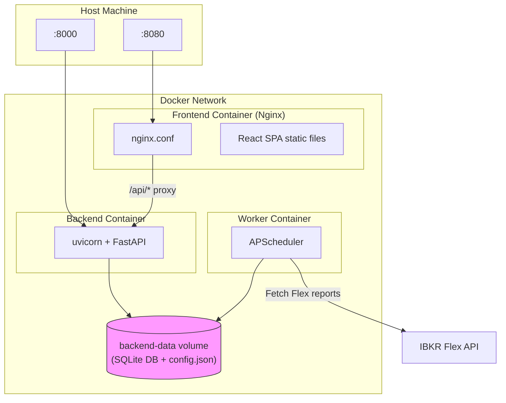

# Docker Deployment

IBKR Dash provides a Docker Compose setup for running all three services (backend, frontend, worker) in containers. This is the easiest way to run the full stack without installing Python or Node.js locally.

---

## Architecture



```
                    ┌─────────────────────────────────────┐
                    │            Docker Network            │
                    │                                      │
    :8080 ──────────┤  ┌──────────┐                        │
                    │  │ Frontend │ (Nginx)                │
                    │  │ :80      │                        │
                    │  └────┬─────┘                        │
                    │       │ /api/*                       │
                    │       ▼                              │
                    │  ┌──────────┐                        │
                    │  │ Backend  │ (uvicorn)              │
                    │  │ :8000    │                        │
                    │  └────┬─────┘                        │
                    │       │                              │
                    │       ▼                              │
                    │  ┌──────────┐  ┌──────────┐          │
                    │  │  SQLite  │  │  Worker  │          │
                    │  │  (vol)   │  │ (cron)   │          │
                    │  └──────────┘  └──────────┘          │
                    └─────────────────────────────────────┘
```

- **Frontend** -- Nginx serves the built React app and proxies `/api/*` to the backend.
- **Backend** -- FastAPI serves the REST API on port 8000, with the worker scheduler running in the background.
- **Shared volume** -- `backend-data` holds the SQLite database and `config.json`.

---

## Quick Start

### 1. Build and start

```bash
docker compose up --build -d
```

### 2. Access the application

| Service | URL |
|---------|-----|
| Frontend | `http://localhost:8080` |
| Admin Settings | `http://localhost:8080/admin/settings` |
| Backend API | `http://localhost:8080/api/health` |
| API Docs | `http://localhost:8000/docs` (direct backend access) |

### 3. Configure

Open **http://localhost:8080/admin/settings** and set your LLM API key, Flex token, and other settings. Changes take effect immediately.

---

## Docker Compose Services

```yaml
# docker-compose.yml
services:
  backend:
    build:
      context: .
      dockerfile: docker/Dockerfile
    ports:
      - "${BACKEND_PORT:-8000}:8000"
    volumes:
      - backend-data:/app/backend/data
    environment:
      - APP_ENV=${APP_ENV:-docker}
    restart: unless-stopped

  frontend:
    build:
      context: .
      dockerfile: docker/frontend.Dockerfile
    ports:
      - "${FRONTEND_PORT:-8080}:80"
    depends_on:
      - backend

volumes:
  backend-data:
```

---

## Dockerfiles

### Backend + Worker (`docker/Dockerfile`)

```dockerfile
FROM python:3.12-slim
WORKDIR /app
COPY backend/requirements.txt ./backend/requirements.txt
RUN pip install --no-cache-dir -r backend/requirements.txt
COPY worker/requirements.txt ./worker/requirements.txt
RUN pip install --no-cache-dir -r worker/requirements.txt
COPY backend/ ./backend/
COPY worker/ ./worker/
ENV PYTHONPATH=/app/backend:/app/worker
COPY docker/entrypoint.sh /app/entrypoint.sh
RUN chmod +x /app/entrypoint.sh
CMD ["/app/entrypoint.sh"]
```

The entrypoint starts the worker scheduler in the background, then runs uvicorn in the foreground.

### Frontend (`docker/frontend.Dockerfile`)

```dockerfile
FROM node:20-alpine AS build
WORKDIR /app
COPY frontend/package*.json ./
RUN npm ci
COPY frontend/ .
RUN npm run build

FROM nginx:alpine
COPY --from=build /app/dist /usr/share/nginx/html
COPY docker/nginx.conf /etc/nginx/conf.d/default.conf
```

---

## .dockerignore

A `.dockerignore` file at the project root excludes unnecessary files from the build context (node_modules, .venv, docs, etc.), reducing the context from ~196MB to ~5MB.

---

## Nginx Configuration

The frontend uses Nginx to serve the SPA and proxy API requests:

```nginx
# docker/nginx.conf
server {
    listen 80;
    server_name _;
    client_max_body_size 100m;

    root /usr/share/nginx/html;
    index index.html;

    # Proxy API requests to backend
    location /api/ {
        proxy_pass http://backend:8000/api/;
    }

    # SPA fallback -- serve index.html for all non-file routes
    location / {
        try_files $uri $uri/ /index.html;
    }
}
```

---

## Volumes

| Volume | Purpose |
|--------|---------|
| `backend-data` | SQLite database, config.json, and Flex CSV exports |

The volume is mounted at `/app/backend/data` inside the container.

To back up the database:

```bash
docker compose exec backend cp /app/backend/data/ibkr_dash.db /tmp/backup.db
docker compose cp backend:/tmp/backup.db ./backup.db
```

---

## Configuration

All configuration is managed via the Admin Settings UI at `http://localhost:8080/admin/settings`. The config is stored in `data/config.json` inside the `backend-data` Docker volume.

Docker-specific overrides in `docker-compose.yml`:

| Variable | Docker Default | Description |
|----------|---------------|-------------|
| `APP_ENV` | `docker` | Environment name |
| `BACKEND_PORT` | `8000` | Host port for the backend |
| `FRONTEND_PORT` | `8080` | Host port for the frontend |

---

## Common Commands

```bash
# Start all services
docker compose up -d

# View logs
docker compose logs -f backend
docker compose logs -f worker
docker compose logs -f frontend

# Restart a single service
docker compose restart backend

# Stop everything
docker compose down

# Rebuild after code changes
docker compose up --build -d

# Run a one-shot import inside the worker
docker compose exec worker python -m worker.main import /path/to/file.csv

# Open a shell in the backend container
docker compose exec backend bash
```

---

## Troubleshooting

### Containers keep restarting

Check logs: `docker compose logs backend`. Common causes:
- Port conflicts on the host (use `BACKEND_PORT` / `FRONTEND_PORT` to change)
- Invalid configuration values

### Database not persisting

Verify the volume exists: `docker volume ls`. If the volume is missing, the database resets on each restart.

### Frontend shows 502 Bad Gateway

The backend container may not be ready yet. Wait a few seconds and refresh. Check: `docker compose ps` to verify all containers are running.

### Worker not importing data

Check worker logs: `docker compose logs worker`. Ensure the Flex token and query IDs are configured in Admin Settings → IBKR Flex.
