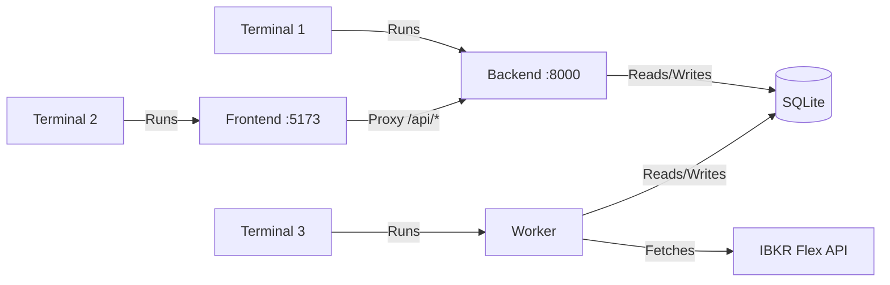

# Local Development Setup

This guide walks you through setting up IBKR Dash for local development. The project has three modules: **backend** (Python/FastAPI), **frontend** (React/Vite), and **worker** (Python ETL scheduler).

---

## Prerequisites

- **Python 3.11+** — for backend and worker
- **Node.js 18+** — for frontend
- **Git** — for version control

:::tip
You do not need Docker for local development. Each module runs independently.
:::

---

## Project Structure

```
ibkr-dash/
  backend/    # FastAPI REST API
  frontend/   # React + Vite SPA
  worker/     # ETL scheduler (IBKR Flex -> SQLite)
  data/                 # SQLite DB + Flex CSV exports + config.json
  docker-compose.yml    # Docker orchestration
```

---

## Step 1: Clone

```bash
git clone https://github.com/your-org/ibkr-dash.git
cd ibkr-dash
```

---

## Step 2: Start the Backend

Open **Terminal 1**:

```bash
cd backend
python -m venv .venv
source .venv/bin/activate
pip install -r requirements.txt
uvicorn app.main:app --reload --port 8000
```

Verify:

```bash
curl http://localhost:8000/api/health
# {"status":"ok","service":"backend"}
```

---

## Step 3: Start the Frontend

Open **Terminal 2**:

```bash
cd frontend
npm install
npm run dev
```

The frontend runs at `http://localhost:5173` and proxies API requests to the backend.

---

## Step 4: Configure

Open **http://localhost:5173/admin/settings** and configure:

| Setting | Required | Description |
|---------|----------|-------------|
| LLM API Key | For AI features | OpenAI-compatible API key |
| LLM Base URL | No | Defaults to OpenAI; change for DeepSeek, MiMo, etc. |
| Auth Password | No | Leave empty for open access during development |
| Flex Token | For auto-pull | IBKR Flex Web Service token |
| Flex Query IDs | For auto-pull | Comma-separated query IDs |

Changes take effect immediately — no restart needed.

---

## Step 5: Import Data

Open **Terminal 3**:

### Option A: Sample Data

```bash
cd worker
python -m venv .venv && source .venv/bin/activate
pip install -r requirements.txt
python -m worker.main import worker/fixtures/daily_sample.csv
```

### Option B: IBKR Flex CSV

```bash
python -m worker.main import path/to/your/flex_export.csv
```

### Option C: Automatic Pull

If you configured the Flex token in Step 4:

```bash
python -m worker.main scan            # Immediate pull
python -m worker.main run-scheduler   # Scheduled daily pulls
```

---

## Running All Three Modules

| Terminal | Command | URL |
|----------|---------|-----|
| 1 | `cd backend && uvicorn app.main:app --reload --port 8000` | `http://localhost:8000` |
| 2 | `cd frontend && npm run dev` | `http://localhost:5173` |
| 3 | `cd worker && python -m worker.main run-scheduler` | (background) |



---

## Database Location

The SQLite database is stored at `data/ibkr_dash.db` by default. Both backend and worker share this file. Auto-created on first run.

---

## Verifying the Setup

1. Open `http://localhost:5173` in your browser
2. If auth password is empty, you are logged in automatically
3. Navigate to the dashboard to see portfolio data
4. Try the Copilot chat to test LLM integration

---

## Common Issues

### Backend fails to start

- Check that port 8000 is not in use: `lsof -i :8000`
- Make sure you activated the virtual environment

### Frontend shows "Network Error"

- Verify the backend is running on port 8000
- Check the Vite proxy config in `vite.config.ts`
- Try `curl http://localhost:8000/api/health`

### No data visible

- Import data with `python -m worker.main import <file>` or `python -m worker.main scan`

### LLM features return errors

- Verify LLM API key is set in Admin Settings → LLM
- Test: `curl -X POST http://localhost:8000/api/admin/llm/test -H "Content-Type: application/json" -d '{"message":"hello"}'`
