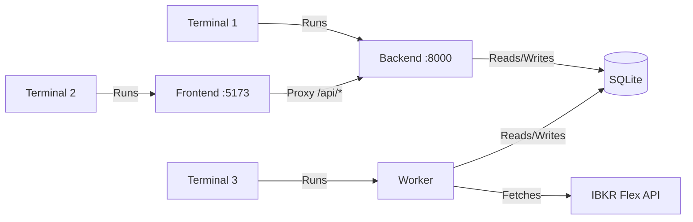

# Local Development Setup

This guide walks you through setting up IBKR Dash for local development. The project has three modules: **backend** (Python/FastAPI), **frontend** (React/Vite), and **worker** (Python ETL scheduler).

---

## Prerequisites

Before you begin, make sure you have these installed:

- **Python 3.12+** -- for backend and worker
- **Node.js 20+** -- for frontend
- **Git** -- for version control

:::tip
You do not need Docker for local development. Each module runs independently.
:::

---

## Project Structure

```
ibkr-dash/
  ibkr_dash_backend/    # FastAPI REST API
  ibkr_dash_frontend/   # React + Vite SPA
  ibkr_dash_worker/     # ETL scheduler (IBKR Flex -> SQLite)
  data/                 # SQLite DB + Flex CSV exports
  .env.example          # Environment variable template
  docker-compose.yml    # Docker orchestration
```

---

## Step 1: Clone and Configure

```bash
# Clone the repository
git clone https://github.com/your-org/ibkr-dash.git
cd ibkr-dash
```

Create a `.env` file in the project root by copying the example:

```bash
cp .env.example .env
```

Edit `.env` and fill in at minimum:

```env
# Required for AI features
LLM_API_KEY=your-api-key-here

# IBKR Flex Web Service (for real data)
FLEX_TOKEN=your-flex-token
FLEX_QUERY_ID_DAILY=your-query-id

# Auth (leave empty for open access during development)
AUTH_PASSWORD=
```

### Key Environment Variables

| Variable | Default | Description |
|----------|---------|-------------|
| `APP_ENV` | `development` | Environment name |
| `DEBUG` | `false` | Enable debug logging |
| `SQLITE_PATH` | `data/ibkr_dash.db` | SQLite database file path |
| `LLM_API_KEY` | (empty) | API key for OpenAI-compatible LLM |
| `LLM_BASE_URL` | `https://api.openai.com/v1` | LLM API base URL |
| `LLM_DEFAULT_MODEL` | `gpt-4o` | Default LLM model |
| `AUTH_USERNAME` | `admin` | Login username |
| `AUTH_PASSWORD` | (empty) | Login password (empty = no auth) |
| `CORS_ORIGINS` | `http://localhost:5173,http://localhost:3000` | Allowed CORS origins |
| `LOG_LEVEL` | `INFO` | Logging level |

See `.env.example` for the full list of worker-specific variables.

---

## Step 2: Start the Backend

Open **Terminal 1**:

```bash
cd ibkr_dash_backend

# Create a virtual environment
python -m venv .venv
source .venv/bin/activate  # Linux/macOS
# .venv\Scripts\activate   # Windows

# Install dependencies
pip install -r requirements.txt

# Start the dev server (with auto-reload)
uvicorn app.main:app --reload --port 8000
```

The API is now running at `http://localhost:8000`. You can verify:

```bash
curl http://localhost:8000/api/health
# {"status":"ok","service":"ibkr_dash_backend"}
```

Interactive API docs are at `http://localhost:8000/docs`.

:::info
**What you should see:** The terminal shows uvicorn startup logs with `Uvicorn running on http://0.0.0.0:8000`. Any code changes in `app/` will trigger an automatic reload.
:::

---

## Step 3: Start the Frontend

Open **Terminal 2**:

```bash
cd ibkr_dash_frontend

# Install dependencies
npm install

# Start the dev server
npm run dev
```

The frontend is now running at `http://localhost:5173`. It proxies API requests to the backend automatically (configured in `vite.config.ts`).

:::info
**What you should see:** Vite prints `Local: http://localhost:5173/` in the terminal. Opening this URL in your browser shows the IBKR Dash dashboard. If `AUTH_PASSWORD` is empty, you are logged in automatically.
:::

---

## Step 4: Initialize the Database and Import Data

Open **Terminal 3**:

### Option A: Use Sample Data

If you have a sample IBKR Flex CSV file:

```bash
cd ibkr_dash_worker

# Create virtual environment (if not done)
python -m venv .venv
source .venv/bin/activate
pip install -r requirements.txt

# Initialize the database schema
python -m worker.main init-db

# Import a Flex CSV file
python -m worker.main import path/to/your/flex_export.csv
```

### Option B: Use IBKR Flex Web Service

If you have an IBKR account with Flex Web Service configured:

```bash
cd ibkr_dash_worker
python -m worker.main init-db
python -m worker.main scan
```

This downloads the latest Flex report from IBKR and imports it.

### Option C: Run the Scheduler

The worker can poll IBKR on a schedule:

```bash
python -m worker.main run-scheduler
```

By default, it runs daily at 12:30 PM (Asia/Shanghai timezone). Configure via `SCHEDULER_HOUR`, `SCHEDULER_MINUTE`, and `SCHEDULER_TIMEZONE` in `.env`.

---

## Running All Three Modules

You need three terminal windows:

| Terminal | Command | URL |
|----------|---------|-----|
| 1 | `cd ibkr_dash_backend && uvicorn app.main:app --reload --port 8000` | `http://localhost:8000` |
| 2 | `cd ibkr_dash_frontend && npm run dev` | `http://localhost:5173` |
| 3 | `cd ibkr_dash_worker && python -m worker.main run-scheduler` | (background) |



---

## Database Location

The SQLite database is stored at `data/ibkr_dash.db` by default. Both the backend and worker share this file. The database is auto-created on first run.

To use an in-memory database (for testing):

```bash
export SQLITE_PATH=":memory:"
```

---

## Verifying the Setup

1. Open `http://localhost:5173` in your browser.
2. If `AUTH_PASSWORD` is empty, you will be logged in automatically.
3. If `AUTH_PASSWORD` is set, log in with `admin` / your password.
4. Navigate to the dashboard to see portfolio data.
5. Try the Copilot chat to test LLM integration.

---

## Common Issues

### Backend fails to start

- Check that port 8000 is not in use: `lsof -i :8000`
- Verify `.env` is in the project root (not inside `ibkr_dash_backend/`)
- Make sure you activated the virtual environment

### Frontend shows "Network Error"

- Verify the backend is running on port 8000
- Check the Vite proxy config in `vite.config.ts`
- Try `curl http://localhost:8000/api/health` from the terminal

### No data visible

- Run `python -m worker.main init-db` to create the schema
- Import data with `python -m worker.main import <file>` or `python -m worker.main scan`

### LLM features return errors

- Verify `LLM_API_KEY` is set in `.env`
- Test the connection: `curl -X POST http://localhost:8000/api/admin/llm/test -H "Content-Type: application/json" -d '{"message":"hello"}'`
