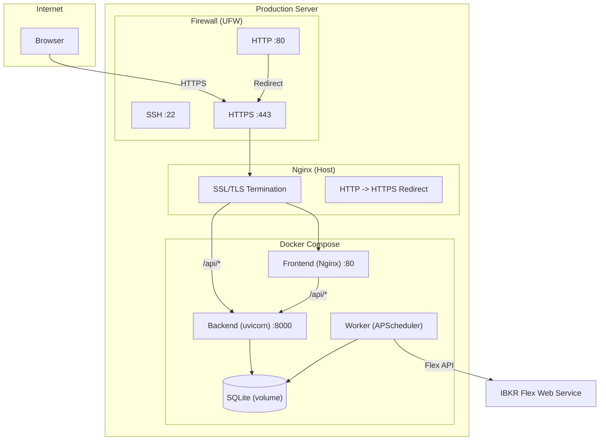

# Production Deployment

This guide covers deploying IBKR Dash to a production server. It assumes you have a Linux server (Ubuntu 22.04+ recommended) with root or sudo access.

---

## Production Checklist

Before deploying, make sure you have:

- [ ] A Linux server with Docker and Docker Compose installed
- [ ] A domain name pointing to your server (e.g. `dash.example.com`)
- [ ] An IBKR Flex Web Service token and query ID
- [ ] An LLM API key (OpenAI, DeepSeek, or compatible provider)
- [ ] A strong auth password configured via Admin Settings

---

## Deployment Architecture



---

## Step 1: Server Setup

### Install Docker

```bash
# Update system packages
sudo apt update && sudo apt upgrade -y

# Install Docker
curl -fsSL https://get.docker.com | sudo sh

# Add your user to the docker group
sudo usermod -aG docker $USER

# Log out and back in, then verify
docker --version
docker compose version
```

### Create the project directory

```bash
sudo mkdir -p /opt/ibkr-dash
sudo chown $USER:$USER /opt/ibkr-dash
cd /opt/ibkr-dash

# Clone the repository
git clone https://github.com/your-org/ibkr-dash.git .
```

---

## Step 2: Build and Deploy

```bash
# Build all containers
docker compose up --build -d

# Verify all services are running
docker compose ps
```

Expected output:

```
NAME                STATUS          PORTS
ibkr-dash-backend   Up (healthy)    0.0.0.0:8000->8000/tcp
ibkr-dash-worker    Up
ibkr-dash-frontend  Up              0.0.0.0:8080->80/tcp
```

## Step 3: Configure via Admin UI

Open **http://localhost:8080/admin/settings** and configure:

| Setting | Value |
|---------|-------|
| `advanced.app_env` | `production` |
| `advanced.debug` | `false` |
| `advanced.cors_origins` | `https://dash.example.com` |
| `advanced.log_level` | `WARNING` |
| `auth.username` | `admin` |
| `auth.password` | Your strong password |
| `llm.api_key` | Your LLM API key |
| `llm.base_url` | `https://api.openai.com/v1` |
| `ibkr.flex_token` | Your Flex token |
| `ibkr.flex_query_ids` | Your query IDs |
| `scheduler.timezone` | `UTC` |

---


---

## Step 4: Nginx Reverse Proxy (with SSL)

Install Nginx on the host to proxy traffic to the Docker containers and handle SSL.

### Install Nginx and Certbot

```bash
sudo apt install -y nginx certbot python3-certbot-nginx
```

### Create Nginx site config

```bash
sudo nano /etc/nginx/sites-available/ibkr-dash
```

Add this configuration:

```nginx
# /etc/nginx/sites-available/ibkr-dash

# HTTP -> HTTPS redirect
server {
    listen 80;
    server_name dash.example.com;

    # Redirect HTTP to HTTPS
    return 301 https://$host$request_uri;
}

# HTTPS server
server {
    listen 443 ssl http2;
    server_name dash.example.com;

    # SSL certificates (managed by Certbot)
    ssl_certificate /etc/letsencrypt/live/dash.example.com/fullchain.pem;
    ssl_certificate_key /etc/letsencrypt/live/dash.example.com/privkey.pem;

    # Modern SSL settings
    ssl_protocols TLSv1.2 TLSv1.3;
    ssl_ciphers ECDHE-ECDSA-AES128-GCM-SHA256:ECDHE-RSA-AES128-GCM-SHA256:ECDHE-ECDSA-AES256-GCM-SHA384:ECDHE-RSA-AES256-GCM-SHA384;
    ssl_prefer_server_ciphers off;

    # Security headers
    add_header X-Frame-Options "SAMEORIGIN" always;
    add_header X-Content-Type-Options "nosniff" always;
    add_header X-XSS-Protection "1; mode=block" always;
    add_header Strict-Transport-Security "max-age=31536000; includeSubDomains" always;
    add_header Referrer-Policy "strict-origin-when-cross-origin" always;

    # Proxy to Docker frontend (Nginx inside the container)
    location / {
        proxy_pass http://127.0.0.1:8080;
        proxy_set_header Host $host;
        proxy_set_header X-Real-IP $remote_addr;
        proxy_set_header X-Forwarded-For $proxy_add_x_forwarded_for;
        proxy_set_header X-Forwarded-Proto $scheme;
    }

    # Direct proxy to backend API (optional, for better performance)
    # Bypasses the container Nginx for API requests
    location /api/ {
        proxy_pass http://127.0.0.1:8000/api/;
        proxy_set_header Host $host;
        proxy_set_header X-Real-IP $remote_addr;
        proxy_set_header X-Forwarded-For $proxy_add_x_forwarded_for;
        proxy_set_header X-Forwarded-Proto $scheme;
        proxy_read_timeout 120s;
    }
}
```

### Enable the site and get SSL certificate

```bash
# Enable the site
sudo ln -s /etc/nginx/sites-available/ibkr-dash /etc/nginx/sites-enabled/
sudo nginx -t
sudo systemctl reload nginx

# Get SSL certificate
sudo certbot --nginx -d dash.example.com

# Verify auto-renewal
sudo certbot renew --dry-run
```

### Update CORS

Add your production domain in Admin Settings → Advanced → `cors_origins`:

```
https://dash.example.com
```

Changes take effect immediately — no restart needed.

---

## Step 5: Firewall

Restrict access to only the necessary ports:

```bash
# Allow SSH, HTTP, and HTTPS
sudo ufw allow 22/tcp
sudo ufw allow 80/tcp
sudo ufw allow 443/tcp

# Block direct access to backend and frontend ports from outside
# (Nginx on the host handles all traffic)

# Enable the firewall
sudo ufw enable
```

---

## Database Backup

The SQLite database is stored in a Docker volume. Back it up regularly.

### Manual backup

```bash
# Copy the database out of the container
docker compose exec backend cp /app/ibkr_dash_backend/data/ibkr_dash.db /tmp/backup.db
docker compose cp backend:/tmp/backup.db ./backup-$(date +%Y%m%d).db
```

### Automated daily backup (cron)

Create a backup script:

```bash
sudo nano /opt/ibkr-dash/backup.sh
```

```bash
#!/bin/bash
BACKUP_DIR="/opt/backups/ibkr-dash"
mkdir -p "$BACKUP_DIR"
DATE=$(date +%Y%m%d_%H%M%S)

docker compose -f /opt/ibkr-dash/docker-compose.yml \
  exec -T backend cp /app/ibkr_dash_backend/data/ibkr_dash.db /tmp/backup.db

docker compose -f /opt/ibkr-dash/docker-compose.yml \
  cp backend:/tmp/backup.db "$BACKUP_DIR/backup_$DATE.db"

# Keep only last 30 backups
ls -t "$BACKUP_DIR"/backup_*.db | tail -n +31 | xargs rm -f
```

```bash
chmod +x /opt/ibkr-dash/backup.sh

# Add to crontab (daily at 2 AM)
crontab -e
# Add: 0 2 * * * /opt/ibkr-dash/backup.sh
```

### Restore from backup

```bash
docker compose stop backend worker
docker compose cp ./backup.db backend:/app/ibkr_dash_backend/data/ibkr_dash.db
docker compose start backend worker
```

---

## Monitoring

### Health check endpoint

The backend exposes a health check at `/api/health`:

```bash
curl http://localhost:8000/api/health
# {"status":"ok","service":"ibkr_dash_backend"}
```

### System status endpoint

For detailed system information:

```bash
curl -u admin:password http://localhost:8000/api/admin/system/status
```

This returns database health, record counts, LLM configuration, and runtime info.

### Docker health checks

Monitor container status:

```bash
# Check container health
docker compose ps

# View resource usage
docker stats

# Follow logs
docker compose logs -f --tail=100
```

### Log management

Configure log rotation to prevent disk space issues:

```bash
sudo nano /etc/docker/daemon.json
```

```json
{
  "log-driver": "json-file",
  "log-opts": {
    "max-size": "10m",
    "max-file": "3"
  }
}
```

```bash
sudo systemctl restart docker
```

---

## Updating

To update to a new version:

```bash
cd /opt/ibkr-dash

# Pull latest code
git pull

# Rebuild and restart
docker compose up --build -d

# Run any new migrations
docker compose exec worker python -m worker.main init-db
```

The `init-db` command is safe to run multiple times -- it uses `CREATE TABLE IF NOT EXISTS`.

---

## Performance Tuning

### SQLite

The default SQLite configuration uses WAL mode for better concurrent read performance. For most single-user deployments, no tuning is needed.

If you experience slow queries with large datasets:

```bash
# Check database size
docker compose exec backend ls -lh /app/ibkr_dash_backend/data/ibkr_dash.db

# Run VACUUM to reclaim space
docker compose exec backend python -c "
import sqlite3
conn = sqlite3.connect('/app/ibkr_dash_backend/data/ibkr_dash.db')
conn.execute('VACUUM')
conn.close()
"
```

### LLM Rate Limiting

The default rate limit is 20 requests per 60 seconds per IP. This is configured in the backend source code (`app/core/rate_limit.py`). For a single-user deployment, this is usually sufficient.

---

## Security Best Practices

1. **Strong password** -- Set a strong auth password in Admin Settings.
2. **HTTPS only** -- Always use SSL in production.
3. **Firewall** -- Block direct access to ports 8000 and 8080.
4. **Regular backups** -- Automate daily database backups.
5. **Keep updated** -- Regularly pull updates and rebuild containers.
6. **Secrets management** -- Config is stored in `data/config.json` which is gitignored.
7. **Log monitoring** -- Check logs regularly for errors or suspicious activity.
