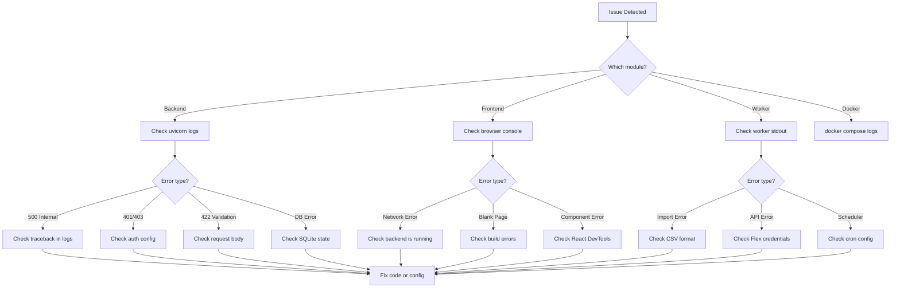

# Debugging Guide

This guide covers debugging techniques for the backend, frontend, and worker modules. It also lists common issues and their solutions.

---

## Debugging Workflow



---

## Backend Debugging

### Enable Debug Mode

Set these environment variables for more verbose logging:

```env
APP_ENV=development
DEBUG=true
LOG_LEVEL=DEBUG
```

Restart the backend after changing these values:

```bash
cd ibkr_dash_backend
uvicorn app.main:app --reload --port 8000
```

### Log Output

The backend logs to stdout with this format:

```
2024-01-15 10:30:00,123 [INFO] app.services.position_service: Fetching positions for date 2024-01-15
2024-01-15 10:30:00,125 [DEBUG] app.core.database: Executing SQL: SELECT * FROM position_snapshots WHERE ...
```

Log levels (from most to least verbose): `DEBUG`, `INFO`, `WARNING`, `ERROR`, `CRITICAL`.

### Using the Interactive API Docs

FastAPI provides Swagger UI at `http://localhost:8000/docs`. This is the easiest way to test endpoints:

1. Open `http://localhost:8000/docs` in your browser.
2. Click on any endpoint to expand it.
3. Click "Try it out".
4. Fill in parameters and click "Execute".
5. View the response status, headers, and body.

### Python Debugger (pdb)

Add a breakpoint in your code:

```python
def list_positions(self, ...):
    # Add this line where you want to pause
    breakpoint()
    result = self.db.execute(sql, params)
    return result
```

When the breakpoint is hit, you get an interactive debugger in the terminal:

```
(Pdb) p sql           # Print the SQL query
(Pdb) p params        # Print query parameters
(Pdb) p result        # Print the result
(Pdb) n               # Next line
(Pdb) c               # Continue execution
(Pdb) q               # Quit
```

### VS Code Debugging

Create `.vscode/launch.json` in the project root:

```json
{
  "version": "0.2.0",
  "configurations": [
    {
      "name": "Backend",
      "type": "debugpy",
      "request": "launch",
      "module": "uvicorn",
      "args": ["app.main:app", "--reload", "--port", "8000"],
      "cwd": "${workspaceFolder}/ibkr_dash_backend",
      "env": {
        "PYTHONPATH": "${workspaceFolder}/ibkr_dash_backend"
      },
      "env": {
        "PYTHONPATH": "${workspaceFolder}/ibkr_dash_backend"
      }
    }
  ]
}
```

Then press F5 to start debugging. You can set breakpoints by clicking in the gutter next to line numbers.

### Common Backend Issues

**Database locked errors:**

```
sqlite3.OperationalError: database is locked
```

Cause: Another process is writing to the database. The backend uses WAL mode with a 5-second busy timeout, but long-running writes can still cause this.

Solution: Ensure the worker is not running a long import while the backend is serving requests. WAL mode allows concurrent reads, but writes are serialized.

**Import errors after pulling updates:**

```
ModuleNotFoundError: No module named 'app.schemas.new_feature'
```

Solution: Reinstall dependencies:

```bash
pip install -r requirements.txt
```

**Settings not taking effect:**

Settings are read live from `data/config.json` — no restart needed. If changes made via the Admin UI are not visible, check that the JSON file was written correctly.

---

## Frontend Debugging

### Browser DevTools

Open Chrome/Firefox DevTools (F12) and use:

- **Console** -- View JavaScript errors and `console.log` output.
- **Network** -- Inspect API requests, check status codes, and view response bodies.
- **React DevTools** -- Install the browser extension to inspect component state and props.

### Vite Dev Server

The Vite dev server provides:

- **Hot Module Replacement (HMR)** -- Changes appear instantly without a full page reload.
- **Error overlay** -- Compilation errors show directly in the browser.
- **Source maps** -- Errors point to the original TypeScript source.

### Proxy Configuration

The Vite dev server proxies `/api` requests to the backend. This is configured in `vite.config.ts`:

```typescript
// vite.config.ts
server: {
  proxy: {
    '/api': {
      target: 'http://localhost:8000',
      changeOrigin: true,
    },
  },
},
```

If API requests fail from the frontend but work from curl, check that:
1. The backend is running on port 8000.
2. The proxy configuration matches.
3. CORS is not blocking the request (check browser console for CORS errors).

### TypeScript Errors

Run the TypeScript compiler to check for type errors:

```bash
cd ibkr_dash_frontend
npx tsc --noEmit
```

This is also run as part of `npm run build`.

### Common Frontend Issues

**Blank page after pulling updates:**

```bash
# Clear node_modules and reinstall
rm -rf node_modules
npm install
```

**API requests return 404:**

Check that the backend is running and the proxy is configured. Open the Network tab in DevTools and verify the request URL is correct (should start with `/api/`).

**Component not updating after state change:**

Common React pitfalls:
- Mutating state directly instead of using the setter function.
- Missing dependency in a `useEffect` dependency array.
- Stale closure capturing an old value.

---

## Worker Debugging

### Manual Import

Test the import pipeline by running it manually:

```bash
cd ibkr_dash_worker

# Import a specific file
python -m worker.main import path/to/flex_export.csv

# Scan for new files
python -m worker.main scan
```

### Check Logs

The worker logs to stdout. For more verbose output:

```bash
LOG_LEVEL=DEBUG python -m worker.main import path/to/file.csv
```

### Verify Database State

Use the SQLite CLI to inspect the database directly:

```bash
sqlite3 data/ibkr_dash.db

# List tables
.tables

# Count records
SELECT COUNT(*) FROM position_snapshots;
SELECT COUNT(*) FROM trade_records;
SELECT COUNT(*) FROM account_snapshots;

# Check latest data
SELECT report_date, COUNT(*) FROM position_snapshots GROUP BY report_date ORDER BY report_date DESC LIMIT 5;

# Exit
.quit
```

### Common Worker Issues

**No data after import:**

Check that the CSV file matches the expected IBKR Flex format. The parser expects specific column headers. Run with `LOG_LEVEL=DEBUG` to see parsing details.

**Scheduler not running:**

Verify `scheduler.enabled` is `true` in Admin Settings. Check that the cron schedule is correct:

```
scheduler.hour = 12
scheduler.minute = 30
scheduler.timezone = Asia/Shanghai
```

**Flex API errors:**

Verify `FLEX_TOKEN` and `FLEX_QUERY_ID_DAILY` are correct. Test manually:

```bash
curl "https://www.interactivebrokers.com/AccountManagement/FlexWebService/StatementViewer?token=YOUR_TOKEN"
```

---

## AI Agent Debugging

### Check LLM Connection

Test the LLM connection via the admin API:

```bash
curl -X POST "http://localhost:8000/api/admin/llm/test" \
  -H "Content-Type: application/json" \
  -d '{"message": "Hello"}'
```

### View Agent Tasks

Check the status of background agent tasks:

```bash
# List recent tasks
curl "http://localhost:8000/api/agent/tasks?limit=10"

# Get specific task details
curl "http://localhost:8000/api/agent/tasks/{task_id}"
```

### View Agent Outputs

Check stored agent results:

```bash
# List trade decisions
curl "http://localhost:8000/api/trade-decision/decisions?limit=5"

# List trade reviews
curl "http://localhost:8000/api/trade-review/reviews?limit=5"

# List daily reviews
curl "http://localhost:8000/api/daily-position-review/dates"
```

### Common Agent Issues

**Agent returns empty result:**

The agent may not have enough data to analyze. Ensure:
- The database has position and trade data.
- The symbol exists in your portfolio (for trade-specific agents).

**Agent takes too long:**

LLM calls can be slow. The default timeout is handled by the async runtime. Check the LLM provider's status page for outages.

**Rate limit exceeded:**

```
429 Too Many Requests
```

The rate limit is 20 LLM calls per 60 seconds per IP. Wait and try again.

---

## Database Debugging

### Inspect the Schema

```bash
sqlite3 data/ibkr_dash.db ".schema"
```

This shows all CREATE TABLE statements.

### Check Table Sizes

```bash
sqlite3 data/ibkr_dash.db "
SELECT 'account_snapshots' as tbl, COUNT(*) FROM account_snapshots
UNION ALL
SELECT 'position_snapshots', COUNT(*) FROM position_snapshots
UNION ALL
SELECT 'trade_records', COUNT(*) FROM trade_records
UNION ALL
SELECT 'agent_tasks', COUNT(*) FROM agent_tasks;
"
```

### Query Agent Prompts

```bash
sqlite3 data/ibkr_dash.db "
SELECT prompt_key, version, status, length(content) as content_length
FROM agent_prompts
ORDER BY prompt_key, version DESC;
"
```

### Reset the Database

If you need a clean start:

```bash
# Stop the backend and worker
rm data/ibkr_dash.db

# Reinitialize
cd ibkr_dash_worker && python -m worker.main init-db

# Re-import data
python -m worker.main import path/to/file.csv
```

---

## Docker Debugging

### View Container Logs

```bash
# All services
docker compose logs -f

# Specific service
docker compose logs -f backend
docker compose logs -f worker
docker compose logs -f frontend
```

### Execute Commands Inside Containers

```bash
# Open a shell in the backend
docker compose exec backend bash

# Run a Python command
docker compose exec backend python -c "from app.core.database import Database; db = Database('data/ibkr_dash.db'); print(db.execute('SELECT COUNT(*) FROM position_snapshots'))"

# Check worker status
docker compose exec worker python -m worker.main scan
```

### Check Container Health

```bash
# Container status
docker compose ps

# Resource usage
docker stats --no-stream

# Inspect a container
docker compose inspect backend
```

### Restart Services

```bash
# Restart one service
docker compose restart backend

# Restart everything
docker compose restart

# Rebuild after code changes
docker compose up --build -d
```

---

## Getting Help

If you are stuck:

1. Check the logs (backend, worker, or browser console).
2. Search existing GitHub issues.
3. Create a new issue with:
   - Steps to reproduce
   - Expected behavior
   - Actual behavior
   - Relevant log output
   - Environment details (OS, Python version, Node version)
