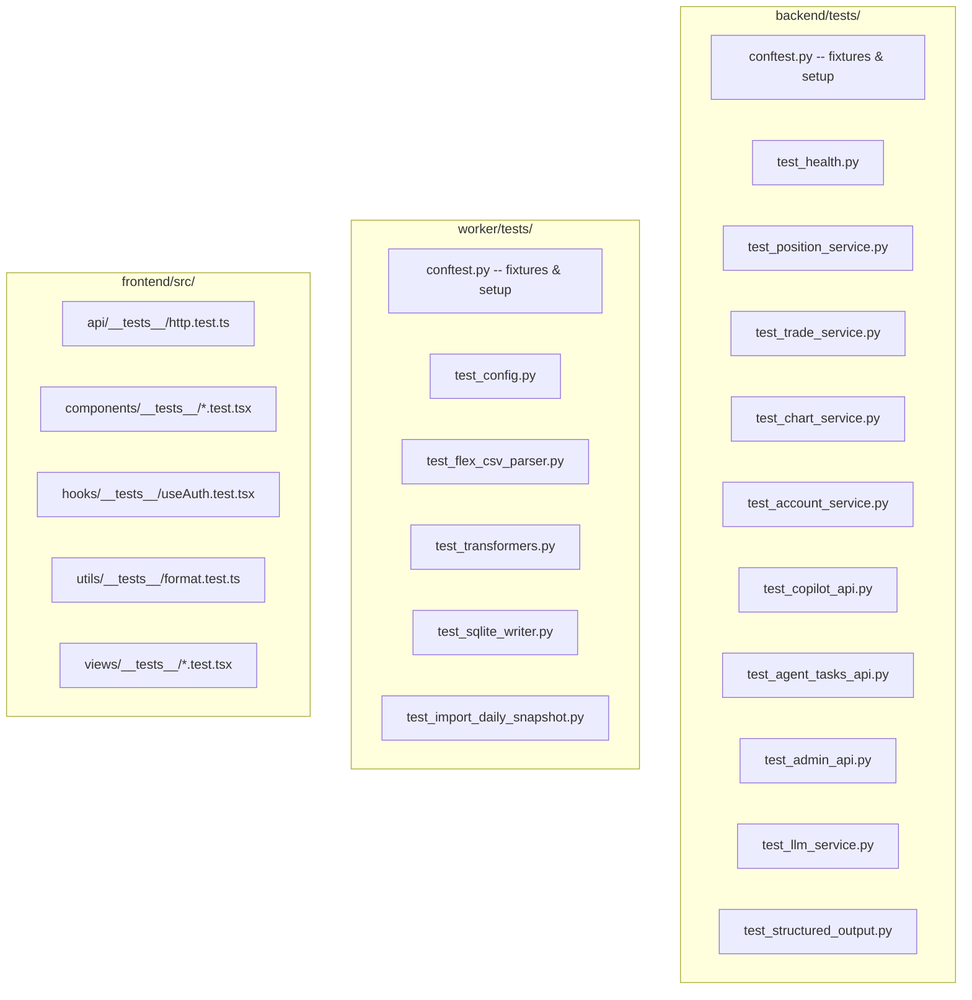

# Testing Guide

IBKR Dash uses **pytest** for Python (backend + worker) and **Vitest** for TypeScript (frontend). This guide explains how to run tests, write new tests, and understand the test infrastructure.

---

## Quick Reference

```bash
# Backend tests
cd backend && pytest

# Worker tests
cd worker && pytest

# Frontend tests
cd frontend && npm test
```

---

## Test File Structure



---

## Backend Tests (pytest)

### Running Tests

```bash
cd backend

# Run all tests
pytest

# Run with verbose output
pytest -v

# Run a specific test file
pytest tests/test_position_service.py

# Run a specific test function
pytest tests/test_position_service.py::test_list_positions_with_data

# Run tests matching a pattern
pytest -k "position"

# Stop on first failure
pytest -x

# Show print output
pytest -s
```

### Test Infrastructure

The test setup is defined in `tests/conftest.py`. Every test gets:

1. **In-memory SQLite database** -- no file I/O, fast and isolated.
2. **Disabled authentication** -- `AUTH_PASSWORD` is set to empty.
3. **Fake LLM config** -- `LLM_API_KEY` is set to `test-key`.
4. **Reset singletons** -- Database and settings are reset before each test.

```python
# tests/conftest.py
@pytest.fixture(autouse=True)
def _reset_singletons(monkeypatch):
    """Reset database and settings singletons before each test."""
    db_mod._db_instance = None
    config_mod.get_settings.cache_clear()

    monkeypatch.setenv("SQLITE_PATH", ":memory:")
    monkeypatch.setenv("AUTH_PASSWORD", "")
    monkeypatch.setenv("LLM_API_KEY", "test-key")
    monkeypatch.setenv("LLM_BASE_URL", "https://api.example.com/v1")
    monkeypatch.setenv("LLM_DEFAULT_MODEL", "test-model")

    yield

    db_mod._db_instance = None
    config_mod.get_settings.cache_clear()
```

### Writing Service Tests

Service tests create an in-memory database, insert test data, and call the service directly:

```python
# tests/test_position_service.py
from app.core.database import Database
from app.services.position_service import PositionService

def test_list_positions_with_data():
    # 1. Create an in-memory database
    db = Database(":memory:")
    db.init_schema()

    # 2. Insert test data
    db.insert("position_snapshots", {
        "account_id": "U123",
        "report_date": "2024-01-15",
        "symbol": "AAPL",
        "quantity": 100,
        "mark_price": 150.0,
        "position_value": 15000.0,
    })

    # 3. Call the service
    service = PositionService(db)
    result = service.list_positions(
        report_date="2024-01-15",
        symbol=None,
        asset_class=None,
        sort_by="position_value",
        sort_order="desc",
        page=1,
        page_size=20,
    )

    # 4. Assert results
    assert len(result.items) == 1
    assert result.items[0].symbol == "AAPL"
    assert result.items[0].position_value == 15000.0

def test_list_positions_empty():
    db = Database(":memory:")
    db.init_schema()

    service = PositionService(db)
    result = service.list_positions(
        report_date="2024-01-15",
        symbol=None,
        asset_class=None,
        sort_by="position_value",
        sort_order="desc",
        page=1,
        page_size=20,
    )

    assert len(result.items) == 0
    assert result.pagination.total == 0
```

### Writing API Tests

API tests use FastAPI's `TestClient` to make HTTP requests:

```python
# tests/test_health.py
from fastapi.testclient import TestClient
from app.main import app

def test_health_endpoint():
    client = TestClient(app)
    response = client.get("/api/health")
    assert response.status_code == 200
    assert response.json()["status"] == "ok"

def test_positions_endpoint():
    client = TestClient(app)
    response = client.get("/api/positions")
    assert response.status_code == 200
    data = response.json()
    assert "items" in data
    assert "pagination" in data
```

### Available Test Files

| File | Tests |
|------|-------|
| `test_health.py` | Health endpoint |
| `test_position_service.py` | Position listing, filtering, sorting |
| `test_trade_service.py` | Trade listing, summary |
| `test_chart_service.py` | Equity curve, performance calendar |
| `test_account_service.py` | Account overview |
| `test_cash_flow_service.py` | Cash flow queries |
| `test_dividend_service.py` | Dividend queries |
| `test_copilot_api.py` | Copilot chat, sessions |
| `test_agent_tasks_api.py` | Background task management |
| `test_admin_api.py` | Admin endpoints |
| `test_llm_service.py` | LLM client |
| `test_structured_output.py` | Agent output parsing |
| `test_risk_assessment_cards.py` | Risk assessment card generation |

---

## Worker Tests (pytest)

### Running Tests

```bash
cd worker

# Run all tests
pytest

# Run with verbose output
pytest -v

# Run a specific file
pytest tests/test_flex_csv_parser.py
```

### Test Infrastructure

Worker tests reuse the backend's database module for schema management:

```python
# tests/conftest.py
@pytest.fixture
def settings() -> Settings:
    return Settings(sqlite_path=":memory:", data_dir="/tmp/test_flex")

@pytest.fixture
def db(settings: Settings) -> Database:
    """Return an initialized in-memory database (reusing backend schema)."""
    return init_database(settings)
```

### Writing Worker Tests

```python
# tests/test_flex_csv_parser.py
from worker.parsers.flex_csv_parser import parse_flex_csv

def test_parse_flex_csv(tmp_path):
    # Create a sample CSV file
    csv_file = tmp_path / "test.csv"
    csv_file.write_text("AccountID,Symbol,...\nU123,AAPL,...\n")

    # Parse it
    result = parse_flex_csv(csv_file)

    # Assert
    assert len(result.positions) == 1
    assert result.positions[0]["symbol"] == "AAPL"

def test_parse_empty_csv(tmp_path):
    csv_file = tmp_path / "empty.csv"
    csv_file.write_text("AccountID,Symbol\n")

    result = parse_flex_csv(csv_file)
    assert len(result.positions) == 0
```

### Available Test Files

| File | Tests |
|------|-------|
| `test_config.py` | Worker settings loading |
| `test_flex_csv_parser.py` | CSV parsing logic |
| `test_transformers.py` | Data transformation |
| `test_sqlite_writer.py` | Database write operations |
| `test_import_daily_snapshot.py` | End-to-end import flow |

---

## Frontend Tests (Vitest)

### Running Tests

```bash
cd frontend

# Run all tests (single run)
npm test

# Run in watch mode
npm run test:watch

# Run a specific file
npx vitest run src/components/__tests__/StatCard.test.tsx
```

### Test Infrastructure

The frontend uses:
- **Vitest** as the test runner
- **jsdom** as the DOM environment
- **@testing-library/react** for component testing
- **@testing-library/jest-dom/vitest** for DOM matchers

Setup file (`src/test/setup.ts`):

```typescript
import '@testing-library/jest-dom/vitest'
```

### Writing Component Tests

```typescript
// src/components/__tests__/StatCard.test.tsx
import { render, screen } from '@testing-library/react'
import { StatCard } from '../StatCard'

describe('StatCard', () => {
  it('renders title and value', () => {
    render(<StatCard title="Total Equity" value="$250,000" />)
    expect(screen.getByText('Total Equity')).toBeInTheDocument()
    expect(screen.getByText('$250,000')).toBeInTheDocument()
  })

  it('renders loading state', () => {
    render(<StatCard title="Total Equity" loading={true} />)
    expect(screen.getByTestId('loading')).toBeInTheDocument()
  })

  it('renders delta with positive change', () => {
    render(<StatCard title="P&L" value="$5,000" delta={2.5} />)
    expect(screen.getByText('+2.5%')).toBeInTheDocument()
  })
})
```

### Writing Hook Tests

```typescript
// src/hooks/__tests__/useAuth.test.tsx
import { renderHook, waitFor } from '@testing-library/react'
import { useAuth } from '../useAuth'

describe('useAuth', () => {
  it('returns unauthenticated by default', () => {
    const { result } = renderHook(() => useAuth())
    expect(result.current.isAuthenticated).toBe(false)
  })

  it('sets loading to true initially', () => {
    const { result } = renderHook(() => useAuth())
    expect(result.current.loading).toBe(true)
  })
})
```

### Writing Utility Tests

```typescript
// src/utils/__tests__/format.test.ts
import { formatCurrency, formatPercent } from '../format'

describe('formatCurrency', () => {
  it('formats USD values', () => {
    expect(formatCurrency(250000)).toBe('$250,000.00')
  })

  it('handles zero', () => {
    expect(formatCurrency(0)).toBe('$0.00')
  })

  it('handles negative values', () => {
    expect(formatCurrency(-1500)).toBe('-$1,500.00')
  })
})

describe('formatPercent', () => {
  it('formats positive percentages', () => {
    expect(formatPercent(0.05)).toBe('+5.00%')
  })

  it('formats negative percentages', () => {
    expect(formatPercent(-0.025)).toBe('-2.50%')
  })
})
```

### Available Test Files

| File | Tests |
|------|-------|
| `src/api/__tests__/http.test.ts` | HTTP client utility |
| `src/components/__tests__/AppHeader.test.tsx` | App header component |
| `src/components/__tests__/ErrorBlock.test.tsx` | Error display component |
| `src/components/__tests__/ErrorBoundary.test.tsx` | Error boundary |
| `src/components/__tests__/LoadingBlock.test.tsx` | Loading indicator |
| `src/components/__tests__/StatCard.test.tsx` | Stat card component |
| `src/hooks/__tests__/useAuth.test.tsx` | Auth hook |
| `src/utils/__tests__/format.test.ts` | Formatting utilities |
| `src/views/__tests__/DashboardView.test.tsx` | Dashboard page |
| `src/views/__tests__/PositionsView.test.tsx` | Positions page |

---

## Test Coverage

### Backend Coverage

```bash
cd backend
pytest --cov=app --cov-report=html
# Open htmlcov/index.html in browser
```

### Frontend Coverage

```bash
cd frontend
npx vitest run --coverage
```

---

## Best Practices

1. **Test isolation** -- Each test should be independent. Use fixtures for setup and teardown.
2. **In-memory databases** -- Never use the real database in tests.
3. **Descriptive names** -- Test function names should describe what they test: `test_list_positions_filters_by_symbol`.
4. **Arrange-Act-Assert** -- Structure tests as: set up data, call the function, check results.
5. **Edge cases** -- Test empty results, missing data, invalid inputs, and boundary conditions.
6. **Fast tests** -- Avoid sleeps, network calls, or file I/O in unit tests.
