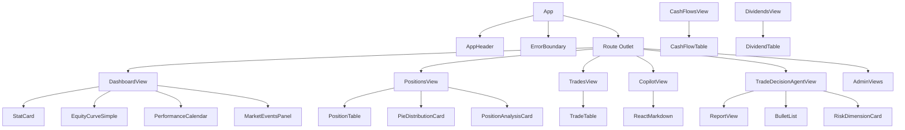
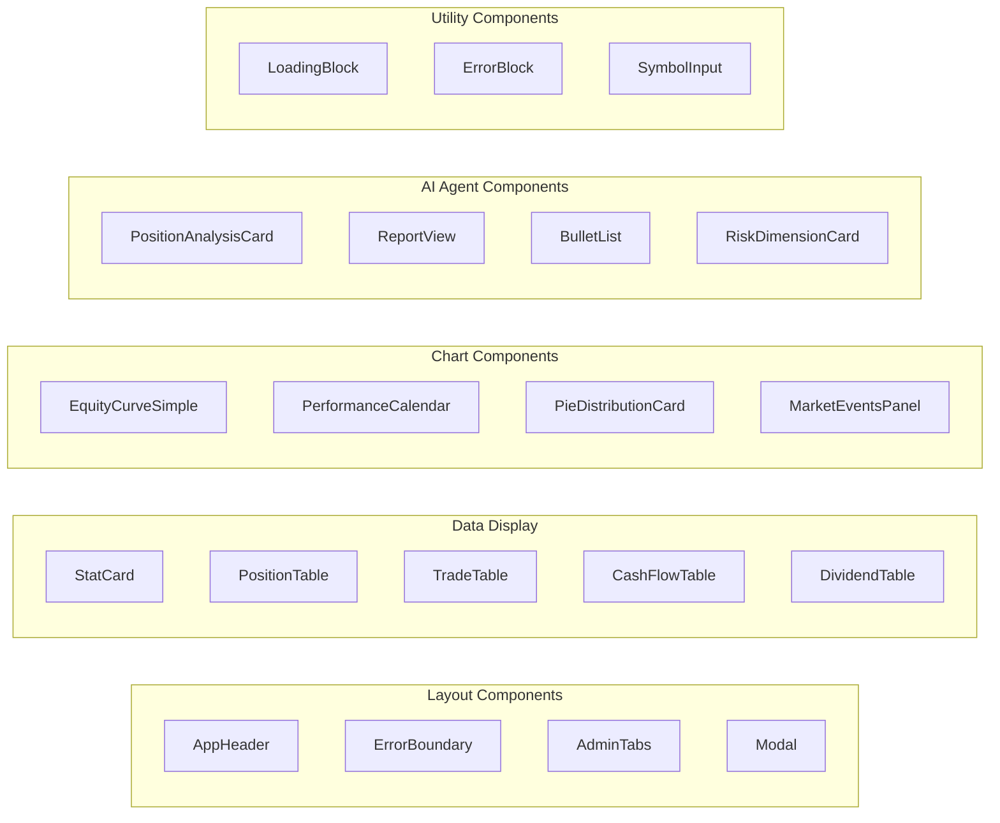

# Components

The frontend uses a library of reusable components in `src/components/`. These components follow the institutional terminal design system and use CSS variables for consistent styling.

## Component Hierarchy



## Component Categories



## Key Components

### AppHeader

**File**: `src/components/AppHeader.tsx`

The main navigation header displayed on every page. It includes:

- **Title**: "IBKR DASH" with status indicator
- **Account metrics strip**: Equity, P&L, Report date (from `useAccountOverview` hook)
- **Navigation tabs**: Dashboard, Positions, Trades, Cash Flows, Dividends, AI Decision, Copilot, Admin
- **Auth controls**: Login/Logout button, username display
- **Language toggle**: Switches between English and Chinese
- **Login modal**: Uses the `Modal` component for username/password authentication

The header uses the `useAuth` hook for authentication state and the `useAccountOverview` hook for account metrics.

```tsx
// ibkr_dash_frontend/src/App.tsx
<AppHeader />
// Renders inside <App /> as the first child, above the <Outlet />
```

### Modal

**File**: `src/components/Modal.tsx`

A reusable modal dialog component with keyboard navigation support.

```tsx
<Modal open={isOpen} onClose={() => setIsOpen(false)} title="Login" width="min(380px, 100%)">
  <form>...</form>
</Modal>
```

| Prop | Type | Description |
|---|---|---|
| `open` | boolean | Whether the modal is visible |
| `onClose` | () => void | Callback when modal should close |
| `title` | string? | Optional title displayed in header |
| `width` | string? | CSS width (default: `min(420px, 100%)`) |
| `children` | ReactNode | Modal content |

Features:
- **Escape key** closes the modal
- **Tab key** traps focus within the modal
- **Auto-focus** first focusable element on open
- **Click backdrop** to close
- **ARIA attributes** for accessibility (`role="dialog"`, `aria-modal="true"`)

### StatCard

**File**: `src/components/StatCard.tsx`

A styled card displaying a single metric with title, value, helper text, and optional delta indicators. Used on the Dashboard to show Total Equity, Cash, Total P&L, YTD TWR, etc.

```tsx
<StatCard
  title="Total Equity"
  value="$123,456"
  helper="As of 2024-12-15"
  tone="positive"
  deltaPercent="+2.3%"
  deltaAmount="+$2,800"
  deltaTone="positive"
/>
```

| Prop | Type | Description |
|---|---|---|
| `title` | string | Metric label (displayed in uppercase monospace) |
| `value` | string | Main metric value |
| `helper` | string? | Helper text below the value |
| `tone` | `'neutral' \| 'positive' \| 'negative' \| 'accent'` | Color tone for the value |
| `deltaPercent` | string? | Delta percent badge |
| `deltaTone` | string? | Color for delta badge |

### ErrorBoundary

**File**: `src/components/ErrorBoundary.tsx`

A React class component that catches rendering errors and displays a fallback UI instead of crashing the entire app.

```tsx
<ErrorBoundary>
  <SomeComponent />
</ErrorBoundary>
```

Features:
- Catches errors in child component tree
- Displays error message and "Reload Page" button
- Logs errors to console with component stack trace

Used in:
- `App.tsx`: Wraps the route outlet
- `router/index.tsx`: Wraps each lazy-loaded view

### PositionTable

**File**: `src/components/PositionTable.tsx`

A sortable data table displaying current portfolio positions. Supports click-to-sort on numeric columns.

Features:
- Client-side sorting with `useMemo`
- Click any row to view position detail
- P&L color coding (green for positive, red for negative)
- Monospace numbers with tabular-nums

```tsx
<PositionTable items={positions} onSelect={openPositionDetail} />
```

### TradeTable

**File**: `src/components/TradeTable.tsx`

Displays trade history with date, symbol, side (BUY/SELL), quantity, price, and P&L columns.

### CashFlowTable

**File**: `src/components/CashFlowTable.tsx`

Displays cash flow records including deposits, withdrawals, and their details.

### DividendTable

**File**: `src/components/DividendTable.tsx`

Displays dividend income records with gross amount, withholding tax, and net received.

### PieDistributionCard

**File**: `src/components/PieDistributionCard.tsx`

An ECharts-based pie chart card showing distribution data (e.g., asset class allocation, industry distribution). Supports interactive hover tooltips and legend.

```tsx
<PieDistributionCard
  title="Asset Classes"
  subtitle="Stocks, fixed income, and cash allocation"
  items={[
    { label: 'Stocks', value: 45000, color: '#56d5ff' },
    { label: 'Fixed Income', value: 30000, color: '#6ee7b7' },
  ]}
/>
```

### EquityCurveSimple

**File**: `src/components/EquityCurveSimple.tsx`

An ECharts line chart showing the equity curve over time. Supports multiple series and range selection.

### PerformanceCalendar

**File**: `src/components/PerformanceCalendar.tsx`

A calendar heatmap showing daily P&L. Green cells for positive days, red for negative. Supports month view, year view, and all-years view.

### MarketEventsPanel

**File**: `src/components/MarketEventsPanel.tsx`

Displays upcoming market events (FOMC meetings, economic data releases, etc.) with importance levels and category indicators.

### PositionAnalysisCard

**File**: `src/components/PositionAnalysisCard.tsx`

AI-generated portfolio analysis card. Shows sector allocation, concentration analysis, and risk assessment.

### LoadingBlock

**File**: `src/components/LoadingBlock.tsx`

A loading placeholder with a shimmer animation. Used while data is being fetched.

### ErrorBlock

**File**: `src/components/ErrorBlock.tsx`

An error display component with an error message and optional retry button.

```tsx
<ErrorBlock message="Failed to load positions" />
```

### SymbolInput

**File**: `src/components/SymbolInput.tsx`

A text input for entering stock symbols with autocomplete suggestions.

### AdminTabs

**File**: `src/components/AdminTabs.tsx`

Navigation tabs for the admin section. Provides links to Settings, System, Monitoring, Scheduler, and Prompts views.

## How Components Use i18n

Components use the `useTranslation` hook from `react-i18next`:

```tsx
import { useTranslation } from 'react-i18next'

function MyComponent() {
  const { t } = useTranslation()

  return (
    <div>
      <h1>{t('dashboard.title')}</h1>
      <p>{t('dashboard.loading')}</p>
    </div>
  )
}
```

Translation keys follow a hierarchical structure matching the JSON locale files:
- `app.title` -> "IBKR Dashboard" (en) / "IBKR 仪表盘" (zh-CN)
- `nav.positions` -> "Positions" (en) / "持仓" (zh-CN)
- `dashboard.totalEquity` -> "Total Equity" (en) / "总权益" (zh-CN)

For interpolation (dynamic values):

```tsx
// en.json: "ytdTwrHelper": "{{startDate}} to date"
t('dashboard.ytdTwrHelper', { startDate: '2024-01-01' })
// -> "2024-01-01 to date"
```

## Styling Patterns

Components use three styling approaches:

1. **CSS classes** from `base.css` and `theme.css` (e.g., `.btn`, `.surface-panel`, `.data-table`)
2. **Inline styles** with CSS variables (e.g., `color: 'var(--color-text-muted)'`)
3. **Component-scoped inline styles** for layout-specific styling

The design system uses CSS custom properties defined in `theme.css` for colors, spacing, typography, and shadows. This makes it easy to maintain visual consistency across components.

```tsx
// Example: Combining CSS classes and inline styles
<div className="surface-panel" style={{ padding: 'var(--space-4)' }}>
  <StatCard
    title={t('dashboard.totalEquity')}
    value={formatCurrency(overview.totalEquity)}
    tone={overview.totalPnl >= 0 ? 'positive' : 'negative'}
  />
</div>
```
