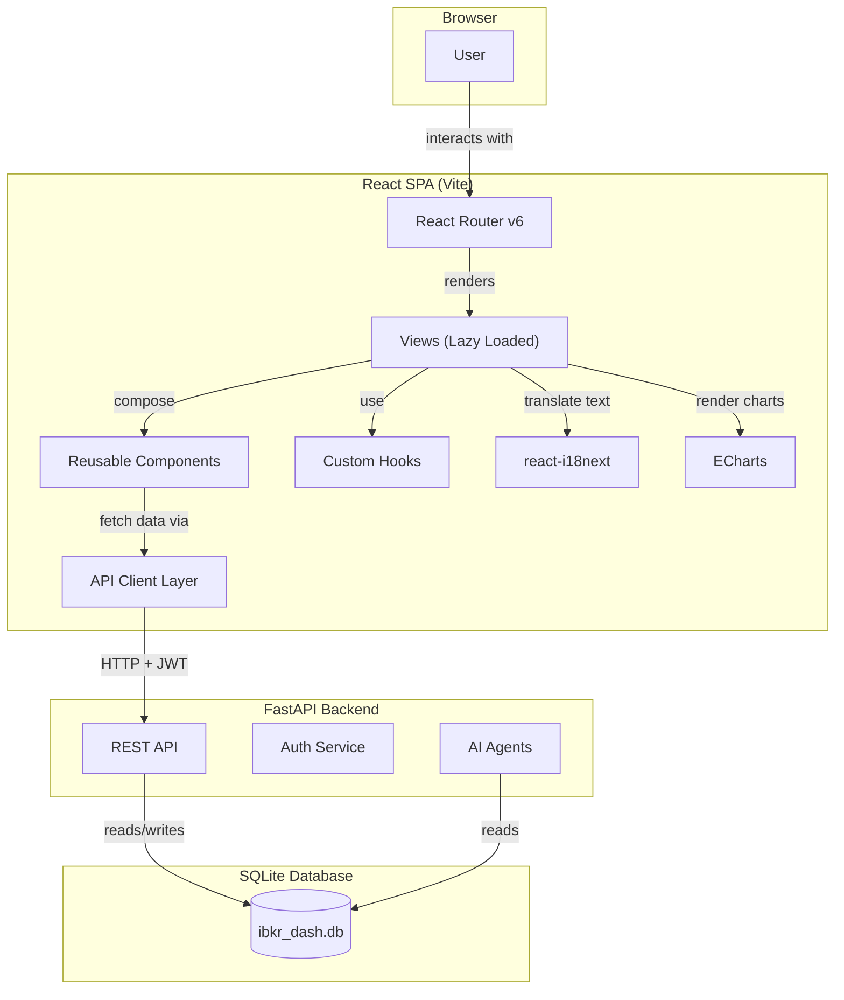
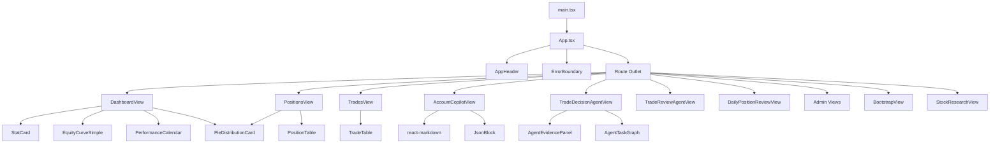
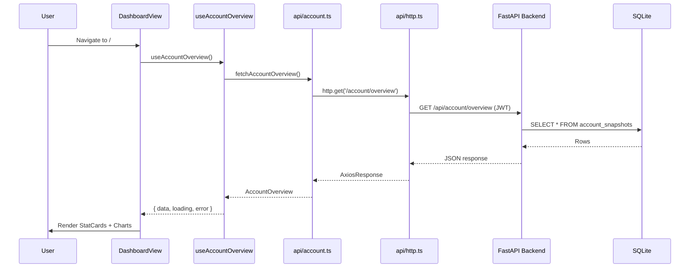

# Frontend Overview

The IBKR Dashboard frontend is a single-page application built with **React 18**, **TypeScript**, and **Vite**. It provides a terminal-luxury themed interface for viewing portfolio data and interacting with AI agents.

## Tech Stack

| Technology | Version | Purpose |
|---|---|---|
| React | 18.3 | UI framework |
| TypeScript | 5.5 | Type safety |
| Vite | 5.4 | Build tool and dev server |
| React Router | 6.23 | Client-side routing |
| react-i18next | 17.0 | Internationalization |
| ECharts | 5.5 | Charts and data visualization |
| react-markdown | 10.1 | Markdown rendering (Copilot) |
| Vitest | 4.1 | Unit testing |

## Application Architecture Diagram



## Module Structure

The source code lives in `frontend/src/` and is organized by concern:

```
frontend/src/
├── api/              # API client functions (one file per domain)
│   ├── http.ts       # Shared Axios instance with JWT interceptor
│   ├── account.ts    # Account overview & snapshots
│   ├── positions.ts  # Position data
│   ├── trades.ts     # Trade records
│   ├── charts.ts     # Equity curve, calendar data
│   ├── auth.ts       # Login / logout
│   └── ...           # 18 more domain-specific files
├── auth/             # Authentication utilities (token storage, refresh)
├── components/       # Reusable UI components (StatCard, tables, charts, etc.)
│   ├── AppHeader.tsx
│   ├── StatCard.tsx
│   ├── PositionTable.tsx
│   ├── ErrorBoundary.tsx
│   └── ...
├── composables/      # Shared composition logic
├── hooks/            # Custom React hooks
│   ├── useAuth.ts         # Authentication state management
│   ├── useAccountOverview.ts  # Account metrics fetching
│   └── ...
├── i18n/             # Internationalization setup and locale files
│   ├── index.ts      # i18next initialization
│   └── locales/      # en.json, zh-CN.json
├── router/           # React Router configuration
│   └── index.tsx     # All route definitions with lazy loading
├── styles/           # CSS files
│   ├── theme.css     # Design tokens (CSS variables)
│   ├── base.css      # Base styles and component classes
│   └── primevue-overrides.css
├── test/             # Test utilities
├── types/            # TypeScript type definitions (one file per domain)
│   ├── account.ts    # AccountOverview, AccountSnapshot
│   ├── positions.ts  # PositionItem, PositionDetail
│   ├── common.ts     # PaginatedResponse, ApiResponse
│   └── ...
├── utils/            # Utility functions (format, metrics)
├── views/            # Page-level components (one per route)
│   ├── DashboardView.tsx
│   ├── PositionsView.tsx
│   ├── TradesView.tsx
│   ├── AccountCopilotView.tsx
│   ├── TradeDecisionAgentView.tsx
│   └── ...
├── App.tsx           # Root component (layout + header + outlet)
├── main.tsx          # Entry point (renders App, imports styles)
└── vite-env.d.ts     # Vite type declarations
```

## Component Hierarchy



## Key Dependencies

### UI and Routing

- **react-router-dom**: Client-side routing with `createBrowserRouter`. Supports lazy loading, nested routes, and protected routes.
- **react-markdown**: Renders Markdown in the Copilot chat interface. Supports GitHub Flavored Markdown via `remark-gfm`.

### Data Visualization

- **echarts**: Full-featured charting library used for equity curves, P&L calendars, pie charts, and performance visualizations. Charts are wrapped in React components that manage the ECharts instance lifecycle.

### Internationalization

- **i18next**: Core i18n framework
- **react-i18next**: React bindings for i18next
- **i18next-browser-languagedetector**: Auto-detects user language from localStorage and browser settings

### Testing

- **vitest**: Fast unit test runner compatible with Vite
- **@testing-library/react**: React testing utilities
- **@testing-library/jest-dom**: Custom Jest matchers for DOM assertions
- **jsdom**: DOM implementation for Node.js testing

## Build Configuration

The Vite config (`vite.config.ts`) sets up:

- React plugin for JSX transformation
- Path alias `@` pointing to `src/`
- Dev server with API proxy to the backend
- Production build with code splitting

### vite.config.ts

```typescript
// frontend/vite.config.ts
import { defineConfig } from 'vite'
import react from '@vitejs/plugin-react'
import path from 'path'

export default defineConfig({
  plugins: [react()],
  resolve: {
    alias: {
      '@': path.resolve(__dirname, 'src'),
    },
  },
  server: {
    port: 5173,
    proxy: {
      '/api': {
        target: 'http://localhost:8000',
        changeOrigin: true,
      },
    },
  },
  build: {
    rollupOptions: {
      output: {
        manualChunks: {
          vendor: ['react', 'react-dom'],
          charts: ['echarts'],
        },
      },
    },
  },
})
```

### Development

```bash
cd frontend
npm install
npm run dev
```

The dev server starts at `http://localhost:5173` and proxies API requests to the backend.

### Production Build

```bash
npm run build
```

This produces optimized static files in `dist/` with:
- Code splitting by route (lazy-loaded views)
- CSS extraction and minification
- Asset hashing for cache busting

## API Layer

Each backend domain has a corresponding API client file in `src/api/`:

| File | Domain |
|---|---|
| `account.ts` | Account overview and snapshots |
| `positions.ts` | Position data |
| `trades.ts` | Trade records |
| `cashFlows.ts` | Cash flow records |
| `dividends.ts` | Dividend records |
| `charts.ts` | Chart data (equity curve, calendar) |
| `tradeDecision.ts` | Trade decision agent |
| `tradeReview.ts` | Trade review agent |
| `dailyPositionReview.ts` | Daily position review agent |
| `accountCopilot.ts` | Account copilot chat |
| `symbolAnalysis.ts` | Stock research |
| `auth.ts` | Authentication |
| `adminSystem.ts` | System status |
| `adminLlm.ts` | LLM configuration |
| `adminIbkr.ts` | IBKR settings |
| `adminEmail.ts` | Email configuration |
| `adminPrompts.ts` | Prompt management |
| `adminHarness.ts` | Eval harness |
| `adminLongbridgeMcp.ts` | Longbridge MCP settings |
| `agentTasks.ts` | Agent task history |

### HTTP Client

All API calls go through a shared HTTP client (`src/api/http.ts`) that handles authentication headers, error responses, and base URL configuration.

```typescript
// frontend/src/api/http.ts
import axios from 'axios'

const http = axios.create({
  baseURL: '/api',
  headers: { 'Content-Type': 'application/json' },
})

// Attach JWT token from localStorage
http.interceptors.request.use((config) => {
  const token = localStorage.getItem('token')
  if (token) {
    config.headers.Authorization = `Bearer ${token}`
  }
  return config
})

// Handle 401 errors (redirect to login)
http.interceptors.response.use(
  (response) => response,
  (error) => {
    if (error.response?.status === 401) {
      localStorage.removeItem('token')
      window.location.href = '/'
    }
    return Promise.reject(error)
  },
)

export default http
```

### Example API Call

```typescript
// frontend/src/api/account.ts
import http from './http'
import type { AccountOverview } from '@/types/account'

export async function fetchAccountOverview(): Promise<AccountOverview> {
  const { data } = await http.get('/account/overview')
  return data
}
```

## Type Definitions

TypeScript types are defined in `src/types/`, one file per domain:

| File | Types |
|---|---|
| `account.ts` | AccountOverview, AccountSnapshot |
| `positions.ts` | PositionItem, PositionDetail |
| `trades.ts` | TradeRecord, TradeSummary |
| `cashFlows.ts` | CashFlowRecord, CashFlowSummary |
| `dividends.ts` | DividendRecord |
| `charts.ts` | EquityCurvePoint, CalendarData |
| `tradeDecision.ts` | TradeDecision, ScoreDetail |
| `tradeReview.ts` | TradeReview, MistakeTag |
| `dailyPositionReview.ts` | DailyReview, SymbolAnalysis |
| `accountCopilot.ts` | CopilotSession, CopilotMessage |
| `agentTasks.ts` | AgentTask, AgentTaskStatus |
| `common.ts` | PaginatedResponse, ApiResponse |
| `auth.ts` | AuthState, LoginCredentials |

## Data Flow



## Design Philosophy

The frontend follows these principles:

- **Terminal luxury theme**: Dark obsidian base with amber/gold accents, monospace typography, Bloomberg Terminal-inspired layout
- **Responsive**: Works on desktop and tablet; gracefully degrades on mobile
- **Accessible**: Semantic HTML, keyboard navigation, color contrast
- **Performant**: Lazy-loaded routes, memoized computations, efficient re-renders
- **Type-safe**: Full TypeScript coverage with strict mode
