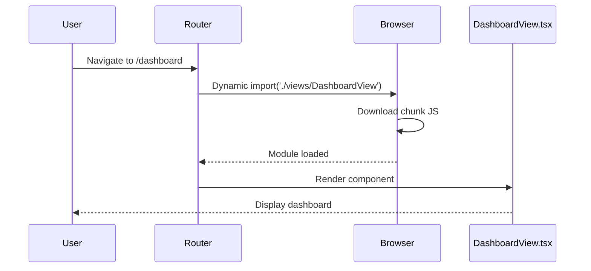
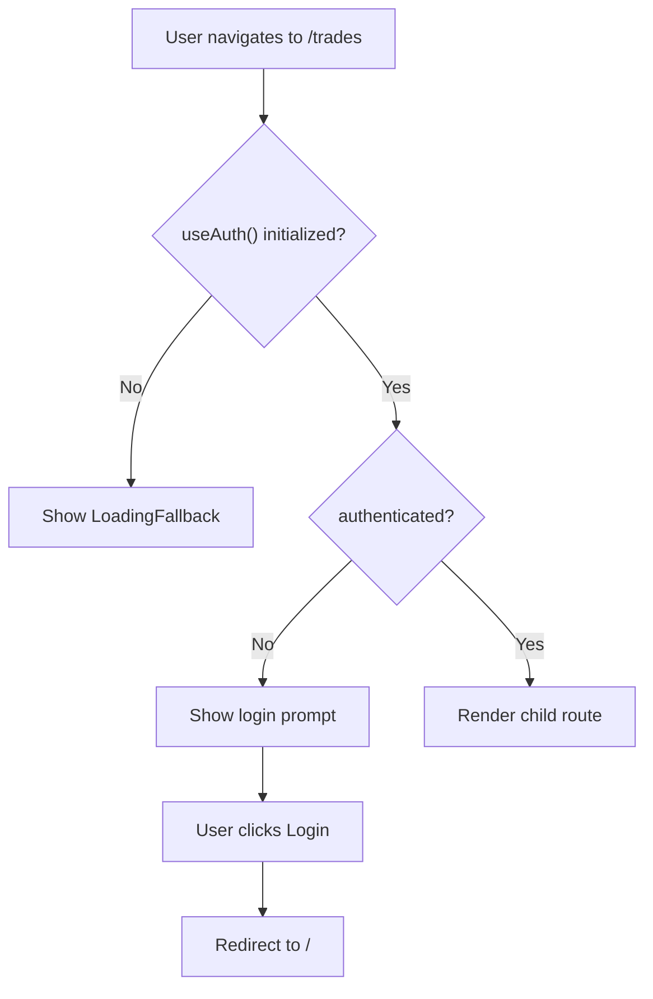

# Routing

The frontend uses **React Router v6** with `createBrowserRouter` for client-side routing. All routes are defined in `src/router/index.tsx`.

## Route Architecture Diagram

```mermaid
graph TB
    Root["createBrowserRouter"] --> App["App.tsx (Layout)"]
    App --> Header["AppHeader"]
    App --> Outlet["Outlet"]

    Outlet --> Public["Public Routes"]
    Outlet --> Protected["Protected Routes"]
    Outlet --> Admin["Admin Routes"]
    Outlet --> CatchAll["Catch-All: * -> /"]

    Public --> Dashboard["/ -> DashboardView"]
    Public --> Positions["/positions -> PositionsView"]
    Public --> Bootstrap["/bootstrap -> BootstrapView"]

    Protected --> Trades["/trades -> TradesView"]
    Protected --> CashFlows["/cash-flows -> CashFlowsView"]
    Protected --> Dividends["/dividends -> DividendsView"]
    Protected --> Research["/stock-research -> StockResearchView"]
    Protected --> DailyReview["/daily-position-review -> DailyPositionReviewView"]
    Protected --> Decision["/trade-decision -> TradeDecisionAgentView"]
    Protected --> Review["/trade-review -> TradeReviewAgentView"]
    Protected --> Copilot["/copilot -> AccountCopilotView"]

    Admin --> System["/admin/system"]
    Admin --> LLM["/admin/llm"]
    Admin --> Ibkr["/admin/ibkr"]
    Admin --> Email["/admin/email"]
    Admin --> Longbridge["/admin/longbridge-mcp"]
    Admin --> Prompts["/admin/prompts"]
    Admin --> Monitor["/admin/agent-monitoring"]
    Admin --> Harness["/admin/harness"]
```



## Router Setup

```tsx
// ibkr_dash_frontend/src/router/index.tsx
import { createBrowserRouter, Navigate } from 'react-router-dom'
import App from '@/App'

export const router = createBrowserRouter([
  {
    path: '/',
    element: <App />,
    children: [
      // All page routes are children of App
    ],
  },
])
```

The `<App />` component serves as the layout wrapper, rendering `<AppHeader />` and an `<Outlet />` for the active route.

```tsx
// ibkr_dash_frontend/src/App.tsx
function App() {
  return (
    <ErrorBoundary>
      <AppHeader />
      <main className="app-shell">
        <Outlet />
      </main>
    </ErrorBoundary>
  )
}
```

## Lazy Loading

All views are lazy-loaded using React's `lazy()` and `Suspense`:

```tsx
// ibkr_dash_frontend/src/router/index.tsx
const DashboardView = lazy(() => import('@/views/DashboardView'))
const PositionsView = lazy(() => import('@/views/PositionsView'))
const TradesView = lazy(() => import('@/views/TradesView'))
// ... more views
```

Each lazy view is wrapped in a helper that provides a loading fallback and error boundary:

```tsx
function lazyViewWithErrorBoundary(Component: React.LazyExoticComponent<any>) {
  return (
    <ErrorBoundary>
      <Suspense fallback={<LoadingFallback />}>
        <Component />
      </Suspense>
    </ErrorBoundary>
  )
}
```

**Lazy loading flow:**



This means:
- Each view is loaded only when the user navigates to it
- If a view fails to load, the error boundary catches it
- A loading spinner shows while the view is being fetched

## Protected Routes

Some routes require authentication. These are wrapped in a `ProtectedRoute` component:

```tsx
// ibkr_dash_frontend/src/router/index.tsx
function ProtectedRoute({ children }: { children: React.ReactNode }) {
  const { authenticated, initialized } = useAuth()

  // Wait for auth state to be determined
  if (!initialized) return <LoadingFallback />

  // Show login prompt if not authenticated
  if (!authenticated) {
    return (
      <div className="surface-panel" style={{ padding: 'var(--space-6)', textAlign: 'center' }}>
        <p style={{ color: 'var(--color-text-secondary)' }}>
          Please log in to access this page.
        </p>
        <button className="btn btn--accent" onClick={() => window.location.href = '/'}>
          Go to Login
        </button>
      </div>
    )
  }

  return <>{children}</>
}
```

**Protected route decision flow:**



## All Routes

### Public Routes

| Path | View | Description |
|---|---|---|
| `/` | `DashboardView` | Main dashboard with equity curve, P&L calendar, stats |
| `/positions` | `PositionsView` | Current portfolio positions and allocation |
| `/bootstrap` | `BootstrapView` | Initial admin account creation |

### Protected Routes (require login)

| Path | View | Description |
|---|---|---|
| `/trades` | `TradesView` | Trade history with filtering |
| `/cash-flows` | `CashFlowsView` | Cash flow records |
| `/dividends` | `DividendsView` | Dividend income records |
| `/stock-research` | `StockResearchView` | Stock research and analysis |
| `/daily-position-review` | `DailyPositionReviewView` | AI daily position review |
| `/trade-decision` | `TradeDecisionAgentView` | AI trade decision analysis |
| `/trade-review` | `TradeReviewAgentView` | AI trade review |
| `/copilot` | `AccountCopilotView` | Account Copilot chat |

### Admin Routes (require login)

| Path | View | Description |
|---|---|---|
| `/admin/system` | `AdminSystemView` | System status and health |
| `/admin/llm` | `AdminLlmView` | LLM provider configuration |
| `/admin/ibkr` | `AdminIbkrView` | IBKR Flex Web Service settings |
| `/admin/email` | `AdminEmailView` | SMTP email configuration |
| `/admin/longbridge-mcp` | `AdminLongbridgeMcpView` | Longbridge MCP integration |
| `/admin/prompts` | `AdminPromptsView` | Prompt version management |
| `/admin/agent-monitoring` | `AdminAgentMonitoringView` | Agent execution monitoring |
| `/admin/harness` | `AdminHarnessView` | Eval harness console |

### Catch-All Route

Any unmatched path redirects to `/`:

```tsx
{ path: '*', element: <Navigate to="/" replace /> }
```

## Navigation

The `AppHeader` component renders navigation buttons that use `useNavigate()` for programmatic routing:

```tsx
const navigate = useNavigate()

<button onClick={() => navigate('/positions')}>
  Positions
</button>
```

Active route highlighting uses `useLocation()`:

```tsx
const location = useLocation()

function isActive(path: string): boolean {
  if (location.pathname === path) return true
  // Admin routes: highlight "Admin" button for any /admin/* path
  if (path.startsWith('/admin')) return location.pathname.startsWith('/admin')
  return false
}
```

## Adding a New Route

To add a new page:

1. Create the view component in `src/views/MyNewView.tsx`

2. Add the lazy import in `src/router/index.tsx`:
   ```tsx
   const MyNewView = lazy(() => import('@/views/MyNewView'))
   ```

3. Add the route to the children array:
   ```tsx
   { path: 'my-new-page', element: lazyViewWithErrorBoundary(MyNewView) }
   ```

4. If it should be protected, wrap in `<ProtectedRoute>`:
   ```tsx
   {
     path: 'my-new-page',
     element: <ProtectedRoute>{lazyViewWithErrorBoundary(MyNewView)}</ProtectedRoute>
   }
   ```

5. Add a navigation button in `AppHeader.tsx` if needed

6. Add translation keys in `en.json` and `zh-CN.json`
