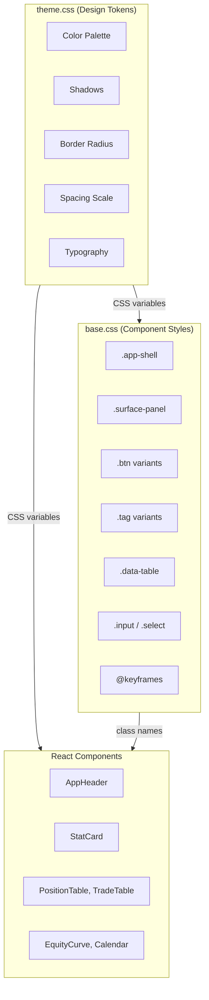

# Styling

The frontend uses an **institutional terminal** design system inspired by Bloomberg Terminal, IBKR Client Portal, and FactSet. Cold dark base, muted accents, zero glow, maximum density.

## CSS Architecture

The styling is organized into three files:

| File | Purpose |
|---|---|
| `src/styles/theme.css` | Design tokens (CSS variables) and font imports |
| `src/styles/base.css` | Base styles, component classes, layout utilities, animations |
| `src/styles/primevue-overrides.css` | Overrides for PrimeVue components (if used) |

Both `theme.css` and `base.css` are imported in `main.tsx`:

```tsx
// frontend/src/main.tsx
import './styles/theme.css'
import './styles/base.css'
```

## Design Token Architecture



## Design Tokens (CSS Variables)

All visual properties are defined as CSS custom properties in `theme.css`. This makes it easy to maintain consistency and adjust the theme.

### Color Palette

| Variable | Value | Usage |
|---|---|---|
| `--color-bg` | `#0A0E14` | Page background |
| `--color-bg-elevated` | `#0D1117` | Elevated surfaces |
| `--color-bg-panel` | `#111820` | Panel backgrounds |
| `--color-bg-panel-strong` | `#151C28` | Stronger panel backgrounds |
| `--color-bg-muted` | `#161B22` | Muted backgrounds |
| `--color-border` | `rgba(255, 255, 255, 0.06)` | Default borders |
| `--color-border-strong` | `rgba(255, 255, 255, 0.12)` | Emphasized borders |
| `--color-border-subtle` | `rgba(255, 255, 255, 0.04)` | Subtle borders |
| `--color-text-primary` | `#C9D1D9` | Primary text |
| `--color-text-secondary` | `#6E7681` | Secondary text |
| `--color-text-muted` | `#484F58` | Muted text |
| `--color-text-bright` | `#E6EDF3` | Bright/highlighted text |
| `--color-accent` | `#58A6FF` | Primary accent (cold blue) |
| `--color-accent-soft` | `rgba(88, 166, 255, 0.08)` | Soft accent backgrounds |
| `--color-accent-strong` | `#79C0FF` | Strong accent |
| `--color-positive` | `#3FB950` | Gains, success |
| `--color-negative` | `#F85149` | Losses, errors |
| `--color-warning` | `#D29922` | Warnings |

### Typography

```css
:root {
  --font-mono: 'IBM Plex Mono', 'SF Mono', 'Cascadia Code', monospace;
  --font-body: 'IBM Plex Sans', -apple-system, BlinkMacSystemFont, sans-serif;
}
```

- **IBM Plex Mono**: Used for numbers, code, labels, and terminal-style text
- **IBM Plex Sans**: Used for body text and headings

### Shadows

```css
:root {
  --shadow-panel:    0 1px 0 rgba(0,0,0,0.3);
  --shadow-card:     0 1px 0 rgba(0,0,0,0.2);
  --shadow-elevated: 0 8px 24px rgba(0,0,0,0.4);
  --shadow-glow:     none;
}
```

### Border Radius

```css
:root {
  --radius-sm: 2px;
  --radius-md: 4px;
  --radius-lg: 6px;
  --radius-xl: 8px;
}
```

### Spacing Scale

| Variable | Value | Pixels |
|---|---|---|
| `--space-1` | `0.25rem` | 4px |
| `--space-2` | `0.5rem` | 8px |
| `--space-3` | `0.625rem` | 10px |
| `--space-4` | `0.875rem` | 14px |
| `--space-5` | `1.25rem` | 20px |
| `--space-6` | `1.75rem` | 28px |
| `--space-7` | `2.5rem` | 40px |

## Base Styles

### App Shell

The `.app-shell` class centers content and constrains width:

```css
.app-shell {
  position: relative;
  width: 100%;
  max-width: 1600px;
  margin: 0 auto;
  padding: 0 12px 40px;
  overflow-x: clip;
}
```

### Surface Panel

The primary container component uses a flat, no-gradient style:

```css
.surface-panel {
  position: relative;
  overflow: hidden;
  border-radius: var(--radius-md);
  background: var(--color-bg-panel);
  border: 1px solid var(--color-border);
}
```

### Buttons

Four button variants:

| Class | Description |
|---|---|
| `.btn` | Default button with subtle border |
| `.btn--accent` | Blue accent button |
| `.btn--ghost` | Transparent background, no border |
| `.btn--sm` | Smaller size variant |

```tsx
<button className="btn">Default</button>
<button className="btn btn--accent">Accent</button>
<button className="btn btn--ghost btn--sm">Small Ghost</button>
```

### Tags

Small status badges:

```tsx
<span className="tag">DEFAULT</span>
<span className="tag tag--positive">POSITIVE</span>
<span className="tag tag--negative">NEGATIVE</span>
<span className="tag tag--accent">ACCENT</span>
<span className="tag tag--warning">WARNING</span>
```

### Data Table

Styled tables for data display:

```css
.data-table {
  width: 100%;
  min-width: 1000px;
  border-collapse: collapse;
  table-layout: fixed;
}

.data-table thead th {
  font-family: var(--font-mono);
  font-size: 0.72rem;
  letter-spacing: 0.08em;
  text-transform: uppercase;
  color: var(--color-text-muted);
  background: var(--color-bg-elevated);
}
```

### Form Inputs

```tsx
<input className="input" placeholder="Enter symbol..." />
<select className="select">...</select>
<label className="field-stack">
  <span className="field-stack__label">USERNAME</span>
  <input className="input" />
</label>
```

## Component Styling Patterns

### Pattern 1: CSS Variables in Inline Styles

Components frequently use CSS variables in inline styles for dynamic layouts:

```tsx
<div style={{
  color: 'var(--color-text-muted)',
  fontFamily: 'var(--font-mono)',
  fontSize: '0.9rem',
  padding: 'var(--space-4)',
  borderRadius: 'var(--radius-md)',
  border: '1px solid var(--color-border)',
}}>
```

### Pattern 2: Tone-Based Color Mapping

Components map semantic tones to CSS variables:

```tsx
const toneColorMap = {
  positive: 'var(--color-positive)',
  negative: 'var(--color-negative)',
  accent: 'var(--color-accent-strong)',
  neutral: 'var(--color-text-bright)',
}

<span style={{ color: toneColorMap[tone] }}>{value}</span>
```

### Pattern 3: Responsive Grid Layouts

```css
.stats-grid {
  display: grid;
  grid-template-columns: repeat(auto-fit, minmax(160px, 1fr));
  gap: var(--space-2);
}

.filters-grid {
  display: grid;
  grid-template-columns: repeat(6, minmax(0, 1fr));
  gap: var(--space-2);
}

/* Two-column list+detail layout */
.list-detail-layout {
  display: grid;
  grid-template-columns: 300px 1fr;
  gap: var(--space-4);
}

@media (max-width: 1200px) {
  .filters-grid { grid-template-columns: repeat(4, minmax(0, 1fr)); }
}

@media (max-width: 900px) {
  .summary-layout { grid-template-columns: 1fr; }
  .list-detail-layout { grid-template-columns: 1fr; }
}

@media (max-width: 768px) {
  .filters-grid { grid-template-columns: repeat(2, minmax(0, 1fr)); }
}
```

### Pattern 4: Animations

Predefined animation keyframes:

| Animation | Description |
|---|---|
| `fadeIn` | Fade in from transparent |
| `slideUp` | Slide up from 8px below |
| `slideInLeft` | Slide in from left |

Staggered reveal for lists:

```css
.stagger-reveal > * { animation: slideInLeft 0.3s ease both; }
.stagger-reveal > *:nth-child(1) { animation-delay: 0s; }
.stagger-reveal > *:nth-child(2) { animation-delay: 0.04s; }
.stagger-reveal > *:nth-child(3) { animation-delay: 0.08s; }
```

## Copilot Markdown Styles

The Copilot view renders Markdown with custom styles via the `.copilot-markdown` class. This ensures Markdown content matches the terminal theme:

- Headings: bright text, monospace
- Code blocks: dark background with blue accents
- Tables: monospace headers, subtle borders
- Blockquotes: blue left border
- Links: blue color with underline

## Responsive Breakpoints

| Breakpoint | Adjustments |
|---|---|
| `<= 1200px` | Filters grid: 4 columns, account strip wraps |
| `<= 900px` | Summary layout: single column, list-detail: single column |
| `<= 768px` | Narrower padding, 2-column filters, smaller text |
