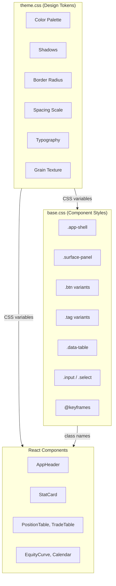

# Styling

The frontend uses a **terminal-luxury** design system inspired by Bloomberg Terminal and luxury watch interfaces. The styling is built on CSS custom properties (design tokens) for consistency and maintainability.

## CSS Architecture

The styling is organized into three files:

| File | Purpose |
|---|---|
| `src/styles/theme.css` | Design tokens (CSS variables) and font imports |
| `src/styles/base.css` | Base styles, component classes, layout utilities, animations |
| `src/styles/primevue-overrides.css` | Overrides for PrimeVue components (if used) |

Both `theme.css` and `base.css` are imported in `main.tsx`:

```tsx
// ibkr_dash_frontend/src/main.tsx
import './styles/theme.css'
import './styles/base.css'
```

## Design Token Architecture



## Design Tokens (CSS Variables)

All visual properties are defined as CSS custom properties in `theme.css`. This makes it easy to maintain consistency and adjust the theme.

### Color Palette Reference

| Variable | Value | Usage |
|---|---|---|
| `--color-bg` | `#080b12` | Page background |
| `--color-bg-elevated` | `rgba(12, 16, 28, 0.96)` | Elevated surfaces |
| `--color-bg-panel` | `rgba(14, 18, 32, 0.92)` | Panel backgrounds |
| `--color-bg-panel-strong` | `rgba(18, 24, 42, 0.96)` | Stronger panel backgrounds |
| `--color-bg-muted` | `rgba(20, 26, 44, 0.72)` | Muted backgrounds |
| `--color-bg-glass` | `rgba(18, 24, 42, 0.56)` | Glass effect backgrounds |
| `--color-border` | `rgba(255, 191, 80, 0.08)` | Default borders |
| `--color-border-strong` | `rgba(255, 191, 80, 0.18)` | Emphasized borders |
| `--color-border-subtle` | `rgba(255, 255, 255, 0.04)` | Subtle borders |
| `--color-text-primary` | `#e8e4dc` | Primary text |
| `--color-text-secondary` | `#8a8d9e` | Secondary text |
| `--color-text-muted` | `#5a5d6e` | Muted text |
| `--color-text-bright` | `#fff8ef` | Bright/highlighted text |
| `--color-accent` | `#d4a843` | Primary accent (amber/gold) |
| `--color-accent-soft` | `rgba(212, 168, 67, 0.12)` | Soft accent backgrounds |
| `--color-accent-strong` | `#f0c55e` | Strong accent |
| `--color-accent-glow` | `rgba(212, 168, 67, 0.06)` | Accent glow effects |
| `--color-positive` | `#3dd68c` | Gains, success |
| `--color-positive-soft` | `rgba(61, 214, 140, 0.10)` | Positive backgrounds |
| `--color-negative` | `#f25c5c` | Losses, errors |
| `--color-negative-soft` | `rgba(242, 92, 92, 0.10)` | Negative backgrounds |
| `--color-warning` | `#f0a030` | Warnings |

### Color Palette CSS

```css
/* ibkr_dash_frontend/src/styles/theme.css */
:root {
  /* Surface palette */
  --color-bg:              #080b12;     /* Page background */
  --color-bg-elevated:     rgba(12, 16, 28, 0.96);
  --color-bg-panel:        rgba(14, 18, 32, 0.92);
  --color-bg-panel-strong: rgba(18, 24, 42, 0.96);
  --color-bg-muted:        rgba(20, 26, 44, 0.72);
  --color-bg-glass:        rgba(18, 24, 42, 0.56);

  /* Borders */
  --color-border:        rgba(255, 191, 80, 0.08);
  --color-border-strong: rgba(255, 191, 80, 0.18);
  --color-border-subtle: rgba(255, 255, 255, 0.04);

  /* Text */
  --color-text-primary:   #e8e4dc;
  --color-text-secondary: #8a8d9e;
  --color-text-muted:     #5a5d6e;
  --color-text-bright:    #fff8ef;

  /* Accent — amber/gold */
  --color-accent:       #d4a843;
  --color-accent-soft:  rgba(212, 168, 67, 0.12);
  --color-accent-strong:#f0c55e;
  --color-accent-glow:  rgba(212, 168, 67, 0.06);

  /* Semantic */
  --color-positive:      #3dd68c;     /* Gains, success */
  --color-positive-soft: rgba(61, 214, 140, 0.10);
  --color-negative:      #f25c5c;     /* Losses, errors */
  --color-negative-soft: rgba(242, 92, 92, 0.10);
  --color-warning:       #f0a030;     /* Warnings */
}
```

### Shadows

```css
:root {
  --shadow-panel:    0 1px 0 rgba(255,191,80,0.04), 0 8px 32px rgba(0,0,0,0.35);
  --shadow-card:     0 1px 0 rgba(255,191,80,0.03), 0 4px 20px rgba(0,0,0,0.25);
  --shadow-elevated: 0 12px 48px rgba(0,0,0,0.5), 0 1px 0 rgba(255,191,80,0.06);
  --shadow-glow:     0 0 30px rgba(212,168,67,0.06);
}
```

### Border Radius

```css
:root {
  --radius-sm: 6px;
  --radius-md: 10px;
  --radius-lg: 14px;
  --radius-xl: 20px;
}
```

### Spacing Scale

| Variable | Value | Pixels |
|---|---|---|
| `--space-1` | `0.25rem` | 4px |
| `--space-2` | `0.5rem` | 8px |
| `--space-3` | `0.75rem` | 12px |
| `--space-4` | `1rem` | 16px |
| `--space-5` | `1.5rem` | 24px |
| `--space-6` | `2rem` | 32px |
| `--space-7` | `3rem` | 48px |

### Typography

```css
:root {
  --font-mono: 'JetBrains Mono', 'SF Mono', 'Cascadia Code', monospace;
  --font-body: 'DM Sans', -apple-system, sans-serif;
}
```

- **JetBrains Mono**: Used for numbers, code, labels, and terminal-style text
- **DM Sans**: Used for body text and headings

## Base Styles

### App Shell

The `.app-shell` class centers content and constrains width:

```css
/* ibkr_dash_frontend/src/styles/base.css */
.app-shell {
  width: min(1520px, calc(100% - 48px));
  margin: 0 auto;
  padding: 20px 0 60px;
}
```

### Surface Panel (Glass Card)

The primary container component uses a glassmorphism effect:

```css
.surface-panel {
  border-radius: var(--radius-xl);
  background: linear-gradient(168deg, rgba(22, 28, 50, 0.88), rgba(12, 16, 30, 0.94));
  border: 1px solid var(--color-border);
  box-shadow: var(--shadow-panel);
  backdrop-filter: blur(12px);
}
```

An ambient glow appears on the top edge via `::before` pseudo-element.

### Buttons

Three button variants:

| Class | Description |
|---|---|
| `.btn` | Default button with subtle border |
| `.btn--accent` | Amber/gold accent button |
| `.btn--ghost` | Transparent background, no border |
| `.btn--sm` | Smaller size variant |

```tsx
<button className="btn">Default</button>
<button className="btn btn--accent">Accent</button>
<button className="btn btn--ghost btn--sm">Small Ghost</button>
```

### Tags

Small status badges:

```tsx
<span className="tag">DEFAULT</span>
<span className="tag tag--positive">POSITIVE</span>
<span className="tag tag--negative">NEGATIVE</span>
<span className="tag tag--accent">ACCENT</span>
<span className="tag tag--warning">WARNING</span>
```

### Data Table

Styled tables for data display:

```css
.data-table {
  width: 100%;
  min-width: 1100px;
  border-collapse: collapse;
}

.data-table thead th {
  font-family: var(--font-mono);
  font-size: 0.68rem;
  letter-spacing: 0.12em;
  text-transform: uppercase;
  color: var(--color-text-muted);
}
```

### Form Inputs

```tsx
<input className="input" placeholder="Enter symbol..." />
<select className="select">...</select>
<label className="field-stack">
  <span className="field-stack__label">USERNAME</span>
  <input className="input" />
</label>
```

## Theme Switching Example

While the current app uses a fixed dark theme, the CSS variable architecture makes it straightforward to add theme switching. Here is an example of how you could implement a light theme toggle:

```typescript
// Example: Theme switching utility
const themes = {
  dark: {
    '--color-bg': '#080b12',
    '--color-text-primary': '#e8e4dc',
    '--color-accent': '#d4a843',
  },
  light: {
    '--color-bg': '#f5f3ee',
    '--color-text-primary': '#1a1a2e',
    '--color-accent': '#b8860b',
  },
}

function applyTheme(themeName: 'dark' | 'light') {
  const root = document.documentElement
  const vars = themes[themeName]
  for (const [key, value] of Object.entries(vars)) {
    root.style.setProperty(key, value)
  }
  localStorage.setItem('theme', themeName)
}
```

## Component Styling Patterns

### Pattern 1: CSS Variables in Inline Styles

Components frequently use CSS variables in inline styles for dynamic layouts:

```tsx
<div style={{
  color: 'var(--color-text-muted)',
  fontFamily: 'var(--font-mono)',
  fontSize: '0.82rem',
  padding: 'var(--space-4)',
  borderRadius: 'var(--radius-md)',
  border: '1px solid var(--color-border)',
}}>
```

### Pattern 2: Tone-Based Color Mapping

Components map semantic tones to CSS variables:

```tsx
const toneColorMap = {
  positive: 'var(--color-positive)',
  negative: 'var(--color-negative)',
  accent: 'var(--color-accent-strong)',
  neutral: 'var(--color-text-bright)',
}

<span style={{ color: toneColorMap[tone] }}>{value}</span>
```

### Pattern 3: Responsive Grid Layouts

```css
.stats-grid {
  display: grid;
  grid-template-columns: repeat(auto-fit, minmax(200px, 1fr));
  gap: var(--space-4);
}

.filters-grid {
  display: grid;
  grid-template-columns: repeat(6, minmax(0, 1fr));
  gap: var(--space-3);
}

@media (max-width: 768px) {
  .filters-grid { grid-template-columns: repeat(2, minmax(0, 1fr)); }
}
```

### Pattern 4: Hover Effects

Interactive elements use CSS transitions:

```tsx
<div
  onMouseEnter={e => {
    e.currentTarget.style.borderColor = 'var(--color-border)'
    e.currentTarget.style.boxShadow = '0 0 24px rgba(212,168,67,0.04)'
  }}
  onMouseLeave={e => {
    e.currentTarget.style.borderColor = 'var(--color-border-subtle)'
    e.currentTarget.style.boxShadow = 'none'
  }}
>
```

### Pattern 5: Animations

Predefined animation keyframes:

| Animation | Description |
|---|---|
| `fadeIn` | Fade in from transparent |
| `slideUp` | Slide up from 16px below |
| `slideInLeft` | Slide in from left |
| `shimmer` | Loading shimmer effect |
| `runner-pulse` | Pulsing opacity |
| `glowPulse` | Pulsing box-shadow glow |

Staggered reveal for lists:

```css
.stagger-reveal > * { animation: slideInLeft 0.4s ease both; }
.stagger-reveal > *:nth-child(1) { animation-delay: 0s; }
.stagger-reveal > *:nth-child(2) { animation-delay: 0.06s; }
.stagger-reveal > *:nth-child(3) { animation-delay: 0.12s; }
```

## Grain Overlay

A subtle noise texture is applied to the entire page via `body::before`:

```css
body::before {
  content: '';
  position: fixed;
  inset: 0;
  z-index: 9999;
  pointer-events: none;
  background: var(--grain);
  opacity: 0.4;
}
```

This creates the terminal-luxury aesthetic with a subtle film grain effect.

## Grid Pattern

A faint grid pattern is applied via `body::after`:

```css
body::after {
  background:
    linear-gradient(rgba(212,168,67,0.012) 1px, transparent 1px),
    linear-gradient(90deg, rgba(212,168,67,0.012) 1px, transparent 1px);
  background-size: 60px 60px;
}
```

## Copilot Markdown Styles

The Copilot view renders Markdown with custom styles via the `.copilot-markdown` class. This ensures Markdown content matches the terminal-luxury theme:

- Headings: bright text, monospace
- Code blocks: dark background with amber accents
- Tables: monospace headers, subtle borders
- Blockquotes: amber left border
- Links: amber color with underline

## Responsive Breakpoints

| Breakpoint | Adjustments |
|---|---|
| `<= 1200px` | Filters grid: 4 columns |
| `<= 900px` | Summary layout: single column |
| `<= 768px` | Narrower padding, 2-column filters, smaller text |
