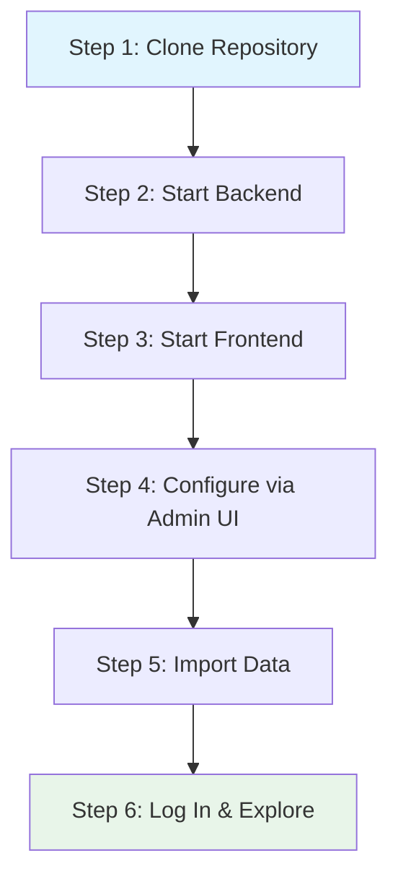

# Getting Started

This guide walks you through setting up IBKR Dash from scratch. By the end, you will have a running dashboard with sample data and two services (backend with worker scheduler, frontend) operational.

---

## Prerequisites

Before you begin, make sure you have the following installed on your machine:

| Tool | Minimum Version | How to Check | Install Link |
|------|----------------|--------------|--------------|
| **Python** | 3.11+ | `python --version` | [python.org](https://www.python.org/downloads/) |
| **Node.js** | 18+ | `node --version` | [nodejs.org](https://nodejs.org/) |
| **npm** | 9+ | `npm --version` | Comes with Node.js |
| **Git** | 2.30+ | `git --version` | [git-scm.com](https://git-scm.com/) |

:::tip
We recommend using a Python version manager like `pyenv` or `conda` to manage Python installations. For Node.js, `nvm` is a popular choice.
:::

:::warning
Python 3.11 or higher is required. The codebase uses modern Python features like `type | None` union syntax and `dataclasses` with `frozen=True` that are not available in older versions.
:::

---

## Setup Flow Overview



---

## Step 1: Clone the Repository

```bash
git clone https://github.com/your-username/ibkr-dash.git
cd ibkr-dash
```

Directory structure:

```
ibkr-dash/
├── backend/       # FastAPI server + AI agents
├── frontend/      # React dashboard
├── worker/        # Data ETL worker
├── data/                    # SQLite database + Flex exports + config.json
├── docker/                  # Docker configurations
├── scripts/                 # Utility scripts
└── docker-compose.yml       # Docker Compose config
```

---

## Step 2: Start the Backend

```bash
cd backend

# Create and activate a Python virtual environment
python -m venv .venv
source .venv/bin/activate   # macOS/Linux
# .venv\Scripts\activate    # Windows

# Install dependencies
pip install -r requirements.txt

# Start the server
uvicorn app.main:app --reload --port 8000
```

Verify:

```bash
curl http://localhost:8000/api/health
# {"status": "ok", "version": "0.1.0"}
```

---

## Step 3: Start the Frontend

Open a **second terminal**:

```bash
cd frontend
npm install
npm run dev
```

Open **http://localhost:5173** in your browser.

---

## Step 4: Configure via Admin UI

IBKR Dash uses a JSON config file (`data/config.json`) managed through the **Admin Settings** UI. No `.env` files needed.

1. Navigate to **http://localhost:5173/admin/settings**
2. Fill in at minimum:
   - **LLM API Key** — required for AI features (copilot, reviews, trade decisions)
   - **LLM Base URL** — defaults to OpenAI; change for DeepSeek, MiMo, etc.
   - **Auth Password** — leave empty to disable login

Changes take effect immediately — no restart required.

:::info
If you do not have an LLM API key, the data dashboard still works. AI agents will be disabled but all other functionality (positions, trades, charts, cash flows) is fully operational.
:::

### Optional: IBKR Flex Web Service

For automatic data pulls from IBKR (instead of manual CSV imports), configure in Admin Settings → IBKR Flex:

- **Flex Token** — get from IBKR Account Management > Settings > Flex Web Service
- **Flex Query IDs** — comma-separated query IDs

---

## Step 5: Import Data

### Option A: Sample Data (Recommended for First Run)

```bash
cd worker
python -m venv .venv && source .venv/bin/activate
pip install -r requirements.txt
python -m worker.main import worker/fixtures/daily_sample.csv
```

### Option B: Import a Flex CSV File

1. Export a CSV from [IBKR Flex Queries](https://www.interactivebrokers.com/AccountManagement/AmAccountManagement)
2. Place it in `data/flex_exports/`
3. Run:

```bash
cd worker
python -m worker.main import ../data/flex_exports/your_file.csv
```

### Option C: Automatic Pull (Requires Flex Token)

If you configured the Flex token in Step 4:

```bash
cd worker
python -m worker.main run-scheduler   # Scheduled pulls
python -m worker.main scan            # Immediate pull
```

---

## Step 6: Log In

If you set `auth.password` in Admin Settings, log in at **http://localhost:5173**. If left empty, the dashboard is accessible without login.

:::warning
For security, always set a password if you expose the dashboard beyond localhost.
:::

---

## What's Next?

- **Dashboard** (`/`) — Portfolio overview with key metrics
- **Positions** (`/positions`) — Detailed holdings table
- **Trades** (`/trades`) — Trade history with P&L
- **Cash Flows** (`/cash-flows`) — Deposits, withdrawals, dividends
- **Copilot** (`/copilot`) — Chat with your AI portfolio assistant
- **Daily Review** (`/daily-position-review`) — AI-generated position reviews

---

## Docker Deployment (Alternative)

```bash
docker compose up -d --build
# Access at http://localhost:8080
```

After starting, configure via the Admin Settings UI at `http://localhost:8080/admin/settings`.

```bash
docker compose logs -f backend
docker compose logs -f worker
docker compose down
```

---

## Running Tests

### Backend

```bash
cd backend
.venv/bin/python -m pytest tests/ -v
```

### Frontend

```bash
cd frontend
npx vitest run
```

---

## Configuration Reference

All configuration lives in `data/config.json`. See [Configuration](./backend/config.md) for the full reference of all settings.

Key sections:

| Section | Description |
|---------|-------------|
| `ibkr` | Flex token, query IDs, polling settings |
| `llm` | API key, base URL, model, temperature |
| `scheduler` | Daily job time and timezone |
| `auth` | Username, password, cookie settings |
| `email` | SMTP configuration |
| `longbridge` | Market data API keys |
| `advanced` | App env, debug, SQLite path, CORS, cache |

---

## Troubleshooting

### "ModuleNotFoundError: No module named 'app'"

Run from inside `backend/`:

```bash
cd backend
uvicorn app.main:app --reload --port 8000
```

### "Address already in use: port 8000"

```bash
lsof -i :8000
# Or use a different port
uvicorn app.main:app --reload --port 8001
```

### Frontend shows "Network Error"

1. Ensure backend is running on port 8000
2. Check `advanced.cors_origins` in Admin Settings includes `http://localhost:5173`

### "LLM provider authentication failed"

Your LLM API key is invalid. Check it in Admin Settings → LLM. If using a non-OpenAI provider, also verify the Base URL.

### "No data showing" after import

```bash
ls -la data/ibkr_dash.db
sqlite3 data/ibkr_dash.db "SELECT COUNT(*) FROM position_snapshots;"
```

### SQLite "database is locked"

Two processes are writing simultaneously. Stop the worker, wait a few seconds, retry.

---

## Quick Reference

```bash
# --- Backend ---
cd backend
python -m venv .venv && source .venv/bin/activate
pip install -r requirements.txt
uvicorn app.main:app --reload --port 8000

# --- Frontend ---
cd frontend
npm install && npm run dev

# --- Worker (import sample data) ---
cd worker
python -m venv .venv && source .venv/bin/activate
pip install -r requirements.txt
python -m worker.main import worker/fixtures/daily_sample.csv

# --- Configure ---
# Open http://localhost:5173/admin/settings
```
