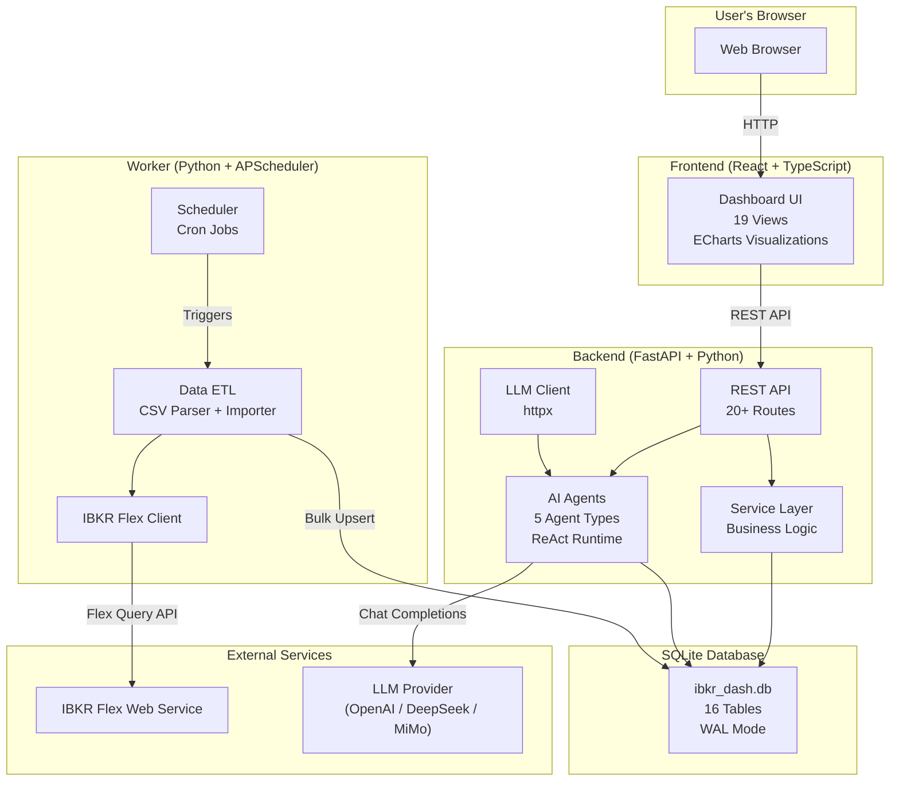
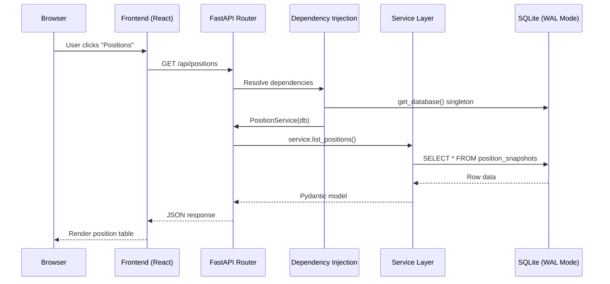

# IBKR Dash

Welcome to **IBKR Dash** -- a personal investment portfolio dashboard with AI-powered analysis agents, built on top of Interactive Brokers (IBKR) data.

IBKR Dash connects to your IBKR brokerage account, imports your portfolio data, and presents it in a clean, interactive dashboard. On top of the data layer, it provides AI agents that can analyze your positions, review trades, assess risk, and even chat with you about your portfolio in natural language.

---

## Why IBKR Dash?

If you use Interactive Brokers for investing, you know that the built-in reporting tools can be overwhelming. The web interface has dozens of screens, the data is scattered across multiple reports, and there is no easy way to get a quick overview of your portfolio health.

IBKR Dash solves these problems:

- **Single-page dashboard** -- See your key metrics (total equity, P&L, cash balance) at a glance without navigating through multiple IBKR screens
- **AI-powered analysis** -- Get automated reviews of your positions, trade decisions, and portfolio risk using large language models
- **Historical tracking** -- Every day's snapshot is stored, so you can see how your portfolio evolves over time
- **Natural language interface** -- Ask questions like "What's my AAPL position worth?" or "How much did I earn in dividends this month?" using the AI copilot
- **Full data ownership** -- Everything runs locally on your machine. Your financial data never leaves your network (except for LLM API calls if you enable AI features)
- **Customizable** -- Open source, well-documented codebase that you can modify to fit your needs

---

## Feature Comparison: IBKR Dash vs. Alternatives

| Feature | IBKR Dash | IBKR Web Portal | Bloomberg Terminal | Yahoo Finance |
|---------|-----------|----------------|-------------------|---------------|
| **Cost** | Free (open source) | Free (built-in) | $24,000/yr | Free tier available |
| **AI Analysis** | 5 specialized agents | None | Limited | None |
| **Natural Language Chat** | Yes (Copilot) | No | No | No |
| **Historical Tracking** | Daily snapshots stored locally | Limited (90 days) | Yes | Limited |
| **Data Ownership** | Full (local SQLite) | IBKR servers | Bloomberg servers | Yahoo servers |
| **Customization** | Full source code | None | Limited | None |
| **Deployment** | Local / Docker | N/A | Desktop app | Web |
| **Offline Access** | Yes | No | Partial | No |
| **Portfolio Privacy** | Complete | IBKR has access | Bloomberg has access | Yahoo has access |

---

## Feature Overview

### Data Dashboard

The dashboard provides a comprehensive view of your investment portfolio:

| Feature | Description |
|---------|-------------|
| **Portfolio Overview** | Total equity, cash balance, stock value, options value, and P&L at a glance |
| **Position Table** | Detailed view of all holdings with quantity, cost basis, market value, unrealized P&L, and % of NAV |
| **Treemap Visualization** | Interactive treemap showing position sizes with daily change color coding |
| **Trade History** | Complete log of buy/sell transactions with dates, prices, commissions, and realized P&L |
| **Cash Flow Tracking** | Deposits, withdrawals, dividends, interest, and other cash movements |
| **Dividend History** | Track dividend payments across all holdings with dates and amounts |
| **Equity Curve** | Interactive line chart showing portfolio value over time with range selection |
| **Performance Calendar** | Daily P&L heatmap calendar to quickly spot winning and losing days |
| **Market Events** | Upcoming market events (FOMC, economic data releases) with importance levels |
| **Asset Distribution** | Pie charts showing allocation by asset class and industry sector |
| **AI Portfolio Analysis** | AI-generated portfolio analysis with sector allocation and risk assessment |

### AI Agents

IBKR Dash includes five AI agents, each specialized for a different analysis task:

| Agent | What It Does | When to Use |
|-------|-------------|-------------|
| **Account Copilot** | Conversational AI assistant that queries your portfolio data and answers questions in natural language | Any time you have a question about your portfolio |
| **Daily Position Review** | Automated review of all open positions with buy/hold/sell signals and reasoning | Once per day, after market close |
| **Trade Decision Analysis** | Pre-trade analysis for potential entries with risk/reward evaluation and entry/exit targets | Before opening a new position |
| **Trade Review** | Post-trade evaluation of executed trades with lessons learned and grade | After closing a position |
| **Risk Assessment** | Portfolio-level risk analysis including concentration risk, sector exposure, liquidity risk, and stress testing | Weekly or monthly review |

All agents use a **structured output pipeline** that ensures reliable JSON output. If the LLM produces malformed JSON, the system automatically attempts repair before returning a result.

:::tip
The structured output pipeline (defined in `app/agents/structured_output/runtime.py`) uses a four-stage process: parse, validate, repair, fallback. This ensures that even if the LLM produces slightly malformed JSON, the system can still extract a valid result.
:::

### Admin Panel

The admin panel gives you control over the system configuration:

- **Unified Settings** (`/admin/settings`) -- All configuration in one place (IBKR, LLM, Auth, Scheduler, Email, etc.)
- **System Status** (`/admin/system`) -- View database size, uptime, and system health
- **Agent Monitoring** (`/admin/agent-monitoring`) -- View agent task history, execution traces, and performance metrics
- **Scheduler** (`/admin/scheduler`) -- Manually trigger IBKR data imports and view import history
- **Prompt Management** (`/admin/prompts`) -- View and edit version-controlled prompts for each agent

---

## System Architecture

IBKR Dash consists of three independent modules that communicate through a shared SQLite database. This separation means each module can be developed, tested, and deployed independently.



### Request Lifecycle

Here is how a typical API request flows through the system, from the moment a user clicks a link to the data appearing on screen:



### Module Responsibilities

| Module | Technology | Purpose | Port |
|--------|-----------|---------|------|
| **Frontend** | React 18, TypeScript, Vite, ECharts | Interactive dashboard UI | 5173 (dev) / 8080 (Docker) |
| **Backend** | FastAPI, SQLite, Pydantic, httpx | REST API + AI agent orchestration | 8000 |
| **Worker** | Python, APScheduler, requests | IBKR Flex CSV data import (ETL) | N/A (CLI) |

### Key Design Principles

1. **SQLite as single source of truth** -- Both the backend and worker read/write to the same SQLite file. No message queues, no separate databases.
2. **Decoupled modules** -- The backend and worker share no Python code at runtime. They communicate only through the database.
3. **OpenAI-compatible AI** -- The LLM client works with any OpenAI-compatible provider. Switch models by changing environment variables.
4. **Structured output** -- All AI agent outputs are validated against Pydantic schemas with automatic repair and fallback.
5. **Local-first** -- Designed to run on your machine. No cloud services required (except the LLM API if you enable AI features).

:::warning
SQLite with WAL mode handles concurrent reads and a single writer well, but it is not designed for high-concurrency write workloads. For a personal investment dashboard, this is more than sufficient. If you need multi-user concurrent writes, consider migrating to PostgreSQL.
:::

---

## What You'll Learn

This documentation is organized to take you from zero to a running dashboard. Here is the recommended reading order:

### Getting Started

**[Getting Started](./getting-started.md)** -- The fastest path to a running dashboard. Covers:

- Installing prerequisites (Python 3.11+, Node.js 18+)
- Cloning and configuring the project
- Starting all three services (backend, frontend, worker)
- Importing sample data
- Logging in and exploring the dashboard
- Troubleshooting common issues

### Architecture

**[Architecture Overview](./architecture/overview.md)** -- Understand the big picture:

- How the three modules (backend, frontend, worker) fit together
- The full database schema with 16 tables and their relationships
- Directory structure of each module
- Design decisions (why SQLite, why no LangGraph, why React)
- Security model and authentication

**[Data Flow](./architecture/data-flow.md)** -- Follow data through every layer:

- IBKR Flex API to Worker to SQLite (financial data pipeline)
- User to Frontend to Backend to LLM and back (AI agent flow)
- Detailed sequence diagrams for every major flow
- Copilot memory system and tool dispatch
- Agent task lifecycle (pending -> running -> completed)
- Error handling at each layer

**[Technology Stack](./architecture/tech-stack.md)** -- Deep dive into every technology:

- Backend: FastAPI, SQLite, Pydantic, httpx
- Frontend: React, TypeScript, Vite, ECharts
- Worker: APScheduler, requests
- AI: OpenAI-compatible API, structured output pipeline, ReAct runtime
- DevOps: Docker, pytest, Vitest
- Version requirements and dependency matrix

---

## Quick Links

| Resource | URL | Description |
|----------|-----|-------------|
| Frontend Dashboard | `http://localhost:5173` | Main dashboard UI |
| Backend API Docs (Swagger) | `http://localhost:8000/docs` | Interactive API documentation |
| Backend API Docs (ReDoc) | `http://localhost:8000/redoc` | Alternative API documentation |
| Health Check | `http://localhost:8000/api/health` | Backend health endpoint |
| Docker Dashboard | `http://localhost:8080` | Dashboard when using Docker |

---

## Who Is This For?

IBKR Dash is designed for several audiences:

### Individual Investors

If you use Interactive Brokers and want better portfolio visibility, IBKR Dash gives you a clean dashboard with AI-powered insights. You do not need to be a developer -- the [Getting Started](./getting-started.md) guide has step-by-step instructions.

### Developers

If you want to understand, customize, or extend the dashboard, the [Architecture](./architecture/overview.md) docs explain the codebase structure, design decisions, and key patterns. The codebase is well-organized with clear separation of concerns.

### Data Enthusiasts

If you want to combine financial data with AI analysis, IBKR Dash provides a ready-made pipeline from IBKR data to LLM-powered insights. The structured output pipeline and agent system are designed to be extended with new analysis types.

---

## Project Structure

Here is a high-level overview of the project directory:

```
ibkr-dash/
├── backend/          # FastAPI server + AI agents
│   ├── app/
│   │   ├── agents/             # AI agent system (5 agent types)
│   │   ├── api/routes/         # REST API endpoints (20+ routes)
│   │   ├── services/           # Business logic layer
│   │   ├── schemas/            # Pydantic request/response models
│   │   ├── core/               # Config, database, auth, cache, rate limiting
│   │   └── utils/              # Date, pagination, JSON helpers
│   └── tests/                  # Backend test suite
│
├── frontend/         # React + TypeScript dashboard
│   ├── src/
│   │   ├── views/              # Page components
│   │   ├── components/         # Reusable UI components (Modal, StatCard, etc.)
│   │   ├── api/                # API client functions
│   │   ├── types/              # TypeScript type definitions
│   │   ├── hooks/              # Custom React hooks
│   │   ├── router/             # Route configuration
│   │   ├── i18n/               # Internationalization (zh-CN, en)
│   │   ├── styles/             # CSS (theme.css, base.css)
│   │   └── utils/              # Formatting helpers
│   └── package.json
│
├── worker/           # Data ETL worker
│   ├── worker/
│   │   ├── parsers/            # IBKR Flex CSV/XML parsers
│   │   ├── importers/          # Import pipeline
│   │   ├── writers/            # SQLite writer
│   │   ├── clients/            # IBKR Flex API client
│   │   ├── jobs/               # Scheduled import jobs
│   │   └── core/               # Config, scheduler, logger
│   └── tests/                  # Worker test suite
│
├── data/                       # Runtime data directory
│   ├── ibkr_dash.db            # SQLite database (created at runtime)
│   ├── config.json             # Settings (admin UI managed)
│   └── flex_exports/           # IBKR Flex CSV files
│
├── docs/                       # This documentation (Docusaurus)
├── docker/                     # Docker build configs
├── scripts/                    # Utility scripts
├── docker-compose.yml          # Docker Compose config
└── README.md                   # Project README
```

---

## Technology Summary

| Layer | Technology | Why |
|-------|-----------|-----|
| Frontend UI | React 18 + TypeScript | Component model, ecosystem, TypeScript support |
| Frontend Build | Vite 5 | Fast dev server, instant HMR, native ESM |
| Frontend Charts | ECharts 5.5 | Rich interactivity, many chart types |
| Backend Framework | FastAPI | Async support, auto docs, Pydantic integration |
| Backend Database | SQLite (stdlib) | Zero config, single file, WAL mode for concurrency |
| Backend Validation | Pydantic v2 | Type-safe data validation, JSON Schema generation |
| Backend HTTP | httpx | Provider-agnostic LLM client |
| Worker Scheduler | APScheduler | Cron-like scheduling with timezone support |
| Worker HTTP | requests | Simple HTTP client for IBKR Flex API |
| AI Protocol | OpenAI-compatible | Works with any provider (OpenAI, DeepSeek, MiMo) |
| Testing | pytest + Vitest | Fast, modern test frameworks |
| Deployment | Docker Compose | Single-command deployment |

---

## Getting Help

If you run into issues:

1. Check the **[Troubleshooting](./getting-started.md#troubleshooting)** section in the Getting Started guide
2. Explore the **Swagger UI** at `http://localhost:8000/docs` to test API endpoints
3. Check the **browser console** (F12) for frontend errors
4. Check the **terminal output** for backend/worker errors

:::tip
If you just want to get the dashboard running, head straight to the **[Getting Started](./getting-started.md)** guide. You can come back to the architecture docs later when you want to understand how things work under the hood.
:::

:::info
IBKR Dash is **not** a trading platform. It does not execute trades or place orders. It reads your IBKR data for analysis and visualization purposes only. Your brokerage account credentials are never stored or transmitted by this application.
:::

---

## Project Status

IBKR Dash is an active personal project under continuous development.

| Component | Status | Notes |
|-----------|--------|-------|
| Data Import (Worker) | Stable | CSV/XML parsing, Flex API client, scheduler |
| REST API (Backend) | Stable | 20+ endpoints, auth, admin panel, rate limiting |
| Dashboard (Frontend) | Stable | Charts, i18n, responsive design, keyboard navigation |
| AI Agents | Active development | 5 agent types, structured output pipeline |
| Documentation | In progress | You're reading it! |
