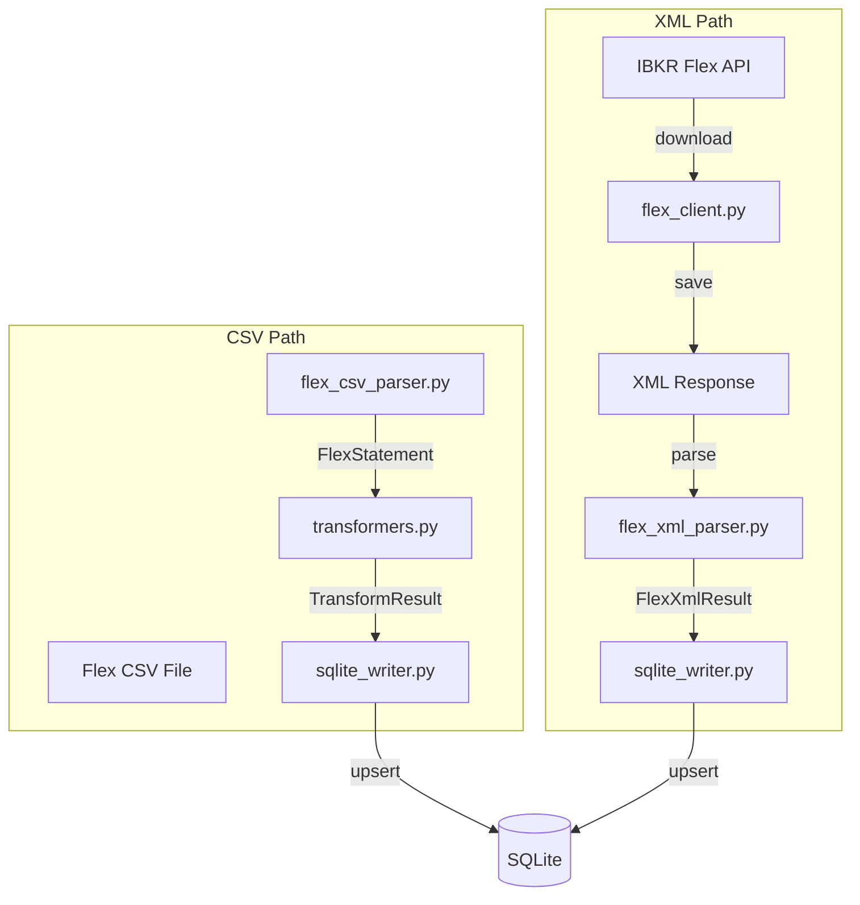
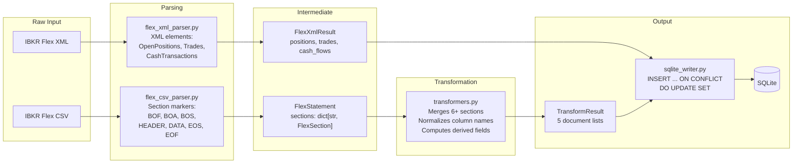

# Data Pipeline

The worker's data pipeline transforms raw IBKR data into normalized SQLite records. There are two input paths: **Flex CSV files** (manual export) and **Flex XML responses** (auto-pull from IBKR).

## Pipeline Flow



## End-to-End Data Transformation



## CSV Parsing (`flex_csv_parser.py`)

IBKR Flex exports use a multi-section CSV format with record type markers:

| Marker | Meaning |
|--------|---------|
| `BOF` | Beginning of file (metadata) |
| `BOA` | Beginning of account (key-value metadata pairs) |
| `BOS` | Beginning of section |
| `HEADER` | Column headers for the current section |
| `DATA` | A data row in the current section |
| `EOS` | End of section |
| `EOF` | End of file |

### Example CSV Structure

```csv
BOF,U1234567,Daily Snapshot,20250101,20250601
BOA,QueryName,Daily Snapshot,FromDate,20250101,ToDate,20250601
BOS,ACCT
HEADER,ACCT,AccountId,Account
DATA,ACCT,U1234567,Individual
EOS
BOS,POST
HEADER,POST,Symbol,Description,Quantity,MarkPrice
DATA,POST,AAPL,Apple Inc,100,185.50
DATA,POST,MSFT,Microsoft Corp,50,420.00
EOS
EOF
```

### Parser Code Example

```python
# ibkr_dash_worker/worker/parsers/flex_csv_parser.py
def parse_flex_csv(file_path: Path) -> FlexStatement:
    """Parse an IBKR Flex CSV file into a FlexStatement."""
    sections: dict[str, FlexSection] = {}
    current_section: str | None = None
    current_headers: list[str] = []
    current_rows: list[dict] = []

    for row in csv.reader(file_path.open(encoding="utf-8")):
        marker = row[0]

        if marker == "BOS":
            current_section = row[1]
            current_headers = []
            current_rows = []
        elif marker == "HEADER":
            current_headers = row[2:]  # Skip marker and section name
        elif marker == "DATA":
            values = row[2:]  # Skip marker and section name
            current_rows.append(dict(zip(current_headers, values)))
        elif marker == "EOS":
            if current_section:
                sections[current_section] = FlexSection(
                    name=current_section,
                    headers=current_headers,
                    rows=current_rows,
                )

    return FlexStatement(source_file=file_path, sections=sections, ...)
```

### Parsing Output

The parser produces a `FlexStatement` dataclass:

```python
@dataclass
class FlexStatement:
    source_file: Path
    metadata: FlexStatementMetadata  # query_name, from_date, to_date, account_ids
    sections: dict[str, FlexSection]  # section_name -> FlexSection
    record_counts: dict[str, int]     # record_type -> count
```

Each `FlexSection` contains:
- `name` -- Section name (e.g., `POST`, `TRNT`, `EQUT`)
- `headers` -- Column names from the `HEADER` row
- `rows` -- List of dicts mapping header names to cell values

### Key Sections

| Section | Content |
|---------|---------|
| `ACCT` | Account metadata |
| `EQUT` | Equity summary (total equity, cash, stock value, etc.) |
| `POST` | Open positions |
| `TRNT` | Trade transactions |
| `CTRN` | Cash transactions (deposits, dividends) |
| `FIFO` | FIFO PnL per position |
| `MYTD` | Month/YTD PnL |
| `NETP` | Net shares (shares at IB, borrowed, lent) |
| `SECU` | Security details (ISIN, FIGI, issuer) |
| `PPPO` | Price history |
| `CNAV` | Change in NAV (MTM, TWR, dividends, commissions) |
| `CRTT` | Cash report (MTD/YTD dividends, interest, commissions) |
| `UNBC` | Unbundled commission details |

## XML Parsing (`flex_xml_parser.py`)

When the worker pulls data from IBKR Flex Web Service, the response is XML. The XML parser handles:

- `OpenPositions` -- Current positions
- `Trades` -- Trade transactions
- `TradeConfirms` -- Today's trade confirmations
- `CashTransactions` -- Cash movements

### XML Parsing Code Example

```python
# ibkr_dash_worker/worker/parsers/flex_xml_parser.py
def parse_flex_xml(xml_text: str) -> FlexXmlResult:
    """Parse an IBKR Flex XML response into a FlexXmlResult."""
    root = ET.fromstring(xml_text)
    account_id = root.findtext(".//AccountId", "")

    positions = []
    for pos in root.findall(".//OpenPositions/OpenPosition"):
        positions.append({
            "symbol": pos.get("symbol"),
            "quantity": float(pos.get("position", "0")),
            "mark_price": float(pos.get("markPrice", "0")),
            "conid": pos.get("conid"),
            # ... more fields
        })

    trades = []
    for trade in root.findall(".//Trades/Trade"):
        trades.append({
            "symbol": trade.get("symbol"),
            "date_time": _convert_ibkr_datetime(trade.get("dateTime")),
            "quantity": float(trade.get("quantity", "0")),
            "price": float(trade.get("tradePrice", "0")),
            # ... more fields
        })

    return FlexXmlResult(
        account_id=account_id,
        report_date=_convert_ibkr_date(root.findtext(".//Date", "")),
        positions=positions,
        trades=trades,
        cash_flows=cash_flows,
    )
```

### XML Parsing Output

```python
@dataclass
class FlexXmlResult:
    account_id: str
    report_date: str       # YYYY-MM-DD
    positions: list[dict]  # Ready for SQLite upsert
    trades: list[dict]     # Ready for SQLite insert
    cash_flows: list[dict] # Ready for SQLite insert
```

The XML parser converts IBKR date formats (`YYYYMMDD` -> `YYYY-MM-DD`) and datetime formats (`YYYYMMDD;HHMMSS` -> `YYYY-MM-DDTHH:MM:SS`).

## Data Transformation (`transformers.py`)

The transformer is the most complex module. It converts a parsed `FlexStatement` into a `TransformResult` containing five lists of document dicts ready for SQLite insertion.

### TransformResult

```python
@dataclass
class TransformResult:
    account_documents: list[dict]      # -> account_snapshots
    position_documents: list[dict]     # -> position_snapshots
    trade_documents: list[dict]        # -> trade_records
    cash_flow_documents: list[dict]    # -> cash_flows
    price_history_documents: list[dict] # -> price_history
```

### Key Transformations

**Account Snapshots:**
- Merges data from `EQUT`, `CNAV`, `CRTT`, and `FIFO` sections.
- Computes FIFO totals by summing across all positions.
- Handles both single-day and multi-day statements.

**Position Snapshots:**
- Merges `POST` (positions) with `FIFO` (PnL), `MYTD` (MTD/YTD), `NETP` (shares), `SECU` (security details), and `PPPO` (price history).
- Computes `average_cost_price` from `cost_basis_money / quantity` when not directly available.
- Computes `previous_day_change_percent` from price history.
- Uses `conid` as primary merge key (falls back to `symbol + asset_class`).

**Trade Records:**
- Reads from `TRNT` section, merges with `SECU` and `UNBC` (unbundled commissions).
- Skips summary-level rows (`LevelOfDetail = SUMMARY`).
- Maps IBKR field names to normalized column names.

**Cash Flows:**
- Reads from `CTRN` section.
- Filters to supported types: `Deposits/Withdrawals`, dividends, withholding tax.
- Determines `flow_direction` (deposit/withdrawal) from amount sign.

**Price History:**
- Reads from `PPPO` section.
- Groups by security, sorts by date.
- Derives open/high/low from close prices when OHLC is not available.

### Column Name Normalization

IBKR exports use inconsistent column names. The transformer handles this with fuzzy matching:

```python
# ibkr_dash_worker/worker/parsers/transformers.py
def _normalize_key(value: str) -> str:
    """Lowercase and strip all non-alphanumeric characters."""
    return re.sub(r"[^a-z0-9]+", "", value.lower())

def _get_value(row: dict, *aliases: str) -> str | None:
    """Look up a value by trying multiple column name aliases."""
    normalized = { _normalize_key(k): v for k, v in row.items() }
    for alias in aliases:
        key = _normalize_key(alias)
        if key in normalized and normalized[key]:
            return normalized[key]
    return None

# Usage: handles "MarkPrice", "Mark Price", "ClosePrice", etc.
price = _get_value(row, "MarkPrice", "Mark Price", "ClosePrice", "Close Price")
```

## SQLite Writing (`sqlite_writer.py`)

The writer performs **bulk upsert** operations. Each write method:

1. Opens a connection with WAL mode.
2. Iterates over documents.
3. Executes an `INSERT ... ON CONFLICT ... DO UPDATE SET` for each row.
4. Commits and closes the connection.

### Upsert Code Example

```python
# ibkr_dash_worker/worker/writers/sqlite_writer.py
def write_position_snapshots(self, documents: list[dict]) -> int:
    """Upsert position snapshots into the database."""
    conn = sqlite3.connect(self.db_path)
    conn.execute("PRAGMA journal_mode=WAL")

    for doc in documents:
        doc["raw_json"] = json.dumps(doc, default=str)
        conn.execute("""
            INSERT INTO position_snapshots
                (account_id, report_date, symbol, quantity, mark_price, ...)
            VALUES
                (:account_id, :report_date, :symbol, :quantity, :mark_price, ...)
            ON CONFLICT (account_id, report_date, symbol)
            DO UPDATE SET
                quantity = excluded.quantity,
                mark_price = excluded.mark_price,
                ...
        """, doc)

    conn.commit()
    conn.close()
    return len(documents)
```

### Upsert Semantics

| Table | Conflict Columns | Behavior |
|-------|-----------------|----------|
| `account_snapshots` | `(account_id, report_date)` | Updates all fields on conflict. |
| `position_snapshots` | `(account_id, report_date, symbol)` | Updates all fields on conflict. |
| `trade_records` | (none -- append-only) | Inserts only. Duplicates are unlikely. |
| `cash_flows` | (none -- append-only) | Inserts only. |
| `price_history` | `(account_id, report_date, symbol)` | Updates all fields on conflict. |

### raw_json Field

Every record stores the full document as a `raw_json` TEXT column. This is useful for debugging and auditing -- you can always see the original transformed data.

```python
row["raw_json"] = json.dumps(doc, default=str)
```

:::tip
The `raw_json` field is especially useful when troubleshooting data issues. Query it directly: `SELECT raw_json FROM position_snapshots WHERE symbol = 'AAPL' ORDER BY report_date DESC LIMIT 1`.
:::
