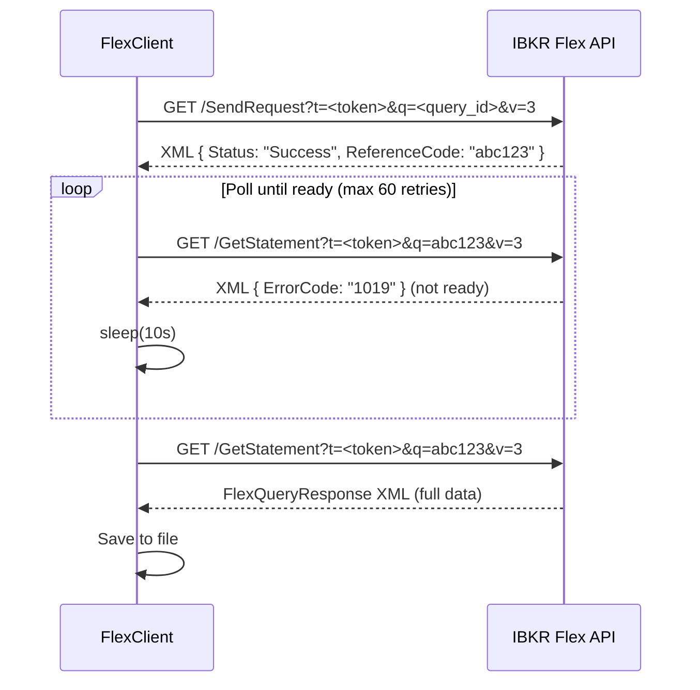
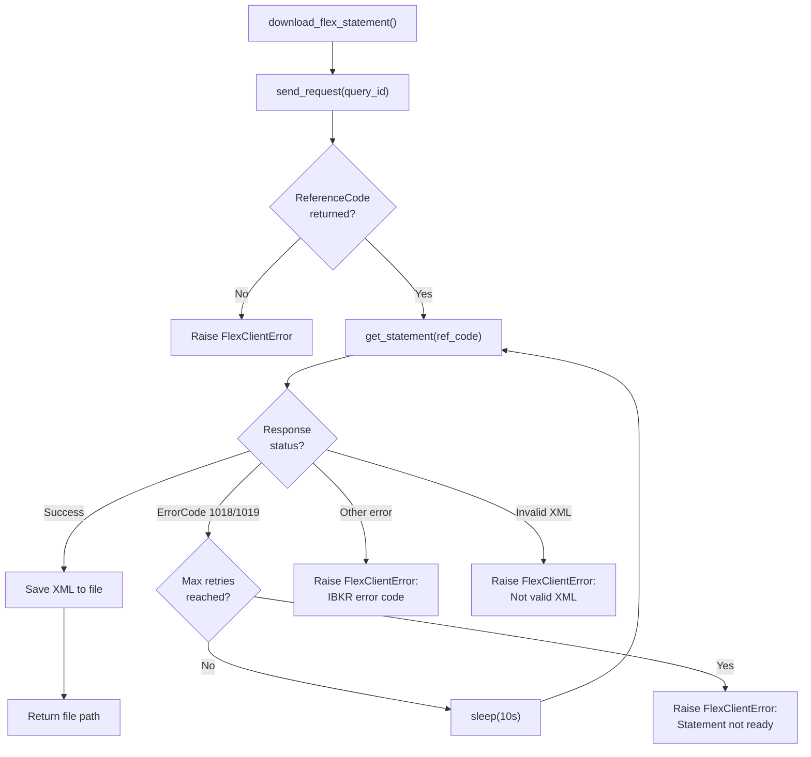

# IBKR Flex Web Service

The IBKR Flex Web Service is an HTTP API provided by Interactive Brokers for downloading Flex Query reports programmatically. The worker uses it to pull daily portfolio data without manual intervention.

## API Overview

The Flex Web Service has two endpoints:

| Endpoint | Method | Purpose |
|----------|--------|---------|
| `SendRequest` | GET | Submit a Flex Query and get a reference code. |
| `GetStatement` | GET | Poll for the statement result using the reference code. |

Base URL: `https://www.interactivebrokers.com/AccountManagement/FlexWebService`

## FlexClient Implementation

**File:** `worker/clients/flex_client.py`

The `FlexClient` class wraps the full lifecycle of a Flex query: submit, poll, and download.

```python
class FlexClient:
    def __init__(self, settings: Settings) -> None:
        self.session = requests.Session()
        self.session.headers.update({"User-Agent": "ibkr-dash-worker/0.1"})
```

### SendRequest -> Poll -> GetStatement Flow



### Step 1: Send Request

```python
# worker/worker/clients/flex_client.py
def send_request(self, query_id: str) -> str:
    """Submit a flex query and return the reference code."""
    token = self._require_token()
    response = self.session.get(
        f"{self.settings.flex_base_url}/SendRequest",
        params={"t": token, "q": query_id, "v": "3"},
        timeout=30,
    )
    root = self._parse_xml(response.text)
    reference_code = self._extract_text(root, ("ReferenceCode",))
    return reference_code
```

The response is XML:

```xml
<FlexStatementResponse>
  <Status>Success</Status>
  <ReferenceCode>abc123def456</ReferenceCode>
</FlexStatementResponse>
```

### Step 2: Get Statement (Poll)

```python
def get_statement(self, reference_code: str) -> str:
    """Poll for a statement result using the reference code."""
    token = self._require_token()
    response = self.session.get(
        f"{self.settings.flex_base_url}/GetStatement",
        params={"t": token, "q": reference_code, "v": "3"},
        timeout=60,
    )
    root = self._parse_xml(response.text)

    # Check for error codes
    error_code = self._extract_text(root, ("ErrorCode",))
    if error_code in ("1018", "1019"):
        raise FlexStatementNotReady(f"Statement not ready: error {error_code}")
    if error_code:
        raise FlexClientError(f"IBKR returned error code: {error_code}")

    return response.text
```

### Step 3: Download with Retry

```python
def download_flex_statement(self, query_id: str, save_path: str | Path) -> Path:
    """Download a flex statement with retry logic."""
    save_target = Path(save_path)
    reference_code = self.send_request(query_id)

    for attempt in range(1, self.settings.flex_max_poll_retries + 1):
        try:
            statement = self.get_statement(reference_code)
            save_target.write_text(statement, encoding="utf-8")
            return save_target
        except FlexStatementNotReady:
            if attempt == self.settings.flex_max_poll_retries:
                raise FlexClientError(
                    f"Statement not ready after {self.settings.flex_max_poll_retries} retries."
                )
            time.sleep(self.settings.flex_poll_interval_seconds)
```

## Error Handling

### Error Handling Flowchart



### Error Codes

| Code | Meaning | Handling |
|------|---------|----------|
| `1018` | Statement not ready | Retry after polling interval. |
| `1019` | Statement still being generated | Retry after polling interval. |
| Other | Various errors | Raise `FlexClientError`. |

### Exception Hierarchy

```python
class FlexClientError(RuntimeError):
    """Raised when the IBKR Flex Web Service returns an error."""

class FlexStatementNotReady(FlexClientError):
    """Raised when the statement is still being generated."""
```

`FlexStatementNotReady` is a **recoverable** error -- the retry loop catches it and waits. All other `FlexClientError` instances are **fatal** and abort the download.

### XML Parsing Errors

If the response is not valid XML, the client raises:

```python
FlexClientError("IBKR Flex response is not valid XML.")
```

### Token Validation

The client checks for a configured token before making any request:

```python
def _require_token(self) -> str:
    if not self.settings.flex_token:
        raise FlexClientError(
            "FLEX_TOKEN is missing. Please configure it in Admin Settings → IBKR Flex."
        )
    return self.settings.flex_token
```

## Token Configuration

### Getting a Flex Token

1. Log in to [IBKR Account Management](https://www.interactivebrokers.com/AccountManagement).
2. Navigate to **Settings** > **Flex Web Service**.
3. Generate a new token (or copy an existing one).
4. Set it in **Admin Settings → IBKR Flex → Flex Token**.

### Creating a Flex Query

1. In IBKR Account Management, go to **Reports** > **Flex Queries**.
2. Create a new Custom Flex Query with the sections you need:
   - Account Information
   - Open Positions
   - Trades
   - Cash Transactions
   - Change in NAV
   - FIFO P/L
   - Mark-to-Market P/L
   - Net Position by Security
   - Price History
3. Note the **Query ID** from the query list.
4. Configure it in the worker:

```bash
FLEX_QUERY_ID_DAILY=1532356
```

:::warning
The Flex Web Service has rate limits. Do not poll more frequently than every 10 seconds. The default configuration (`FLEX_POLL_INTERVAL_SECONDS=10`, `FLEX_MAX_POLL_RETRIES=60`) allows up to 10 minutes for a statement to be generated.
:::

## Configuration Summary

| Variable | Default | Description |
|----------|---------|-------------|
| `FLEX_TOKEN` | `""` | IBKR Flex Web Service authentication token. |
| `FLEX_BASE_URL` | `https://www.interactivebrokers.com/AccountManagement/FlexWebService` | API base URL. |
| `FLEX_QUERY_ID_DAILY` | `""` | Flex Query ID for daily data import. |
| `FLEX_POLL_INTERVAL_SECONDS` | `10` | Seconds between poll retries. |
| `FLEX_MAX_POLL_RETRIES` | `60` | Maximum number of poll attempts. |

### Admin Settings Example

Configure in **Admin Settings → IBKR Flex**:

| Setting | Example Value |
|---------|---------------|
| Flex Token | `your-flex-token-here` |
| Flex Query IDs | `1532356,1532359` |
| Flex Base URL | `https://www.interactivebrokers.com/AccountManagement/FlexWebService` |
| Poll Interval Seconds | `10` |
| Max Poll Retries | `60` |

:::info
The worker's default `daily_incremental_job.py` uses a hardcoded list of query IDs (`DEFAULT_QUERY_IDS = ["1532356", "1532359"]`). Update this list to match your Flex Query IDs.
:::
