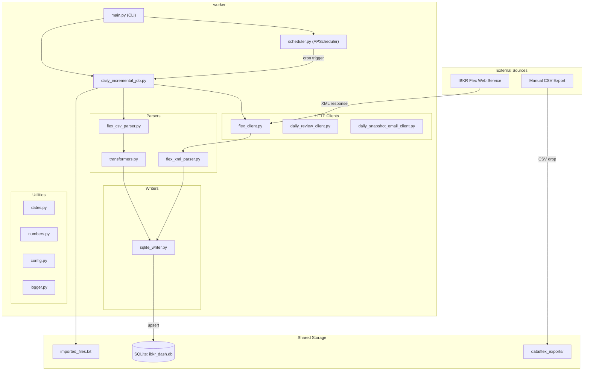
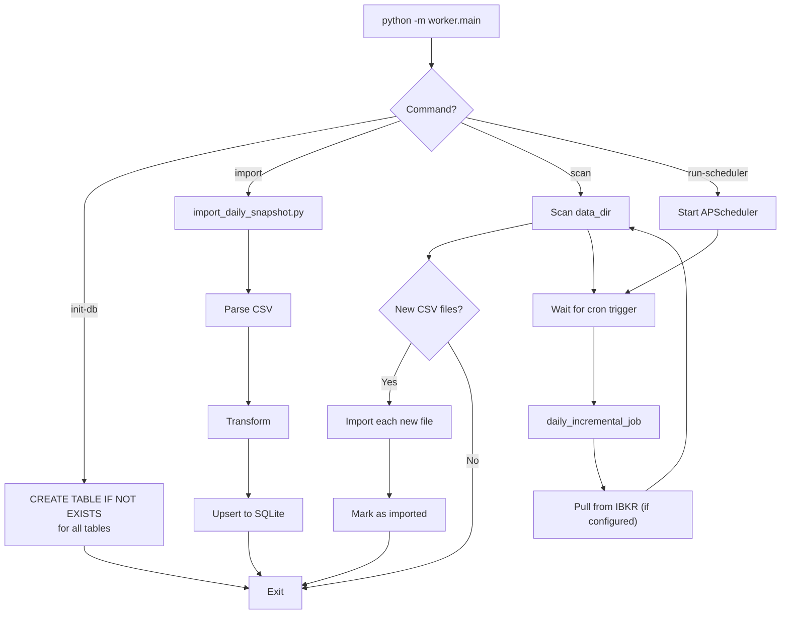
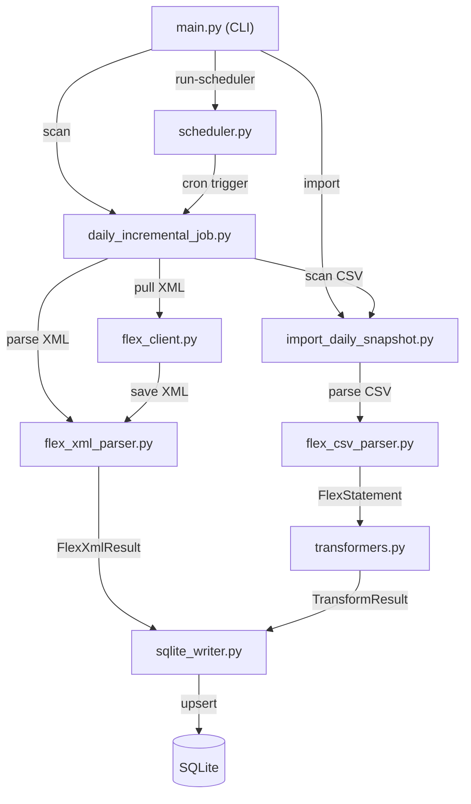
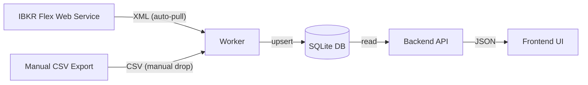

# Worker Overview

The IBKR Dash worker is a standalone Python application that imports financial data from **Interactive Brokers (IBKR)** into the shared SQLite database. It handles CSV parsing, XML parsing, data transformation, and scheduled execution.

## What It Does

1. **Pulls data from IBKR** via the Flex Web Service API (XML responses).
2. **Parses Flex CSV files** exported manually from IBKR.
3. **Transforms raw data** into normalized SQLite-ready dictionaries.
4. **Writes to SQLite** using upsert semantics (insert or update on conflict).
5. **Runs on a schedule** (APScheduler) for daily incremental imports.

## System Architecture Diagram



## Directory Layout

```
worker/
  worker/
    main.py                     # CLI entry point (import, run-scheduler, init-db, scan)
    core/
      config.py                 # Settings dataclass (env vars)
      logger.py                 # Logging setup
      scheduler.py              # APScheduler configuration
    clients/
      flex_client.py            # IBKR Flex Web Service HTTP client
      sqlite_writer.py          # SQLite writer with upsert methods
      daily_review_client.py    # Backend API client for triggering reviews
      daily_snapshot_email_client.py  # Email notification client
    parsers/
      flex_csv_parser.py        # IBKR Flex CSV multi-section parser
      flex_xml_parser.py        # IBKR Flex XML parser
      transformers.py           # Raw data -> SQLite-ready dict transformations
    importers/
      daily_snapshot_importer.py  # High-level import pipeline
    jobs/
      daily_incremental_job.py  # Main scheduled job (pull + scan + import)
      import_daily_snapshot.py  # Single-file import pipeline
    writers/
      sqlite_writer.py          # Alternative SQLite writer (used by importer)
    utils/
      dates.py                  # Date parsing/conversion helpers
      numbers.py                # Number parsing/cleaning helpers
  tests/                        # pytest test suite
```

## CLI Usage

The worker is invoked as a Python module with four commands:

### Initialize Database

```bash
python -m worker.main init-db
```

Creates all SQLite tables (`account_snapshots`, `position_snapshots`, `trade_records`, `cash_flows`, `price_history`, `admin_settings`) using `CREATE TABLE IF NOT EXISTS`. Safe to run multiple times.

### Import a Single File

```bash
python -m worker.main import /path/to/flex_export.csv
```

Imports a single Flex CSV file through the full pipeline: parse -> transform -> upsert.

### Scan for New Files

```bash
python -m worker.main scan
```

One-shot scan of `data_dir` for new CSV files. Checks `imported_files.txt` to skip already-processed files.

### Run Scheduler

```bash
python -m worker.main run-scheduler
```

Starts the APScheduler daemon that runs the daily incremental import job at the configured time (default: 12:30 Asia/Shanghai).

## CLI Command Flow



## Module Relationships



## Worker vs. Backend

The worker runs as a background scheduler inside the backend container, sharing the same SQLite database:

| Aspect | Worker | Backend |
|--------|--------|---------|
| **Writes** | Financial data (positions, trades, etc.) | AI agent outputs, copilot messages |
| **Reads** | `admin_settings` for IBKR config | All financial data tables |
| **Process** | CLI / scheduler daemon | FastAPI web server |
| **Language** | Python (same) | Python (same) |

:::tip
The worker and backend can run on the same machine or different machines as long as they share the same SQLite file (e.g., via a shared volume in Docker).
:::

## Data Flow Summary



## Two Import Paths

### Path 1: Auto-Pull from IBKR (Recommended)

The worker pulls data directly from the IBKR Flex Web Service on a daily schedule. This requires:

1. A valid `FLEX_TOKEN` (from IBKR Account Management).
2. A configured Flex Query ID.
3. The scheduler running (`python -m worker.main run-scheduler`).

The pulled data arrives as XML, which the worker parses and imports automatically.

### Path 2: Manual CSV Drop

You can also export Flex Query reports manually from the IBKR website and drop the CSV files into the `data_dir` directory (`data/flex_exports/` by default). The worker will pick them up on the next scheduler run or via `python -m worker.main scan`.

This is useful for:
- Initial data backfill (export historical reports).
- Troubleshooting (re-export and re-import a specific date).
- Scenarios where the Flex Web Service token is not available.

## Tech Stack

| Component | Technology | Purpose |
|-----------|-----------|---------|
| CLI | argparse (stdlib) | Command-line interface. |
| Scheduler | APScheduler (BackgroundScheduler) | Cron-based job scheduling. |
| HTTP client | requests | IBKR Flex Web Service communication. |
| CSV parsing | csv (stdlib) | Multi-section Flex CSV parsing. |
| XML parsing | xml.etree.ElementTree (stdlib) | Flex XML response parsing. |
| Database | SQLite (stdlib) | Shared data store with backend. |
| Configuration | SettingsManager (JSON) | Shared JSON config with backend. |

:::info
The worker has minimal external dependencies. Only `requests` and `APScheduler` are third-party packages. Everything else uses Python standard library modules.
:::

## Running in Docker

The worker is designed to run as a long-lived process alongside the backend:

```yaml
# docker-compose.yml (excerpt)
services:
  worker:
    build: ./worker
    command: python -m worker.main run-scheduler
    volumes:
      - ./data:/app/backend/data
    environment:
      - SQLITE_PATH=/app/backend/data/ibkr_dash.db
```

The shared `data/` volume contains:
- `ibkr_dash.db` -- The SQLite database (shared with backend).
- `flex_exports/` -- CSV/XML data files and the import tracking file.

## Troubleshooting

### No data appearing in the backend

1. Check that the worker has imported data: `python -m worker.main scan`
2. Verify the SQLite path matches between worker and backend (`SQLITE_PATH`).
3. Check the `imported_files.txt` tracking file to see which files have been processed.

### IBKR pull failing

1. Verify the Flex token is configured in Admin Settings → IBKR Flex.
2. Check that the Flex Query ID matches a valid query in IBKR.
3. Review worker logs for `FlexClientError` messages.
4. Ensure the IBKR Flex Web Service is accessible from your network.

### Re-importing a file

1. Remove the filename from `data/flex_exports/imported_files.txt`.
2. Run `python -m worker.main scan` or wait for the next scheduler run.
