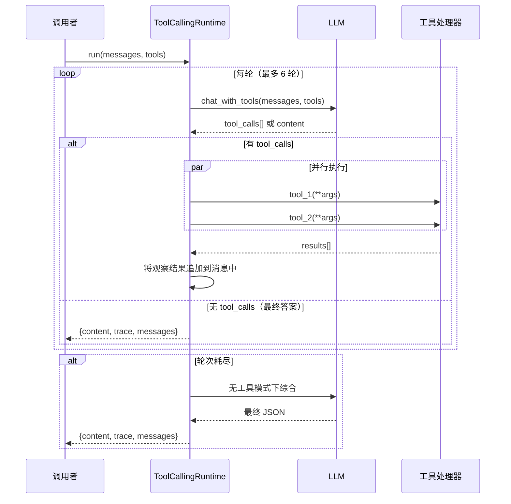
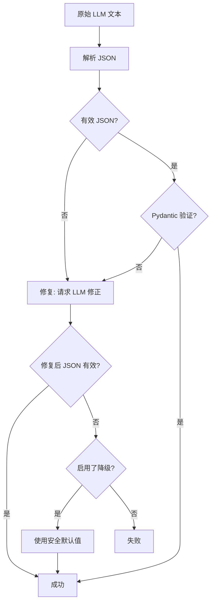
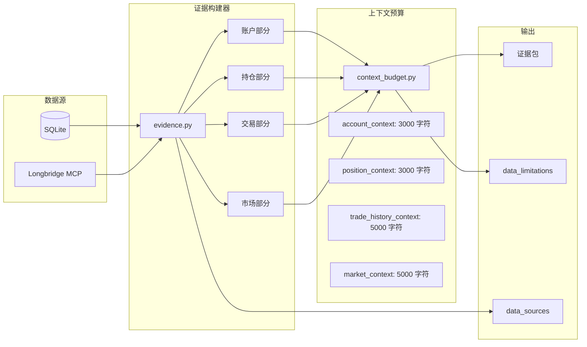
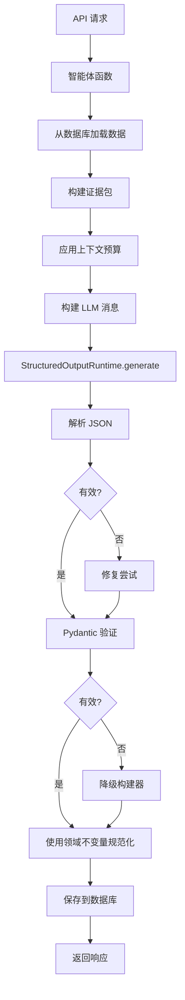

# 智能体架构

本文档解释了支撑所有五个 AI 智能体的共享基础设施。理解这些构建模块将帮助您阅读智能体源代码并扩展智能体行为。

## ReAct 运行时 (ToolCallingRuntime)

`app/agents/runtime.py` 中的 `ToolCallingRuntime` 实现了 **ReAct 循环** -- 一种 LLM 推理要做什么、执行工具、观察结果并重复直到能产生最终答案的模式。

### 工作原理



### 关键配置

| 参数 | 默认值 | 用途 |
|---|---|---|
| `max_rounds` | 6 | ReAct 循环最大迭代次数 |
| `max_parallel_tools` | 6 | 并行工具调用的 ThreadPoolExecutor 工作线程数 |
| `max_observation_chars` | 12,000 | 对话中工具输出的截断限制 |

### 最后一轮行为

在最后一轮，运行时强制 `tool_choice="none"`，阻止 LLM 请求更多工具。如果 LLM 仍然尝试调用工具，运行时会回退到普通的 `chat()` 调用。这保证循环始终以内容响应终止。

### 初始工具调用

您可以传递 `initial_tool_calls` 在第一轮 LLM 之前预执行只读数据加载。结果作为合成用户消息注入，使 LLM 无需往返即可立即获得数据。

```python
# app/agents/runtime.py
# 在 LLM 看到对话之前预执行数据加载
initial_tool_calls = [
    InitialToolCall(
        tool_name="ibkr_get_account_overview",
        arguments={},
        inject_as="user",       # 结果成为合成用户消息
    ),
    InitialToolCall(
        tool_name="ibkr_get_current_positions",
        arguments={},
        inject_as="user",
    ),
]

result = await runtime.run(
    messages=messages,
    tools=tool_registry.get_tools(),
    initial_tool_calls=initial_tool_calls,
)
```

## 结构化输出管道

每个产生固定 schema 输出的智能体都使用 `app/agents/structured_output/runtime.py` 中的 **StructuredOutputRuntime**。此管道有四个阶段：



### 阶段 1: 解析

`app/agents/structured_output/json_parser.py` 中的 JSON 解析器处理常见的 LLM 输出怪癖：

- **Markdown 围栏**：剥离 ` ```json ... ``` ` 包装
- **raw_decode 回退**：扫描第一个 `{` 字符并从那里解析
- **空输出检测**：引发特定错误代码

```python
# app/agents/structured_output/json_parser.py
def extract_json_object(text: str) -> dict:
    """从原始 LLM 文本中提取 JSON 对象。"""
    # 1. 剥离 markdown 围栏
    text = _strip_markdown_fences(text)

    # 2. 尝试直接解析
    try:
        return json.loads(text)
    except JSONDecodeError:
        pass

    # 3. raw_decode 回退: 找到第一个 '{' 并从那里解析
    for i, ch in enumerate(text):
        if ch == '{':
            obj, _ = json.JSONDecoder().raw_decode(text, i)
            if isinstance(obj, dict):
                return obj

    raise StructuredOutputError(ErrorCode.LLM_JSON_PARSE_FAILED)
```

### 阶段 2: 验证

解析后的 JSON 针对 Pydantic 模型进行验证（如 `TradeDecisionOutput`、`TradeReviewOutput`）。`FlexibleModel` 基类使用 `extra="allow"` 以实现前向兼容 -- 意外字段被保留而非拒绝。

### 阶段 3: 修复

如果验证失败，系统将原始输出连同 schema 提示和验证错误一起发回 LLM，要求其仅修复格式问题。修复提示明确说明："不要捏造事实、数字、新闻、财务数据或交易建议。"

### 阶段 4: 降级

如果修复失败，系统调用 `fallback_builder` 函数，返回安全的保守默认值。例如，交易决策降级返回 `action: "watchlist"` 和 `confidence: "low"`。

### StructuredOutputContract

每个智能体定义一个 `StructuredOutputContract` 来配置管道：

```python
# app/agents/trade_decision/contracts.py
contract = StructuredOutputContract(
    name="trade_decision",
    agent_name="trade_decision",
    node_name="compose",
    output_model=TradeDecisionOutput,      # Pydantic 模型
    schema_hint=TradeDecisionOutput.model_json_schema(),
    max_repair_attempts=1,
    repair_enabled=True,
    fallback_enabled=True,
    fallback_builder=lambda ctx, err, raw: _build_fallback_decision(...),
)
```

## 证据流图



## 证据构建器

`app/agents/evidence.py` 中的证据构建器将原始数据库数据转换为**证据包** -- 智能体消费的结构化上下文对象。每种智能体类型有自己的构建函数：

- `build_trade_decision_evidence_pack()` -- 账户、持仓、交易、市场上下文
- `build_trade_review_evidence_pack()` -- 交易事实、绩效指标、基准
- `build_daily_position_review_evidence_pack()` -- 概览、排名、风险、重点股票
- `build_risk_assessment_evidence_pack()` -- 投资组合快照、集中度、主题

### 数据源注释

每个证据包记录其数据源：

```python
# app/agents/evidence.py
DATA_SOURCES = {
    "account_data": "IBKR_ONLY",
    "position_data": "IBKR_ONLY",
    "trade_data": "IBKR_ONLY",
    "public_market_data": "LONGBRIDGE_PUBLIC_ONLY",
}
```

这告诉 LLM（和用户）每条数据的确切来源。

### 证据摘要

`build_evidence_summary()` 函数创建安全的、经过消毒的摘要供前端展示。它：

- 脱敏敏感字段（token、密钥、密码）
- 报告各部分的可用状态（available / partial / missing）
- 列出缺失数据和数据限制

## 上下文预算约束

`app/agents/context_budget.py` 中的上下文预算系统防止证据包超过 LLM 上下文限制。每个部分有字符预算：

| 部分 | 预算（字符） |
|---|---|
| `account_context` | 3,000 |
| `position_context` | 3,000 |
| `trade_history_context` | 5,000 |
| `market_context` | 5,000 |
| `company_context` | 5,000 |
| `daily_position_context` | 12,000 |
| `data_quality` | 2,000 |

### 渐进式约束策略

当某个部分超出预算时，系统按顺序应用策略：

1. **部分特定压缩** -- 删除低优先级项目（如限制持仓数为 20，新闻数为 5）
2. **收缩列表** -- 递归地将所有列表长度减半
3. **截断字符串** -- 将文本字段截断为 140 个字符
4. **降级** -- 用 1000 字符预览替换整个部分

每个约束操作都会产生**预算报告**，显示被删除或截断的内容，这成为证据包 `data_limitations` 的一部分。

## 领域不变量

`app/agents/invariants.py` 中的领域不变量模块定义了：

### 评分维度

**交易决策**（7 个维度，共 100 分）：
- `fundamental_quality_score`（20）
- `valuation_score`（15）
- `trend_score`（15）
- `account_fit_score`（20）
- `risk_reward_score`（15）
- `review_constraint_score`（10）
- `event_catalyst_score`（5）

**交易复盘**（8 个维度，共 100 分）：
- `return_result_score`（20）
- `relative_performance_score`（15）
- `entry_quality_score`（15）
- `exit_quality_score`（15）
- `position_sizing_score`（15）
- `holding_period_score`（5）
- `risk_control_score`（10）
- `decision_attribution_score`（5）

### 允许的枚举值

系统对操作、置信度和评级强制执行严格的枚举：

- **操作**：`add`、`add_small`、`add_batch`、`hold`、`reduce`、`reduce_batch`、`sell`、`wait`、`avoid`、`watchlist`
- **置信度**：`high`、`medium`、`low`
- **决策评级**：`strong_buy_or_hold`、`positive`、`neutral`、`negative`
- **复盘评级**：`excellent`、`good`、`average`、`poor`

### 操作别名

规范化器处理英文和中文操作别名。例如，`"逢低加仓"` 映射到 `add_small`，`"清仓"` 映射到 `sell`。这使系统能够抵御 LLM 输出的变化。

### 安全防护

- 强制性交易语言（如 "必须买入"、"all in"）被软化为 "观察待满足预设条件"
- 当数据限制严重时，置信度自动降级
- 当关键公共数据缺失时，评级被封顶

## 智能体执行流


