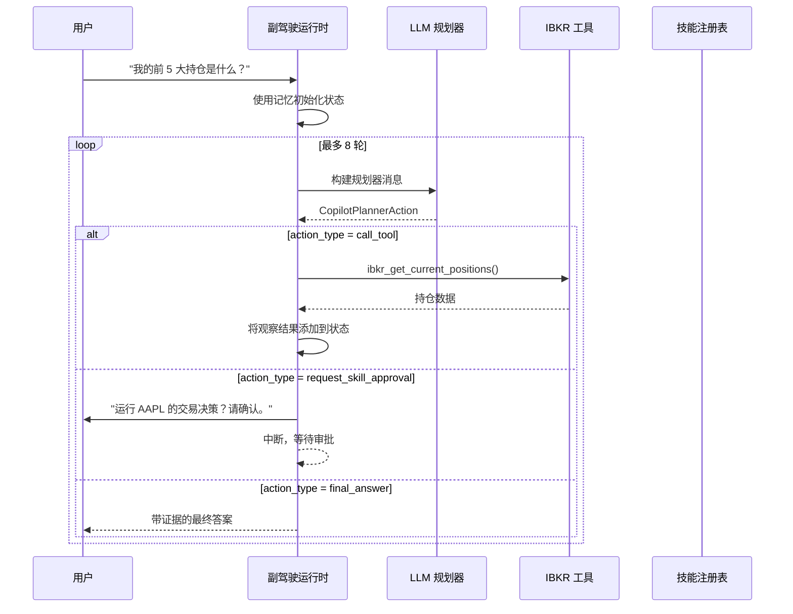
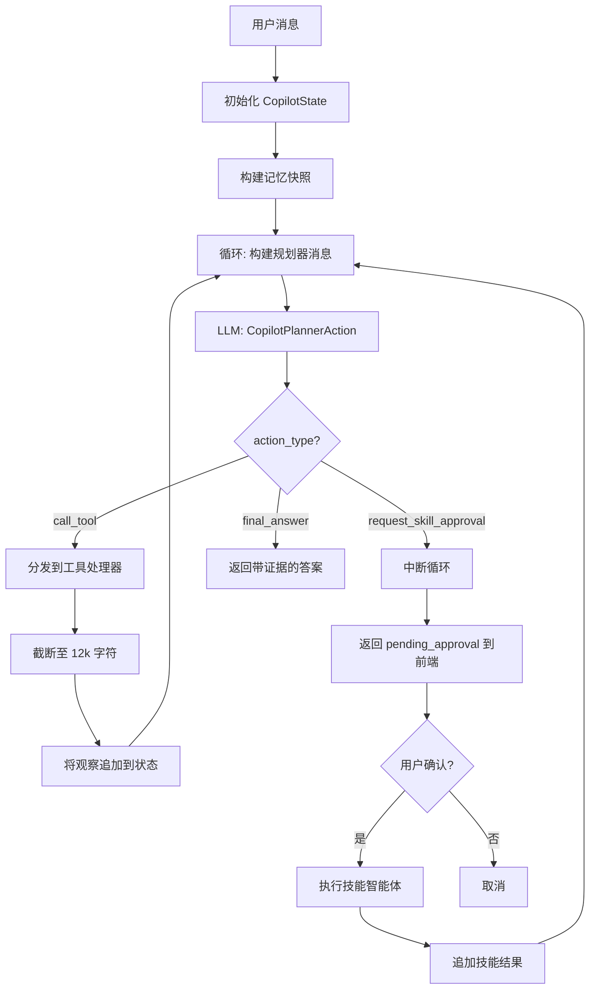
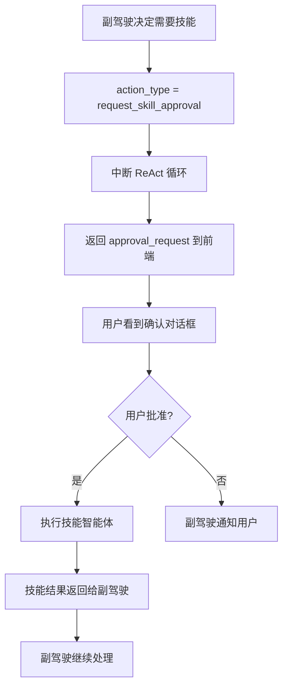
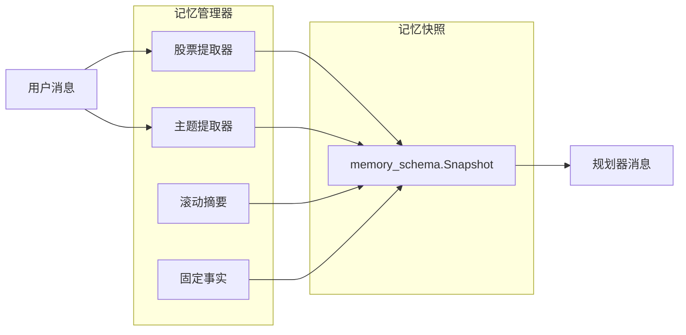

# 账户副驾驶

账户副驾驶是一个交互式聊天智能体，回答关于您投资组合的问题。与其他只运行一次并生成报告的智能体不同，副驾驶维护一个对话，并可以在回答之前跨多轮调用多个工具来收集证据。

## 工作原理

副驾驶使用 `AccountCopilotRuntime`（`app/agents/account_copilot/runtime.py`）中实现的自己的 ReAct 循环。每轮遵循**先规划后行动**模式：

1. LLM 接收对话历史并产生**规划器动作**（结构化 JSON）
2. 运行时分发动作 -- 调用工具、请求技能批准或返回最终答案
3. 如果调用了工具，结果成为添加到对话中的观察结果
4. 循环重复，直到 LLM 产生最终答案或达到轮次限制



### 对话流详情



## 规划器 Schema

每轮规划器产生一个 `CopilotPlannerAction`，包含以下字段：

| 字段 | 类型 | 用途 |
|---|---|---|
| `action_type` | string | `call_tool`、`final_answer` 或 `request_skill_approval` |
| `thought_summary` | string | LLM 对此动作的推理 |
| `tool_name` | string | 要调用的工具名称（当 action_type 为 call_tool 时） |
| `tool_arguments` | dict | 工具的参数 |
| `skill_name` | string | 要请求的技能名称（当 action_type 为 request_skill_approval 时） |
| `skill_arguments` | dict | 技能的参数 |
| `final_answer` | string | 答案文本（当 action_type 为 final_answer 时） |
| `evidence_sufficiency` | object | 是否已收集足够证据的评估 |

规划器使用 `StructuredOutputContract`，以 `CopilotPlannerAction` 作为 Pydantic 模型，因此每个规划器输出都经过 schema 验证。

```python
# app/agents/account_copilot/planner_schema.py
class CopilotPlannerAction(FlexibleModel):
    action_type: str                    # "call_tool" | "final_answer" | "request_skill_approval"
    thought_summary: str = ""           # LLM 推理追踪
    tool_name: str | None = None
    tool_arguments: dict[str, Any] = {}
    skill_name: str | None = None
    skill_arguments: dict[str, Any] = {}
    final_answer: str | None = None
    evidence_sufficiency: dict[str, Any] = {}
```

## 工具注册表

副驾驶通过 `AccountCopilotToolRegistry`（`app/agents/account_copilot/tool_registry.py`）注册 IBKR 数据工具。每个工具有一个处理函数、一个 JSON schema 和元数据：

```python
# app/agents/account_copilot/tool_registry.py
class AccountCopilotToolRegistry:
    """为副驾驶注册所有 IBKR 只读数据工具。"""

    def __init__(self, db_session):
        self._tools: dict[str, ToolRegistration] = {}
        self._register_all(db_session)

    def _register_all(self, db_session):
        self.register(ToolRegistration(
            name="ibkr_get_account_overview",
            description="账户权益、现金、保证金信息",
            parameters_schema={},                  # 无需参数
            handler=lambda **kw: get_account_overview(db_session),
        ))
        self.register(ToolRegistration(
            name="ibkr_get_current_positions",
            description="所有当前持仓及权重",
            parameters_schema={},
            handler=lambda **kw: get_current_positions(db_session),
        ))
        # ... 还有 7 个工具
```

| 工具 | 描述 |
|---|---|
| `ibkr_get_account_overview` | 账户权益、现金、保证金信息 |
| `ibkr_get_current_positions` | 所有当前持仓及权重 |
| `ibkr_get_symbol_position` | 特定股票的持仓详情 |
| `ibkr_get_symbol_trades` | 特定股票的交易历史 |
| `ibkr_get_position_history` | 历史持仓快照 |
| `ibkr_get_equity_curve` | 权益曲线数据点 |
| `ibkr_get_daily_attribution` | 按持仓的每日 PnL 归因 |
| `ibkr_get_risk_snapshot` | 集中度和风险指标 |
| `ibkr_get_cash_flow_summary` | 存取款/分红摘要 |

所有工具都是**只读的**，有 12,000 字符的输出预算。运行时会截断超出此限制的工具输出。

## 技能注册表

技能是需要**用户批准**才能执行的更高级操作。它们通过 `AccountCopilotSkillRegistry`（`app/agents/account_copilot/skill_registry.py`）注册。



| 技能 | 描述 | 风险级别 |
|---|---|---|
| `trade_decision_entry_skill` | 分析是否开新仓 | 中 |
| `trade_decision_holding_skill` | 分析是否加仓/减仓/维持持仓 | 中 |
| `trade_review_symbol_skill` | 复盘历史交易表现 | 中 |
| `daily_position_review_skill` | 生成每日持仓复盘 | 低 |
| `risk_assessment_skill` | 生成账户级风险评估 | 低 |

当副驾驶决定技能有助于回答用户问题时，它：

1. 设置 `action_type = "request_skill_approval"`
2. 包含人类可读的 `approval_message`
3. 运行时中断循环并将批准请求返回前端
4. 前端向用户显示确认对话框
5. 批准后，技能执行，副驾驶继续处理结果

## 记忆系统

副驾驶通过 `memory_manager.py` 和 `memory_schema.py` 跨轮次维护对话记忆：



- **股票提取**：从用户消息中基于正则表达式提取股票代码（如 "AAPL"、"NVDA.US"）
- **主题提取**：基于关键词的主题检测（risk、trade_review、valuation 等）
- **滚动摘要**：到目前为止对话的压缩摘要
- **固定事实**：用户提到的应在各轮次之间持续存在的关键事实

记忆快照每轮传递给规划器，使其可以引用之前的上下文而无需重新阅读完整对话。

```python
# app/agents/account_copilot/memory_manager.py
class MemoryManager:
    def extract_symbols(self, text: str) -> list[str]:
        """使用正则表达式从用户文本中提取股票代码。"""
        # 匹配 AAPL、NVDA.US、9988.HK 等模式
        pattern = r'\b([A-Z]{1,5}(?:\.[A-Z]{1,3})?)\b'
        return list(set(re.findall(pattern, text.upper())))

    def extract_topics(self, text: str) -> list[str]:
        """通过关键词匹配检测对话主题。"""
        topic_keywords = {
            "risk": ["risk", "concentration", "exposure", "风险", "集中度"],
            "trade_review": ["review", "mistake", "performance", "回顾", "复盘"],
            "valuation": ["valuation", "PE", "overvalued", "估值"],
        }
        return [t for t, kw in topic_keywords.items()
                if any(k in text.lower() for k in kw)]
```

## 安全特性

- **取消检查器**：运行时每轮检查 `cancel_checker` 函数，允许前端取消正在运行的分析
- **超时**：可配置的 `timeout_seconds` 防止失控执行
- **连续空结果防护**：如果连续 3 次工具调用返回无有效数据，循环中断并返回降级消息
- **只读强制**：仅执行只读工具；写操作在运行时级别被阻止

## 前端集成

副驾驶视图（`AccountCopilotView.tsx`）提供：

- 带消息历史的聊天界面
- 会话管理（创建、切换、删除会话）
- 技能批准确认对话框
- 副驾驶回答的 Markdown 渲染（使用 `react-markdown`）

API 客户端（`api/accountCopilot.ts`）向后端的 `/api/copilot` 端点发送消息，并处理流式传输或轮询响应。

## 源代码映射

| 文件 | 用途 |
|---|---|
| `app/agents/account_copilot/runtime.py` | 主 ReAct 循环运行时 |
| `app/agents/account_copilot/planner_schema.py` | CopilotPlannerAction Pydantic 模型 |
| `app/agents/account_copilot/tool_registry.py` | IBKR 工具注册 |
| `app/agents/account_copilot/tool_schemas.py` | 工具 JSON schema |
| `app/agents/account_copilot/skill_registry.py` | 技能注册 |
| `app/agents/account_copilot/skills.py` | 技能定义（5 个技能） |
| `app/agents/account_copilot/memory_manager.py` | 股票/主题提取、记忆压缩 |
| `app/agents/account_copilot/memory.py` | 记忆持久化 |
| `app/agents/account_copilot/memory_schema.py` | 记忆数据模型 |
| `app/agents/account_copilot/prompts.py` | 系统提示词和规划器消息构建器 |
| `app/agents/account_copilot/state.py` | AccountCopilotState 类型定义 |
