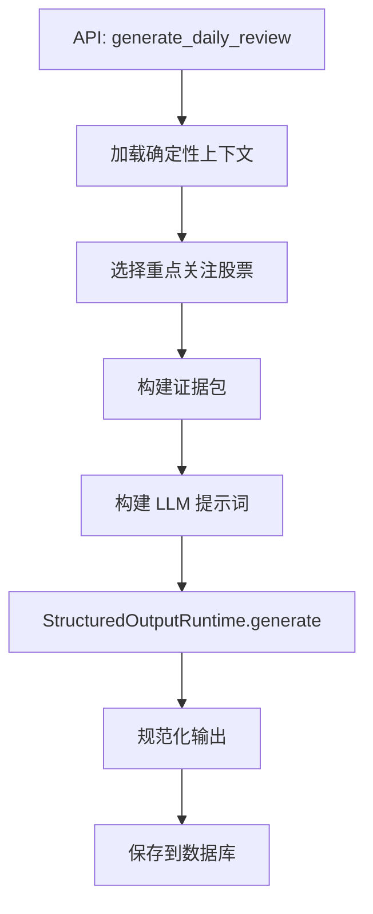
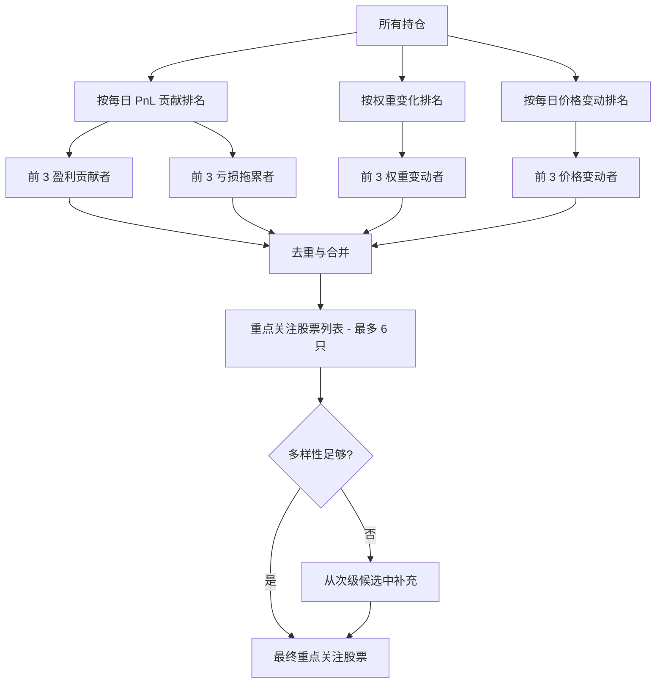
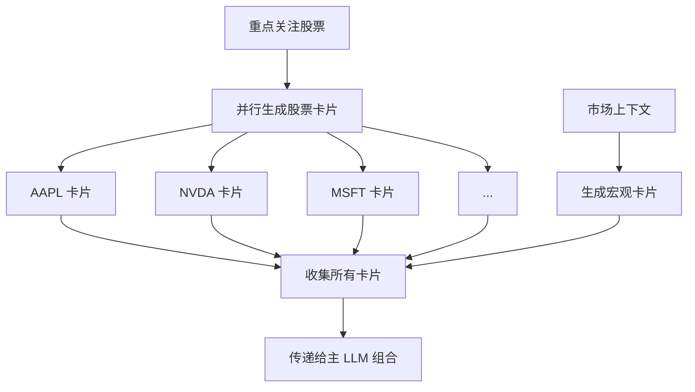
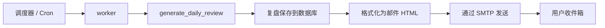

# 每日持仓复盘智能体

每日持仓复盘智能体生成全面的每日投资组合报告。它结合确定性账户计算和 LLM 驱动的市场分析，解释今天发生了什么以及明天需要关注什么。

## 工作原理

入口点是 `app/agents/daily_review/agent.py` 中的 `generate_daily_review()`。它遵循五步管道：



## 步骤 1: 确定性上下文

智能体从数据库加载预计算数据：

- **概览**：账户权益、每日 PnL、每日回报率、现金比率
- **排名**：盈利贡献者、亏损拖累者、权重最大持仓（确定性归因）
- **风险指标**：集中度比率、持仓状态标志、风险警报
- **基准**：用于比较的指数回报（如标普 500、纳斯达克）

此步骤中的所有数字都是**精确的数据库值** -- LLM 永远不会修改它们。

## 步骤 2: 重点关注股票选择

重点关注股票基于以下因素确定性地选择：



- 盈利贡献最多（最高每日 PnL 贡献）
- 亏损拖累最大（最低每日 PnL 贡献）
- 持仓权重变化最大
- 每日价格变动显著的股票

此选择**不是**由 LLM 完成的 -- 它是纯 Python 逻辑，确保可重现性。

```python
# app/agents/daily_review/focus_selection.py
def select_focus_symbols(positions: list[Position], max_count: int = 6) -> list[str]:
    """确定性地选择每日复盘的重点关注股票。"""
    by_pnl = sorted(positions, key=lambda p: p.daily_pnl_contribution, reverse=True)
    top_contributors = by_pnl[:3]
    bottom_drags = by_pnl[-3:]

    by_weight_change = sorted(positions, key=lambda p: abs(p.weight_change), reverse=True)
    top_movers = by_weight_change[:3]

    # 去重并返回最多 max_count 只股票
    seen = set()
    focus = []
    for sym in [p.symbol for p in top_contributors + bottom_drags + top_movers]:
        if sym not in seen:
            seen.add(sym)
            focus.append(sym)
    return focus[:max_count]
```

## 步骤 3: 股票卡片和宏观卡片

在子智能体卡片模式下，系统生成：



- **股票证据卡片**：每只重点关注股票一张卡片，包含价格走势、新闻、估值说明和技术水平
- **宏观证据卡片**：涵盖市场体制、行业背景、风险情绪和科技情绪的卡片

每张卡片由单独的 LLM 调用生成，有自己的 `StructuredOutputContract`，允许并行生成和独立修复。

## 步骤 4: LLM 组合

主 LLM 调用接收所有证据并组合最终复盘。提示词指示 LLM：

- 仅基于确定性数据的账户数字（不修改 PnL 数据）
- 仅使用公共市场数据进行解释（不捏造新闻）
- 将明日观察清单视为观察条件，而非买卖指令

## 输出 Schema

```python
# app/agents/daily_review/output_schema.py
class DailyPositionReviewOutput(FlexibleModel):
    report_date: str
    summary: str | None = None
    account_conclusion: str | None = None
    attribution_summary: str | None = None
    major_contributors_analysis: list[dict[str, Any]]
    major_drags_analysis: list[dict[str, Any]]
    focus_symbol_analyses: list[dict[str, Any]]
    market_context: str | None = None
    risk_analysis: str | None = None
    tomorrow_watchlist: list[dict[str, Any]]
    operation_observation: str | None = None
    data_limitations: list[str]
    evidence_used: list[str]
```

### 关键部分

| 部分 | 描述 |
|---|---|
| `summary` | 今日表现的一行摘要 |
| `account_conclusion` | 详细的账户级结论 |
| `attribution_summary` | PnL 归因解释 |
| `major_contributors_analysis` | 盈利贡献最多的持仓及分析 |
| `major_drags_analysis` | 亏损拖累最大的持仓及分析 |
| `focus_symbol_analyses` | 每只重点关注股票的详细分析 |
| `market_context` | 市场和行业背景 |
| `risk_analysis` | 持仓风险变化 |
| `tomorrow_watchlist` | 需要关注的股票和条件 |
| `operation_observation` | 观察说明（非交易指令） |

### 重点关注股票分析

每只重点关注股票的分析包括：

```json
{
  "symbol": "AAPL.US",
  "price_action": "因强劲财报超预期跳空高开 3.2%...",
  "account_impact": "为每日 PnL 贡献 +$2,400，占投资组合 0.8%...",
  "possible_reasons": ["财报超预期 12%", "iPhone 16 需求强劲"],
  "valuation_note": "以 28 倍前瞻 PE 交易，高于 5 年平均...",
  "cost_position_note": "当前成本基础 $165，未实现收益 18%...",
  "watch_points": ["监控 $195 阻力位", "关注财报后盘整"],
  "data_limitations": ["无实时期权流数据"]
}
```

### 明日观察清单

每个观察清单项包括：

```json
{
  "symbol": "NVDA.US",
  "reason": "接近 50 日均线关键支撑",
  "key_levels": ["$120 支撑", "$135 阻力"],
  "events": ["下周 AI 大会"],
  "conditions": ["监控支撑位是否在放量情况下守住"]
}
```

:::warning
明日观察清单仅包含**观察条件**，不包含买卖指令。系统会软化任何强制性交易语言（如 "必须买入" 变为 "观察待满足预设条件"）。
:::

## 规范化

`app/agents/invariants.py` 中的 `normalize_daily_position_review_output()` 强制执行：

- **报告日期验证**：必须与请求的日期匹配
- **确定性降级**：缺失部分从确定性数据填充（如 `summary` 回退到概览摘要）
- **观察清单消毒**：强制性交易语言被软化
- **数据限制追踪**：从降级填充的部分在 `data_limitations` 中注明

## 降级行为

如果 LLM 失败，降级仅使用确定性数据生成报告：

```json
{
  "summary": "每日复盘以降级模式生成。PnL: +$1,234，回报: +0.42%。",
  "account_conclusion": "账户 PnL +$1,234，回报 +0.42%。贡献者: AAPL、MSFT。拖累者: NVDA。",
  "focus_symbol_analyses": [
    {"symbol": "AAPL.US", "price_action": "LLM 输出格式错误；价格解释待定。"}
  ],
  "operation_observation": "降级复盘；无买卖结论。当 LLM 输出恢复时重新生成。"
}
```

## 邮件集成

每日复盘可以通过管理面板中的 SMTP 配置发送邮件。工作服务（`worker`）可以按计划触发每日复盘生成和邮件发送。



## API 使用

```
POST /api/daily-position-review
{
  "report_date": "2024-12-15"
}
```

响应包含完整的复盘文档，包括证据包、股票分析和观察清单。
