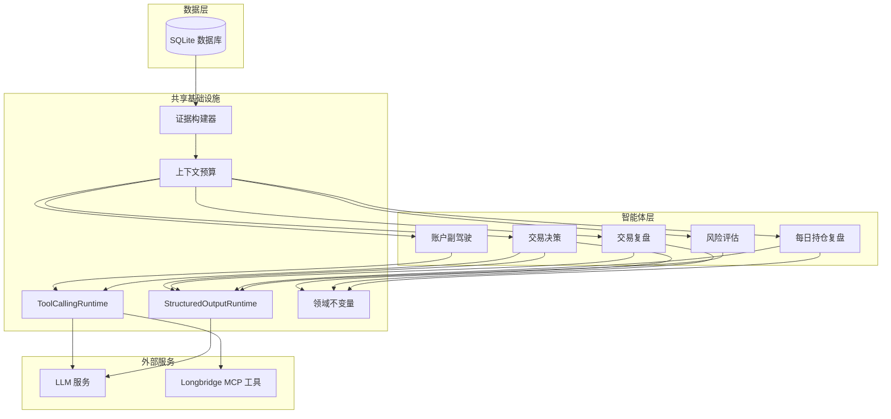
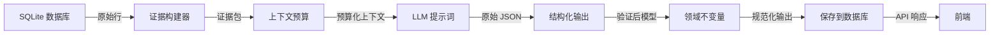

# AI 智能体概览

IBKR Dashboard 包含五个专门的 AI 智能体，用于分析您的投资组合数据并提供可操作的洞察。每个智能体结合**确定性计算**（在 Python 中运行）和**LLM 驱动的推理**（调用大语言模型），产生结构化、可靠的输出。

## 什么是智能体？

每个智能体遵循相同的核心模式：

1. **加载数据**：从 SQLite 数据库加载（账户快照、持仓、交易记录）
2. **构建证据包**：带上下文预算约束
3. **调用 LLM**：使用结构化提示词和输出 schema
4. **验证、修复和规范化**：使用 Pydantic 模型处理输出
5. **保存结果**：写入数据库供前端展示

这种方法确保输出始终是有效的 JSON，始终符合 schema，并在 LLM 失败时优雅降级。

```python
# 简化的智能体生命周期 -- 每个智能体都遵循此模式
# app/agents/trade_decision/agent.py

async def analyze_trade(symbol: str, decision_type: str) -> TradeDecisionOutput:
    # 步骤 1: 加载数据
    account_data = load_account_from_db()
    position_data = load_positions_from_db(symbol)

    # 步骤 2: 构建带上下文预算的证据包
    evidence = build_trade_decision_evidence_pack(account_data, position_data)

    # 步骤 3: 使用结构化输出合约调用 LLM
    contract = TRADE_DECISION_CONTRACT
    result = structured_output_runtime.generate(messages, contract)

    # 步骤 4: 使用领域不变量进行规范化
    if result.ok:
        normalized = normalize_trade_decision_output(result.payload)

    # 步骤 5: 保存到数据库
    save_decision_to_db(normalized)
    return normalized
```

## 五个智能体

### 1. 账户副驾驶 (Account Copilot)

一个交互式聊天智能体，回答关于您投资组合的问题。它使用 **ReAct 循环**（推理 + 行动）来规划调用哪些工具、执行工具、观察结果，然后要么调用更多工具，要么生成最终答案。它还可以请求批准运行更高级别的"技能"，如交易分析。

- **输入**：自由形式的用户问题
- **输出**：基于 IBKR 数据的对话式回答
- **关键特性**：带记忆的多轮工具调用

### 2. 交易决策智能体 (Trade Decision Agent)

分析是否应该建仓、持仓或平仓。它运行**四个并行子分析**（账户适配、市场趋势、基本面估值、事件催化剂），然后将它们综合为最终决策，包含评分和建议。

- **输入**：股票代码、决策类型（建仓/持仓）、可选问题
- **输出**：结构化决策，包含操作、置信度、评分明细
- **关键特性**：并行子智能体架构

### 3. 交易复盘智能体 (Trade Review Agent)

复盘历史交易，评估建仓质量、平仓质量、仓位大小和行为模式。它在**八个维度**上评分，并标记常见错误如追高或恐慌卖出。

- **输入**：股票代码或交易 ID、可选日期范围
- **输出**：结构化复盘，包含八维度评分和错误标签
- **关键特性**：反后见之明偏差评分

### 4. 每日持仓复盘智能体 (Daily Position Review Agent)

生成每日投资组合复盘，涵盖账户归因、重点关注股票分析、市场背景和明日观察清单。它确定性地选择重点关注股票，并生成股票证据卡片。

- **输入**：报告日期 (YYYY-MM-DD)
- **输出**：完整的每日复盘，包含归因、分析和观察清单
- **关键特性**：确定性重点股票选择 + LLM 解释

### 5. 风险评估智能体 (Risk Assessment Agent)

评估投资组合的集中度风险、行业/主题敞口和压力测试场景。核心计算（集中度比率、主题分类、压力测试数学）是**完全确定性的**；LLM 仅撰写叙述性报告。

- **输入**：可选用户问题
- **输出**：风险报告，包含评分、场景和建议
- **关键特性**：确定性风险卡片 + LLM 叙述

## 能力对比

| 特性 | 副驾驶 | 交易决策 | 交易复盘 | 每日复盘 | 风险评估 |
|---|---|---|---|---|---|
| **运行时类型** | ReAct 循环（多轮） | 结构化输出（单次） | 结构化输出（单次） | 结构化输出（单次） | 结构化输出（单次） |
| **每次运行 LLM 调用** | 2-8 轮 | 5（4 子智能体 + 1 组合） | 1 | 1 + N 张卡片 | 1 |
| **确定性工作** | 最少 | 账户适配评分 | 交易事实加载 | 归因、重点选择 | 所有风险计算 |
| **工具调用** | 是（9 个 IBKR 工具） | 是（Longbridge MCP） | 否 | 否 | 否 |
| **技能系统** | 是（5 个技能） | 否 | 否 | 否 | 否 |
| **并行执行** | 工具调用并行 | 4 个子分析并行 | 否 | 卡片生成并行 | 否 |
| **用户审批** | 是（技能相关） | 否 | 否 | 否 | 否 |
| **降级策略** | 优雅消息 | `watchlist` + `low` 置信度 | 评分 50，`neutral` | 仅确定性报告 | 无叙述的风险卡片 |
| **评分维度** | 不适用 | 7 个维度（100 分） | 8 个维度（100 分） | 不适用 | 3 张卡片（65 分） |
| **输出格式** | 对话文本 | JSON 决策文档 | JSON 复盘文档 | JSON 复盘文档 | JSON 风险报告 |
| **记忆/上下文** | 对话记忆 | 证据包 | 证据包 | 证据包 | 投资组合快照 |

## 架构图



### 数据流概要



## 核心设计原则

- **确定性优先**：PnL、集中度比率和压力测试等计算在 Python 中运行。LLM 负责解释和叙述，而非计算。
- **始终结构化输出**：每次 LLM 调用都产生经过 Pydantic 模型验证的 JSON。如果解析失败，系统会尝试修复，然后回退到安全默认值。
- **证据包**：智能体永远不会看到原始数据库行。数据被打包成证据包，包含分段预算、数据源注释和质量元数据。
- **优雅降级**：如果 LLM 不可用或返回无效输出，每个智能体都有确定性降级方案，返回保守结果。
- **可追溯性**：每次智能体运行都会生成 LLM 调用、工具调用、延迟和错误的追踪记录，用于调试和监控。

## 源代码目录结构

```
app/agents/
    runtime.py                    # ToolCallingRuntime（ReAct 循环）
    structured_output/
        runtime.py                # StructuredOutputRuntime
        contracts.py              # StructuredOutputContract
        json_parser.py            # 从 LLM 文本中提取 JSON
        errors.py                 # 错误类型
        registry.py               # 合约注册表
    evidence.py                   # 证据包构建器
    context_budget.py             # 上下文预算约束
    invariants.py                 # 领域不变量和规范化器
    eval_checks.py                # 通用评估检查
    eval_domain_checks.py         # 智能体特定评估检查
    account_copilot/              # 副驾驶智能体
    trade_decision/               # 交易决策智能体
    trade_review/                 # 交易复盘智能体
    daily_review/                 # 每日复盘智能体
    risk_assessment/              # 风险评估智能体
```

## 下一步

- [智能体架构](./architecture.md) -- 深入了解 ReAct 运行时和结构化输出管道
- [账户副驾驶](./copilot.md) -- 交互式聊天智能体的工作原理
- [交易决策](./trade-decision.md) -- 交易决策的分析方式
- [交易复盘](./trade-review.md) -- 交易复盘和评分方式
- [每日复盘](./daily-review.md) -- 每日持仓复盘的生成方式
- [风险评估](./risk-assessment.md) -- 投资组合风险的评估方式
