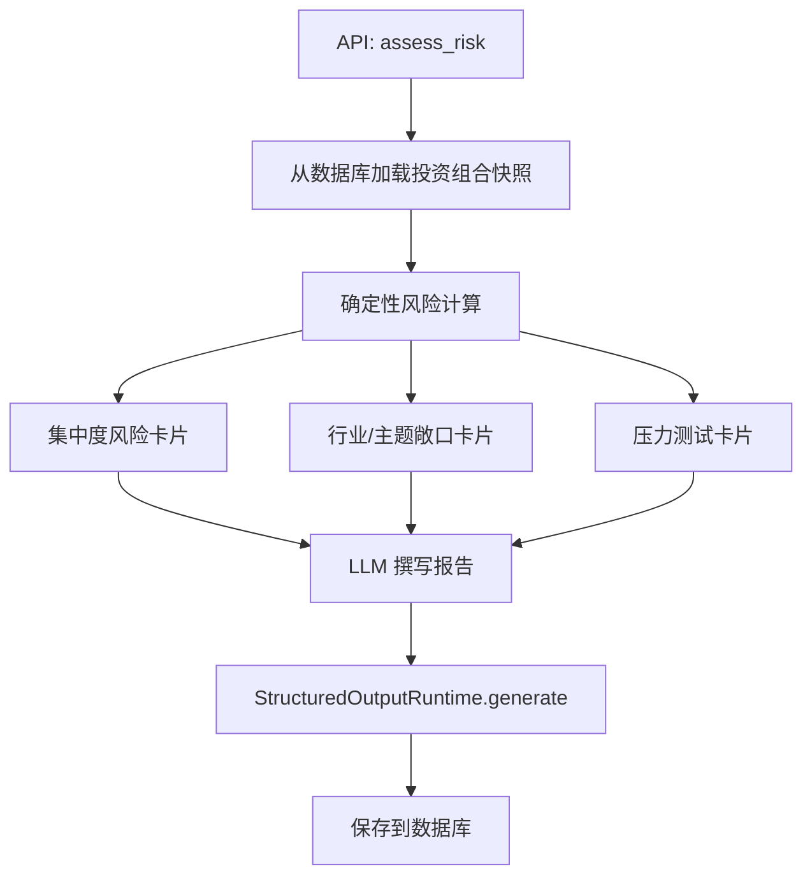
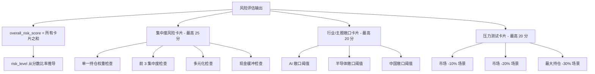
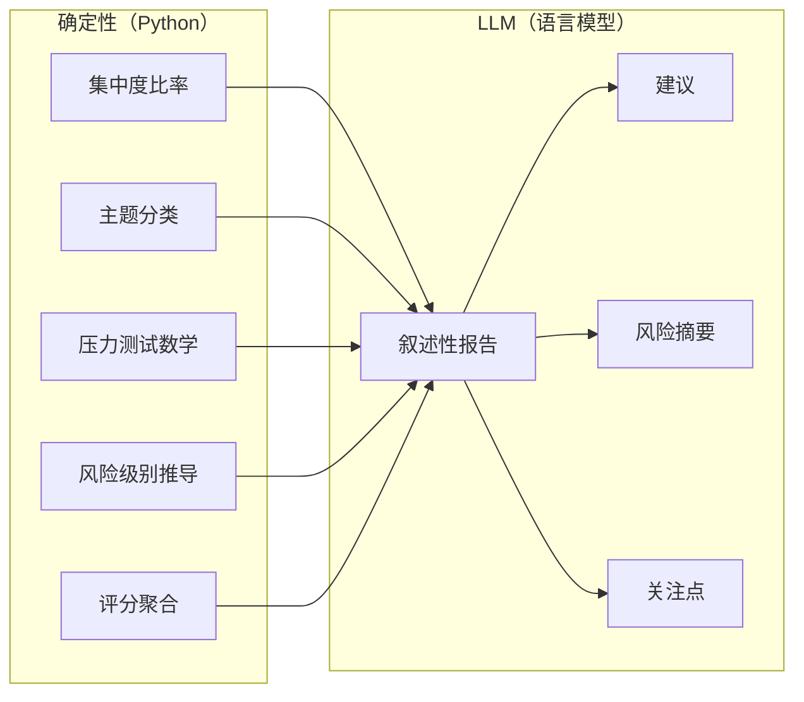

# 风险评估智能体

风险评估智能体跨多个维度评估投资组合风险。与其他智能体不同，核心分析是**完全确定性的** -- LLM 仅从预计算的风险卡片撰写叙述性报告。

## 工作原理

入口点是 `app/agents/risk_assessment/agent.py` 中的 `assess_risk()`。它遵循四步管道：



## 风险卡片层级



## 步骤 1: 投资组合快照

智能体从数据库加载最新的投资组合数据：

- **账户快照**：总权益、现金、保证金信息
- **持仓详情**：股票代码、数量、市值、权重、未实现 PnL
- **衍生指标**：最大持仓百分比、前 3 集中度、前 5 集中度、现金百分比

## 步骤 2: 确定性风险卡片

### 集中度风险卡片（最高分：25）

使用纯 Python 逻辑计算集中度风险：

```python
# app/agents/risk_assessment/concentration.py
def compute_concentration_risk(positions: list[Position]) -> dict:
    """确定性集中度风险计算。"""
    weights = sorted([p.weight for p in positions], reverse=True)
    largest = weights[0] if weights else 0
    top3 = sum(weights[:3])
    cash_pct = 1.0 - sum(weights)

    score = 0
    findings = []

    if largest > 0.40:
        score += 20; findings.append("极端单一持仓集中度")
    elif largest > 0.25:
        score += 14; findings.append("高单一持仓集中度")
    elif largest > 0.15:
        score += 7; findings.append("中等单一持仓集中度")

    if top3 > 0.70:
        score += 5; findings.append("高前 3 集中度")

    if len(positions) <= 2 and largest > 0.30:
        score += 5; findings.append("多元化不足")

    if cash_pct < 0.05:
        score += 3; findings.append("低流动性缓冲")

    return {"score": score, "max_score": 25, "findings": findings}
```

| 条件 | 分数 | 发现 |
|---|---|---|
| 最大持仓 > 40% | +20 | 极端集中度 |
| 最大持仓 > 25% | +14 | 高集中度 |
| 最大持仓 > 15% | +7 | 中等集中度 |
| 前 3 > 70% | +5 | 高前 3 集中度 |
| {'<='} 2 只持仓且最大 > 30% | +5 | 多元化不足 |
| 现金 < 5% | +3 | 低流动性缓冲 |

风险级别从分数比率推导：

| 比率 | 风险级别 |
|---|---|
| >= 75% | 极端 |
| >= 50% | 高 |
| >= 25% | 中 |
| < 25% | 低 |

### 行业/主题敞口卡片（最高分：20）

使用基于股票代码的规则将持仓分类为主题：

```python
# app/agents/risk_assessment/themes.py
THEME_MAP = {
    "NVDA": ["semiconductor", "ai"],
    "AMD": ["semiconductor"],
    "MSFT": ["ai", "cloud"],
    "GOOG": ["ai", "cloud"],
    "BABA": ["china"],
    "JD": ["china"],
    "PDD": ["china"],
}

def classify_symbol_theme(symbol: str) -> list[str]:
    base = symbol.split(".")[0]
    return THEME_MAP.get(base, ["other"])
```

| 主题 | 阈值 | 分数 |
|---|---|---|
| AI 敞口 | > 40% | +8 |
| 半导体敞口 | > 30% | +6 |
| 中国敞口 | > 20% | +4 |

`classify_symbol_theme()` 函数将股票代码映射到主题（如 NVDA -> 半导体 + AI，BABA -> 中国）。

### 压力测试卡片（最高分：20）

运行三个假设场景：

| 场景 | 计算 |
|---|---|
| 市场 -10% | 总敞口 * 0.10 |
| 市场 -20% | 总敞口 * 0.20 |
| 最大持仓 -30% | 最大持仓价值 * 0.30 |

每个场景计算估计损失金额和投资组合影响百分比。最坏场景驱动分数：

| 最坏影响 | 分数 |
|---|---|
| > 20% | +15 |
| > 10% | +8 |

## 步骤 3: LLM 组合

LLM 接收所有三张风险卡片和投资组合快照，然后撰写叙述性报告。LLM **不执行**任何计算 -- 它解释预计算的数字并添加上下文。

## 输出 Schema

```python
# app/agents/risk_assessment/output_schema.py
class RiskAssessmentOutput(FlexibleModel):
    overall_risk_score: float = 0
    risk_level: str = "medium"         # "low", "medium", "high", "extreme"
    summary: str = ""
    concentration_risk: dict[str, Any]
    sector_exposure: dict[str, Any]
    liquidity_risk: dict[str, Any]
    stress_test: dict[str, Any]
    key_risks: list[str]
    recommendations: list[str]
    watch_points: list[str]
    data_limitations: list[str]
    evidence_used: list[str]
```

### 关键部分

| 部分 | 描述 |
|---|---|
| `overall_risk_score` | 所有风险卡片分数之和 |
| `risk_level` | 从总分比率推导 |
| `summary` | 一行风险摘要 |
| `concentration_risk` | 集中度卡片详情 |
| `sector_exposure` | 行业/主题敞口详情 |
| `stress_test` | 压力测试场景和结果 |
| `key_risks` | 已识别的风险列表 |
| `recommendations` | 可操作的风险缓解建议 |
| `watch_points` | 需要监控的事项 |

## 风险评分构成

总风险评分是所有三张卡片之和：

| 卡片 | 最高分 |
|---|---|
| 集中度 | 25 |
| 行业/主题 | 20 |
| 压力测试 | 20 |
| **总计** | **65** |

风险级别从总分推导：

```python
# app/agents/risk_assessment/agent.py
def _risk_level_from_score(score, max_score):
    ratio = score / max_score
    if ratio >= 0.75: return "extreme"
    if ratio >= 0.50: return "high"
    if ratio >= 0.25: return "medium"
    return "low"
```

## 确定性 vs. LLM 分析

此智能体在确定性和 LLM 工作之间有清晰的分离：



| 组件 | 类型 | 用途 |
|---|---|---|
| 集中度比率 | 确定性 | 从持仓数据精确计算 |
| 主题分类 | 确定性 | 股票到主题的映射规则 |
| 压力测试数学 | 确定性 | 假设场景计算 |
| 风险级别推导 | 确定性 | 分数到级别的映射 |
| 叙述性报告 | LLM | 解释和说明 |
| 建议 | LLM | 基于发现的可操作建议 |
| 关键风险 | LLM | 风险识别和优先级排序 |

:::tip
因为核心分析是确定性的，风险评估即使在 LLM 不可用时也能产生有意义的结果。降级方案简单地返回风险卡片数据而不包含 LLM 叙述。
:::

## 降级行为

如果 LLM 失败，降级返回：

```json
{
  "overall_risk_score": 22,
  "risk_level": "medium",
  "summary": "风险评估以降级模式生成。集中度: 中，行业: 低，压力: 中。",
  "concentration_risk": { "...集中度卡片数据..." },
  "sector_exposure": { "...行业卡片数据..." },
  "stress_test": { "...压力测试卡片数据..." },
  "key_risks": ["单一持仓集中度过高"],
  "recommendations": ["监控最大持仓权重变化"],
  "data_limitations": ["LLM 输出验证失败；使用确定性降级"]
}
```

## API 使用

```
POST /api/risk-assessment
{
  "question": "我的投资组合风险级别是什么？"
}
```

响应包含完整的风险评估，包括所有三张风险卡片和 LLM 叙述。
