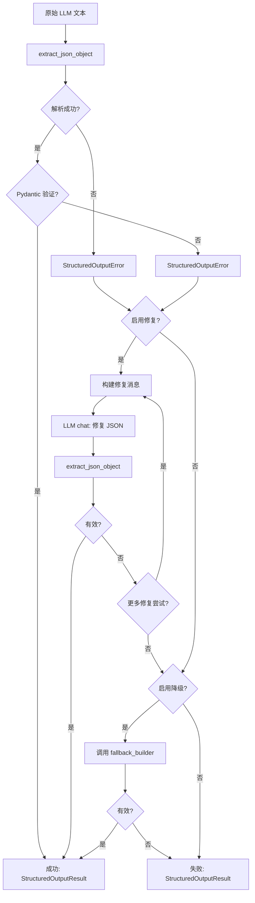
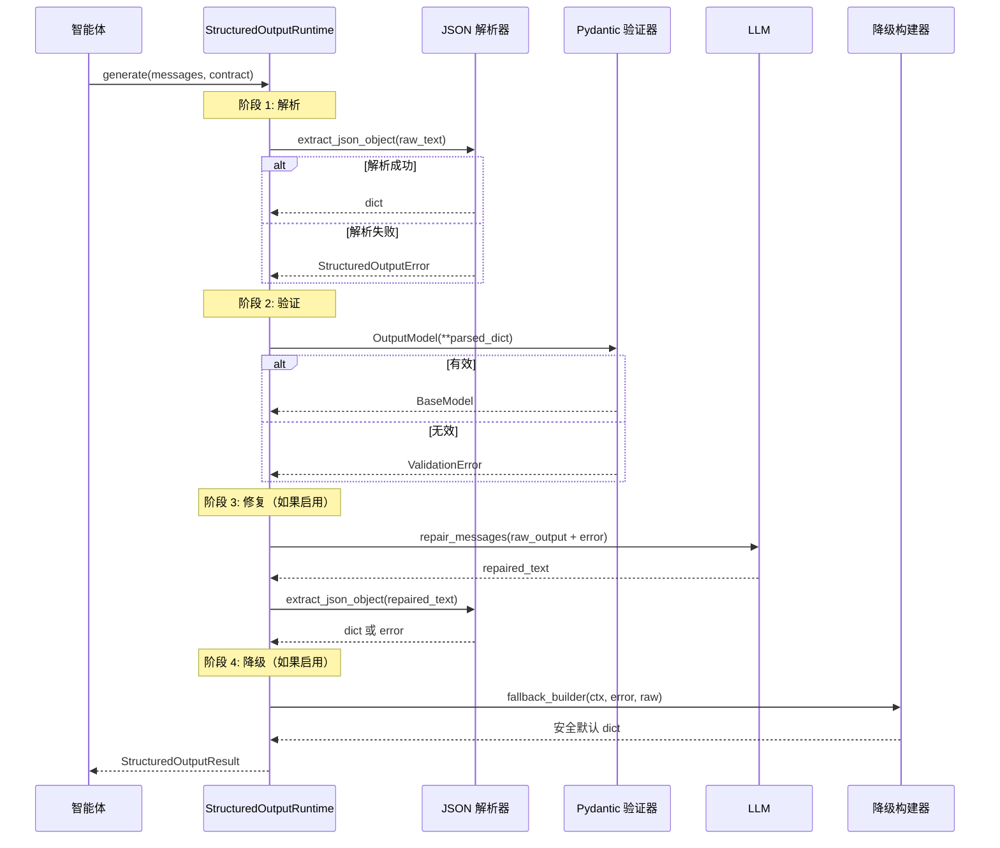

# 结构化输出管道

每个产生固定 schema 输出的智能体都使用结构化输出管道。此系统确保 LLM 输出始终是有效的 JSON，始终符合 Pydantic 模型，并在失败时优雅降级。

## 概述

管道位于 `app/agents/structured_output/`，包含以下文件：

| 文件 | 用途 |
|---|---|
| `contracts.py` | `StructuredOutputContract` 定义 |
| `json_parser.py` | 从原始 LLM 文本中提取 JSON |
| `runtime.py` | `StructuredOutputRuntime` -- 管道引擎 |
| `errors.py` | 错误类型和常量 |
| `registry.py` | 合约注册表，用于审计 |

## 管道



## 解析-验证-修复-降级流程



## StructuredOutputContract

合约定义了如何为特定 LLM 输出进行解析、验证、修复和降级：

```python
# app/agents/structured_output/contracts.py
@dataclass
class StructuredOutputContract:
    name: str                          # 合约标识符
    agent_name: str                    # 哪个智能体拥有此合约
    node_name: str                     # 智能体中的哪个节点/步骤
    output_model: type[BaseModel]      # 用于验证的 Pydantic 模型
    schema_hint: dict                  # 用于修复提示的 JSON schema
    examples: list[dict]               # 用于修复提示的示例输出
    max_repair_attempts: int           # 多少轮修复（默认：1）
    response_format: dict              # {"type": "json_object"}
    repair_enabled: bool               # 是否尝试修复
    fallback_enabled: bool             # 失败时是否使用降级
    fallback_builder: Callable         # 构建降级输出的函数
    repair_system_prompt: str          # 修复 LLM 调用的系统提示词
    repair_user_prompt_builder: Callable  # 自定义修复提示构建器
```

### 合约示例

每个智能体为其 LLM 调用定义合约：

| 合约名称 | 智能体 | 用途 |
|---|---|---|
| `account_copilot_planner` | 副驾驶 | 规划器动作选择 |
| `trade_decision` | 交易决策 | 最终决策组合 |
| `trade_review` | 交易复盘 | 复盘组合 |
| `daily_position_review` | 每日复盘 | 复盘组合 |
| `risk_assessment` | 风险评估 | 报告组合 |
| `trade_decision_market_trend` | 交易决策 | 市场趋势子智能体 |
| `trade_decision_fundamental_valuation` | 交易决策 | 基本面子智能体 |
| `trade_decision_event_catalyst` | 交易决策 | 事件催化剂子智能体 |
| `daily_review_symbol_evidence_card` | 每日复盘 | 股票证据卡片 |
| `daily_review_macro_evidence_card` | 每日复盘 | 宏观证据卡片 |

## JSON 解析器

`json_parser.py` 中的 JSON 解析器处理常见的 LLM 输出怪癖：

### Markdown 围栏处理

LLM 经常在 markdown 围栏中包装 JSON：

````
```json
{"key": "value"}
```
````

解析器使用正则表达式模式剥离这些围栏：`^\s*```(?:json|JSON)?\s*(.*?)\s*```\s*$`

### raw_decode 回退

如果直接解析失败，解析器扫描第一个 `{` 字符并使用 `json.JSONDecoder().raw_decode()` 从文本中的任何位置提取 JSON 对象。这处理了 LLM 在 JSON 前后包含解释性文本的情况。

```python
# app/agents/structured_output/json_parser.py
import json
import re

_MD_FENCE_RE = re.compile(r'^\s*```(?:json|JSON)?\s*(.*?)\s*```\s*$', re.DOTALL)

def extract_json_object(text: str) -> dict:
    """从 LLM 文本中提取 JSON 对象，处理 markdown 围栏。"""
    # 步骤 1: 剥离 markdown 围栏
    m = _MD_FENCE_RE.match(text.strip())
    if m:
        text = m.group(1).strip()

    # 步骤 2: 尝试直接解析
    try:
        result = json.loads(text)
        if isinstance(result, dict):
            return result
        raise StructuredOutputError(ErrorCode.LLM_OUTPUT_NOT_OBJECT)
    except json.JSONDecodeError:
        pass

    # 步骤 3: raw_decode 回退 -- 找到第一个 '{'
    for i, ch in enumerate(text):
        if ch == '{':
            try:
                obj, _ = json.JSONDecoder().raw_decode(text, i)
                if isinstance(obj, dict):
                    return obj
            except json.JSONDecodeError:
                continue

    raise StructuredOutputError(ErrorCode.LLM_JSON_PARSE_FAILED)
```

### 错误代码

| 代码 | 含义 |
|---|---|
| `LLM_OUTPUT_EMPTY` | LLM 返回空或仅空白文本 |
| `LLM_JSON_PARSE_FAILED` | 无法提取有效 JSON 对象 |
| `LLM_OUTPUT_NOT_OBJECT` | JSON 已解析但不是对象（如数组、字符串） |

## Pydantic 验证

所有输出模型都继承使用 `extra="allow"` 的 `FlexibleModel`：

```python
# app/agents/structured_output/contracts.py
class FlexibleModel(BaseModel):
    model_config = ConfigDict(extra="allow")
```

这意味着 LLM 可以包含 schema 中没有的额外字段 -- 它们被保留在输出中，而不是导致验证错误。这提供了随提示词演进的前向兼容性。

### 字段验证器

输出模型包含用于增强韧性的自定义验证器：

- **列表强制转换**：如果 LLM 返回字符串而非列表，会被包装在列表中
- **字符串规范化**：如果 LLM 返回 dict 或 list 用于字符串字段，会被转换
- **枚举映射**：中文操作名称被映射到英文等价物
- **默认值**：缺失字段获得保守默认值

## 修复

当验证失败时，系统构建修复消息：

```python
# app/agents/structured_output/runtime.py
messages = contract.build_repair_messages(
    raw_response=raw_text,
    error=structured_output_error,
    context=context,
)
repaired_text = llm_service.chat(messages, temperature=0.0)
```

修复提示指示 LLM：
- 仅修复格式和 schema 问题
- 不添加新事实或捏造数据
- 仅使用原始输出中的信息
- 仅输出严格 JSON 对象

:::warning
修复 LLM 调用使用 `temperature=0.0` 以获得确定性输出。这最大化了有效 JSON 的概率。
:::

## 降级

如果所有修复尝试失败且 `fallback_enabled=True`，系统调用 `fallback_builder`：

```python
# app/agents/structured_output/runtime.py
fallback_output = contract.fallback_builder(context, last_error, raw_text)
```

每个智能体定义自己的降级构建器，返回保守默认值。例如：

- **交易决策**：`action: "watchlist"`、`confidence: "low"`、`rating: "negative"`
- **交易复盘**：`overall_score: 50`、`rating: "neutral"`
- **每日复盘**：仅使用确定性数据，所有内容标记为 "fallback"
- **风险评估**：返回无 LLM 叙述的风险卡片数据

## StructuredOutputResult

管道返回带有完整可追溯性的 `StructuredOutputResult`：

```python
# app/agents/structured_output/runtime.py
@dataclass
class StructuredOutputResult:
    ok: bool                           # 管道是否成功？
    payload: dict | None               # 验证后的输出 dict
    model: BaseModel | None            # 验证后的 Pydantic 模型
    raw_response: str                  # 原始 LLM 文本
    final_response: str | None         # 修复后的文本（如果发生了修复）
    repaired: bool                     # 是否使用了修复？
    repair_attempts: int               # 多少轮修复
    fallback_used: bool                # 是否使用了降级？
    error_code: str | None             # 失败时的错误代码
    error_message: str | None          # 失败时的错误消息
    errors: list[dict]                 # 遇到的所有错误
    trace: list[dict]                  # 完整事件追踪
    metadata: dict                     # 摘要元数据
```

## 合约注册表

`registry.py` 中的合约注册表提供所有合约的静态列表，用于审计和监控：

```python
# app/agents/structured_output/registry.py
specs = get_structured_output_contract_specs()
for spec in specs:
    print(f"{spec.name}: {spec.agent_name}/{spec.node_name}")
```

这被管理监控视图使用，显示哪些合约存在、其修复/降级设置及其输出模型名称。

## 使用 StructuredOutputRuntime

以下是智能体使用管道的方式：

```python
# app/agents/trade_review/agent.py
from app.agents.structured_output import StructuredOutputContract, StructuredOutputRuntime

contract = StructuredOutputContract(
    name="my_agent_output",
    agent_name="my_agent",
    node_name="compose",
    output_model=MyOutputModel,
    schema_hint=MyOutputModel.model_json_schema(),
    max_repair_attempts=1,
    repair_enabled=True,
    fallback_enabled=True,
    fallback_builder=lambda ctx, err, raw: {"safe": "default"},
)

so_runtime = StructuredOutputRuntime(llm_service)
result = so_runtime.generate(messages, contract)

if result.ok:
    validated = result.payload  # 始终是符合 MyOutputModel 的有效 JSON
else:
    # 所有尝试都失败
    logger.error(f"结构化输出失败: {result.error_code}")
```
