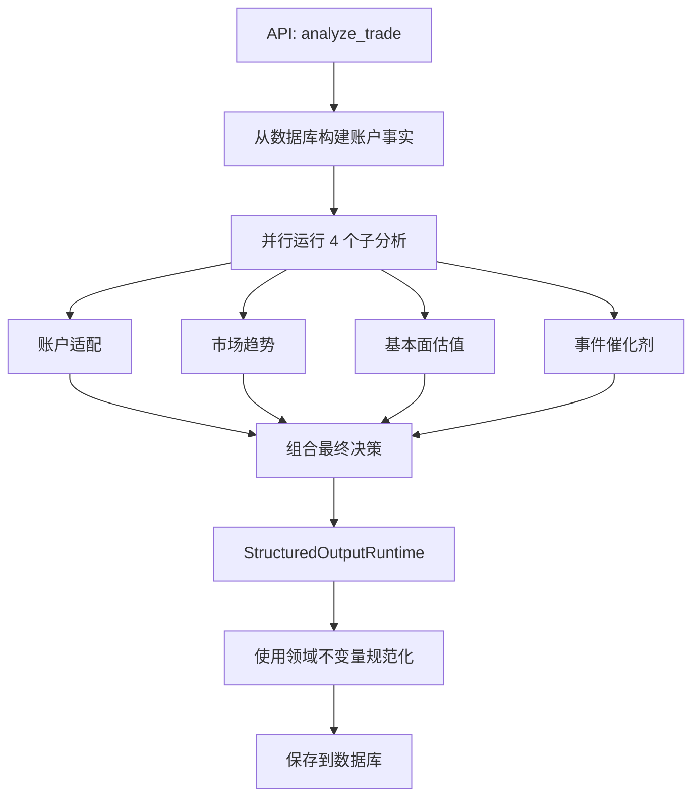
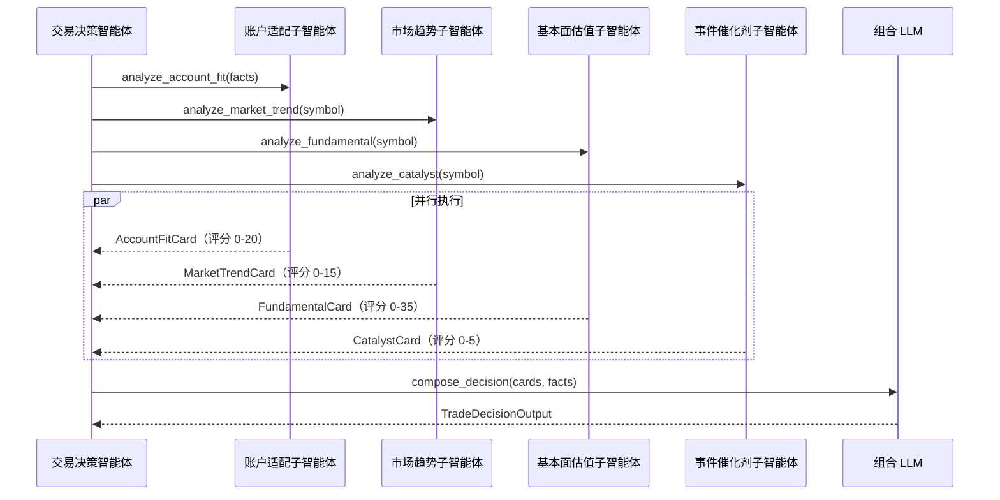

# 交易决策智能体

交易决策智能体分析是否应该**开新仓**或**调整现有持仓**。它运行四个并行子分析，每个产生一个评分"卡片"，然后将它们综合为最终决策。

## 架构



入口点是 `app/agents/trade_decision/agent.py` 中的 `analyze_trade()`。它是一个异步函数，使用 `asyncio.gather` 配合 `ThreadPoolExecutor` 并发运行四个子分析。

```python
# app/agents/trade_decision/agent.py
async def analyze_trade(symbol: str, decision_type: str) -> TradeDecisionOutput:
    # 构建确定性账户事实
    account_facts = build_account_facts(symbol, decision_type)

    # 并行运行 4 个子分析
    account_fit, market_trend, fundamental, catalyst = await asyncio.gather(
        run_account_fit_analysis(account_facts),
        run_market_trend_analysis(symbol),
        run_fundamental_analysis(symbol),
        run_event_catalyst_analysis(symbol),
    )

    # 从所有 4 张卡片组合最终决策
    cards = {
        "account_fit": account_fit,
        "market_trend": market_trend,
        "fundamental_valuation": fundamental,
        "event_catalyst": catalyst,
    }
    decision = await compose_final_decision(cards, account_facts)
    return normalize_trade_decision_output(decision)
```

### 4-子智能体并行执行



## 决策类型

| 类型 | 描述 |
|---|---|
| `entry_decision` | 是否应该在此股票开新仓？ |
| `holding_decision` | 是否应该加仓、减仓或维持现有持仓？ |

## 四个子分析

每个子分析作为独立的 `ToolCallingRuntime` 实例运行，有自己的系统提示词和输出 schema。

### 1. 账户适配（评分 0-20）

分析该股票与当前投资组合的适配程度。此子分析**不使用** MCP 工具 -- 纯粹使用 IBKR 账户数据和 LLM 推理。

**输出字段**：`summary`、`score`、`stance`、`account_fit_level`、`deployable_liquidity`、`current_position_pct`、`max_suggested_position_pct`、`suggested_cash_amount`、`position_size_label`、`key_points`、`risks`、`historical_mistake_flags`

**关键考量**：
- 当前投资组合集中度
- 可用现金和流动性
- 相对于账户规模的仓位大小
- 此股票的历史错误模式

### 2. 市场趋势（评分 0-15）

分析价格趋势、波动性和技术信号。使用 MCP 工具从 Longbridge 获取公共市场数据。

**输出字段**：`summary`、`score`、`stance`、`price_trend`、`relative_to_benchmark`、`recent_return_pct`、`volatility_summary`、`volume_signal`、`support_resistance`、`sector_view`、`key_points`、`risks`

**关键考量**：
- 价格趋势方向和强度
- 成交量模式
- 支撑/阻力位
- 行业和基准比较

### 3. 基本面估值（评分 0-35）

分析公司基本面和估值指标。使用 MCP 工具获取财务数据。

**输出字段**：`summary`、`score`、`stance`、`company_name`、`market_cap`、`pe_ttm`、`forward_pe`、`revenue_growth_summary`、`profitability_summary`、`valuation_summary`、`peer_relative_note`、`key_points`、`risks`

**关键考量**：
- 营收和盈利增长
- 利润率
- PE、PB 和其他估值比率
- 同行比较

### 4. 事件催化剂（评分 0-5）

分析即将发生的事件和新闻催化剂。使用 MCP 工具获取新闻和事件数据。

**输出字段**：`summary`、`score`、`stance`、`next_earnings_date`、`recent_news_count`、`key_events`、`sentiment`、`catalyst_strength`、`risk_events`、`key_points`、`risks`

**关键考量**：
- 即将到来的财报日期
- 近期新闻情绪
- 监管或产品事件
- 风险事件（诉讼、调查）

## 评分维度

最终决策使用 7 个评分维度，共 100 分：

| 维度 | 最大分数 | 来源 | 测量内容 |
|---|---|---|---|
| `fundamental_quality_score` | 20 | 基本面卡片 | 营收增长、盈利能力、业务质量 |
| `valuation_score` | 15 | 基本面卡片 | PE、PB、同行比较、估值吸引力 |
| `trend_score` | 15 | 市场趋势卡片 | 价格趋势、动量、成交量信号 |
| `account_fit_score` | 20 | 账户适配卡片 | 投资组合适配、仓位大小、流动性 |
| `risk_reward_score` | 15 | 综合 | 跨所有信号的风险收益比 |
| `review_constraint_score` | 10 | 从复盘历史综合 | 此股票历史不良交易的惩罚 |
| `event_catalyst_score` | 5 | 事件催化剂卡片 | 即将到来的事件、新闻催化剂 |

## 决策输出 Schema

`TradeDecisionOutput` Pydantic 模型定义输出结构：

```python
# app/agents/trade_decision/output_schema.py
class TradeDecisionOutput(FlexibleModel):
    symbol: str | None = None
    decision_type: str = ""          # "entry_decision" 或 "holding_decision"
    overall_score: float = 0         # 0-100
    rating: str | None = None        # "strong_buy_or_hold", "positive", "neutral", "negative"
    action: str = "watchlist"         # "add", "hold", "reduce", "sell", "wait", "avoid", "watchlist"
    confidence: str = "low"           # "high", "medium", "low"
    decision_summary: str = ""
    score_detail: dict[str, ScoreItem]
    position_advice: dict[str, Any]
    execution_plan: dict[str, Any]
    key_reasons: list[str]
    major_risks: list[str]
    review_warnings: list[str]
    data_limitations: list[str]
    evidence_used: list[str]
```

### 评级推导

评级从总分推导：

| 分数范围 | 评级 |
|---|---|
| >= 85 | `strong_buy_or_hold` |
| >= 70 | `positive` |
| >= 50 | `neutral` |
| < 50 | `negative` |

### 仓位建议

`position_advice` 字段提供具体的仓位大小指导：

```json
{
  "current_position_pct": 0.05,
  "suggested_target_position_pct": 0.08,
  "max_position_pct": 0.15,
  "suggested_cash_amount": 5000,
  "position_size_label": "small"
}
```

### 执行计划

`execution_plan` 字段提供分步指导：

```json
{
  "should_act_now": true,
  "plan": [
    {"step": 1, "condition": "价格回落至 50 日均线", "action": "add_small", "amount": 3000}
  ],
  "invalid_conditions": ["财报不及预期", "行业下调"],
  "recheck_triggers": ["下次财报后"]
}
```

## 规范化与安全

LLM 产生输出后，`app/agents/invariants.py` 中的 `normalize_trade_decision_output()` 强制执行：

- **操作规范化**：中文别名如 "逢低加仓" 映射到 `add_small`
- **置信度降级**：如果存在 4 个以上数据限制，置信度封顶为 `medium`
- **评级封顶**：如果关键 Longbridge 数据缺失，`strong_buy_or_hold` 封顶为 `positive`
- **操作协调**：如果 `should_act_now` 为 false 或 `suggested_cash_amount` 为 0，买入操作降级为 `hold`
- **强制性语言软化**："必须买入" 变为 "观察待满足预设条件"

## 降级行为

如果 LLM 失败或返回无效输出，降级返回：

```json
{
  "action": "watchlist",
  "confidence": "low",
  "rating": "negative",
  "decision_summary": "分析失败；建议观察。",
  "key_reasons": ["数据不足，无法进行可靠分析"],
  "major_risks": ["数据不足"]
}
```

## API 使用

```
POST /api/trade-decision
{
  "symbol": "AAPL.US",
  "decision_type": "entry_decision",
  "question": "鉴于最近的回调，我应该买入 AAPL 吗？"
}
```

响应包含完整的决策文档，包括证据包、评分明细和执行计划。
