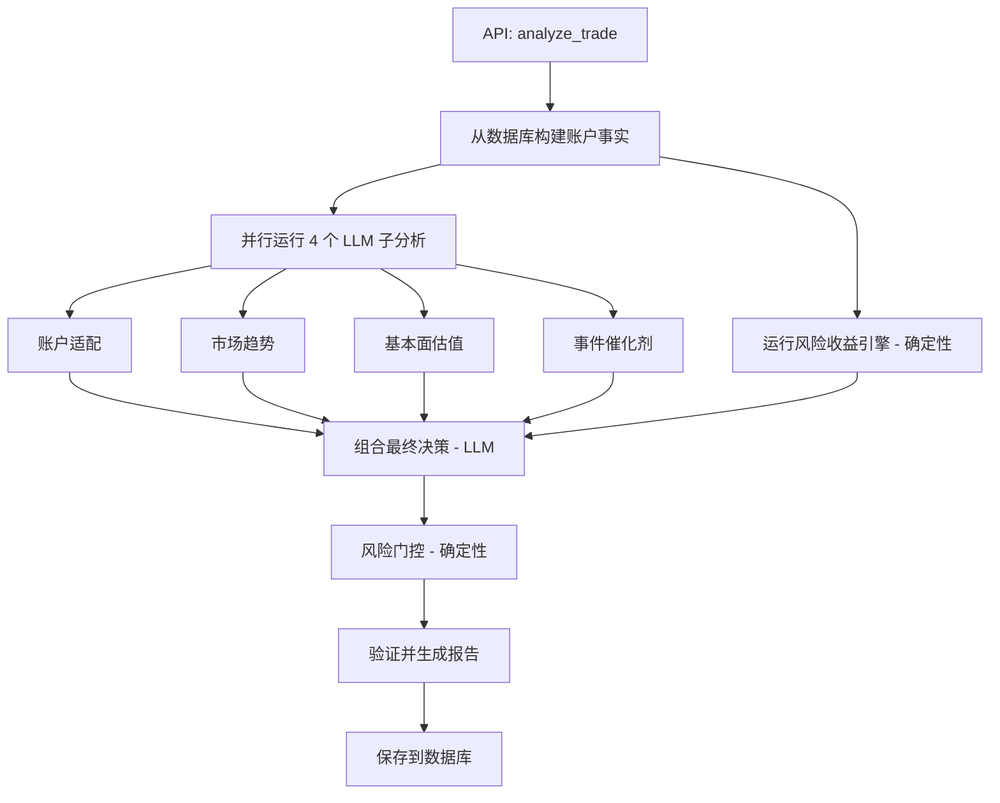

# 交易决策智能体

交易决策智能体分析是否应该**开新仓**或**调整现有持仓**。它运行五个子分析（4 个 LLM + 1 个确定性），通过 LLM 组合器综合，然后应用**确定性风险门控 (Risk Gate)** 确保安全。

## 架构



## 五个子分析

### 1. 账户适配 (LLM, 0-20 分)

分析标的与当前投资组合的适配程度。仅使用 IBKR 账户数据，不调用 MCP 工具。

### 2. 市场趋势 (LLM, 0-15 分)

分析价格趋势、波动率和技术信号。使用 `TechnicalSignalEngine` 增强（trend_break_level、支撑/阻力、相对强弱）。

### 3. 基本面估值 (LLM, 0-35 分)

分析公司基本面和估值。使用 `FundamentalChangeEngine` 增强（fundamental_status、thesis_broken、变化信号）。

### 4. 事件催化剂 (LLM, 0-5 分)

分析即将到来的事件和新闻催化剂。

### 5. 风险收益 (确定性, 0-15 分)

**不调用 LLM。** 使用三个确定性引擎：

- **TechnicalSignalEngine** → MA20/50/200、ATR14、支撑/阻力、趋势破位等级
- **RiskRewardEngine** → 上行/下行估算、R 倍数、操作指引、止损/失效价位
- **InvestmentThesis** → 每标的最大仓位、风险类别、卖出/禁止加仓触发条件

## 风险门控

LLM 组合器产生决策后，**风险门控**应用确定性安全规则，可以降级或阻止不安全的操作。

### 门控规则

| 规则 | 触发条件 | 效果 |
|------|---------|------|
| **恐慌检测** | 用户要求清仓但基本面完好 | `panic_blocked` |
| **缺少仓位上限** | `add` 但无 `max_position_pct` | → `hold_no_add` |
| **缺少失效条件** | 强 `add` 但无 `invalid_conditions` | → `add_on_pullback` |
| **数据不足** | 2+ 公开数据 fallback | → `hold_no_add` |
| **催化剂偏弱** | `add` 但催化剂弱 | → `hold_no_add` |
| **已达仓位上限** | 已达/超过最大仓位 | → `hold_no_add` |
| **趋势严重破位** | `trend_break_level = severe` | 阻止所有 `add` |
| **趋势破位** | `trend_break_level = broken` | 阻止所有 `add` |
| **趋势警告** | `trend_break_level = warning` | 阻止强 `add` |
| **投资论点仓位上限** | 已达论点最大仓位 | → `hold_no_add` |
| **极端风险类别** | `risk_class = extreme` | 阻止强 `add` |
| **卖出触发命中** | 投资论点卖出规则匹配 | → `reduce_now` |
| **基本面红色** | `fundamental_status = red` | → `reduce_now` |
| **R/R < 1.0** | `reward_risk_ratio < 1.0` | → `reduce_now` |
| **严重破坏** | 所有信号看跌 | → `reduce_now` |

### 操作词汇表

| 操作 | 含义 |
|------|------|
| `add` / `add_small` / `add_batch` | 增加持仓 |
| `add_on_pullback` | 仅在回调后增仓 |
| `add_right_side` | 确认上升趋势后增仓 |
| `hold` / `hold_no_add` | 维持当前，不增仓 |
| `reduce` / `reduce_now` | 减少持仓 |
| `sell_thesis_broken` | 清仓 — 投资论点失效 |
| `wait` / `watchlist` / `avoid` | 暂不操作 |
| `panic_blocked` | 检测到恐慌，操作被阻止 |

## API 使用

```
POST /api/trade-decision/analyze
{
  "symbol": "AAPL.US",
  "decision_type": "entry_decision",
  "question": "考虑到最近的回调，我应该买入 AAPL 吗？"
}
```

响应包含完整决策文档，含证据包（5 张卡片）、风险门控结果、评分明细和执行计划。
