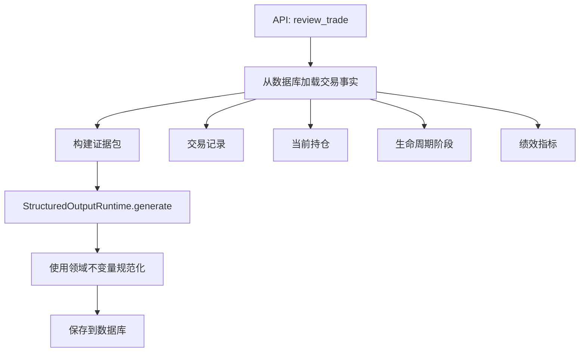
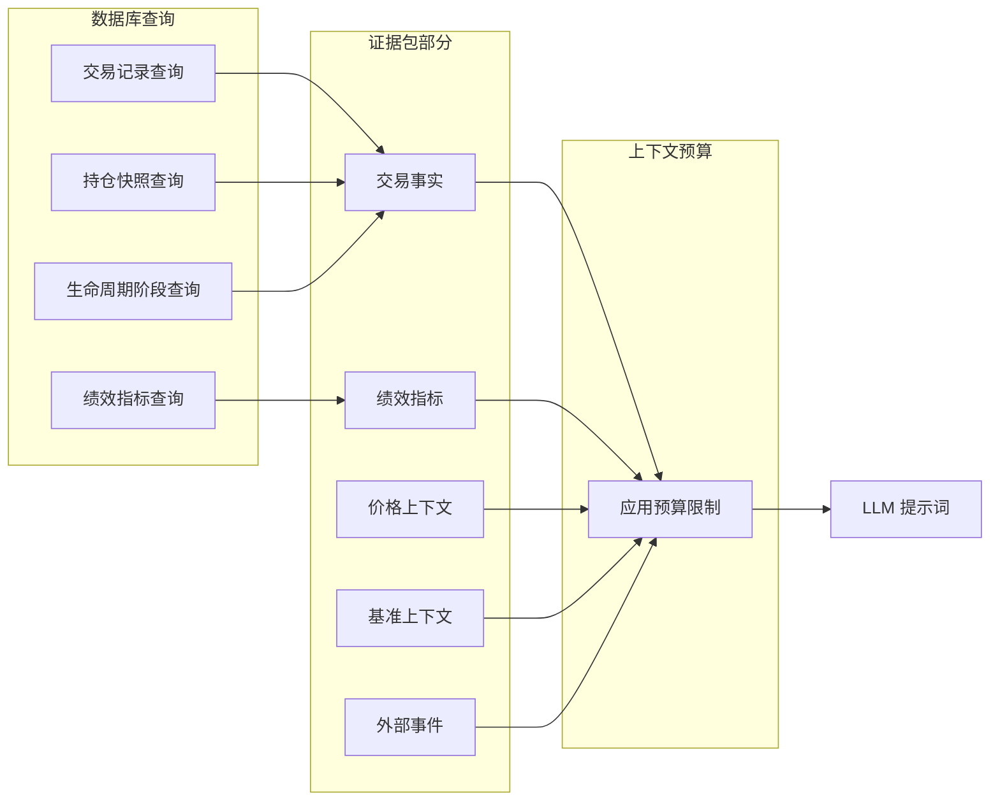
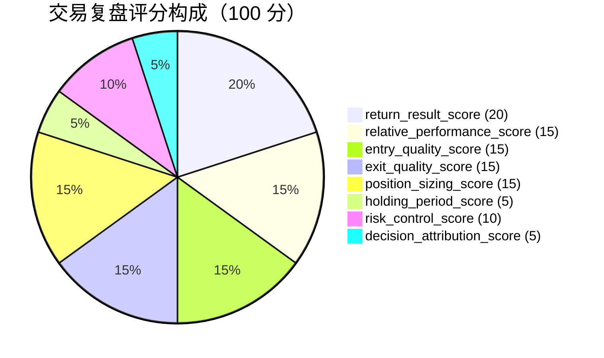
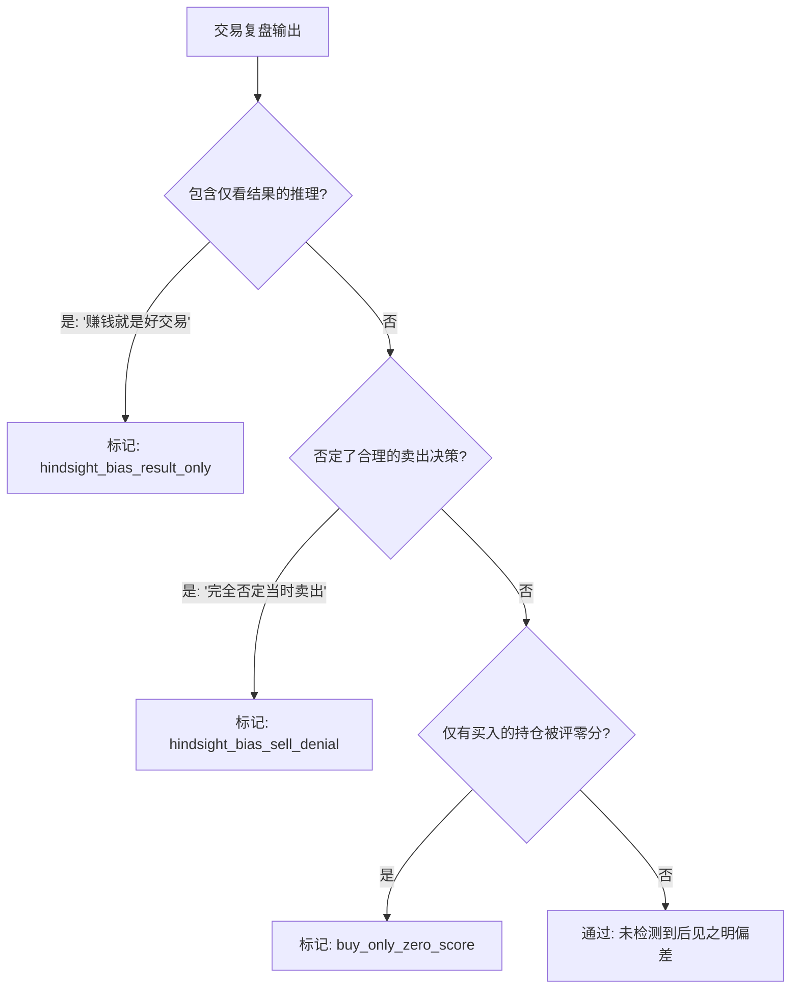

# 交易复盘智能体

交易复盘智能体评估您在特定股票或交易上的历史交易表现。它在八个维度上评分，识别行为模式，并标记常见的交易错误。

## 工作原理

入口点是 `app/agents/trade_review/agent.py` 中的 `review_trade()`。它遵循四步管道：



### 证据收集流程



## 复盘类型

| 类型 | 描述 |
|---|---|
| `single_trade_review` | 通过交易 ID 复盘特定交易 |
| `symbol_level_review` | 复盘某股票在日期范围内的所有交易 |

## 交易事实

智能体从数据库加载这些确定性事实：

- **交易记录**：该股票的所有买入/卖出交易
- **当前持仓**：持仓是否仍然开放、当前数量和价值
- **生命周期阶段**：`open`（仍持有）或 `closed`（已完全退出）
- **绩效指标**：总买入/卖出、佣金、已实现 PnL、交易次数
- **首次买入日期 / 最后交易日期**：交易历史的时间边界

## 八个评分维度

交易复盘在八个维度上评分，共 100 分：

| 维度 | 最大分数 | 测量内容 |
|---|---|---|
| `return_result_score` | 20 | 交易的绝对回报 |
| `relative_performance_score` | 15 | 相对于基准（如标普 500）的表现 |
| `entry_quality_score` | 15 | 建仓时机是否合理？是否以合理价格买入？ |
| `exit_quality_score` | 15 | 平仓时机是否合理？是否卖出过早或过晚？ |
| `position_sizing_score` | 15 | 仓位大小是否适合账户？ |
| `holding_period_score` | 5 | 持有期是否合理？ |
| `risk_control_score` | 10 | 是否设置了止损或风险限制？ |
| `decision_attribution_score` | 5 | 决策是基于分析还是情绪？ |

### 未平仓持仓的平仓质量

对于仍然开放的持仓（无卖出交易），`exit_quality_score` 被标记为**不适用**，并从总计中排除。这防止 LLM 惩罚尚未平仓的交易。

对于仅有买入的未平仓持仓，系统对 `entry_quality_score`（5.0）、`position_sizing_score`（3.0）、`holding_period_score`（1.0）和 `risk_control_score`（1.0）强制执行最低分数，避免零分输出。

### 评分明细图



## 评级推导

总分计算为 `(raw_score / applicable_max_score) * 100`，然后映射到评级：

| 分数范围 | 评级 |
|---|---|
| >= 85 | `excellent` |
| >= 70 | `good` |
| >= 50 | `average` |
| < 50 | `poor` |

## 错误标签

智能体可以从以下允许的集合中标记常见的交易错误：

### 负面标签（行为错误）

| 标签 | 含义 | 类别 |
|---|---|---|
| `CHASE_HIGH` | 大幅上涨后追高买入 | 建仓错误 |
| `SELL_TOO_EARLY` | 行情未走完就退出 | 平仓错误 |
| `SELL_TOO_LATE` | 持有过久，回吐利润 | 平仓错误 |
| `PANIC_SELL` | 恐慌/暴跌中卖出 | 情绪错误 |
| `POSITION_TOO_SMALL` | 仓位太小，无足轻重 | 仓位错误 |
| `POSITION_TOO_LARGE` | 仓位太大，超出账户承受能力 | 仓位错误 |
| `MISSED_OPPORTUNITY` | 识别了交易机会但未执行 | 执行错误 |
| `NO_CLEAR_PLAN` | 没有明确的进出场标准 | 规划错误 |
| `WEAK_RELATIVE_PERFORMANCE` | 跑输基准 | 表现问题 |

### 正面标签（良好实践）

| 标签 | 含义 | 类别 |
|---|---|---|
| `GOOD_ENTRY` | 时机良好的建仓 | 良好建仓 |
| `GOOD_EXIT` | 时机良好的平仓 | 良好平仓 |
| `GOOD_POSITION_SIZING` | 合理的仓位大小 | 良好仓位 |
| `GOOD_TREND_FOLLOW` | 成功跟随趋势 | 良好策略 |
| `GOOD_RISK_CONTROL` | 良好的风险管理 | 良好风控 |

LLM 产生的未知标签被过滤掉并添加到 `data_limitations`。

## 反后见之明偏差

评估工具包含检查以防止**后见之明偏差** -- 基于当时未知的结果来评判过去决策的倾向：



- "赚钱就是好交易"（赚钱就是好交易）被标记为仅看结果的思维
- "完全否定当时卖出"（完全否定当时卖出）在复盘后见之明场景时被标记
- 仅有买入的未平仓持仓不会因为没有平仓而自动评零分

## 输出 Schema

```python
# app/agents/trade_review/output_schema.py
class TradeReviewOutput(FlexibleModel):
    symbol: str | None = None
    review_type: str | None = None
    overall_score: float = 0
    rating: str | None = None
    score_detail: dict[str, ScoreItem]
    summary: str | None = None
    strengths: list[str]
    weaknesses: list[str]
    mistake_tags: list[str]
    improvement_suggestions: list[str]
    data_limitations: list[str]
    evidence_used: list[str]
```

## 证据包

交易复盘的证据包包括：

- **交易事实**：正在复盘的交易、生命周期阶段、当前持仓
- **绩效指标**：程序计算的回报、总买入/卖出、佣金
- **价格上下文**：首次买入价格、最后卖出价格、期间最高/最低价
- **基准上下文**：来自 Longbridge 的公共基准回报
- **外部事件**：交易期间的新闻和事件

## 降级行为

如果 LLM 失败，降级返回：

```json
{
  "overall_score": 50,
  "rating": "neutral",
  "summary": "交易复盘失败；使用保守的中性评估。",
  "weaknesses": ["数据不足，无法进行可靠复盘"],
  "improvement_suggestions": ["当 LLM 输出恢复时重试复盘"]
}
```

## API 使用

**股票级复盘：**
```
POST /api/trade-review
{
  "symbol": "AAPL.US",
  "start_date": "2024-01-01",
  "end_date": "2024-12-31"
}
```

**单笔交易复盘：**
```
POST /api/trade-review
{
  "symbol": "AAPL.US",
  "trade_id": "12345"
}
```
