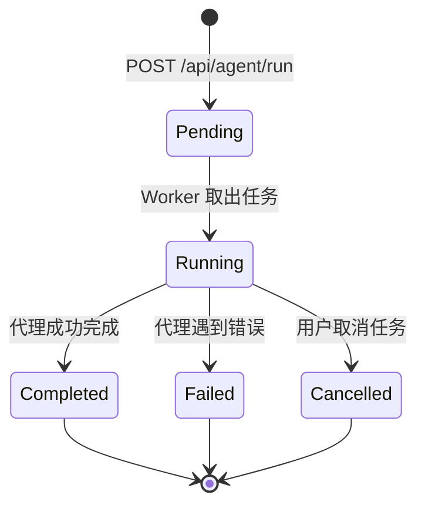
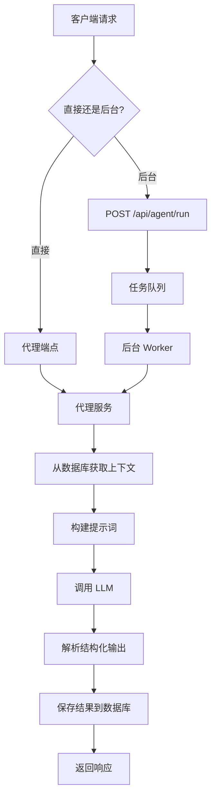

# AI 代理 API

IBKR Dash 包含四个专门的 AI 代理，使用 LLM 驱动的推理来分析您的投资组合数据。每个代理专注于特定任务：交易决策、交易复盘、每日持仓审查和风险评估。

您可以通过两种方式运行代理：
- **直接端点** -- 每个代理有自己的端点，同步返回结果。
- **后台任务** -- 使用 `/api/agent/run` 端点在后台运行代理并轮询结果。

---

## 代理任务生命周期



---

## 代理架构



---

## 代理概览

| 代理 | 前缀 | 用途 |
|------|------|------|
| 交易决策 | `/api/trade-decision` | 我应该买入/卖出/持有某个标的吗？ |
| 交易复盘 | `/api/trade-review` | 复盘过去的交易以获取经验教训 |
| 每日持仓审查 | `/api/daily-position-review` | 每日投资组合健康检查 |
| 风险评估 | `/api/risk-assessment` | 投资组合全局风险分析 |

所有代理端点受速率限制（每 IP 每 60 秒 20 次请求）。

---

## 交易决策代理

分析是否应该进入、持有或退出某个标的的仓位。

### 端点

| 方法 | 路径 | 说明 |
|------|------|------|
| POST | `/api/trade-decision/analyze` | 运行交易决策分析 |
| GET | `/api/trade-decision/decisions` | 列出历史决策 |
| GET | `/api/trade-decision/decisions/{decision_id}` | 获取特定决策 |
| GET | `/api/trade-decision/health` | 健康检查 |

### 运行分析

```bash
# 入场决策
curl -X POST "http://localhost:8000/api/trade-decision/analyze" \
  -H "Content-Type: application/json" \
  -d '{"symbol": "AAPL", "decision_type": "entry_decision"}'

# 持有决策（含自定义问题）
curl -X POST "http://localhost:8000/api/trade-decision/analyze" \
  -H "Content-Type: application/json" \
  -d '{"symbol": "AAPL", "decision_type": "holding_decision", "question": "Should I add more shares?"}'
```

**请求体：**

| 字段 | 类型 | 必填 | 说明 |
|------|------|------|------|
| `symbol` | string | 是 | 要分析的股票代码 |
| `decision_type` | string | 否 | `entry_decision`（默认）或 `holding_decision` |
| `question` | string | 否 | 给代理的自定义问题 |

**响应：**

```json
{
  "id": "td-abc-123",
  "decision_type": "entry_decision",
  "symbol": "AAPL",
  "decision_output": {
    "recommendation": "BUY",
    "confidence": "high",
    "reasoning": "Strong fundamentals with...",
    "target_price": 200.00,
    "risk_factors": ["Market volatility", "Earnings upcoming"]
  },
  "metadata": {
    "model": "gpt-4o",
    "tokens_used": 2500
  },
  "evidence_summary": {
    "positions": [...],
    "recent_trades": [...]
  },
  "run_trace": [],
  "created_at": "2024-01-15T10:30:00"
}
```

### 列出决策

```bash
curl "http://localhost:8000/api/trade-decision/decisions?limit=10&symbol=AAPL"
```

| 参数 | 类型 | 默认值 | 说明 |
|------|------|--------|------|
| `limit` | int | `20` | 最大结果数（1-100） |
| `symbol` | string | - | 按标的筛选 |
| `decision_type` | string | - | 按类型筛选 |

### 获取特定决策

```bash
curl "http://localhost:8000/api/trade-decision/decisions/td-abc-123"
```

### 健康检查

```bash
curl "http://localhost:8000/api/trade-decision/health"
```

```json
{
  "status": "ok",
  "agent": "trade_decision"
}
```

---

## 交易复盘代理

复盘某个标的的历史交易，识别模式、错误和经验教训。

### 端点

| 方法 | 路径 | 说明 |
|------|------|------|
| POST | `/api/trade-review/review` | 触发交易复盘 |
| GET | `/api/trade-review/reviews` | 列出历史复盘 |
| GET | `/api/trade-review/reviews/{review_id}` | 获取特定复盘 |
| GET | `/api/trade-review/health` | 健康检查 |

### 运行复盘

```bash
# 复盘某个标的的所有交易
curl -X POST "http://localhost:8000/api/trade-review/review" \
  -H "Content-Type: application/json" \
  -d '{"symbol": "AAPL"}'

# 复盘特定交易
curl -X POST "http://localhost:8000/api/trade-review/review" \
  -H "Content-Type: application/json" \
  -d '{"symbol": "AAPL", "trade_id": "T12345"}'

# 复盘日期范围内的交易
curl -X POST "http://localhost:8000/api/trade-review/review" \
  -H "Content-Type: application/json" \
  -d '{"symbol": "AAPL", "start_date": "2024-01-01", "end_date": "2024-01-31"}'
```

**请求体：**

| 字段 | 类型 | 必填 | 说明 |
|------|------|------|------|
| `symbol` | string | 是 | 要复盘的股票代码 |
| `trade_id` | string | 否 | 要复盘的特定交易 ID |
| `start_date` | string | 否 | 筛选此日期之后的交易 |
| `end_date` | string | 否 | 筛选此日期之前的交易 |

### 列出复盘

```bash
curl "http://localhost:8000/api/trade-review/reviews?limit=10&symbol=AAPL"
```

### 获取特定复盘

```bash
curl "http://localhost:8000/api/trade-review/reviews/review-abc-123"
```

### 健康检查

```bash
curl "http://localhost:8000/api/trade-review/health"
```

---

## 每日持仓审查代理

生成投资组合持仓的每日健康检查。

### 端点

| 方法 | 路径 | 说明 |
|------|------|------|
| POST | `/api/daily-position-review/generate` | 生成每日审查 |
| GET | `/api/daily-position-review/dates` | 列出可用的审查日期 |
| GET | `/api/daily-position-review/reviews/{date}` | 获取特定日期的审查 |
| GET | `/api/daily-position-review/health` | 健康检查 |

### 生成审查

```bash
# 为最新日期生成
curl -X POST "http://localhost:8000/api/daily-position-review/generate" \
  -H "Content-Type: application/json" \
  -d '{"report_date": ""}'

# 为特定日期生成
curl -X POST "http://localhost:8000/api/daily-position-review/generate" \
  -H "Content-Type: application/json" \
  -d '{"report_date": "2024-01-15"}'
```

### 列出可用日期

```bash
curl "http://localhost:8000/api/daily-position-review/dates?limit=30"
```

返回有审查的日期列表：

```json
{
  "items": ["2024-01-15", "2024-01-14", "2024-01-13"]
}
```

### 获取特定日期的审查

```bash
curl "http://localhost:8000/api/daily-position-review/reviews/2024-01-15"
```

---

## 风险评估代理

分析投资组合全局风险，包括集中度、多元化和敞口。

### 端点

| 方法 | 路径 | 说明 |
|------|------|------|
| POST | `/api/risk-assessment/assess` | 运行风险评估 |
| GET | `/api/risk-assessment/assessments` | 列出历史评估 |
| GET | `/api/risk-assessment/assessments/{assessment_id}` | 获取特定评估 |
| GET | `/api/risk-assessment/health` | 健康检查 |

### 运行评估

```bash
# 默认风险评估
curl -X POST "http://localhost:8000/api/risk-assessment/assess" \
  -H "Content-Type: application/json" \
  -d '{}'

# 带自定义问题
curl -X POST "http://localhost:8000/api/risk-assessment/assess" \
  -H "Content-Type: application/json" \
  -d '{"question": "What is my exposure to tech stocks?"}'
```

### 列出评估

```bash
curl "http://localhost:8000/api/risk-assessment/assessments?limit=10"
```

### 获取特定评估

```bash
curl "http://localhost:8000/api/risk-assessment/assessments/assess-abc-123"
```

### 健康检查

```bash
curl "http://localhost:8000/api/risk-assessment/health"
```

---

## 后台任务运行器

对于长时间运行的代理任务，请使用后台任务 API。这会立即返回任务 ID，您可以轮询结果。

### 运行后台任务

```bash
curl -X POST "http://localhost:8000/api/agent/run" \
  -H "Content-Type: application/json" \
  -d '{"agent_name": "daily_review", "report_date": "2024-01-15"}'
```

**请求体：**

| 字段 | 类型 | 必填 | 说明 |
|------|------|------|------|
| `agent_name` | string | 是 | `daily_review`、`trade_decision`、`trade_review` 或 `risk_assessment` |
| `symbol` | string | 交易代理需要 | 股票代码 |
| `trade_id` | string | 否 | 特定交易 ID |
| `report_date` | string | 否 | 每日审查的日期 |
| `question` | string | 否 | 自定义问题 |
| `decision_type` | string | 否 | `entry_decision` 或 `holding_decision` |

**响应：**

```json
{
  "id": "task-abc-123",
  "agent_name": "daily_review",
  "status": "running",
  "progress": null,
  "result": null,
  "error": null,
  "created_at": "2024-01-15T10:30:00",
  "started_at": "2024-01-15T10:30:01",
  "finished_at": null
}
```

### 轮询任务状态

```bash
curl "http://localhost:8000/api/agent/tasks/task-abc-123"
```

**已完成响应：**

```json
{
  "id": "task-abc-123",
  "agent_name": "daily_review",
  "status": "completed",
  "progress": 100,
  "result": {
    "review_date": "2024-01-15",
    "summary": "Portfolio is well-diversified...",
    "cards": [...]
  },
  "error": null,
  "created_at": "2024-01-15T10:30:00",
  "started_at": "2024-01-15T10:30:01",
  "finished_at": "2024-01-15T10:30:45"
}
```

状态值：`pending`（待处理）、`running`（运行中）、`completed`（已完成）、`failed`（失败）、`cancelled`（已取消）。

### 列出任务

```bash
curl "http://localhost:8000/api/agent/tasks?agent_name=daily_review&status=completed&limit=10"
```

### 取消任务

```bash
curl -X POST "http://localhost:8000/api/agent/tasks/task-abc-123/cancel"
```

---

## 错误处理

| 状态码 | 响应体 | 原因 |
|--------|--------|------|
| `400` | `{"detail":"symbol is required"}` | 缺少必需参数 |
| `401` | `{"detail":"Not authenticated"}` | 会话缺失或已过期 |
| `404` | `{"detail":"Task not found"}` | 任务 ID 不存在 |
| `422` | `{"detail":"No data available..."}` | 请求的分析没有数据 |
| `429` | `{"detail":"Rate limit exceeded..."}` | LLM 请求过多 |
| `500` | `{"detail":"Analysis failed: ..."}` | LLM 或代理运行时错误 |
