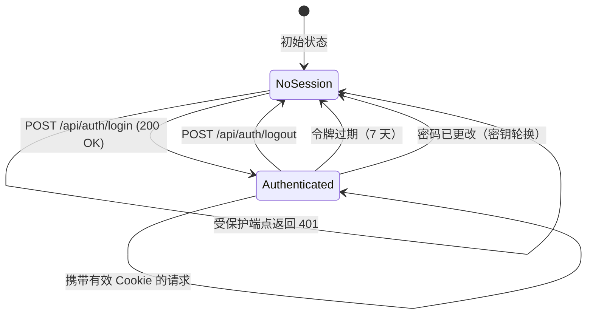
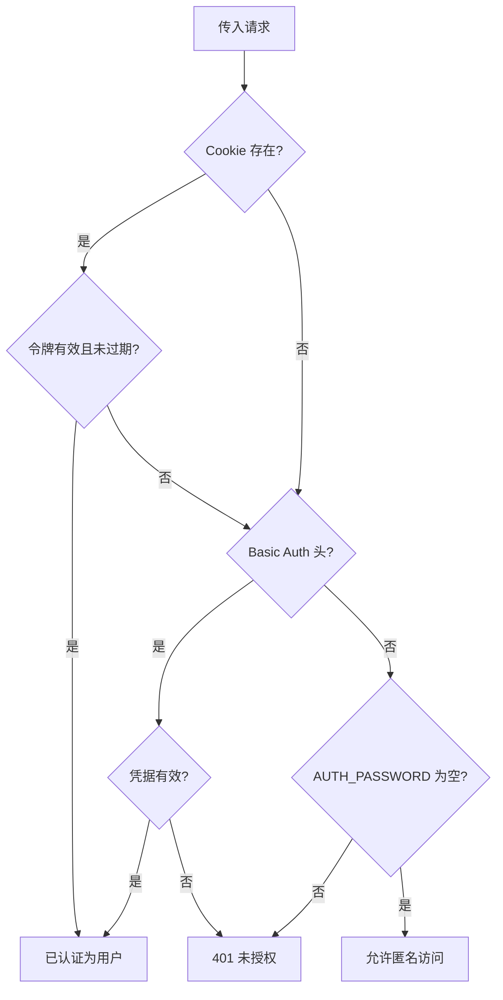

# 身份验证 API

IBKR Dash 使用存储在 `httpOnly` Cookie 中的 HMAC 签名会话令牌进行身份验证。当环境中未设置 `AUTH_PASSWORD` 时，所有端点均可无需登录公开访问。

---

## 端点

| 方法 | 路径 | 说明 |
|------|------|------|
| `POST` | `/api/auth/login` | 登录并获取会话 Cookie |
| `POST` | `/api/auth/logout` | 清除会话 Cookie |
| `GET` | `/api/auth/session` | 检查当前会话状态 |

---

## 登录时序图

```mermaid
sequenceDiagram
    participant Browser as 浏览器
    participant FastAPI as FastAPI 服务器
    participant Auth as 身份验证模块
    participant HMAC as HMAC-SHA256

    Browser->>FastAPI: POST /api/auth/login<br/>{username, password}

    alt AUTH_PASSWORD 为空
        FastAPI->>Auth: 跳过验证
        Auth-->>FastAPI: 接受任意凭据
    else AUTH_PASSWORD 已设置
        FastAPI->>Auth: 验证凭据
        Auth->>Auth: secrets.compare_digest(password, AUTH_PASSWORD)
        alt 密码无效
            Auth-->>FastAPI: 身份验证失败
            FastAPI-->>Browser: 401 {"detail": "Invalid username or password"}
        end
    end

    FastAPI->>HMAC: 生成令牌
    HMAC->>HMAC: payload = base64({username, expires_at})
    HMAC->>HMAC: signature = HMAC-SHA256(payload, secret)
    HMAC-->>FastAPI: token = payload + "." + signature
    FastAPI-->>Browser: 200 OK<br/>Set-Cookie: ibkr_dash_session=token; HttpOnly; SameSite=Lax; Max-Age=604800
```

---

## POST /api/auth/login

使用用户名和密码进行身份验证。成功后，服务器设置会话 Cookie。

### 请求

```json
{
  "username": "admin",
  "password": "your-password"
}
```

| 字段 | 类型 | 必填 | 说明 |
|------|------|------|------|
| `username` | string | 是 | 必须匹配 `AUTH_USERNAME` 设置 |
| `password` | string | 是 | 必须匹配 `AUTH_PASSWORD` 设置 |

### 成功响应 (200)

```json
{
  "authenticated": true,
  "username": "admin"
}
```

响应同时设置 `Set-Cookie` 头：

```
Set-Cookie: ibkr_dash_session=<token>; Max-Age=604800; HttpOnly; SameSite=Lax; Path=/
```

会话 Cookie 的特性：

- `httpOnly`（JavaScript 无法访问）
- `SameSite=Lax`（同站导航和顶层跨站 GET 请求时发送）
- 有效期 **7 天**（604,800 秒）
- 作用域为 `/`（所有路径）

### 错误响应 (401)

```json
{
  "detail": "Invalid username or password"
}
```

### 示例

```bash
curl -X POST http://localhost:8000/api/auth/login \
  -H "Content-Type: application/json" \
  -d '{"username": "admin", "password": "my-secret"}' \
  -c cookies.txt
```

### 身份验证禁用时

如果 `.env` 中 `AUTH_PASSWORD` 为空，登录端点接受**任意**凭据并返回有效会话。这在本地开发时很方便，但绝不应在生产环境中使用。

---

## POST /api/auth/logout

清除会话 Cookie。返回当前（已取消认证的）会话状态。

### 请求

无需请求体。会话 Cookie 会被自动识别。

### 响应 (200)

```json
{
  "authenticated": false,
  "username": null
}
```

响应清除 Cookie：

```
Set-Cookie: ibkr_dash_session=; Max-Age=0; Path=/; SameSite=Lax
```

### 示例

```bash
curl -X POST http://localhost:8000/api/auth/logout -b cookies.txt
```

---

## GET /api/auth/session

检查当前请求是否具有有效会话。这是一个轻量级端点，不需要身份验证 -- 它仅报告是否存在有效的会话 Cookie。

### 请求

无参数。会话 Cookie 从请求中自动读取。

### 响应 (200)

**已认证：**

```json
{
  "authenticated": true,
  "username": "admin"
}
```

**未认证：**

```json
{
  "authenticated": false,
  "username": null
}
```

### 示例

```bash
# 检查是否已登录
curl -b cookies.txt http://localhost:8000/api/auth/session
```

---

## Cookie 生命周期



---

## 会话工作原理

### 令牌格式

会话令牌是一个由点分隔的两部分字符串：

```
<base64-payload>.<hex-signature>
```

- **Payload**：Base64 编码的 JSON，包含用户名和过期时间戳
- **Signature**：使用从 `AUTH_PASSWORD` 派生的密钥对 payload 进行的 HMAC-SHA256 签名

**令牌结构示例：**

```
eyJ1c2VybmFtZSI6ImFkbWluIiwiZXhwaXJlc19hdCI6MTcwNzk4NDgwMH0=.a1b2c3d4e5f6...
\________________________________________________________/   \______________/
                    base64(JSON payload)                        hex(HMAC signature)
```

### 令牌验证

当请求携带会话 Cookie 到达时：

1. 服务器从 `ibkr_dash_session` Cookie 中提取令牌。
2. 使用配置的密钥重新计算 HMAC 签名。
3. 使用常量时间比较对比签名（防止时序攻击）。
4. 检查令牌是否已过期。
5. 如果所有检查通过，请求即被认证。

### 安全说明

- 签名密钥使用 SHA-256 从 `AUTH_PASSWORD` 派生。更改密码会使所有现有会话失效。
- 凭据使用 `secrets.compare_digest()` 进行比较，防止基于时序的攻击。
- 会话 Cookie 为 `httpOnly`，浏览器中的 JavaScript 无法读取。

---

## 其他端点中的身份验证

大多数 API 端点需要身份验证。它们使用 `get_current_user` 依赖项：

1. 首先检查 `ibkr_dash_session` Cookie。
2. 回退到 HTTP Basic Auth（`Authorization` 头）。
3. 如果 `AUTH_PASSWORD` 为空，允许匿名访问。
4. 如果需要身份验证但未提供有效凭据，返回 `401 Unauthorized`。



### HTTP Basic Auth 示例

```bash
curl -u admin:your-password http://localhost:8000/api/account/overview
```

### Cookie 认证示例

```bash
# 先登录
curl -X POST http://localhost:8000/api/auth/login \
  -H "Content-Type: application/json" \
  -d '{"username": "admin", "password": "my-secret"}' \
  -c cookies.txt

# 然后使用 Cookie 进行后续请求
curl -b cookies.txt http://localhost:8000/api/account/overview
```

### 前端认证 Hook

```typescript
// 使用会话端点的 React Hook 示例
import { useState, useEffect } from 'react';

export function useAuth() {
  const [isAuthenticated, setIsAuthenticated] = useState(false);
  const [loading, setLoading] = useState(true);

  useEffect(() => {
    fetch('/api/auth/session', { credentials: 'include' })
      .then(res => res.json())
      .then(data => {
        setIsAuthenticated(data.authenticated);
        setLoading(false);
      })
      .catch(() => setLoading(false));
  }, []);

  return { isAuthenticated, loading };
}
```

---

## 数据模型

### LoginRequest

| 字段 | 类型 | 说明 |
|------|------|------|
| `username` | string | 登录用户名 |
| `password` | string | 登录密码 |

### LoginResponse

| 字段 | 类型 | 说明 |
|------|------|------|
| `authenticated` | boolean | 登录是否成功 |
| `username` | string \| null | 已认证的用户名 |

### SessionResponse

| 字段 | 类型 | 说明 |
|------|------|------|
| `authenticated` | boolean | 是否存在有效会话 |
| `username` | string \| null | 会话中的用户名 |
