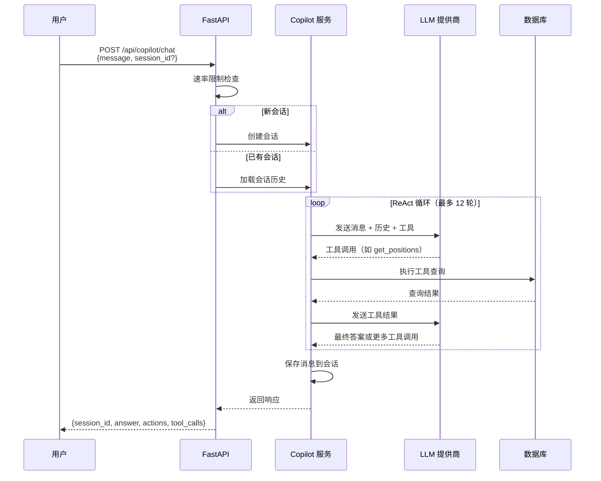
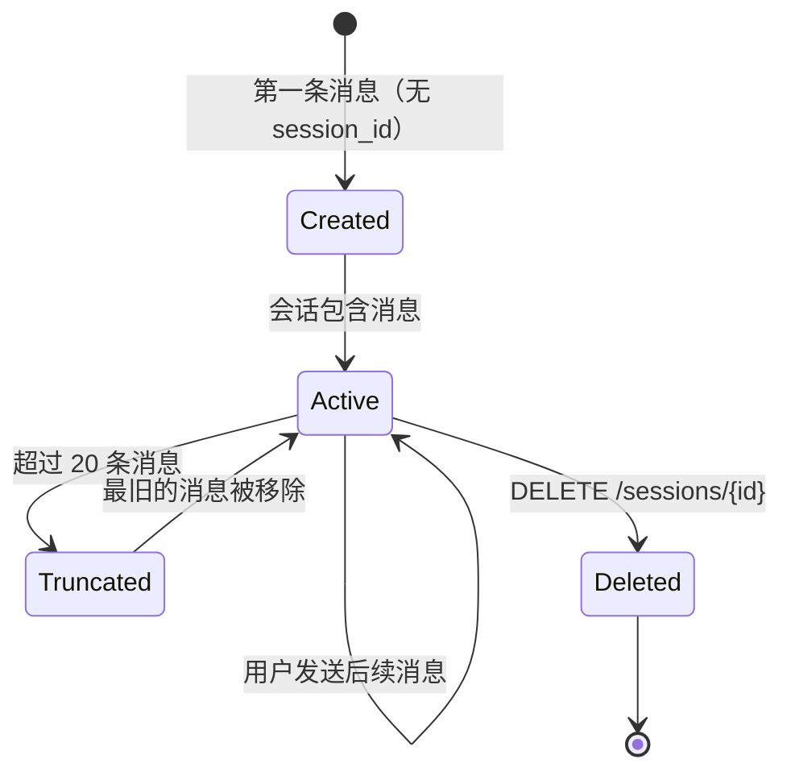

# Copilot API

Copilot 是一个 AI 聊天助手，可以回答关于您投资组合的问题。它使用 ReAct（推理 + 行动）循环，并可访问投资组合数据工具。您可以问"我的主要持仓是什么？"或"AAPL 本月表现如何？"等问题。

---

## 端点

| 方法 | 路径 | 说明 |
|------|------|------|
| POST | `/api/copilot/chat` | 发送消息并获取响应 |
| GET | `/api/copilot/sessions` | 列出所有聊天会话 |
| GET | `/api/copilot/sessions/{session_id}/messages` | 获取会话中的消息 |
| DELETE | `/api/copilot/sessions/{session_id}` | 删除会话及其消息 |

所有端点在 `AUTH_PASSWORD` 非空时需要身份验证。聊天端点受速率限制（每 IP 每 60 秒 20 次请求）。

---

## 聊天流程图



---

## 会话生命周期



- 当未提供 `session_id` 时自动创建会话。
- 每个会话存储完整的对话历史。
- 历史记录被截断为最近 20 条消息，以保持在 LLM 上下文限制内。
- 删除会话会永久移除其所有消息。

---

## 发送消息

向 Copilot 发送消息并接收 AI 生成的响应。如果未提供 `session_id`，将自动创建新会话。

### 请求

```
POST /api/copilot/chat
```

### 请求体

```json
{
  "session_id": null,
  "message": "What are my top 5 holdings by value?"
}
```

| 字段 | 类型 | 必填 | 说明 |
|------|------|------|------|
| `session_id` | string | 否 | 已有会话 ID。省略则创建新会话。 |
| `message` | string | 是 | 您的问题（1-10,000 个字符） |

### 示例

```bash
# 开始新对话
curl -X POST "http://localhost:8000/api/copilot/chat" \
  -H "Content-Type: application/json" \
  -d '{"message": "What are my top holdings?"}'

# 继续已有会话
curl -X POST "http://localhost:8000/api/copilot/chat" \
  -H "Content-Type: application/json" \
  -d '{"session_id": "abc-123", "message": "What about AAPL specifically?"}'
```

### 响应

```json
{
  "session_id": "a1b2c3d4-e5f6-7890-abcd-ef1234567890",
  "run_id": "run-xyz-789",
  "answer": "Your top 5 holdings by value are:\n1. AAPL - $18,550 (7.4% of NAV)\n2. MSFT - $15,200 (6.1% of NAV)\n...",
  "actions": [
    {"tool": "get_positions", "args": {"sort_by": "position_value", "limit": 5}}
  ],
  "tool_calls": [
    {"name": "get_positions", "status": "success"}
  ],
  "pending_approval": null,
  "errors": []
}
```

### 响应字段

| 字段 | 类型 | 说明 |
|------|------|------|
| `session_id` | string | 用于继续对话的会话 ID |
| `run_id` | string | 本次运行的唯一 ID |
| `answer` | string | Copilot 的响应（Markdown 格式） |
| `actions` | list | 推理过程中调用的工具 |
| `tool_calls` | list | 详细的工具调用结果 |
| `pending_approval` | object | 如果设置，Copilot 需要用户确认才能执行 |
| `errors` | list | 运行期间遇到的任何错误 |

### 可用工具

Copilot 可以访问以下投资组合数据工具：

| 工具 | 说明 |
|------|------|
| `get_positions` | 带筛选条件查询当前持仓 |
| `get_position_detail` | 获取特定标的历史 |
| `get_trades` | 带筛选条件查询交易历史 |
| `get_trade_summary` | 获取交易汇总统计 |
| `get_account_overview` | 获取账户级别指标 |
| `get_equity_curve` | 获取权益曲线数据 |
| `get_performance_calendar` | 获取按周期的盈亏 |

### 工作原理

Copilot 使用 **ReAct 循环**（最多 12 轮）：

1. 您发送消息。
2. LLM 推理您的问题并决定调用哪些工具。
3. 工具从数据库获取数据（持仓、交易等）。
4. LLM 使用工具结果生成最终答案。
5. 对话被保存以供未来消息的上下文使用。

Copilot 自动将历史截断为最近 20 条消息，以保持在 LLM 上下文限制内。

---

## 列出会话

获取所有 Copilot 会话及其消息计数的列表。

### 请求

```
GET /api/copilot/sessions
```

### 查询参数

| 参数 | 类型 | 默认值 | 说明 |
|------|------|--------|------|
| `limit` | int | `20` | 返回的最大会话数 |

### 示例

```bash
curl "http://localhost:8000/api/copilot/sessions?limit=10"
```

### 响应

```json
[
  {
    "session_id": "a1b2c3d4-e5f6-7890-abcd-ef1234567890",
    "title": "What are my top holdings?...",
    "created_at": "2024-01-15T10:30:00",
    "message_count": 6
  },
  {
    "session_id": "b2c3d4e5-f6a7-8901-bcde-f12345678901",
    "title": "How is my portfolio performing...",
    "created_at": "2024-01-14T15:00:00",
    "message_count": 4
  }
]
```

---

## 获取会话消息

获取特定会话中的所有消息。

### 请求

```
GET /api/copilot/sessions/{session_id}/messages
```

### 路径参数

| 参数 | 类型 | 说明 |
|------|------|------|
| `session_id` | string | 会话 ID |

### 查询参数

| 参数 | 类型 | 默认值 | 说明 |
|------|------|--------|------|
| `limit` | int | `100` | 返回的最大消息数 |

### 示例

```bash
curl "http://localhost:8000/api/copilot/sessions/a1b2c3d4/messages"
```

### 响应

```json
[
  {
    "id": 1,
    "session_id": "a1b2c3d4-e5f6-7890-abcd-ef1234567890",
    "role": "user",
    "content": "What are my top holdings?",
    "metadata": null,
    "created_at": "2024-01-15T10:30:00"
  },
  {
    "id": 2,
    "session_id": "a1b2c3d4-e5f6-7890-abcd-ef1234567890",
    "role": "assistant",
    "content": "Your top holdings are...",
    "metadata": {
      "run_id": "run-xyz-789",
      "actions_count": 1,
      "tool_calls_count": 1
    },
    "created_at": "2024-01-15T10:30:05"
  }
]
```

---

## 删除会话

删除会话及其所有消息。

### 请求

```
DELETE /api/copilot/sessions/{session_id}
```

### 示例

```bash
curl -X DELETE "http://localhost:8000/api/copilot/sessions/a1b2c3d4"
```

### 响应

成功时返回 HTTP `204 No Content`。

---

## 错误处理

| 状态码 | 响应体 | 原因 |
|--------|--------|------|
| `401` | `{"detail":"Not authenticated"}` | 会话缺失或已过期 |
| `404` | `{"detail":"Session abc not found"}` | 会话 ID 不存在 |
| `422` | `{"detail":"field required"}` | 消息为空 |
| `429` | `{"detail":"Rate limit exceeded..."}` | 请求过多 |
| `500` | `{"detail":"Internal server error"}` | LLM 或运行时错误 |
