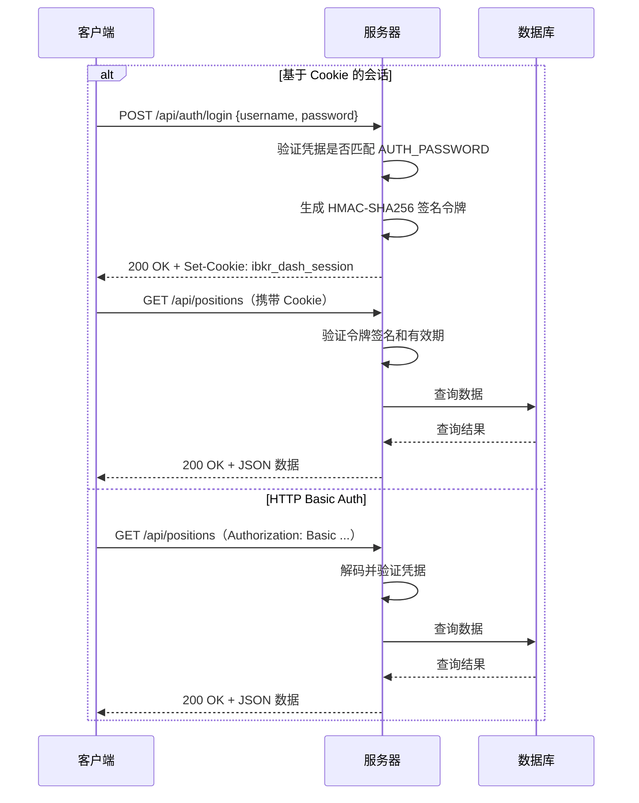
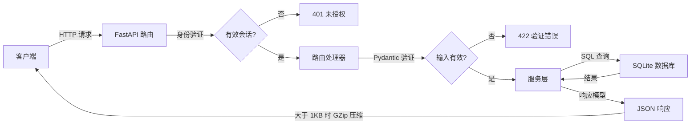

# API 概览

本节文档介绍 IBKR Dash REST API。该 API 基于 FastAPI 构建，提供投资组合数据、AI 代理、身份验证和系统管理等端点。

---

## 基础 URL

所有 API 端点均以 `/api` 为前缀。基础 URL 取决于您的环境：

| 环境 | 基础 URL |
|------|----------|
| 本地开发 | `http://localhost:8000/api` |
| Docker | `http://localhost:8080/api`（通过 Nginx 反向代理） |
| 生产环境 | `https://your-domain.com/api` |

:::tip
在本地开发期间，Vite 开发服务器会将 `/api` 请求代理到 `http://localhost:8000`。您可以从前端直接调用 `/api/health`，无需指定完整的后端 URL。
:::

---

## 交互式 API 文档

FastAPI 自动生成交互式 API 文档：

| URL | 工具 | 说明 |
|-----|------|------|
| `/api/docs` | Swagger UI | 每个端点的试用界面 |
| `/api/redoc` | ReDoc | 简洁易读的 API 参考文档 |

在浏览器中打开 `http://localhost:8000/docs` 即可交互式探索所有端点。

---

## 身份验证流程

IBKR Dash 支持两种身份验证方式。当 Admin Settings 中的 `AUTH_PASSWORD` 为空时，身份验证将被禁用，所有端点均可公开访问。



### 基于 Cookie 的会话

1. 使用用户名和密码调用 `POST /api/auth/login`。
2. 服务器返回名为 `ibkr_dash_session` 的 `httpOnly` Cookie。
3. 所有后续请求自动包含此 Cookie（通过 fetch 的 `credentials: 'include'`）。
4. 会话有效期为 **7 天**。
5. 调用 `POST /api/auth/logout` 清除 Cookie。

### HTTP Basic Auth

作为 Cookie 的替代方式，您可以通过标准的 `Authorization` 头传递凭据：

```bash
curl -u admin:your-password http://localhost:8000/api/account/overview
```

适用于脚本、CLI 工具和编程访问。

---

## 请求/响应流程



---

## 响应格式

所有端点均返回 `Content-Type: application/json` 的 JSON 响应。成功响应遵循以下格式：

```json
{
  "items": [...],
  "pagination": {
    "page": 1,
    "page_size": 20,
    "total": 150,
    "total_pages": 8
  }
}
```

列表端点包含 `pagination` 对象。详情端点直接返回资源。

### 空响应

DELETE 端点返回 HTTP `204 No Content`，无响应体。

---

## 错误码表

API 使用标准 HTTP 状态码：

| 状态码 | 含义 | 触发场景 |
|--------|------|----------|
| `200` | OK | 成功的 GET、PUT、POST 请求 |
| `201` | Created | 资源创建成功 |
| `204` | No Content | 成功的 DELETE 请求 |
| `400` | Bad Request | 请求参数无效 |
| `401` | Unauthorized | 缺少或无效的凭据 |
| `404` | Not Found | 资源不存在 |
| `413` | Payload Too Large | 请求体超过 1 MB 限制 |
| `422` | Unprocessable Entity | 请求格式正确但业务逻辑错误 |
| `429` | Too Many Requests | 超出速率限制 |
| `500` | Internal Server Error | 服务器内部错误 |

### 错误响应体

错误响应包含 `detail` 字段：

```json
{
  "detail": "Invalid username or password"
}
```

对于验证错误（422），`detail` 是一个数组：

```json
{
  "detail": [
    {
      "loc": ["body", "symbol"],
      "msg": "field required",
      "type": "value_error.missing"
    }
  ]
}
```

### 客户端错误处理示例

```typescript
// 推荐的错误处理模式
async function fetchPositions() {
  try {
    const response = await fetch('/api/positions', { credentials: 'include' });
    if (!response.ok) {
      const error = await response.json();
      if (response.status === 401) {
        // 重定向到登录页
        window.location.href = '/login';
        return;
      }
      throw new Error(error.detail || 'Request failed');
    }
    return await response.json();
  } catch (err) {
    console.error('Failed to fetch positions:', err);
  }
}
```

---

## 速率限制

调用 LLM 的端点（Copilot 聊天、代理分析）受到速率限制，以保护您的 API 预算：

| 限制 | 窗口 | 范围 |
|------|------|------|
| 20 次请求 | 60 秒 | 每个客户端 IP |

受速率限制的端点：

- `POST /api/copilot/chat`
- `POST /api/trade-decision/analyze`
- `POST /api/trade-review/review`
- `POST /api/daily-position-review/generate`
- `POST /api/risk-assessment/assess`
- `POST /api/agent/run`

超出限制时，API 返回：

```json
{
  "detail": "Rate limit exceeded: max 20 requests per 60s. Please try again later."
}
```

标准数据端点（账户、持仓、交易、图表）**不受**速率限制。

---

## 请求大小限制

请求体最大为 **1 MB**（1,000,000 字节）。超出限制的请求将收到 `413 Payload Too Large` 响应。

---

## 压缩

大于 1 KB 的响应会自动使用 GZip 压缩。此过程对客户端透明，无需特殊请求头。

---

## CORS

跨源资源共享通过 Admin Settings 中的 `CORS_ORIGINS` 配置。默认允许以下来源的请求：

- `http://localhost:5173`（Vite 开发服务器）
- `http://localhost:3000`

CORS 请求默认包含凭据（Cookie）。

---

## 端点分组

API 按以下分组组织：

| 分组 | 前缀 | 说明 |
|------|------|------|
| 健康检查 | `/api/health` | 服务健康检查 |
| 身份验证 | `/api/auth` | 登录、登出、会话 |
| 账户 | `/api/account` | 投资组合概览、快照 |
| 持仓 | `/api/positions` | 持仓列表、摘要、详情 |
| 交易 | `/api/trades` | 交易历史、摘要 |
| 图表 | `/api/charts` | 权益曲线、绩效日历 |
| Copilot | `/api/copilot` | AI 聊天助手 |
| 代理 | `/api/trade-decision`、`/api/trade-review`、`/api/daily-position-review`、`/api/risk-assessment` | AI 分析代理 |
| 代理任务 | `/api/agent` | 后台任务管理 |
| 管理 | `/api/admin` | 系统状态、LLM、IBKR、邮件、提示词 |

---

## 示例：完整工作流

以下是使用 `curl` 的典型 API 工作流：

```bash
# 1. 检查健康状态
curl http://localhost:8000/api/health

# 2. 登录
curl -X POST http://localhost:8000/api/auth/login \
  -H "Content-Type: application/json" \
  -d '{"username": "admin", "password": "your-password"}' \
  -c cookies.txt

# 3. 获取账户概览（使用保存的 Cookie）
curl -b cookies.txt http://localhost:8000/api/account/overview

# 4. 列出持仓
curl -b cookies.txt "http://localhost:8000/api/positions?page=1&page_size=10"

# 5. 登出
curl -X POST -b cookies.txt http://localhost:8000/api/auth/logout
```
