# 数据流

本文档追踪数据在 IBKR Dash 中的流转 -- 从 IBKR 的服务器到您的屏幕。每个主要流都用序列图说明，以便您了解每一步发生了什么。

---

## 概览

IBKR Dash 中有两个主要数据流：

1. **金融数据流** -- IBKR Flex API -> Worker -> SQLite -> 后端 -> 前端
2. **AI 代理流** -- 用户 -> 前端 -> 后端 -> LLM -> 响应

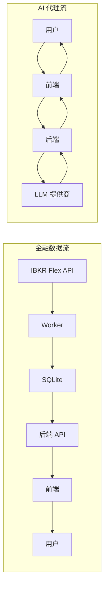

---

## 金融数据流

这是将您的 IBKR 投资组合数据带入仪表盘的核心数据管道。

### 步骤 1：从 IBKR 提取数据

有两种方式从 IBKR 获取数据：

#### 选项 A：手动 Flex CSV 导出

您手动从 IBKR 的 Web 界面导出 CSV：

1. 登录 IBKR Account Management
2. 导航到 Reports > Flex Queries
3. 运行 Flex Query（每日快照）
4. 下载 CSV 文件
5. 放入 `data/flex_exports/`

#### 选项 B：自动 Flex Web Service 拉取

Worker 使用 IBKR 的 Flex Web Service API 自动拉取数据：

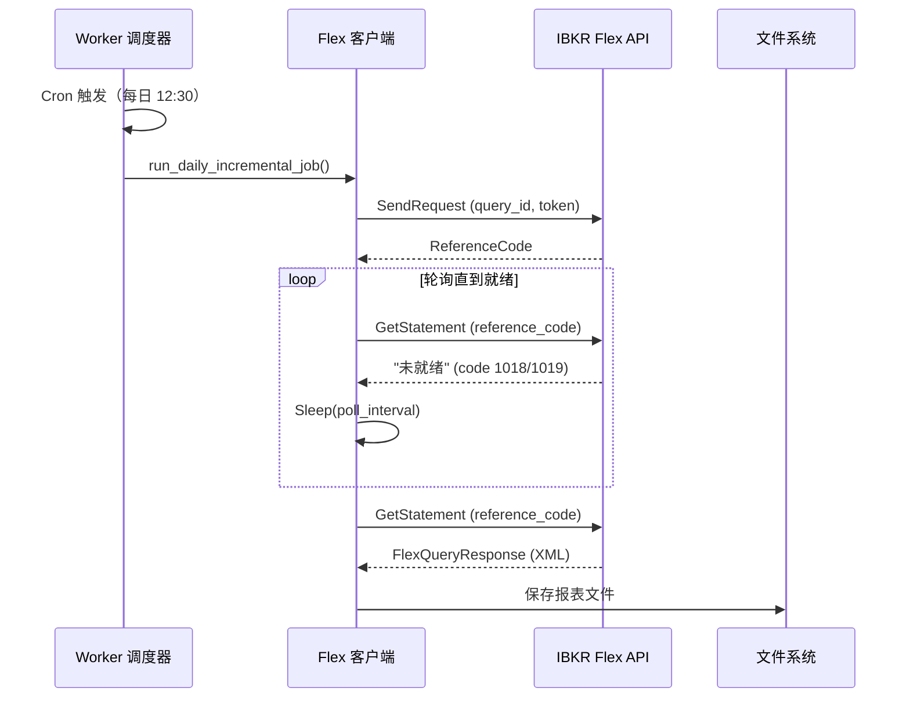

Flex 客户端 (`worker/clients/flex_client.py`) 处理：

- **发送**查询请求，包含您的令牌和查询 ID
- **轮询**直到报表就绪（IBKR 异步生成报表）
- **下载**最终报表（XML 或 CSV 格式）
- **重试**最多 60 次，间隔 10 秒

:::info
IBKR Flex 查询不是即时的。提交查询后，IBKR 需要 10-60 秒来生成报表。Worker 每 10 秒轮询一次，直到报表就绪。
:::

---

### 步骤 2：CSV 解析

IBKR Flex CSV 格式是一种带有记录类型标记的多段格式。解析器 (`worker/parsers/flex_csv_parser.py`) 读取每一行并分类：

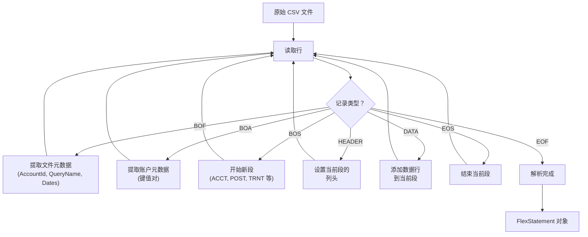

CSV 包含多个段：

| 段 | 描述 | 映射到 |
|----|------|--------|
| `ACCT` | 账户信息 | `account_snapshots` |
| `POST` | 持仓数据 | `position_snapshots` |
| `TRNT` | 交易记录 | `trade_records` |
| `CTRN` | 现金交易 | `cash_flows` |
| `FIFO` | FIFO 盈亏数据 | 合并到持仓 |
| `SECU` | 证券详情 | 合并到持仓 |
| `PPPO` | 价格数据 | `price_history` |

原始 CSV 结构示例：

```csv
BOF,DU123456,Daily_Snapshot,2024-01-01,2024-01-15
BOA,AccountId,DU123456,AccountType,Individual
BOS,ACCT
HEADER,AccountId,Currency,TotalEquity,Cash
DATA,DU123456,USD,150000.00,25000.00
EOS
BOS,POST
HEADER,Symbol,Quantity,MarkPrice,PositionValue
DATA,AAPL,100,185.50,18550.00
DATA,MSFT,50,375.00,18750.00
EOS
```

---

### 步骤 3：数据转换

转换器 (`worker/parsers/transformers.py`) 将解析的段转换为 SQLite 就绪的字典：

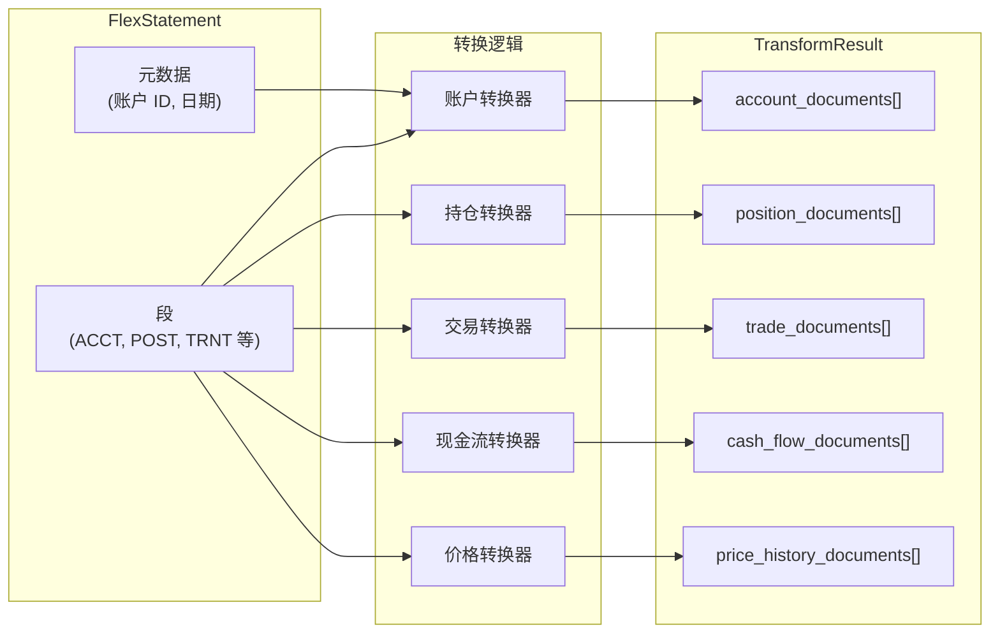

关键转换步骤：

- **日期标准化** -- 将 IBKR 日期格式转换为 ISO 8601 (`YYYY-MM-DD`)
- **数字清理** -- 从数字字段中移除逗号、货币符号和空白
- **字段映射** -- 将 IBKR 列名映射到数据库列名
- **去重** -- 使用唯一约束防止重复记录

---

### 步骤 4：数据库写入

SQLite 写入器 (`worker/writers/sqlite_writer.py`) 执行批量 upsert：

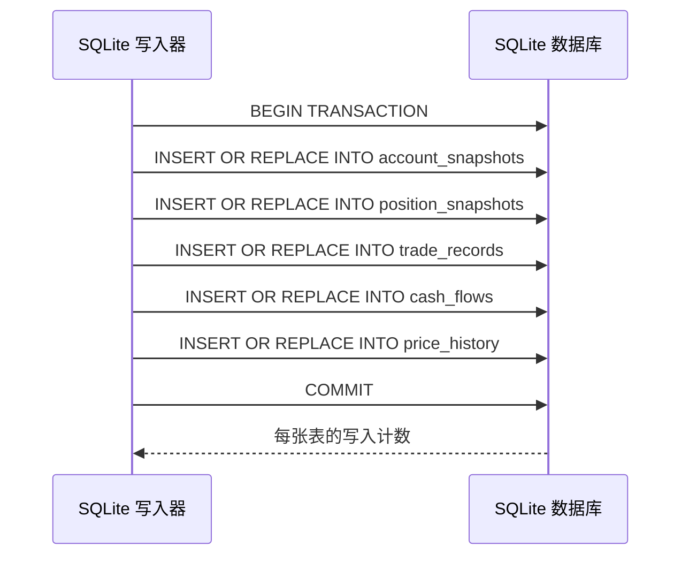

Upsert 模式 (`INSERT ... ON CONFLICT DO UPDATE`) 确保：

- 重新导入同一天的数据会更新现有记录而不是创建重复项
- 唯一约束 (`account_id + report_date + symbol`) 防止数据重复
- 每次导入都是幂等的（可安全多次运行）

:::tip
Worker 使用 SQLite 的 `PRAGMA journal_mode=WAL` 进行并发访问。这允许后端在 Worker 写入的同时继续提供读取请求。
:::

---

### 步骤 5：API 读取

当前端请求数据时，后端从 SQLite 读取：

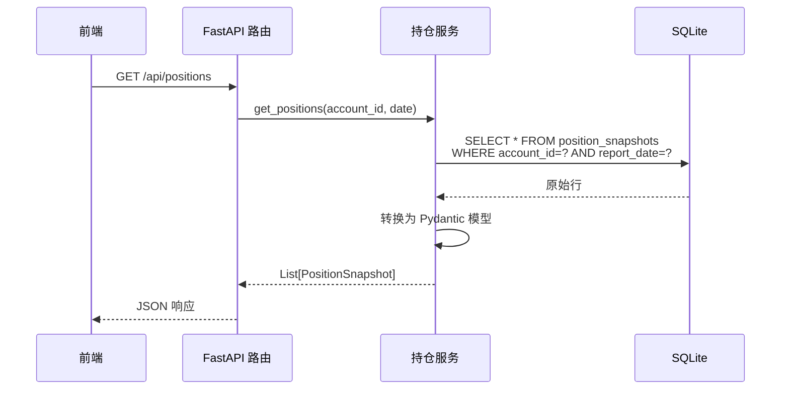

---

### 步骤 6：前端显示

前端使用 React 组件和 ECharts 渲染数据：

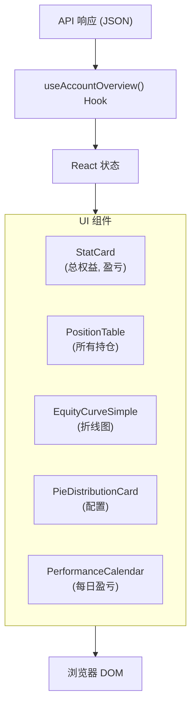

---

## AI 代理数据流

AI 代理是 IBKR Dash 中最复杂的数据流。有两种不同的模式：

### 模式 1：结构化输出代理

使用者：每日持仓审查、交易决策、交易回顾、风险评估

这些代理遵循固定管道：收集数据 -> 调用 LLM -> 解析结构化 JSON -> 存储结果。

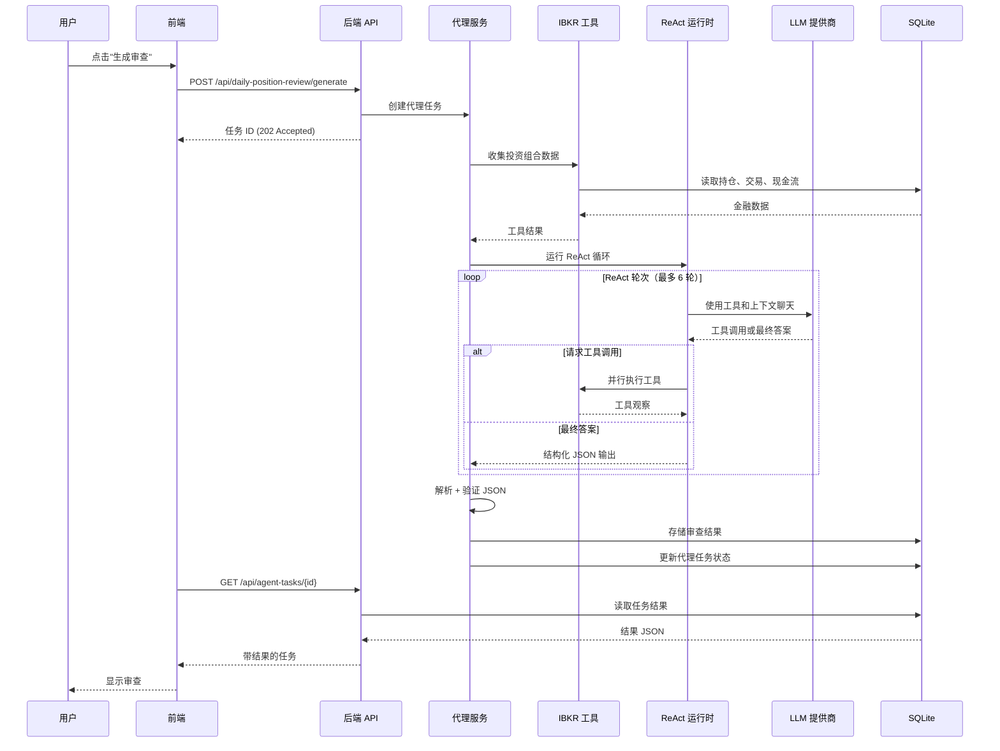

---

### 模式 2：Copilot（对话代理）

使用者：账户 Copilot

Copilot 是一个具有记忆、技能和工具调度的对话代理：

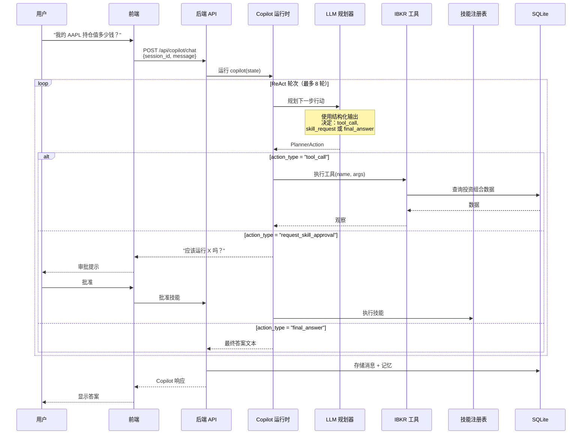

---

## 结构化输出管道

所有 AI 代理使用结构化输出管道确保从 LLM 获得可靠的 JSON 输出。这很重要，因为 LLM 可能产生格式错误的 JSON。

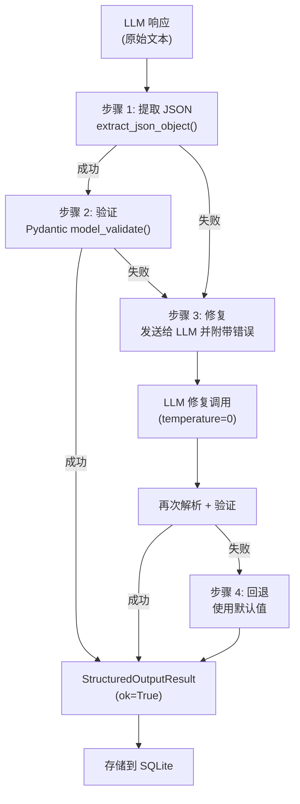

管道有四个阶段：

1. **解析** -- 从原始 LLM 文本中提取 JSON 对象（处理 markdown 代码块、额外文本等）
2. **验证** -- 根据 Pydantic 模型模式验证 JSON
3. **修复** -- 如果验证失败，将原始输出和错误消息发回 LLM 要求修复格式
4. **回退** -- 如果修复失败，使用默认/回退值

:::info
结构化输出管道定义在 `app/agents/structured_output/` 中。每个代理定义一个 `StructuredOutputContract`，指定预期模式、修复行为和回退逻辑。
:::

---

## Copilot 工具系统

账户 Copilot 可以访问一个只读工具注册表来查询数据库：

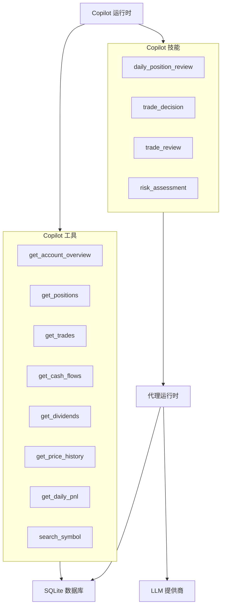

**工具**是只读数据库查询。Copilot 可以自由调用它们来收集数据。

**技能**是更复杂的操作，触发完整的代理运行。它们在执行前需要用户批准，可能多次调用 LLM。

---

## 代理任务生命周期

每次代理执行都会创建一个跟踪其进度的任务记录：

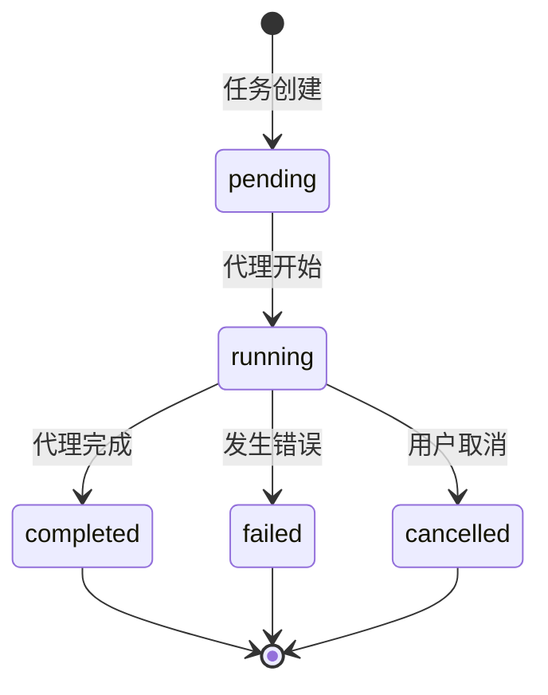

任务记录存储：

- **进度** -- 执行期间的 JSON 更新
- **结果** -- 最终输出（审查、决策等）
- **错误** -- 失败时的错误消息
- **计时** -- 创建、开始和完成时间戳
- **运行追踪** -- 完整的执行追踪用于调试

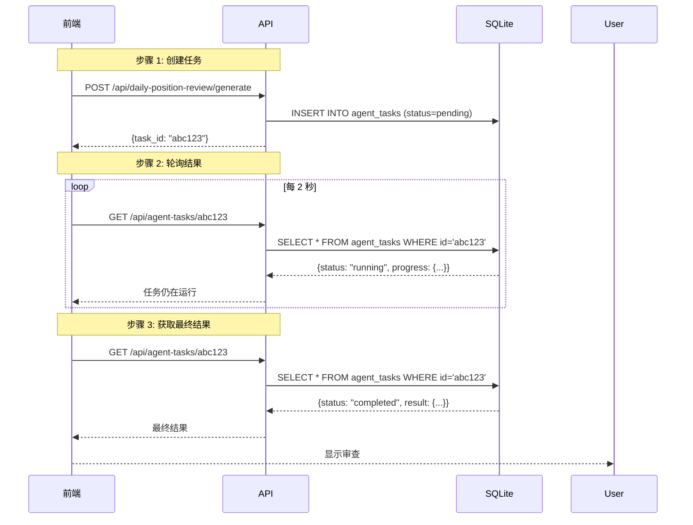

---

## Copilot 记忆流

Copilot 在对话中维护记忆：

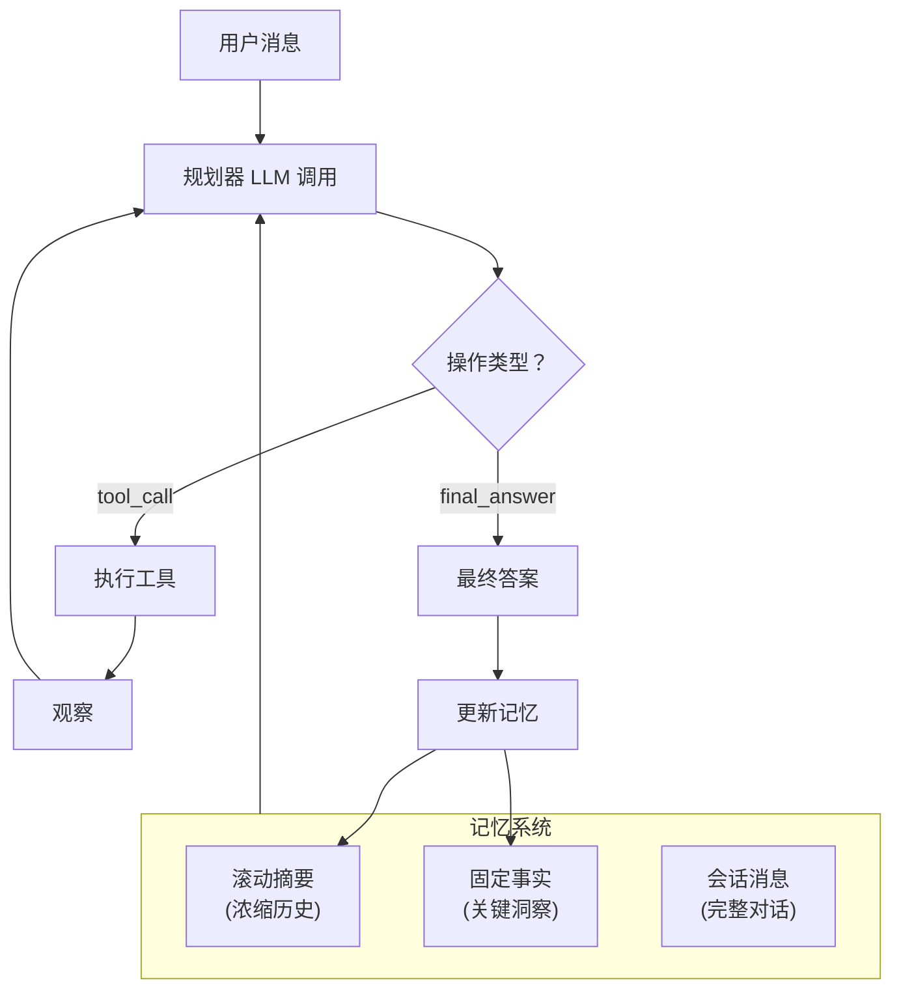

记忆类型：

- **滚动摘要** -- 对话历史的浓缩版本，每次交流后更新
- **固定事实** -- 从对话中提取的关键事实（例如"用户对科技股感兴趣"）
- **会话消息** -- 当前会话的完整消息历史

---

## 数据新鲜度

了解数据何时更新有助于您理解仪表盘：

```mermaid
gantt
    title 每日数据时间线
    dateFormat HH:mm
    axisFormat %H:%M

    section Worker
    Flex 查询提交   :done, 12:30, 1m
    轮询报表        :done, 12:31, 5m
    解析 + 转换     :done, 12:36, 1m
    写入 SQLite     :done, 12:37, 1m

    section 后端
    提供 API 请求   :active, 00:00, 24h

    section 前端
    页面加载时获取   :crit, 12:38, 1m
```

- **金融数据**每天更新一次（当 Worker 运行时）
- **API 响应**是从 SQLite 的实时读取（默认无缓存，但可配置 `CACHE_TTL_SECONDS`）
- **AI 代理输出**按需生成并永久存储

:::warning
仪表盘显示最新的快照日期。如果 Worker 今天没有运行，您将看到昨天的数据。检查仪表盘头部的报告日期以确认数据新鲜度。
:::

---

## 错误处理

每一层都有自己的错误处理策略：

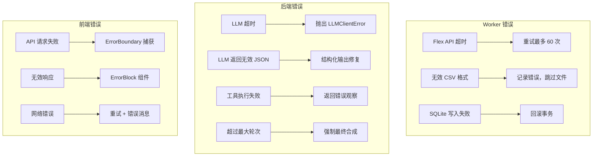

---

## 总结

| 流 | 方向 | 协议 | 频率 |
|----|------|------|------|
| IBKR -> Worker | 拉取 | Flex Web Service API | 每日（定时） |
| Worker -> SQLite | 写入 | 直接 SQL (upsert) | 导入时 |
| SQLite -> 后端 | 读取 | 直接 SQL 查询 | API 请求时 |
| 后端 -> 前端 | 提供 | HTTP REST (JSON) | 页面加载时 |
| 前端 -> 用户 | 显示 | 浏览器 DOM | 实时 |
| 用户 -> Copilot | 聊天 | HTTP REST (JSON) | 按需 |
| Copilot -> LLM | 查询 | HTTP (chat/completions) | 每个代理轮次 |
| LLM -> Copilot | 响应 | HTTP (JSON) | 每个代理轮次 |
| Copilot -> SQLite | 存储 | 直接 SQL | 完成后 |
