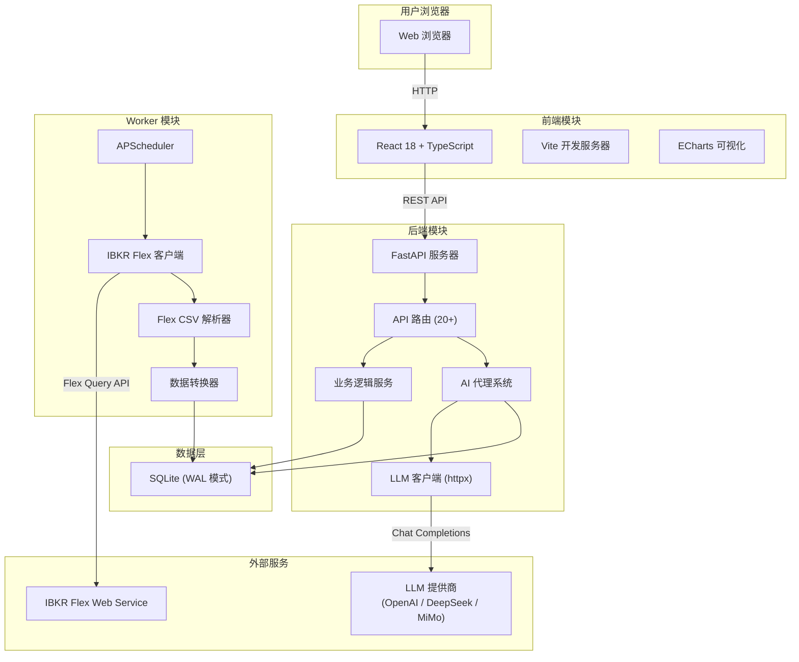
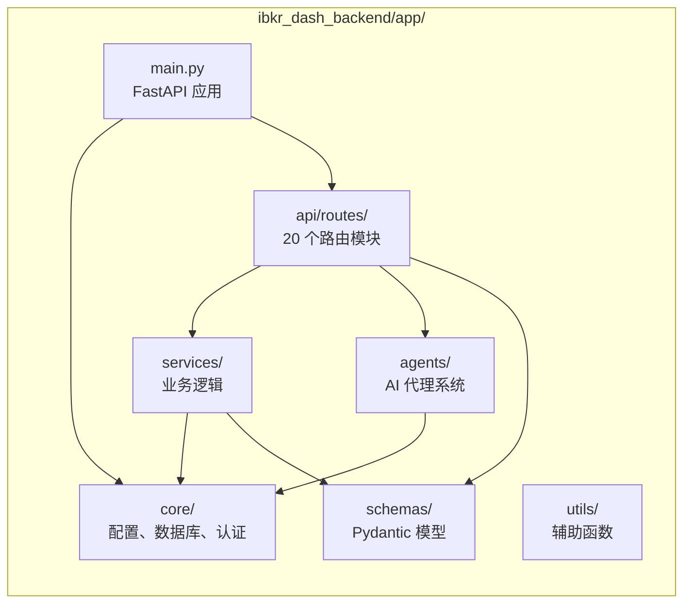
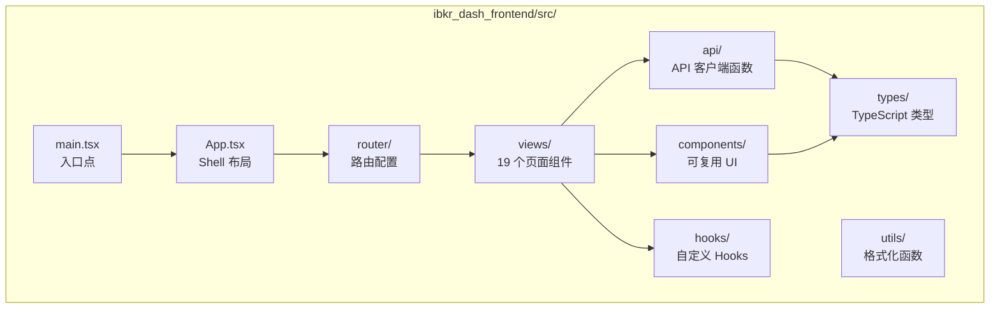
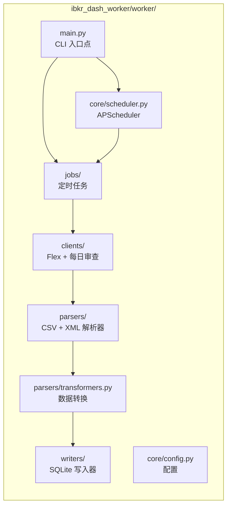
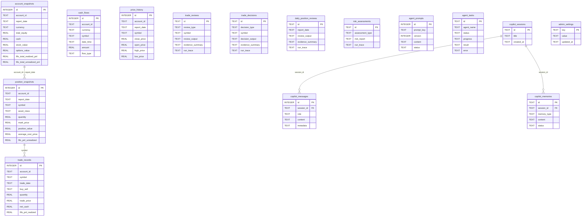
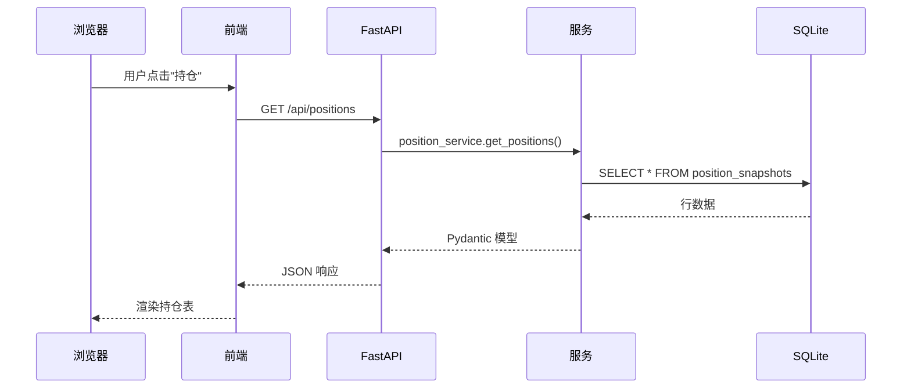
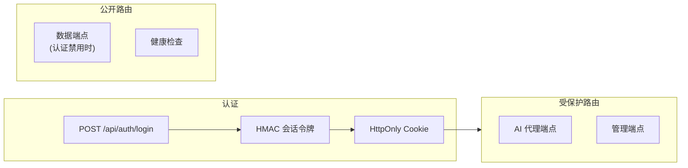

# 架构概览

本文档解释 IBKR Dash 的结构、模块如何交互以及为什么做出某些设计决策。阅读完本文后，您将了解完整的系统拓扑，并准备好探索[数据流](./data-flow.md)和[技术栈](./tech-stack.md)的细节。

---

## 高层架构

IBKR Dash 采用**三模块架构**，以共享的 SQLite 数据库作为唯一数据源：



关键洞察是**后端**和**Worker**完全解耦。它们在运行时不共享代码。它们仅通过 SQLite 数据库文件通信。这意味着您可以独立运行它们，重启一个而不影响另一个，甚至可以在不同的机器上运行它们（只要它们能访问同一个 SQLite 文件）。

:::tip
这种解耦架构意味着您可以隔离地开发和测试每个模块。Worker 可以通过导入 CSV 文件并检查数据库来测试。后端可以用预填充的数据库测试。前端可以用模拟 API 响应测试。
:::

---

## 模块分解

### 后端模块 (`ibkr_dash_backend/`)

后端是系统的核心。它提供 REST API，运行 AI 代理，并管理所有业务逻辑。



#### 目录结构

```
ibkr_dash_backend/app/
├── main.py                    # FastAPI 应用工厂
├── core/
│   ├── config.py              # 配置 (pydantic-settings)
│   ├── database.py            # SQLite 连接 + 模式 DDL
│   ├── auth.py                # HMAC 会话令牌
│   ├── cors.py                # CORS 配置
│   ├── rate_limit.py          # 速率限制中间件
│   └── logger.py              # 日志设置
├── api/
│   ├── deps.py                # 共享依赖 (get_current_user)
│   └── routes/
│       ├── health.py          # GET /api/health
│       ├── auth.py            # POST /api/auth/login, logout
│       ├── account.py         # 账户概览端点
│       ├── positions.py       # 持仓数据端点
│       ├── trades.py          # 交易历史端点
│       ├── cash_flows.py      # 现金流端点
│       ├── dividends.py       # 股息端点
│       ├── charts.py          # 图表数据端点
│       ├── copilot.py         # Copilot 聊天端点
│       ├── agent_tasks.py     # 代理任务管理
│       ├── daily_position_review.py
│       ├── trade_decision_agent.py
│       ├── trade_review_agent.py
│       ├── risk_assessment_agent.py
│       ├── symbols.py         # 代码查询
│       ├── admin_system.py    # 系统管理端点
│       ├── admin_llm.py       # LLM 配置
│       ├── admin_prompts.py   # 提示词管理
│       ├── admin_ibkr.py      # IBKR 设置
│       └── admin_email.py     # 邮件配置
├── services/
│   ├── account_service.py     # 账户数据查询
│   ├── position_service.py    # 持仓查询
│   ├── trade_service.py       # 交易查询
│   ├── cash_flow_service.py   # 现金流查询
│   ├── dividend_service.py    # 股息查询
│   ├── chart_service.py       # 图表数据生成
│   ├── llm_service.py         # LLM HTTP 客户端
│   ├── ibkr_tool_service.py   # 代理的 IBKR 数据工具
│   └── agent_services.py      # 代理编排
├── agents/
│   ├── runtime.py             # ReAct 工具调用运行时
│   ├── structured_output/     # JSON 解析/验证/修复管道
│   ├── account_copilot/       # 基于聊天的 Copilot 代理
│   ├── daily_review/          # 每日持仓审查代理
│   ├── trade_decision/        # 交易决策代理
│   ├── trade_review/          # 交易回顾代理
│   ├── risk_assessment/       # 风险评估代理
│   ├── eval_cases/            # 评估测试用例
│   ├── eval_harness.py        # 评估框架
│   ├── prompt_registry.py     # 提示词版本控制
│   ├── evidence.py            # 证据收集
│   └── sensitive.py           # 敏感数据过滤
├── schemas/                   # Pydantic 请求/响应模型
└── utils/                     # 日期、分页、JSON 辅助函数
```

---

### 前端模块 (`ibkr_dash_frontend/`)

前端是使用 React 和 TypeScript 构建的单页应用 (SPA)。它通过 REST API 调用与后端通信。



#### 关键视图

| 视图 | 路由 | 描述 |
|------|------|------|
| `DashboardView` | `/` | 投资组合概览，包含图表和统计 |
| `PositionsView` | `/positions` | 详细持仓表 |
| `TradesView` | `/trades` | 交易历史 |
| `CashFlowsView` | `/cash-flows` | 现金流追踪 |
| `DividendsView` | `/dividends` | 股息历史 |
| `AccountCopilotView` | `/copilot` | AI 聊天助手 |
| `DailyPositionReviewView` | `/daily-position-review` | AI 每日审查 |
| `TradeDecisionAgentView` | `/trade-decision` | 预交易分析 |
| `TradeReviewAgentView` | `/trade-review` | 交易回顾 |
| `StockResearchView` | `/stock-research` | 代码研究 |
| `AdminSystemView` | `/admin/system` | 系统设置 |
| `AdminLlmView` | `/admin/llm` | LLM 配置 |
| `AdminPromptsView` | `/admin/prompts` | 提示词管理 |
| `AdminAgentMonitoringView` | `/admin/agent-monitoring` | 代理任务历史 |
| `AdminIbkrView` | `/admin/ibkr` | IBKR 设置 |
| `AdminEmailView` | `/admin/email` | 邮件配置 |
| `AdminHarnessView` | `/admin/harness` | 代理评估 |
| `AdminLongbridgeMcpView` | `/admin/longbridge-mcp` | Longbridge MCP 配置 |
| `BootstrapView` | `/bootstrap` | 首次设置 |

:::info
AI 驱动的视图（Copilot、每日审查、交易决策、交易回顾、股票研究）需要认证。数据视图（仪表盘、持仓、交易等）在认证禁用时无需登录即可访问。
:::

---

### Worker 模块 (`ibkr_dash_worker/`)

Worker 是一个独立的 ETL（提取、转换、加载）管道。它读取 IBKR Flex CSV 导出并将结构化数据写入 SQLite。



#### Worker CLI 命令

```bash
# 导入单个 Flex CSV 文件
python -m worker.main import <file.csv>

# 扫描 data_dir 中的新文件并导入
python -m worker.main scan

# 运行后台调度器（按 cron 计划自动导入）
python -m worker.main run-scheduler

# 初始化数据库模式
python -m worker.main init-db
```

---

## 数据库模式

SQLite 数据库是后端和 Worker 共享的中央数据存储。它包含 **16 张表**，分为四组：



### 表组

**金融数据（由 Worker 写入，由后端读取）：**

| 表名 | 描述 | 唯一约束 |
|------|------|----------|
| `account_snapshots` | 每日账户级摘要（权益、现金、盈亏） | `account_id + report_date` |
| `position_snapshots` | 每日持仓详情（数量、价格、价值） | `account_id + report_date + symbol` |
| `trade_records` | 单个交易记录 | `account_id + trade_date + symbol + trade_id` |
| `cash_flows` | 现金变动（存款、取款、股息） | 无（仅追加） |
| `price_history` | 代码的每日价格数据 | `account_id + report_date + symbol` |

**AI 代理输出（由后端写入，由前端读取）：**

| 表名 | 描述 |
|------|------|
| `trade_reviews` | 交易回顾评估结果 |
| `trade_decisions` | 交易决策分析结果 |
| `daily_position_reviews` | 每日持仓审查报告 |
| `risk_assessments` | 投资组合风险分析报告 |

**代理基础设施（由后端管理）：**

| 表名 | 描述 |
|------|------|
| `agent_prompts` | 版本控制的提示词模板 |
| `agent_tasks` | 代理执行历史 |
| `copilot_sessions` | 聊天会话元数据 |
| `copilot_messages` | 聊天消息历史 |
| `copilot_memories` | Copilot 记忆事实 |
| `admin_settings` | 键值配置存储 |

---

## 请求生命周期

以下是典型请求在系统中的流转方式：



---

## 设计决策

### 为什么选择 SQLite？

IBKR Dash 使用 SQLite 作为唯一数据存储。这是一个深思熟虑的选择：

| 因素 | SQLite | PostgreSQL/MySQL |
|------|--------|-----------------|
| **设置** | 零配置 | 需要服务器安装 |
| **部署** | 单文件 | 独立服务 |
| **并发** | WAL 模式处理读取 + 单个写入器 | 完全并发写入 |
| **数据量** | 足够个人投资组合（数千行） | 设计用于数百万行 |
| **备份** | 复制一个文件 | 需要 pg_dump 或类似工具 |
| **Docker** | 通过卷挂载共享 | 需要单独容器 |

对于个人投资仪表盘，数据量不大 -- 每年几百个持仓快照、几千个交易和几百个每日审查。SQLite 可以轻松处理。

:::tip
启用了 WAL（Write-Ahead Logging）模式的 SQLite 允许在写入进行时并发读取。这意味着后端可以在 Worker 导入数据的同时提供 API 请求。
:::

### 为什么不选 LangGraph？

最初的原型使用 LangGraph 进行代理编排。它被替换为用纯 Python 实现的自定义 ReAct（Reason + Act）循环。原因：

1. **简单性** -- 自定义运行时约 400 行直观的 Python 代码，没有魔法
2. **控制力** -- 完全控制工具执行、并行调度和错误处理
3. **依赖** -- LangGraph 引入了许多传递依赖
4. **调试** -- 纯 Python 比图框架更容易调试
5. **性能** -- ThreadPoolExecutor 用于并行工具调用，简单有效

ReAct 运行时 (`app/agents/runtime.py`) 实现标准循环：**计划 (LLM) -> 执行工具 -> 观察 -> 重复**。在最后一轮，工具调用被阻止，LLM 被强制合成最终答案。

### 为什么选择 React 而不是 Vue？

前端使用 React 18 和 TypeScript。主要原因：

1. **生态系统** -- ECharts 有出色的 React 绑定
2. **TypeScript** -- React 的一流 TypeScript 支持
3. **懒加载** -- React.lazy() 用于代码分割 19 个视图
4. **测试** -- Vitest + React Testing Library 提供快速、可靠的测试
5. **开发者熟悉度** -- 开发者偏好的框架

### 为什么选择 FastAPI 而不是 Django？

后端使用 FastAPI 而不是 Django 这样的全栈框架：

1. **异步支持** -- FastAPI 原生异步，对 LLM API 调用很重要
2. **自动文档** -- 自动生成 Swagger/OpenAPI 文档
3. **Pydantic 集成** -- 原生请求/响应验证
4. **轻量级** -- 无 ORM、无管理面板、无模板引擎（不需要）
5. **性能** -- FastAPI 是最快的 Python Web 框架之一

### 为什么用 httpx 进行 LLM 调用？

LLM 服务使用 `httpx` 而不是官方 OpenAI Python SDK：

1. **提供商无关** -- 适用于任何 OpenAI 兼容端点
2. **无供应商锁定** -- 不依赖特定 SDK 版本
3. **简单性** -- 只需一个 HTTP POST 到 `/chat/completions`
4. **轻量级** -- 更小的依赖树

---

## 模块通信

三个模块通过两个通道通信：

### 1. SQLite 数据库（主要）

后端和 Worker 共享同一个 SQLite 数据库文件。Worker 写入金融数据；后端读取它并写入代理输出。

```
Worker  --[写入]--> SQLite <--[读取/写入]-- Backend
```

### 2. HTTP API（可选）

Worker 可以选择性地调用后端 API 在数据导入后触发每日审查：

```
Worker --[POST /api/daily-position-review/generate]--> Backend
```

这通过 Worker 的 `.env` 文件中的 `BACKEND_BASE_URL` 配置。

---

## 安全模型

IBKR Dash 拥有适合个人工具的简单安全模型：



- **会话令牌** -- HMAC-SHA256 签名令牌，存储在 HttpOnly cookie 中
- **7 天过期** -- 会话在 7 天后过期
- **可选认证** -- 如果 `AUTH_PASSWORD` 为空，所有路由公开
- **受保护路由** -- AI 代理端点和管理路由需要认证
- **CORS** -- 可配置的允许来源

:::warning
IBKR Dash 设计用于可信网络上的个人使用。它不实现每用户速率限制、CSRF 保护或 OAuth。如果您将其暴露到互联网，请使用带有适当安全头的反向代理。
:::

---

## 下一步

现在您了解了架构：

- **[数据流](./data-flow.md)** -- 通过详细的序列图追踪数据在每一层的流转
- **[技术栈](./tech-stack.md)** -- 深入了解每项技术选择和配置
