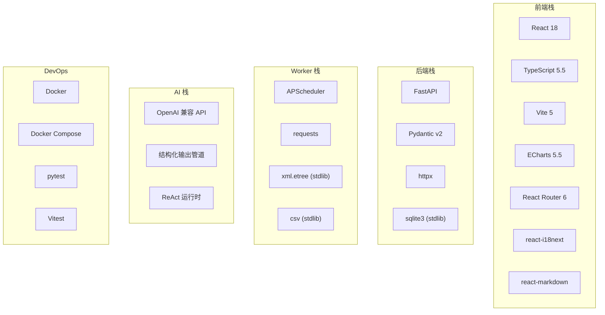
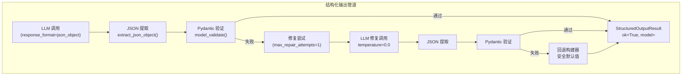
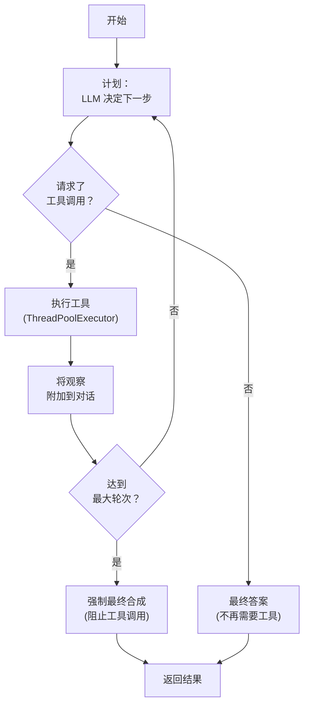
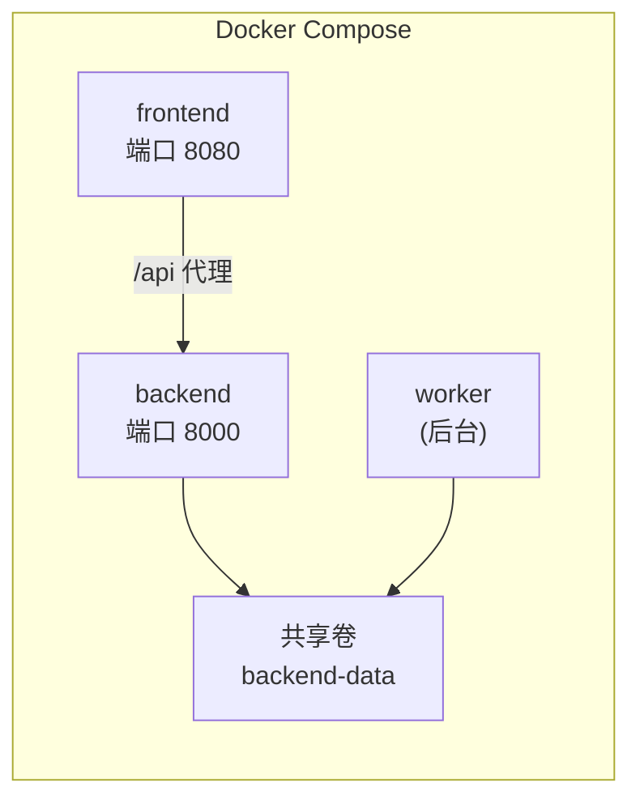
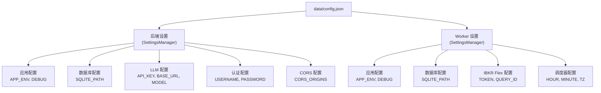

# 技术栈

本文档解释 IBKR Dash 中使用的所有技术、选择原因以及配置方式。如果您正在评估项目或计划贡献，这将为您提供技术基础的完整图景。

---

## 栈概览



---

## 依赖版本矩阵

### 后端依赖

| 包 | 版本 | 用途 |
|----|------|------|
| `fastapi` | ^0.115.0 | 支持异步的 Web 框架 |
| `uvicorn` | ^0.34.0 | FastAPI 的 ASGI 服务器 |
| `pydantic` | ^2.10.0 | 数据验证和 JSON Schema 生成 |
| `httpx` | ^0.28.0 | LLM API 调用的 HTTP 客户端 |

### 前端依赖

| 包 | 版本 | 用途 |
|----|------|------|
| `react` | ^18.3.1 | UI 库 |
| `react-dom` | ^18.3.1 | DOM 渲染 |
| `react-router-dom` | ^6.23.0 | 客户端路由 |
| `typescript` | ^5.5.0 | 类型安全的 JavaScript |
| `vite` | ^5.4.0 | 构建工具和开发服务器 |
| `echarts` | ^5.5.0 | 图表库 |
| `react-markdown` | ^10.1.0 | Markdown 渲染 |
| `remark-gfm` | ^4.0.1 | GitHub Flavored Markdown |
| `i18next` | ^26.3.1 | 国际化框架 |
| `react-i18next` | ^17.0.8 | React i18n 绑定 |
| `vitest` | ^2.1.0 | 测试框架 |

### Worker 依赖

| 包 | 版本 | 用途 |
|----|------|------|
| `apscheduler` | ^3.10.0 | Cron 风格的任务调度 |
| `requests` | ^2.32.0 | IBKR Flex API HTTP 客户端 |

:::info
Worker 的依赖最少。CSV 解析器使用 Python 内置的 `csv` 模块，XML 解析器使用标准库的 `xml.etree.ElementTree`。`sqlite3` 模块也是标准库的一部分。
:::

---

## 后端技术

### FastAPI

**是什么：** 一个现代、快速的 Python Web 框架，用于构建 API。

**选择原因：**

- **异步支持** -- FastAPI 基于 ASGI 构建，支持异步请求处理，这对可能需要几秒钟的 LLM API 调用很重要
- **自动文档** -- 零配置生成交互式 Swagger UI (`/docs`) 和 ReDoc (`/redoc`)
- **Pydantic 集成** -- 使用 Pydantic 模型的原生请求/响应验证
- **性能** -- 最快的 Python Web 框架之一，对于 I/O 密集型工作负载可与 Node.js 和 Go 媲美
- **简单性** -- 与带扩展的 Django 或 Flask 相比，样板代码最少

**如何使用：**

```python
# 来自 app/main.py -- 应用工厂
from fastapi import FastAPI

def create_app() -> FastAPI:
    app = FastAPI(title="IBKR Dash", version="0.1.0", lifespan=lifespan)

    # 用于前端通信的 CORS 中间件
    app.add_middleware(CORSMiddleware, allow_origins=origins, ...)

    # 注册 20+ 路由模块
    app.include_router(health_router, prefix="/api")
    app.include_router(account_router, prefix="/api")
    app.include_router(copilot_router, prefix="/api")
    # ... 以及更多

    return app
```

**关键模式：**

- **依赖注入** -- `app/api/deps.py` 提供共享依赖如 `get_current_user`
- **路由模块** -- 每个功能在 `app/api/routes/` 中有自己的路由文件
- **生命周期事件** -- 数据库初始化在 `lifespan` 上下文管理器中进行

:::tip
FastAPI 的 Swagger UI (`http://localhost:8000/docs`) 是探索所有可用 API 端点的最佳方式。您可以直接从浏览器测试每个端点。
:::

---

### SQLite

**是什么：** 一个自包含、无服务器的 SQL 数据库引擎。

**选择原因：**

- **零配置** -- 无需安装、配置或维护数据库服务器
- **单文件** -- 整个数据库是一个文件 (`data/ibkr_dash.db`)，易于备份
- **足够规模** -- 个人投资组合每年生成数千行数据，完全在 SQLite 的能力范围内
- **WAL 模式** -- Write-Ahead Logging 允许在写入期间并发读取
- **内置** -- Python 的 `sqlite3` 模块是标准库的一部分

**如何使用：**

```python
# 来自 app/core/database.py -- 线程安全包装器
class Database:
    def __init__(self, db_path: str | Path) -> None:
        self._db_path = db_path

    def _connect(self) -> sqlite3.Connection:
        conn = sqlite3.connect(self._db_path, check_same_thread=False)
        conn.row_factory = sqlite3.Row  # 返回行作为字典
        conn.execute("PRAGMA journal_mode=WAL")    # 并发读取
        conn.execute("PRAGMA foreign_keys=ON")      # FK 强制
        conn.execute("PRAGMA busy_timeout=5000")    # 锁定等待 5 秒
        return conn

    def upsert(self, table: str, data: dict, conflict_cols: list[str]) -> None:
        # INSERT ... ON CONFLICT DO UPDATE
        ...

    def execute(self, sql: str, params: tuple = ()) -> list[dict]:
        # 执行查询，返回行作为字典
        ...
```

**关键设计选择：**

- **无 ORM** -- 通过 `Database` 类直接 SQL 查询。保持代码简单，查询透明
- **WAL 模式** -- 使 Worker 能在后端读取的同时写入
- **Upsert 模式** -- `INSERT ... ON CONFLICT DO UPDATE` 使导入幂等
- **代码中的模式** -- 完整的 DDL 定义为 `database.py` 中的 Python 字符串，启动时应用

:::info
SQLite 的 WAL 模式对 IBKR Dash 至关重要。没有它，Worker 的写操作会阻塞所有后端读请求。有了 WAL 模式，读取器和单个写入器可以同时操作。
:::

---

### Pydantic

**是什么：** 使用 Python 类型注解进行数据验证和设置管理。

**选择原因：**

- **类型安全** -- 使用 Python 类型提示在运行时验证数据
- **FastAPI 集成** -- 原生请求/响应验证
- **JSON Schema** -- 自动生成 API 文档的 JSON 模式
- **结构化输出** -- 用于验证 LLM JSON 输出是否符合预期模式

**如何使用：**

```python
# 来自 app/schemas/positions.py -- 请求/响应模型
from pydantic import BaseModel

class PositionSnapshot(BaseModel):
    account_id: str
    report_date: str
    symbol: str
    quantity: float
    mark_price: float
    position_value: float
    average_cost_price: float | None = None
    fifo_pnl_unrealized: float | None = None
```

```python
# 来自 app/core/config.py -- 设置管理
import json
from pathlib import Path

CONFIG_PATH = Path("data/config.json")

def load_settings() -> dict:
    if CONFIG_PATH.exists():
        return json.loads(CONFIG_PATH.read_text(encoding="utf-8"))
    return {}  # 使用默认值

def save_settings(data: dict) -> None:
    CONFIG_PATH.parent.mkdir(parents=True, exist_ok=True)
    CONFIG_PATH.write_text(json.dumps(data, indent=2, ensure_ascii=False), encoding="utf-8")
```

---

### httpx

**是什么：** 一个现代的 Python HTTP 客户端库。

**选择原因：**

- **提供商无关** -- 适用于任何 OpenAI 兼容 API 端点
- **无供应商锁定** -- 不依赖 OpenAI SDK
- **连接池** -- 重用连接以获得更好的性能
- **超时控制** -- 可配置的 LLM 调用超时

**如何使用：**

```python
# 来自 app/services/llm_service.py -- LLM 客户端
class LLMService:
    def __init__(self, settings: Settings) -> None:
        self._client = httpx.Client(
            timeout=60.0,
            limits=httpx.Limits(max_connections=10),
        )

    def chat(self, messages: list[dict], **kwargs) -> str:
        url = f"{self.base_url}/chat/completions"
        headers = {"Authorization": f"Bearer {self.api_key}"}
        payload = {"model": self.default_model, "messages": messages, ...}
        response = self._client.post(url, headers=headers, json=payload)
        return response.json()["choices"][0]["message"]["content"]
```

LLM 服务是围绕单个 HTTP POST 到 `/chat/completions` 端点的薄包装器。这意味着它适用于：

- OpenAI (GPT-4o, GPT-4 等)
- DeepSeek (deepseek-chat, deepseek-reasoner)
- Xiaomi MiMo
- 任何其他 OpenAI 兼容提供商

---

## 前端技术

### React 18

**是什么：** 一个用于构建用户界面的 JavaScript 库。

**选择原因：**

- **组件模型** -- 清晰的组件架构，适合有多个视图的仪表盘
- **懒加载** -- `React.lazy()` 用于代码分割 19 个视图
- **生态系统** -- 丰富的库生态系统（ECharts 绑定、markdown 渲染、i18n）
- **测试** -- 出色的测试工具（React Testing Library、Vitest）

**如何使用：**

```tsx
// 来自 src/router/index.tsx -- 懒加载路由
const DashboardView = lazy(() => import('@/views/DashboardView'))
const PositionsView = lazy(() => import('@/views/PositionsView'))
const AccountCopilotView = lazy(() => import('@/views/AccountCopilotView'))

export const router = createBrowserRouter([
  {
    path: '/',
    element: <App />,
    children: [
      { index: true, element: lazyViewWithErrorBoundary(DashboardView) },
      { path: 'positions', element: lazyViewWithErrorBoundary(PositionsView) },
      { path: 'copilot', element: <ProtectedRoute>{lazyViewWithErrorBoundary(AccountCopilotView)}</ProtectedRoute> },
      // ... 共 19 个路由
    ],
  },
])
```

:::tip
每个视图都是懒加载的，意味着每个页面的 JavaScript 仅在您导航到它时才下载。这使初始页面加载保持快速。
:::

---

### TypeScript 5.5

**是什么：** JavaScript 的类型化超集，编译为纯 JavaScript。

**选择原因：**

- **类型安全** -- 在编译时而非运行时捕获 bug
- **API 契约** -- TypeScript 接口镜像后端的 Pydantic 模型
- **IDE 支持** -- 编辑器中的自动补全、重构和错误检测
- **可维护性** -- 使用显式类型更容易理解和修改代码

**如何使用：**

```typescript
// 来自 src/types/positions.ts -- 后端响应类型
export interface PositionSnapshot {
  account_id: string
  report_date: string
  symbol: string
  quantity: number
  mark_price: number
  position_value: number
  average_cost_price: number | null
  fifo_pnl_unrealized: number | null
  percent_of_nav: number | null
}
```

---

### Vite 5

**是什么：** 一个快速的构建工具和现代 Web 项目的开发服务器。

**选择原因：**

- **快速开发服务器** -- 即时热模块替换 (HMR)
- **ESBuild** -- 极快的 TypeScript/JSX 编译
- **Tree shaking** -- 从生产构建中移除未使用的代码
- **简单配置** -- 与 Webpack 相比配置最少

**如何使用：**

Vite 配置很简单。项目使用路径别名 (`@/` 映射到 `src/`) 和 React 插件进行 JSX 转换。

```bash
# 开发
npm run dev      # 在端口 5173 启动 Vite 开发服务器

# 生产
npm run build    # TypeScript 检查 + Vite 构建
npm run preview  # 本地预览生产构建
```

---

### ECharts 5.5

**是什么：** 一个强大的交互式图表库，源自 Apache。

**选择原因：**

- **丰富的图表类型** -- 折线图、柱状图、饼图、K 线图、热力图等
- **交互式** -- 内置缩放、平移、工具提示和数据过滤
- **性能** -- 流畅处理数千个数据点
- **React 绑定** -- 与 React 组件的清晰集成

**如何使用：**

前端使用 ECharts 用于：

- **权益曲线** -- 显示投资组合价值随时间变化的折线图
- **资产分布** -- 行业/配置细分的饼图
- **表现日历** -- 显示每日盈亏的热力图
- **代码分析** -- 带技术指标的价格图表

---

### React Router 6

**是什么：** React 应用的声明式路由。

**如何使用：**

```tsx
// 路由定义在 src/router/index.tsx
// 受保护路由需要认证
function ProtectedRoute({ children }: { children: React.ReactNode }) {
  const { authenticated, initialized } = useAuth()
  if (!initialized) return <LoadingFallback />
  if (!authenticated) return <LoginPrompt />
  return <>{children}</>
}
```

路由器定义了 19 个路由，分为：

- **公开路由** -- 仪表盘、持仓、交易、现金流、股息
- **受保护路由** -- Copilot、AI 代理、管理面板（需要登录）

---

## Worker 技术

### APScheduler

**是什么：** 一个使用 cron 风格语法调度任务的 Python 库。

**选择原因：**

- **Cron 语法** -- 熟悉的调度格式 (`hour=12, minute=30`)
- **后台执行** -- 在后台线程中运行任务
- **时区支持** -- 使用 `zoneinfo` 进行准确的时区处理
- **轻量级** -- 对单个定时任务的开销最小

**如何使用：**

```python
# 来自 worker/core/scheduler.py
from apscheduler.schedulers.background import BackgroundScheduler

def create_scheduler() -> BackgroundScheduler:
    settings = get_settings()
    tz = ZoneInfo(settings.scheduler_timezone)

    scheduler = BackgroundScheduler(timezone=tz)
    scheduler.add_job(
        run_daily_incremental_job,
        trigger="cron",
        hour=settings.scheduler_hour,
        minute=settings.scheduler_minute,
        id="daily_incremental_job",
    )
    return scheduler
```

---

### requests

**是什么：** 一个简单、优雅的 Python HTTP 库。

**选择原因：**

- **简单性** -- Python 最直接的 HTTP 客户端
- **会话支持** -- `requests.Session()` 重用到 IBKR 的连接
- **XML 解析** -- IBKR Flex API 返回 XML，与 `requests` + `xml.etree` 配合良好

**如何使用：**

```python
# 来自 worker/clients/flex_client.py
class FlexClient:
    def __init__(self, settings: Settings) -> None:
        self.session = requests.Session()
        self.session.headers.update({"User-Agent": "ibkr-dash-worker/0.1"})

    def send_request(self, query_id: str) -> str:
        response = self.session.get(
            self._build_url("SendRequest"),
            params={"t": token, "q": query_id, "v": "3"},
            timeout=30,
        )
        # 解析 XML 响应
        root = ET.fromstring(response.text)
        return root.find(".//ReferenceCode").text
```

---

## AI 技术

### OpenAI 兼容 API

IBKR Dash 不依赖任何特定的 AI 提供商。它使用 OpenAI 聊天完成协议，该协议被许多提供商支持：

| 提供商 | 示例模型 | Base URL |
|--------|----------|----------|
| OpenAI | gpt-4o, gpt-4, gpt-3.5-turbo | `https://api.openai.com/v1` |
| DeepSeek | deepseek-chat, deepseek-reasoner | `https://api.deepseek.com/v1` |
| Xiaomi MiMo | mimo-v2.5 | 提供商特定 |
| Ollama | llama3, mistral | `http://localhost:11434/v1` |
| LiteLLM | 通过代理的任何模型 | `http://localhost:4000/v1` |

LLM 配置通过 Admin Settings UI (`/admin/settings`) 管理，存储在 `data/config.json` 中：

| 设置 | 示例值 | 说明 |
|------|--------|------|
| `LLM_API_KEY` | `your-api-key` | LLM API 密钥 |
| `LLM_BASE_URL` | `https://api.openai.com/v1` | LLM API 基础 URL |
| `LLM_DEFAULT_MODEL` | `gpt-4o` | 默认模型 |
| `LLM_TEMPERATURE` | `0.1` | 生成温度 |
| `LLM_MAX_TOKENS` | `8192` | 最大 token 数 |

:::tip
您可以随时通过 Admin Settings UI 更改 LLM 提供商。无需修改代码。后端使用适用于任何 OpenAI 兼容端点的单一 HTTP 客户端。
:::

---

### 结构化输出管道

结构化输出管道 (`app/agents/structured_output/`) 确保从 LLM 获得可靠的 JSON 输出。这是一个自定义实现，处理 LLM 有时产生格式错误 JSON 的现实。



**关键类：**

| 类 | 文件 | 用途 |
|----|------|------|
| `StructuredOutputContract` | `contracts.py` | 定义模式、修复行为和回退逻辑 |
| `StructuredOutputRuntime` | `runtime.py` | 执行解析/验证/修复/回退管道 |
| `StructuredOutputResult` | `runtime.py` | 包含结果、模型、错误和追踪 |
| `StructuredOutputError` | `errors.py` | 带错误码和上下文的错误类型 |

**如何定义契约：**

```python
# 来自 app/agents/daily_review/agent.py
contract = StructuredOutputContract(
    name="daily_position_review",
    agent_name="daily_review",
    node_name="synthesis",
    output_model=DailyReviewOutput,           # Pydantic 模型
    schema_hint=DailyReviewOutput.model_json_schema(),
    max_repair_attempts=1,
    repair_enabled=True,
    fallback_enabled=True,
    fallback_builder=build_fallback_review,    # 安全默认值
)
```

---

### ReAct 运行时

ReAct（Reason + Act）运行时 (`app/agents/runtime.py`) 实现代理标准循环：



**关键特性：**

- **并行工具执行** -- 一轮中的多个工具调用通过 `ThreadPoolExecutor` 并发执行
- **最大轮次** -- 默认 6 轮；最后一轮阻止工具调用
- **观察截断** -- 大型工具输出被截断以适应上下文限制
- **追踪记录** -- 记录每个 LLM 调用、工具执行和决策用于调试
- **错误恢复** -- 如果 LLM 在最后一轮失败，回退到无工具合成

**工具定义：**

```python
# 工具定义为 AgentTool 实例
@dataclass(frozen=True)
class AgentTool:
    name: str                              # "get_positions"
    description: str                       # "获取账户的当前持仓"
    parameters: dict[str, Any]             # 参数的 JSON Schema
    handler: Callable[..., Any]            # 调用的 Python 函数

    def to_openai_tool(self) -> dict[str, Any]:
        return {
            "type": "function",
            "function": {
                "name": self.name,
                "description": self.description,
                "parameters": self.parameters,
            },
        }
```

---

### Copilot 规划器

账户 Copilot 使用比标准 ReAct 运行时更复杂的规划系统。它不依赖 LLM 的原生工具调用，而是使用结构化输出强制 LLM 进入特定的操作模式：

```python
# 来自 app/agents/account_copilot/planner_schema.py
class CopilotPlannerAction(BaseModel):
    action_type: Literal["tool_call", "skill_request", "final_answer"]
    thought_summary: str
    tool_name: str | None = None
    tool_arguments: dict[str, Any] | None = None
    skill_name: str | None = None
    skill_arguments: dict[str, Any] | None = None
    final_answer: str | None = None
    approval_message: str | None = None
    evidence_sufficiency: EvidenceSufficiency
```

这使系统对代理行为有更多控制：

- **结构化决策** -- LLM 必须从定义的操作类型中选择
- **证据追踪** -- LLM 报告是否有足够的数据来回答
- **技能审批** -- 复杂操作需要显式用户批准
- **记忆管理** -- 规划器接收紧凑的状态表示

---

## DevOps 技术

### Docker

IBKR Dash 支持使用两个容器的 Docker 部署（后端 + Worker 合并）：



```yaml
# docker-compose.yml
services:
  backend:
    build:
      dockerfile: docker/backend.Dockerfile
    ports:
      - "8000:8000"
    volumes:
      - backend-data:/app/backend/data

  worker:
    build:
      dockerfile: docker/worker.Dockerfile
    volumes:
      - backend-data:/app/backend/data

  frontend:
    build:
      dockerfile: docker/frontend.Dockerfile
    ports:
      - "8080:80"
    depends_on:
      - backend

volumes:
  backend-data:
```

共享卷 (`backend-data`) 包含 SQLite 数据库，后端和 Worker 都可以访问。

---

### 测试

**后端：pytest**

```bash
cd backend
.venv/bin/python -m pytest tests/ -v
```

后端有 43 个测试，涵盖：

- 数据库操作（模式创建、CRUD）
- 服务层（持仓查询、图表生成）
- 代理服务（结构化输出、LLM 集成）
- API 端点（健康检查、认证、Copilot）
- 结构化输出管道（解析、验证、修复）

**前端：Vitest**

```bash
cd frontend
npx vitest run
```

前端有 74 个测试，涵盖：

- API 客户端函数（HTTP 请求、错误处理）
- 工具函数（格式化器、日期辅助函数）
- 组件渲染（StatCard、ErrorBlock、LoadingBlock）
- 视图渲染（DashboardView、PositionsView）
- 认证 hooks (useAuth)

:::info
使用 Vitest 而不是 Jest，因为它更快（原生 ESM 支持）、配置占用更小，并与 Vite 无缝集成。
:::

---

## 配置架构

所有配置通过 JSON 配置文件 (`data/config.json`) 管理，通过 Admin Settings UI 进行修改：



后端和 Worker 都使用 `SettingsManager` 从 `data/config.json` 加载配置。Admin Settings UI 提供带验证的类型安全配置管理。

---

## 技术决策矩阵

| 决策 | 选择 | 替代方案 | 原因 |
|------|------|----------|------|
| 数据库 | SQLite | PostgreSQL | 零配置、单文件、足够个人使用 |
| 后端框架 | FastAPI | Django, Flask | 异步支持、自动文档、Pydantic 集成 |
| 前端框架 | React | Vue, Svelte | 生态系统、TypeScript 支持、ECharts 绑定 |
| 构建工具 | Vite | Webpack | 速度、简单性、原生 ESM |
| 图表 | ECharts | Chart.js, D3 | 丰富交互性、React 绑定、图表种类 |
| HTTP 客户端（后端） | httpx | requests, OpenAI SDK | 提供商无关、异步支持 |
| HTTP 客户端（Worker） | requests | httpx | 同步 IBKR API 调用的简单性 |
| 代理框架 | 自定义 ReAct | LangGraph | 简单性、控制力、更少依赖 |
| LLM 集成 | OpenAI 协议 | 提供商特定 SDK | 适用于任何提供商 |
| 测试（后端） | pytest | unittest | 更好的 fixtures、parametrize、插件 |
| 测试（前端） | Vitest | Jest | 速度、Vite 集成、原生 ESM |
| 部署 | Docker Compose | Kubernetes | 单机部署的简单性 |
| 认证 | HMAC 会话令牌 | JWT, OAuth | 简单、无外部依赖 |
| i18n | react-i18next | react-intl | 轻量级、灵活、良好的 React 集成 |

---

## 版本要求

| 工具 | 最低版本 | 推荐 |
|------|----------|------|
| Python | 3.11 | 3.12+ |
| Node.js | 18 | 20+ |
| npm | 9 | 10+ |
| Docker | 20.10 | 24+ |
| Docker Compose | 2.0 | 2.20+ |

:::warning
Python 3.11 是最低支持版本。代码库使用 `type | None` 联合语法 (PEP 604) 和需要 3.10+ 的 `match` 语句。但推荐 3.11 以获得更好的错误消息和性能改进。
:::
