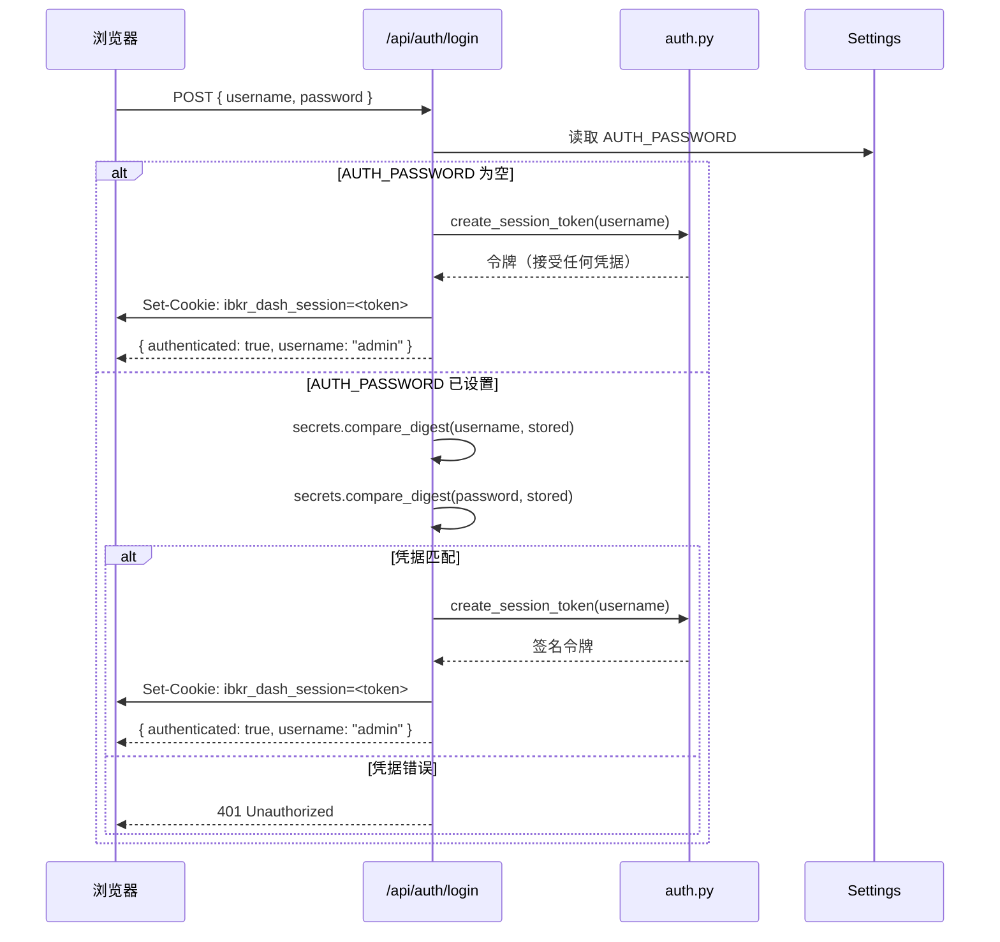
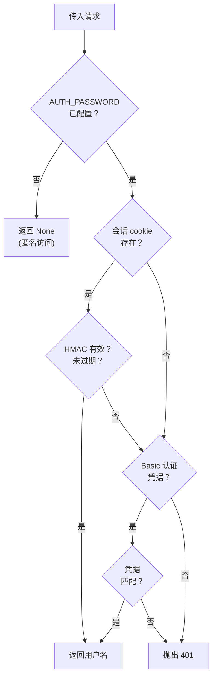

# 认证

IBKR Dash 支持两种认证方法：**基于 cookie 的会话**（主要）和 **HTTP Basic 认证**（回退）。如果未配置 `AUTH_PASSWORD`，所有端点都公开可访问。

## 登录流程

以下是从浏览器到后端的完整认证流程：



## HMAC 会话令牌

会话令牌使用 **HMAC-SHA256** 签名。签名密钥从配置的 `AUTH_PASSWORD` 派生：

```python
# 来自 app/core/auth.py
secret = hashlib.sha256(settings.auth_password.encode()).hexdigest()
```

### 令牌格式

令牌由点分隔的两部分组成：

```
<base64-payload>.<hex-signature>
```

负载是 URL 安全 Base64 编码的 JSON 对象：

```json
{"u": "admin", "e": 1718000000}
```

- `u` -- 用户名
- `e` -- 过期时间戳（Unix 纪元秒）

签名计算为：

```python
hmac.new(secret.encode(), payload.encode(), hashlib.sha256).hexdigest()
```

### 令牌有效期

默认会话有效期为 **7 天**（`DEFAULT_SESSION_MAX_AGE = 604800` 秒）。

## 基于 Cookie 的会话

会话 cookie 名为 `ibkr_dash_session`，具有以下属性：

| 属性 | 值 | 用途 |
|------|-----|------|
| `httponly` | `true` | 防止 JavaScript 访问（XSS 保护）。 |
| `samesite` | `lax` | 顶层导航的 CSRF 保护。 |
| `secure` | `false` | 使用 HTTPS 的生产环境设为 `true`。 |
| `path` | `/` | cookie 对所有路径发送。 |
| `max_age` | `604800` | 7 天。 |

:::warning
凭据比较使用 `secrets.compare_digest()` 防止计时攻击。永远不要使用 `==` 进行密码比较。
:::

## HTTP Basic 认证回退

对于程序化访问（例如脚本、curl），API 也接受 HTTP Basic 认证凭据：

```bash
curl -u admin:password http://localhost:8000/api/account/overview
```

`get_current_user` 依赖仅在没有找到有效会话 cookie 时才检查 Basic 认证凭据。

## `get_current_user` 如何工作

`app/api/deps.py` 中的 `get_current_user` 函数是中央认证网关：

```python
# 来自 app/api/deps.py
def get_current_user(
    request: Request,
    credentials: HTTPBasicCredentials | None = Depends(security),
    settings: Settings = Depends(get_app_settings),
) -> str | None:
```

**逐步逻辑：**



1. **检查是否配置了认证。** 如果 `settings.auth_password` 为空，返回 `None`（允许匿名访问）。

2. **尝试会话 cookie。** 从请求 cookie 读取 `ibkr_dash_session`。验证 HMAC 签名并检查过期。如果有效，返回用户名。

3. **尝试 HTTP Basic 认证。** 如果请求包含 Basic 认证凭据，使用常量时间比较将它们与 `auth_username` 和 `auth_password` 比较。如果匹配，返回用户名。

4. **抛出 401。** 如果两种方法都没有成功，抛出 `HTTPException(status_code=401)`。

```python
# 来自 app/api/deps.py 的简化流程
if not settings.auth_password:
    return None  # 匿名访问

# 尝试 cookie
token = request.cookies.get(SESSION_COOKIE_NAME)
if token:
    session = verify_session_token(token, secret=secret)
    if session:
        return session.username

# 尝试 Basic 认证
if credentials:
    if compare_digest(credentials.username, settings.auth_username) and \
       compare_digest(credentials.password, settings.auth_password):
        return credentials.username

raise HTTPException(status_code=401)
```

## 登出

登出端点只是删除 cookie：

```python
# 来自 app/api/routes/auth.py
@router.post("/logout")
def logout(response: Response) -> SessionResponse:
    response.delete_cookie(key=SESSION_COOKIE_NAME, path="/", samesite="lax")
    return SessionResponse(authenticated=False)
```

## 会话检查

`/api/auth/session` 端点允许前端检查用户当前是否已认证：

```python
# 来自 app/api/routes/auth.py
@router.get("/session")
def get_session(request: Request, settings: Settings) -> SessionResponse:
    session = _get_optional_session(request, settings)
    if session is None:
        return SessionResponse(authenticated=False)
    return SessionResponse(authenticated=True, username=session.username)
```

:::info
会话检查端点不会抛出 401 -- 它始终返回指示用户是否已认证的响应。这对前端确定是否显示登录表单很有用。
:::

## 安全考虑

- **HMAC 密钥**从 `AUTH_PASSWORD` 派生，不直接存储。更改密码会使所有现有会话失效。
- **令牌篡改**会被检测到，因为 HMAC 签名必须匹配。
- **令牌过期**在每次验证时检查（默认 7 天）。
- **计时安全比较**防止凭据的侧信道攻击。
- **httpOnly cookie** 防止 XSS 窃取会话令牌。
- **SameSite=lax** 为顶层导航提供 CSRF 保护。

## 令牌内部

### 创建

```python
# 来自 app/core/auth.py
def create_session_token(*, username: str, secret: str, max_age_seconds: int) -> str:
    expires_at = int(time.time()) + max_age_seconds
    payload = base64_urlsafe_encode(json.dumps({"u": username, "e": expires_at}))
    signature = hmac.new(secret.encode(), payload.encode(), hashlib.sha256).hexdigest()
    return f"{payload}.{signature}"
```

### 验证

```python
# 来自 app/core/auth.py
def verify_session_token(token: str, *, secret: str) -> AuthSession | None:
    payload, signature = token.rsplit(".", 1)
    expected = hmac.new(secret.encode(), payload.encode(), hashlib.sha256).hexdigest()
    if not hmac.compare_digest(signature, expected):
        return None  # 篡改
    data = json.loads(base64_urlsafe_decode(payload))
    if data["e"] <= int(time.time()):
        return None  # 过期
    return AuthSession(username=data["u"], expires_at=data["e"])
```

### 为什么选择 HMAC 而不是 JWT？

项目使用自定义 HMAC 令牌而不是 JWT，以保持简单：

- **无需外部库**（使用 Python 标准库 `hmac`, `hashlib`, `json`, `base64`）。
- **更小的令牌大小**（无 header/algorithm 元数据）。
- **对此用例足够**（单服务器、单用户仪表盘）。

如果需要多用户支持或第三方令牌验证，请考虑使用 `python-jose` 切换到 JWT。

## 禁用认证

要在没有任何登录的情况下运行仪表盘（例如本地开发），将 `AUTH_PASSWORD` 留空：

```bash
# .env
AUTH_PASSWORD=
```

当认证禁用时：
- `get_current_user()` 对所有请求返回 `None`。
- 登录端点接受任何凭据。
- 不需要会话 cookie。

:::warning
永远不要在禁用认证的情况下部署到公共网络。任何有 URL 访问权限的人都可以查看您的投资组合数据并触发 AI 代理运行（这会消耗 LLM API 额度）。
:::

## 前端集成

前端应该：

1. **检查会话**在页面加载时：`GET /api/auth/session`
2. **显示登录表单**如果 `authenticated: false`
3. **提交凭据**：`POST /api/auth/login` 带 `{ username, password }`
4. **包含 cookie**：所有后续请求自动包含会话 cookie（同源）。
5. **处理 401**：如果任何 API 调用返回 401，重定向到登录表单。
6. **登出**：`POST /api/auth/logout` 清除 cookie。

```javascript
// 示例前端流程
const res = await fetch("/api/auth/session", { credentials: "include" });
const { authenticated, username } = await res.json();
if (!authenticated) {
  // 显示登录表单
}
```
