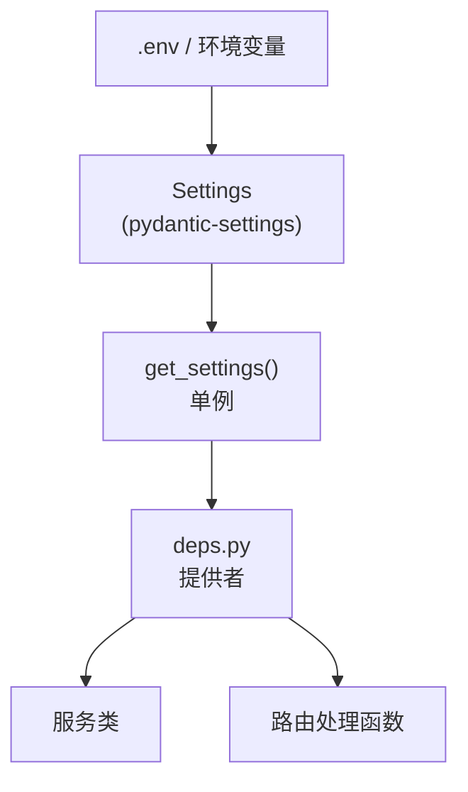

# 配置

后端使用 **pydantic-settings** 从环境变量加载配置，带有合理的默认值。所有设置定义在单个 `Settings` 类中。

## pydantic-settings 如何工作

```python
# 来自 app/core/config.py
from pydantic_settings import BaseSettings

class Settings(BaseSettings):
    app_name: str = "IBKR Dash"
    debug: bool = False
    sqlite_path: str = "data/ibkr_dash.db"
    # ...

    model_config = {
        "env_prefix": "",
        "env_file": ".env",
        "env_file_encoding": "utf-8",
    }
```

Pydantic-settings 自动：
1. 从环境变量读取值（不区分大小写）。
2. 如果变量未设置，回退到 `.env` 文件。
3. 如果两者都不可用，回退到默认值。
4. 验证类型（例如 `debug: bool` 接受 `true`, `1`, `yes`）。

设置实例是**缓存的单例**：

```python
# 来自 app/core/config.py
@lru_cache
def get_settings() -> Settings:
    return Settings()
```

## 完整环境变量参考

### 应用

| 变量 | 默认值 | 描述 |
|------|--------|------|
| `APP_ENV` | `development` | 环境名称（`development`, `production`）。 |
| `DEBUG` | `false` | 启用调试模式。 |

### SQLite

| 变量 | 默认值 | 描述 |
|------|--------|------|
| `SQLITE_PATH` | `data/ibkr_dash.db` | SQLite 数据库文件路径。相对于后端根目录解析。 |

### 缓存

| 变量 | 默认值 | 描述 |
|------|--------|------|
| `CACHE_TTL_SECONDS` | `86400` | 内存缓存 TTL（24 小时）。 |

### LLM（OpenAI 兼容）

| 变量 | 默认值 | 描述 |
|------|--------|------|
| `LLM_API_KEY` | `""` | LLM 提供商的 API 密钥。 |
| `LLM_BASE_URL` | `https://api.openai.com/v1` | 聊天完成端点的基础 URL。 |
| `LLM_DEFAULT_MODEL` | `gpt-4o` | 默认模型名称。 |
| `LLM_TEMPERATURE` | `0.1` | 采样温度（0.0 = 确定性）。 |
| `LLM_MAX_TOKENS` | `8192` | 响应中的最大 token 数。 |

:::tip
任何 OpenAI 兼容 API 都可以工作。设置 `LLM_BASE_URL` 和 `LLM_API_KEY` 以使用 DeepSeek、Xiaomi MiMo 或自托管模型等提供商。
:::

### 认证

| 变量 | 默认值 | 描述 |
|------|--------|------|
| `AUTH_USERNAME` | `admin` | HTTP Basic 认证和登录的用户名。 |
| `AUTH_PASSWORD` | `""` | 认证密码。**留空则禁用认证。** |

### CORS

| 变量 | 默认值 | 描述 |
|------|--------|------|
| `CORS_ORIGINS` | `http://localhost:5173,http://localhost:3000` | 逗号分隔的允许来源列表。 |

### Longbridge（可选）

| 变量 | 默认值 | 描述 |
|------|--------|------|
| `LONGBRIDGE_APP_KEY` | `""` | Longbridge API app key（用于公开市场数据）。 |
| `LONGBRIDGE_APP_SECRET` | `""` | Longbridge API app secret。 |
| `LONGBRIDGE_ACCESS_TOKEN` | `""` | Longbridge 访问令牌。 |

### Worker 特定变量

Worker 有自己的 `Settings` dataclass（非 pydantic），包含额外变量：

| 变量 | 默认值 | 描述 |
|------|--------|------|
| `DATA_DIR` | `data/flex_exports` | Flex CSV/XML 文件目录。 |
| `SCHEDULER_ENABLED` | `true` | 启用后台调度器。 |
| `SCHEDULER_HOUR` | `12` | 运行每日任务的小时。 |
| `SCHEDULER_MINUTE` | `30` | 运行每日任务的分钟。 |
| `SCHEDULER_TIMEZONE` | `Asia/Shanghai` | 调度器时区。 |
| `FLEX_TOKEN` | `""` | IBKR Flex Web Service 令牌。 |
| `FLEX_QUERY_ID_DAILY` | `""` | 每日快照查询 ID。 |
| `FLEX_BASE_URL` | `https://www.interactivebrokers.com/AccountManagement/FlexWebService` | Flex API 基础 URL。 |
| `FLEX_POLL_INTERVAL_SECONDS` | `10` | 轮询重试间隔秒数。 |
| `FLEX_MAX_POLL_RETRIES` | `60` | 最大轮询尝试次数。 |
| `BACKEND_BASE_URL` | `http://localhost:8000` | Worker 到后端调用的后端 URL。 |
| `LOG_LEVEL` | `INFO` | 日志级别。 |

## .env 文件结构

复制 `.env.example` 到 `.env` 并填写您的值：

```bash
# --- App ---
APP_ENV=development
DEBUG=true

# --- SQLite ---
SQLITE_PATH=data/ibkr_dash.db

# --- LLM ---
LLM_API_KEY=sk-your-key-here
LLM_BASE_URL=https://api.openai.com/v1
LLM_DEFAULT_MODEL=gpt-4o
LLM_TEMPERATURE=0.1
LLM_MAX_TOKENS=8192

# --- Auth ---
AUTH_USERNAME=admin
AUTH_PASSWORD=your-secret-password

# --- CORS ---
CORS_ORIGINS=http://localhost:5173,http://localhost:3000
```

:::warning
`.env` 文件已被 gitignore。永远不要将真实凭据提交到版本控制。
:::

## 设置如何传播到服务

设置通过 FastAPI 的依赖注入流经应用程序：



**DI 中的直接使用：**

```python
# 来自 app/api/deps.py
def get_app_settings() -> Settings:
    return get_settings()

def get_llm_service(settings: Settings = Depends(get_app_settings)) -> LLMService:
    return LLMService(settings)
```

**通过 Database 的间接使用：**

```python
# 来自 app/api/deps.py
def get_database(settings: Settings | None = None) -> Database:
    s = settings or get_settings()
    return Database(s.sqlite_path)
```

**路由中的使用：**

```python
@router.get("/status")
def system_status(
    settings: Settings = Depends(get_app_settings),
) -> dict:
    return {"model": settings.llm_default_model}
```

## 配置最佳实践

### 开发

```bash
APP_ENV=development
DEBUG=true
AUTH_PASSWORD=               # 本地开发无认证
LLM_API_KEY=sk-dev-key
```

### 生产

```bash
APP_ENV=production
DEBUG=false
AUTH_PASSWORD=strong-random-secret
CORS_ORIGINS=https://your-domain.com
LLM_API_KEY=sk-prod-key
```

:::warning
在生产环境中，始终设置强 `AUTH_PASSWORD` 并将 `CORS_ORIGINS` 限制为您的实际域名。永远不要在生产环境中留下 `DEBUG=true`。
:::

### Docker

在 Docker 中运行时，通过 `docker-compose.yml` 或挂载到容器中的 `.env` 文件传递环境变量：

```yaml
services:
  backend:
    env_file:
      - .env
    environment:
      - SQLITE_PATH=data/ibkr_dash.db
```

`SQLITE_PATH` 应指向容器内作为卷挂载的路径，以便数据库在容器重启后持久化。
